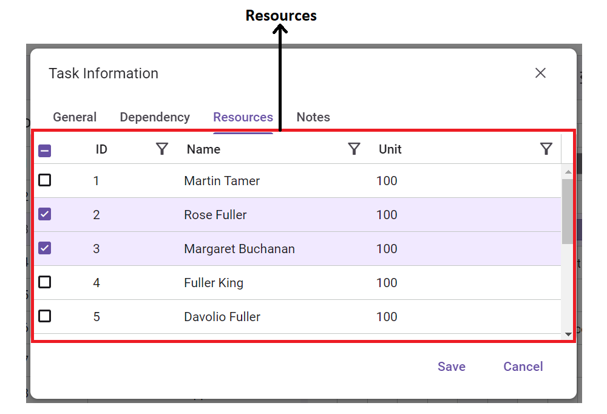

# Key Elements in Gantt UI

This section explains the key elements of the Gantt Chart interface.

The Gantt component consists of two main sections: a `grid` and a `chart`, separated by a `splitter`. The grid is located on the left side of the Gantt component, while the chart section is on the right side. You can adjust the view of the Gantt by moving the splitter left or right to display only the grid, only the chart, or both.

At the top of Gantt chart, having a [toolbar](https://help.syncfusion.com/cr/aspnetcore-js2/Syncfusion.EJ2.Gantt.Gantt.html#Syncfusion_EJ2_Gantt_Gantt_Toolbar) that allows you to peform **CRUD** operations on tasks.

**Grid section**

* In the tree grid section, the task details are presented in a tabular format.
* You can expand or collapse a task by clicking on the expand/collapse icon near the parent task.
* At the top of the tree grid section is the column header, which dispays the titles of different grid columns.

**Chart section**

* The `X-axis` of the chart represents the timeline scale.
* In the chart section, task details are displayed in a taskbar format over a time range along with their activities.

**Elements in taskbar**

* To change the task startDate and endDate value, you can use the start date gripper and end date gripper.
* To change the progress value, you can use the progress gripper.

**Managing task dependency**

To establish dependency connections between multiple tasks using connector points.

**Other taskbars**

**Milestone**

A milestone is a unique type of task characterized by the following attributes:

* It typically has no distinct start and end dates or may have both set to the same date.
* The duration value for a milestone task is typically zero.

>For more information, refer to [Unscheduled Tasks](https://ej2.syncfusion.com/aspnetcore/documentation/gantt/task-scheduling#unscheduled-tasks)

**Manual taskbar**

It is a type of task where the dates are not automatically validated by the Gantt chart.

>For more information, refer to [Manual Tasks](https://ej2.syncfusion.com/aspnetcore/documentation/gantt/task-scheduling#manually-scheduled-tasks)

**Baseline**

A baseline is a line that shows the deviation between the planned dates and the actual dates of tasks.

**Critical path**

It consists of a series of tasks (or sometimes only a single task) that determine the calculated finish date of the project. If a task on the critical path is delayed, the entire project will be delayed.

**Other elements in chart section**

**Indicators**

It shows significant events on specified days for particular tasks with different icons and labels.

**Event markers**

Event markers highlight important dates in the project timeline.

**Row drag and drop**

You can rearrange the Gantt chart rows by using the drag icon on the left side of the grid column.

**Dialog box**

* While editing a row, the dialog edit box will be used, which contains the following tabs:
    * General
    * Dependency
    * Resources
    * Notes

The `General` tab contains form fields where you can view and edit task details. These fields include:
    **TaskID**: Identifier for the task.
    **TaskName**: Name or title of the task.
    **Duration**: Duration of the task.
    **StartDate**: Start date of the task.
    **EndDate**: End date of the task.
    **Progress**: Progress status of the task.

The `Dependency` tab displays tasks that are dependent on the current task, along with their details presented in a tabular format.

The `Resources` tab lists all resources assigned to the particular task, as well as available resources.

The `Notes` tab displays any notes that have been added for the task.

