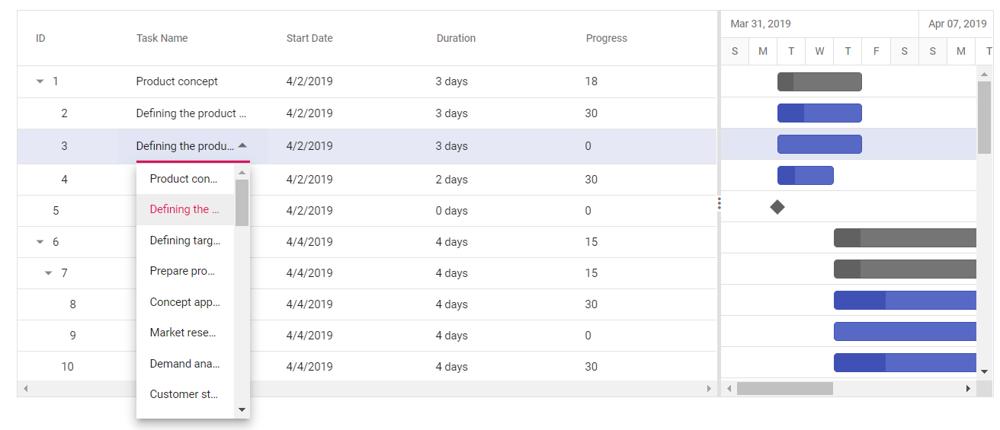
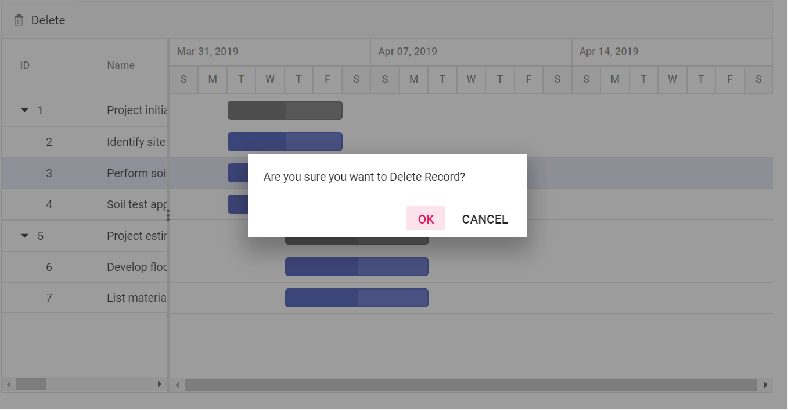

`numericedit` | [`NumericTextBox`](../numerictextbox) | params: { decimals: 2, value: 5 }
`dropdownedit` | [`DropDownList`](../drop-down-list) | params: { value: 'Germany' }
`booleanedit` | [`Checkbox`](../check-box) | params: { checked: true}
`datepickeredit` | [`DatePicker`](../datepicker) | params: { format:'dd.MM.yyyy' }
`datetimepickeredit` | [`DateTimePicker`](../datetimepicker) | params: { value: new Date() }





### Cell Edit Template

The cell edit template is used to create a custom component for a particular column by invoking the following functions:

* `create` - It is used to create the element at the time of initialization.

* `write` - It is used to create the custom component or assign default value at the time of editing.

* `read` - It is used to read the value from the component at the time of save.

* `destroy` - It is used to destroy the component.





### Disable editing for particular column

You can disable editing for particular columns, by using the [`columns.allowEditing`](https://help.syncfusion.com/cr/aspnetcore-js2/Syncfusion.EJ2.Gantt.GanttColumn.html#Syncfusion_EJ2_Gantt_GanttColumn_AllowEditing) property.

In the following demo, editing is disabled for the `TaskName` column.





## Maintaining data in server

All the modified data in Gantt control can be maintained in the database using RESTful web services.

All the CRUD operations in the gantt are done through DataManager. The DataManager has an option to bind all the CRUD related data in server-side.

In the below section, we have explained how to get the edited data details on the server-side using the `UrlAdaptor`.

### URL Adaptor

In Gantt, we can fetch data from SQL database using `ADO.NET` Entity Data Model and update the changes on CRUD action to the server by using `DataManager` support. To communicate with the remote data we are using `UrlAdaptor` of DataManager property to call the server method and get back resultant data in JSON format. We can know more about `UrlAdaptor` from [`here`](https://ej2.syncfusion.com/javascript/documentation/data/adaptors/?no-cache=1).

> Please refer the [link](https://docs.microsoft.com/en-us/aspnet/mvc/overview/older-versions-1/models-data/creating-model-classes-with-the-entity-framework-cs) to create the `ADO.NET` Entity Data Model in Visual studio,

We can define data source for Gantt as instance of DataManager using `url` property of DataManager. Please Check the below code snippet to assign data source to Gantt.





We can also do CRUD operations over Gantt data and save the changes to database. By using `BatchUrl` property of DataManager, we can communicate with the controller method to update the data source on CRUD operation. In gantt CRUD actions on task are dependent with other tasks. For example on editing the child record on chart side, corresponding parent item also will get affect and predecessor dependency task as well get affected. So in Gantt all the CRUD operations are considered to be batch editing where you will get all the affected records as collection. Please check the below code snippet to assign controller method to this property.





This server method will be triggered for all the CRUD operations like adding, editing and deleting actions. We can handle those each operations separately inside this method with corresponding data received in this method argument. Also, when using the `UrlAdaptor`, you need to return the data as JSON from the controller action and the JSON object must contain a property as result with dataSource as its value and one more property count with the dataSource total records count as its value.

### Insert action

Using the `added` argument of the `BatchUrl` method we can insert the newly added row to database and return the same to client side. please find the below code example for details.





### Editing action

Using the `changed` argument of the `BatchUrl` method we can update the modified records to database and return the same to client side. please find the below code example for details.





### Delete action

Using the `deleted` argument of the `BatchUrl` method we can remove the deleted records from database and return the same to client side. on deleting the record we need to remove its corresponding child records as well if it exist from the data base. please find the below code example for details.





> You can find the full sample at our [GitHub repository](https://github.com/SyncfusionExamples/EJ2-Gantt-MVC-CRUD-URL-ADAPTOR).

## Deleting tasks

A task delete option in the Gantt control can be enabled by enabling the [`EdiSettings.AllowDeleting`](https://help.syncfusion.com/cr/aspnetcore-js2/Syncfusion.EJ2.Gantt.GanttEditSettings.html#Syncfusion_EJ2_Gantt_GanttEditSettings_AllowDeleting) property. Tasks can be deleted by clicking the delete toolbar item or using the `deleteRow` method. You can call this method dynamically on any custom actions like button click. The following code example shows how to enable the delete option in the Gantt control.





> NOTE: You should select any one of the rows in the Gantt control to perform task delete action.
> You should set the [`AllowDeleting`](https://help.syncfusion.com/cr/aspnetcore-js2/Syncfusion.EJ2.Gantt.GanttEditSettings.html#Syncfusion_EJ2_Gantt_GanttEditSettings_AllowDeleting) value to `true` to delete the record dynamically.

### Delete confirmation message

Delete confirmation message is used to get the confirmation from users before deleting a task. This confirmation message can be enabled by setting the [`EditSettings.ShowDeleteConfirmDialog`](https://help.syncfusion.com/cr/aspnetcore-js2/Syncfusion.EJ2.Gantt.GanttEditSettings.html#Syncfusion_EJ2_Gantt_GanttEditSettings_ShowDeleteConfirmDialog) property to true.

The following code snippet explains how to enable the delete confirmation message in Gantt.





## Indent and Outdent

Indent and Outdent of a task are used to update the level of the task in hierarchical order of the task. It can be performed bu enabling the [`editSettings.allowEditing`](https://help.syncfusion.com/cr/aspnetcore-js2/Syncfusion.EJ2.Gantt.GanttEditSettingsBuilder.html#Syncfusion_EJ2_Gantt_GanttEditSettingsBuilder_AllowEditing_System_Boolean_) property.

`Indent` - Selected task can be indented to the level of task to the hierarchical order. It can be performed by using in-built context menu or toolbar items. It can also be invoked by using the `indent` method dynamically on any action like external button click. The following code example shows how to enable indent option in the Gantt chart.

`Outdent` - Selected task can be outdented to the level of task from the hierarchical order. It can be performed by using in-built context menu or toolbar items. It can also be invoked by using the `outdent` method dynamically on any action like external button click. The following code example shows how to enable outdent option in the Gantt chart.





## Read-only Gantt

In Gantt, all create, update, delete operations can be disabled by set `readOnly` property as `true`. The following sample demonstrates, render Gantt chart as read only.





## Splitting and Merging tasks

### Splitting task at load time

To split task at load time, we can define segment details in both hierarchical and self-referential way.
Refer below link for more details.

* [Split task at load time](./data-binding/#split-task)

### Split task dynamically

The task can be split dynamically, either by using the context menu or dialog.

* `Dialog`: `Segments` tab is rendered in add/edit dialog, when the [`TaskFields.Segments`](https://help.syncfusion.com/cr/aspnetcore-js2/Syncfusion.EJ2.Gantt.Gantt.html#Syncfusion_EJ2_Gantt_Gantt_SegmentData) or [`TaskFields.segmentId`](https://help.syncfusion.com/cr/aspnetcore-js2/Syncfusion.EJ2.Gantt.Gantt.html#Syncfusion_EJ2_Gantt_Gantt_SegmentData) property is mapped. Using this tab, we can split the task based on the original start and end date of a particular task.

* `Context menu`: When the [`TaskFields.Segments`](https://help.syncfusion.com/cr/aspnetcore-js2/Syncfusion.EJ2.Gantt.Gantt.html#Syncfusion_EJ2_Gantt_Gantt_SegmentData) or [`TaskFields.SegmentId`](https://help.syncfusion.com/cr/aspnetcore-js2/Syncfusion.EJ2.Gantt.Gantt.html#Syncfusion_EJ2_Gantt_Gantt_SegmentData) property is mapped and the [`EnableContextMenu`](https://help.syncfusion.com/cr/aspnetcore-js2/Syncfusion.EJ2.Gantt.Gantt.html#Syncfusion_EJ2_Gantt_Gantt_EnableContextMenu) property is enabled, `Split Task` item will be included in the context menu.





### Merge tasks

The split tasks can be merged either by using the `Merge Task` item of the Context menu or by using the dialog. We can also merge the tasks, by simply dragging the segments together in the UI.

### Limitations of Split tasks

1. Parent and milestone tasks cannot be split into segments.
2. The task must have a width greater than the timeline unit cell in order to be split.
3. Split task is not supported in the `Resource view`.

## Troubleshoot: Editing works only when primary key column is defined

Editing feature requires a primary key column for CRUD operations.
While defining columns in Gantt using the [`columns`](https://help.syncfusion.com/cr/aspnetcore-js2/Syncfusion.EJ2.Gantt.GanttColumn.html) property, it is mandatory that any one of the columns, must be a primary column. By default, the [`id`](https://help.syncfusion.com/cr/aspnetcore-js2/Syncfusion.EJ2.Gantt.GanttTaskFieldsBuilder.html#Syncfusion_EJ2_Gantt_GanttTaskFieldsBuilder_Id_System_String_) column will be the primary key column.  If [`id`](https://help.syncfusion.com/cr/aspnetcore-js2/Syncfusion.EJ2.Gantt.GanttTaskFieldsBuilder.html#Syncfusion_EJ2_Gantt_GanttTaskFieldsBuilder_Id_System_String_) column is not defined, we need to enable [`isPrimaryKey`](https://help.syncfusion.com/cr/aspnetcore-js2/Syncfusion.EJ2.Gantt.GanttColumn.html#Syncfusion_EJ2_Gantt_GanttColumn_IsPrimaryKey) for any one of the columns defined in the [`columns`](https://help.syncfusion.com/cr/aspnetcore-js2/Syncfusion.EJ2.Gantt.GanttColumn.html) property.