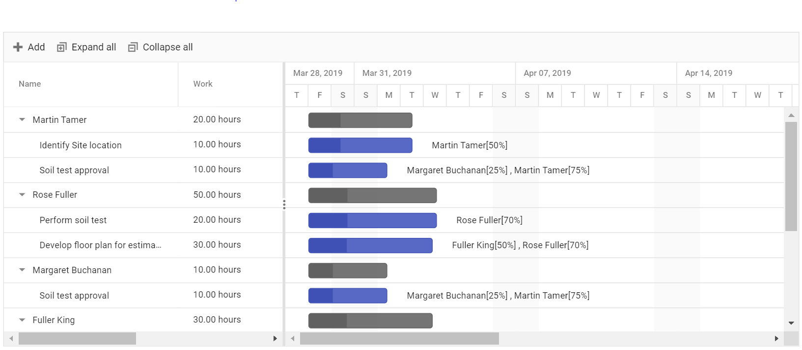
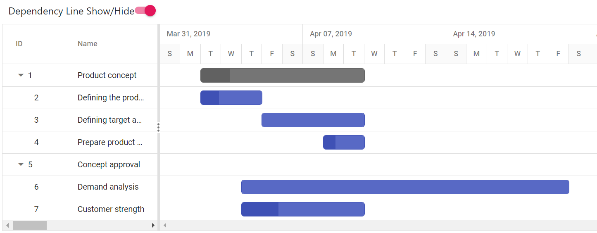

# Resource Breakdown View

The resource breakdown view is used to visualize the tasks assigned to each resource in hierarchy manner. Resources are displayed as parents and all the tasks assigned to each resource are displayed as its child records. It can be initialized by setting the [`viewType`](https://help.syncfusion.com/cr/aspnetcore-js2/Syncfusion.EJ2.Gantt.ViewType.html) property to `ResourceView`.

## Unassigned task

A task not assigned to any one of the resource are termed as unassigned tasks. The unassigned tasks are grouped with a name as `Unassigned Task` and displayed at the bottom of Gantt data collection . It is validated at load time during Gantt record creation by default based on a task [`resourceInfo`](https://help.syncfusion.com/cr/aspnetcore-js2/Syncfusion.EJ2.Gantt.GanttTaskFieldsBuilder.html#Syncfusion_EJ2_Gantt_GanttTaskFieldsBuilder_ResourceInfo_System_String_) mapping property in the Gantt chart data source. If the resource is assigned to the unassigned grouped tasks, the task will be moved as child to the respective resource.

## Resource task

A task assigned to one or more resources are termed as resource task and it is added as child task to the respective resource. Already assigned task can also be shared or moved with other resources by adding a resource name to the task or removing resource name from the task by cell or dialog editing.

N> Currently there is no support for unscheduled task in Resource view Gantt.
























## Resource OverAllocation

When a resource is assigned too much of work to complete within a day of resource’s available time then it is called as overallocation.

The available working time of resources for completing the task in a day will be calculated based on the `dayWorkingTime` property and `resource unit`.

The range of overallocation dates can be highlighted by a square bracket. It can be enabled by setting the `showOverallocation` property as `true`. The following code example demonstrates how to hide or show the over allocation by clicking the custom button.

N> By default, the `showOverAllocation` property value is `false`.
























## Resource Multi Taskbar

To visualize multiple tasks assigned to each resource in a row when the records are in the collapsed state. It can be enabled by settings the `enableMultiTaskbar` property value as `true`.

The collapse or expand action of a resource record can be achieved only by using the tree grid side arrow icon. Because it will be disabled on chart side action for this support.

When a resource has multiple tasks scheduled on the same date, then the tasks will be overlapped one another. Taskbar editing is also possible to change the task scheduling on the collapsed state.

N> By default, the `enableMultiTaskbar` property value is `false`.
























### Enable taskbar drag and drop

In Gantt, you can enable taskbar drag and drop between resources by using the [`AllowTaskbarDragAndDrop`](https://help.syncfusion.com/cr/aspnetcore-js2/Syncfusion.EJ2.Gantt.Gantt.html#Syncfusion_EJ2_Gantt_Gantt_AllowTaskbarDragAndDrop) property. This allows you to move a taskbar from one resource to another vertically, making it easier to schedule tasks and manage resources.

>Note: By default, the `AllowTaskbarDragAndDrop` property value is `false`.
























### Disable taskbar overlap

In Gantt, you can disable taskbar overlap between resource tasks using the [`AllowTaskbarOverlap`](https://help.syncfusion.com/cr/aspnetcore-js2/Syncfusion.EJ2.Gantt.Gantt.html#Syncfusion_EJ2_Gantt_Gantt_AllowTaskbarOverlap) property. This prevents the taskbars for different tasks from overlapping on the same row, making it easier to distinguish between the different tasks and manage resources effectively.

When `AllowTaskbarOverlap` is set to false, the resources are displayed in a single row and the row height will be extended to occupy the tasks of the resource when it is in a collapsed state. This view allows you to easily identify any overallocation of tasks for a resource in a project.

It's important to note that when `AllowTaskbarOverlap` is disabled, task dependencies or relationships cannot be established between tasks that are rendered in multiple lines for the same resource. If you need to establish dependencies between tasks for the same resource, you may want to consider enabling taskbar overlap.























