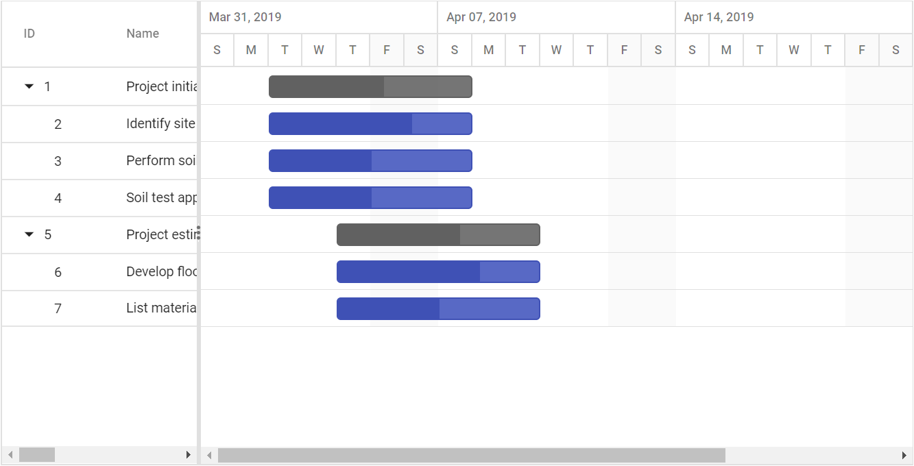

# Scheduling Tasks

## Duration units

In Gantt, the tasks’ duration value can be measured by the following duration units,

* Day
* Hour
* Minute

In Gantt, we can define duration unit for whole project by using [`DurationUnit`](https://help.syncfusion.com/cr/aspnetcore-js2/Syncfusion.EJ2.Gantt.Gantt.html#Syncfusion_EJ2_Gantt_Gantt_DurationUnit) property, when we defines the value for this property, this unit will be applied for all task which don't has duration unit value.
And each task in the project can be defined with different duration units and the duration unit of a task can be defined by the following ways,

* Using [`TaskFields.DurationUnit`](https://help.syncfusion.com/cr/aspnetcore-js2/Syncfusion.EJ2.Gantt.GanttTaskFields.html#Syncfusion_EJ2_Gantt_GanttTaskFields_DurationUnit) property, to map the duration unit data source field.
* Defining the duration unit value along with the duration field in the data source.

### Mapping the duration unit field

The below code snippet explains the mapping of duration unit data source field to the Gantt control using the [`TaskFields.DurationUnit`](https://help.syncfusion.com/cr/aspnetcore-js2/Syncfusion.EJ2.Gantt.GanttTaskFields.html#Syncfusion_EJ2_Gantt_GanttTaskFields_DurationUnit) property.
























> NOTE
The default value of the [`DurationUnit`](https://help.syncfusion.com/cr/aspnetcore-js2/Syncfusion.EJ2.Gantt.GanttTaskFields.html#Syncfusion_EJ2_Gantt_GanttTaskFields_DurationUnit) property is `day`.

### Defining duration unit along with duration field

Duration units for the tasks can also be defined along with the duration values, the below code snippet explains the duration unit for a task along with duration value,
























> The edit type of the duration column in Gantt is string, to support editing the duration field along with duration units.

## Unscheduled Tasks

Unscheduled tasks are planned for a project without any definite schedule dates. The Gantt control supports rendering the unscheduled tasks. You can create or update the tasks with anyone of start date, end date, and duration values or none. You can enable or disable the unscheduled tasks by using the [`AllowUnscheduledTasks`](https://help.syncfusion.com/cr/aspnetcore-js2/Syncfusion.EJ2.Gantt.Gantt.html#Syncfusion_EJ2_Gantt_Gantt_AllowUnscheduledTasks) property. The following images represent the various types of unscheduled tasks in Gantt.

### Start Date Only

### End Date Only

### Duration Only

### Milestone

A milestone is a task that has no start and end dates, but it has a duration value of zero. It is represented as follows.

## Define unscheduled tasks in data source

You can define the various types of unscheduled tasks in the data source as follows
























> NOTE
> If the [`AllowUnscheduledTasks`](https://help.syncfusion.com/cr/aspnetcore-js2/Syncfusion.EJ2.Gantt.Gantt.html#Syncfusion_EJ2_Gantt_Gantt_AllowUnscheduledTasks) property is set to false, then the Gantt control automatically calculates the scheduled date values with a default value of duration 1 and the project start date is considered as the start date for the task.

## Working Time Range

In the Gantt control, working hours in a day for a project can be defined by using the [`DayWorkingTime`](https://help.syncfusion.com/cr/aspnetcore-js2/Syncfusion.EJ2.Gantt.Gantt.html#Syncfusion_EJ2_Gantt_Gantt_DayWorkingTime) property. Based on the working hours, automatic date scheduling and duration validations for a task are performed.

The following code snippet explains how to define the working time range for the project in Gantt.
























The following screen shot shows working time range in Gantt control.

> NOTE
>* Individual tasks can lie between any time within the defined working time range of the project.
>* The [`DayWorkingTime`](https://help.syncfusion.com/cr/aspnetcore-js2/Syncfusion.EJ2.Gantt.Gantt.html#Syncfusion_EJ2_Gantt_Gantt_DayWorkingTime) property is used to define the working time for the whole project.

## Weekend/Non-working days

Non-working days/weekend are used to represent the non-productive days in a project. You can define the non-working days in a week using the [`WorkWeek`](https://help.syncfusion.com/cr/aspnetcore-js2/Syncfusion.EJ2.Gantt.Gantt.html#Syncfusion_EJ2_Gantt_Gantt_WorkWeek) property in Gantt.
























> By default, Saturdays and Sundays are considered as non-working days/weekend in a project.
> In the Gantt control, you can make weekend as working day by setting the [`IncludeWeekend`](https://help.syncfusion.com/cr/aspnetcore-js2/Syncfusion.EJ2.Gantt.Gantt.html#Syncfusion_EJ2_Gantt_Gantt_IncludeWeekend) property to `true`.