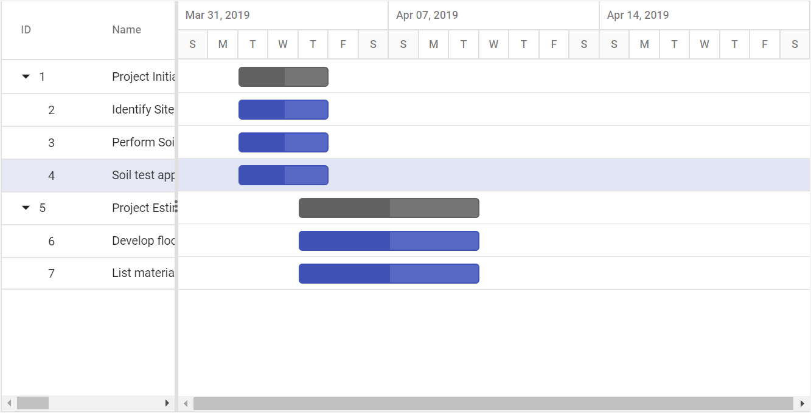
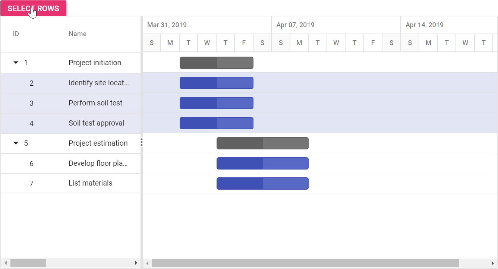

# Selection

Selection provides an option to highlight a row or a cell. It can be done using arrow keys or by scrolling down the mouse. To disable selection in the Gantt control, set the [`AllowSelection`](https://help.syncfusion.com/cr/cref_files/aspnetcore-js2/Syncfusion.EJ2~Syncfusion.EJ2.Gantt.Gantt~AllowSelection.html) to false.

The Gantt control supports two types of selection that can be set by using the [`SelectionSettings.Type`](https://help.syncfusion.com/cr/cref_files/aspnetcore-js2/Syncfusion.EJ2~Syncfusion.EJ2.Gantt.GanttSelectionSettings~Type.html) property. They are:

* `Single`: Sets a single value by default and allows only selection of a single row or a cell.
* `Multiple`: Allows you to select multiple rows or cells. To perform the multi-selection, press and hold the CTRL key and click the desired rows or cells.

## Selection mode

The Gantt control supports three types of selection modes that can be set by using the [`SelectionSettings.Mode`](https://help.syncfusion.com/cr/cref_files/aspnetcore-js2/Syncfusion.EJ2~Syncfusion.EJ2.Gantt.GanttSelectionSettings~Mode.html). They are:

* `Row`: Allows you to select only rows, and the row value is set by default.
* `Cell`: Allows you to select only cells.
* `Both`: Allows you to select rows and cells at the same time.
























## Row selection

The row selection in the Gantt control can be enabled or disabled using the [`AllowSelection`](https://help.syncfusion.com/cr/cref_files/aspnetcore-js2/Syncfusion.EJ2~Syncfusion.EJ2.Gantt.Gantt~AllowSelection.html) property. You can get the selected row object using the `getSelectedRecords` method. The following code example shows how to disable the row selection in Gantt.
























> `Row` selection is the default type of Gantt selection mode.

### Selecting a row on initial load

You can select a row at the time of loading by setting the index of the row to the [`SelectedRowIndex`](https://help.syncfusion.com/cr/cref_files/aspnetcore-js2/Syncfusion.EJ2~Syncfusion.EJ2.Gantt.Gantt~SelectedRowIndex.html) property. Find the following code example for details.
























### Selecting a row dynamically

You can also select a row dynamically using the `selectRow` method. The following code demonstrates how to select a row dynamically by clicking the custom button.
























### Multiple row selection

You can select multiple rows by setting the [`SelectionSettings.Type`](https://help.syncfusion.com/cr/cref_files/aspnetcore-js2/Syncfusion.EJ2~Syncfusion.EJ2.Gantt.GanttSelectionSettings~Type.html) property to `Multiple`. You can select more than one row by holding down the CTRL key while selecting multiple rows. The following code example explains how to enable multiple selection in Gantt.
























### Selecting multiple rows dynamically

You can also select rows dynamically using the `selectRows` method. The following code demonstrates how to select rows dynamically by clicking the custom button.
























### Customize row selection action

While selecting a row in Gantt, the [`RowSelecting`](https://help.syncfusion.com/cr/cref_files/aspnetcore-js2/Syncfusion.EJ2~Syncfusion.EJ2.Gantt.Gantt~RowSelecting.html) and [`RowSelected`](https://help.syncfusion.com/cr/cref_files/aspnetcore-js2/Syncfusion.EJ2~Syncfusion.EJ2.Gantt.Gantt~RowSelected.html) events will be triggered. The the [`RowSelecting`](https://help.syncfusion.com/cr/cref_files/aspnetcore-js2/Syncfusion.EJ2~Syncfusion.EJ2.Gantt.Gantt~RowSelecting.html) event will be triggered on initialization of row selection, and you can get the previously selected row and current selecting row’s information, which is used to prevent selection of a particular row. The [`RowSelected`](https://help.syncfusion.com/cr/cref_files/aspnetcore-js2/Syncfusion.EJ2~Syncfusion.EJ2.Gantt.Gantt~RowSelected.html) event will be triggered on completion of row selection action, and you can get the current selected row’s information through this event. The following code example demonstrates how to prevent the selection of a row using the [`RowSelecting`](https://help.syncfusion.com/cr/cref_files/aspnetcore-js2/Syncfusion.EJ2~Syncfusion.EJ2.Gantt.Gantt~RowSelecting.html) event.
























In the Gantt control, when you click an already selected row, selection will be cleared. While deselecting a row in Gantt, the [`RowDeselecting`](https://help.syncfusion.com/cr/cref_files/aspnetcore-js2/Syncfusion.EJ2~Syncfusion.EJ2.Gantt.Gantt~RowDeselecting.html) and [`RowDeselected`](https://help.syncfusion.com/cr/cref_files/aspnetcore-js2/Syncfusion.EJ2~Syncfusion.EJ2.Gantt.Gantt~RowDeselected.html) events will occur. The [`RowDeselecting`](https://help.syncfusion.com/cr/cref_files/aspnetcore-js2/Syncfusion.EJ2~Syncfusion.EJ2.Gantt.Gantt~RowDeselecting.html) event will occur on initialization of deselecting row, and you can get the current deselecting row’s information to prevent the deselection of particular row. The [`RowDeselected`](https://help.syncfusion.com/cr/cref_files/aspnetcore-js2/Syncfusion.EJ2~Syncfusion.EJ2.Gantt.Gantt~RowDeselected.html) event will occur on completion of row deselection action, and you can get the current deselected row’s information.

## Toggle selection

The toggle selection allows you to select and deselect a specific row or cell. To enable toggle selection, set the `enableToggle` property of the selectionSettings to `true`. If you click the selected row or cell, then it will be deselected and vice versa.
By default, the `enableToggle` property is set to `false`.
























## Clear selection

You can clear the selected cells and selected rows by using a method called `clearSelection`. The following code example demonstrates how to clear the selected rows in Gantt Chart.
























## Get selected row indexes and records

You can get the selected row indexes by using the [`getSelectedRowIndexes`](../api/gantt/#getselectedrowindexes) method. And by using [`getSelectedRecords`](../api/gantt/#getSelectedRecords) method, you can get the selected record details.
























## Multiple Selection based on condition

You can select multiple rows based on condition by using the [`selectRows`](../api/grid/#selectrows) method.

In the following code, the rows which contains `TaskId` value as 3 and 4 are selected at initial rendering.
























## See Also

* [Touch interaction](./touch-interaction/#selection)