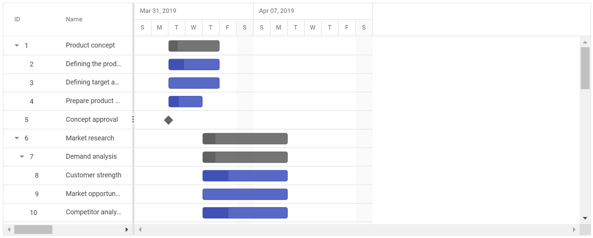

`Start Date Only` |  | 
`End Date Only` |  | 
`Duration Only` |  | 
`Milestone`|  | 

> A milestone is a task that has no start and end dates, but it has a duration value of zero

## Define unscheduled tasks in data source

You can define the various types of unscheduled tasks in the data source as follows
























> NOTE
> If the [`allowUnscheduledTasks`](https://help.syncfusion.com/cr/aspnetcore-js2/Syncfusion.EJ2.Gantt.Gantt.html#Syncfusion_EJ2_Gantt_Gantt_AllowUnscheduledTasks) property is set to false, then the Gantt control automatically calculates the scheduled date values with a default value of duration 1 and the project start date is considered as the start date for the task.

## Working Time Range

In the Gantt control, working hours in a day for a project can be defined by using the [`dayWorkingTime`](https://help.syncfusion.com/cr/aspnetcore-js2/Syncfusion.EJ2.Gantt.Gantt.html#Syncfusion_EJ2_Gantt_Gantt_DayWorkingTime) property. Based on the working hours, automatic date scheduling and duration validations for a task are performed.

The following code snippet explains how to define the working time range for the project in Gantt.
























> NOTE
>* Individual tasks can lie between any time within the defined working time range of the project.
>* The [`dayWorkingTime`](https://help.syncfusion.com/cr/aspnetcore-js2/Syncfusion.EJ2.Gantt.Gantt.html#Syncfusion_EJ2_Gantt_Gantt_DayWorkingTime) property is used to define the working time for the whole project.

## Weekend/Non-working days

Non-working days/weekend are used to represent the non-productive days in a project. You can define the non-working days in a week using the [`workWeek`](https://help.syncfusion.com/cr/aspnetcore-js2/Syncfusion.EJ2.Gantt.Gantt.html#Syncfusion_EJ2_Gantt_Gantt_WorkWeek) property in Gantt.
























> By default, Saturdays and Sundays are considered as non-working days/weekend in a project.
> In the Gantt control, you can make weekend as working day by setting the [`includeWeekend`](https://help.syncfusion.com/cr/aspnetcore-js2/Syncfusion.EJ2.Gantt.Gantt.html#Syncfusion_EJ2_Gantt_Gantt_IncludeWeekend) property to `true`.