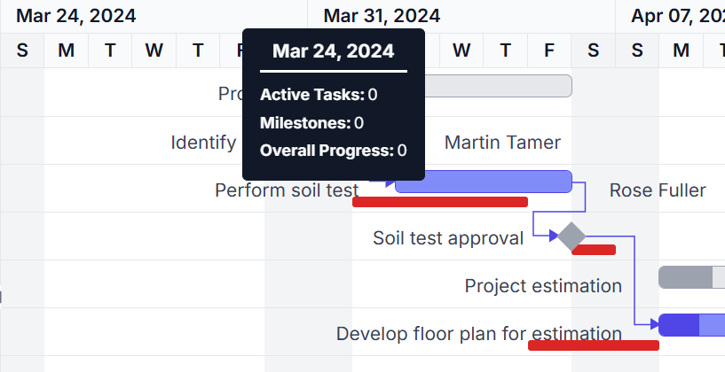

# Taskbar in ##Platform_Name## Gantt Chart Component

## Taskbar template

You can design your own taskbars to view the tasks in Gantt by using [`TaskbarTemplate`](https://help.syncfusion.com/cr/aspnetcore-js2/Syncfusion.EJ2.Gantt.Gantt.html#Syncfusion_EJ2_Gantt_Gantt_TaskbarTemplate) property. And it is possible to map the template script element’s ID value to this property. It is also possible to customize the parent taskbars and milestones with custom templates by using [`ParentTaskbarTemplate`](https://help.syncfusion.com/cr/aspnetcore-js2/Syncfusion.EJ2.Gantt.Gantt.html#Syncfusion_EJ2_Gantt_Gantt_ParentTaskbarTemplate) and [`MilestoneTemplate`](https://help.syncfusion.com/cr/aspnetcore-js2/Syncfusion.EJ2.Gantt.Gantt.html#Syncfusion_EJ2_Gantt_Gantt_MilestoneTemplate) properties.
























## Taskbar customization

### Taskbar Height

Height of child taskbars and parent taskbars can be customized by using [`TaskbarHeight`](https://help.syncfusion.com/cr/aspnetcore-js2/Syncfusion.EJ2.Gantt.Gantt.html#Syncfusion_EJ2_Gantt_Gantt_TaskbarHeight) property. The following code example shows how to use the property.
























N> The [`TaskbarHeight`](https://help.syncfusion.com/cr/aspnetcore-js2/Syncfusion.EJ2.Gantt.Gantt.html#Syncfusion_EJ2_Gantt_Gantt_TaskbarHeight) value should be lower than the [`RowHeight`](https://help.syncfusion.com/cr/aspnetcore-js2/Syncfusion.EJ2.Gantt.Gantt.html#Syncfusion_EJ2_Gantt_Gantt_RowHeight) property value and these properties accept only pixel values.

### Conditional formatting

The default taskbar UI can be replaced with custom templates using the [`QueryTaskbarInfo`](https://help.syncfusion.com/cr/aspnetcore-js2/Syncfusion.EJ2.Gantt.Gantt.html#Syncfusion_EJ2_Gantt_Gantt_QueryTaskbarInfo) event. The following code example shows customizing the taskbar UI based on task progress values in the Gantt control.
























### Change gripper icon in taskbar

You can change the gripper icon in the taskbar by applying styles to their respective class elements.
























## Multi Taskbar support in project view

The Gantt component, supports rendering multi-taskbars in the project view. With this feature the parent taskbar, when it is collapsed, visually summarize the progress of all its child taskbars.

This feature can be enabled by setting the [EnableMultiTaskbar](https://help.syncfusion.com/cr/aspnetcore-js2/Syncfusion.EJ2.Gantt.Gantt.html#Syncfusion_EJ2_Gantt_Gantt_EnableMultiTaskbar) property value to `true`. 

The following code example shows how to use this property.
























## Connector lines

The width and background color of connector lines in Gantt can be customized using the [`ConnectorLineWidth`](https://help.syncfusion.com/cr/aspnetcore-js2/Syncfusion.EJ2.Gantt.Gantt.html#Syncfusion_EJ2_Gantt_Gantt_ConnectorLineWidth) and [`ConnectorLineBackground`](https://help.syncfusion.com/cr/aspnetcore-js2/Syncfusion.EJ2.Gantt.Gantt.html#Syncfusion_EJ2_Gantt_Gantt_ConnectorLineBackground) properties. The following code example shows how to use these properties.
























## Tooltip

In the Gantt control, you can enable or disable the mouse hover tooltip for the following UI elements using the [`TooltipSettings.ShowTooltip`](https://help.syncfusion.com/cr/aspnetcore-js2/Syncfusion.EJ2.Gantt.GanttTooltipSettings.html#Syncfusion_EJ2_Gantt_GanttTooltipSettings_ShowTooltip) property:

* Taskbar
* Connector line
* Baseline
* Event marker
























Taskbar Tooltip

Dependency Tooltip

Baseline Tooltip

Event Marker Tooltip

N> The default value of the [`TooltipSettings.ShowTooltip`](https://help.syncfusion.com/cr/aspnetcore-js2/Syncfusion.EJ2.Gantt.GanttTooltipSettings.html#Syncfusion_EJ2_Gantt_GanttTooltipSettings_ShowTooltip) property is true.

## Tooltip template

### Taskbar tooltip

The default tooltip in the Gantt control can be customized using the [`TooltipSettings.Taskbar`](https://help.syncfusion.com/cr/aspnetcore-js2/Syncfusion.EJ2.Gantt.GanttTooltipSettings.html#Syncfusion_EJ2_Gantt_GanttTooltipSettings_Taskbar) property. You can map the template script element’s ID value or template string directly to this property.
























The below screenshot shows the output of above code example.

### Baseline tooltip

A baseline tooltip can be customized using the [`TooltipSettings.Baseline`](https://help.syncfusion.com/cr/aspnetcore-js2/Syncfusion.EJ2.Gantt.GanttTooltipSettings.html#Syncfusion_EJ2_Gantt_GanttTooltipSettings_Baseline) property. The following code example shows how to customize the baseline tooltip in Gantt.
























The following screenshot shows the template for baseline in Gantt.

### Connector line tooltip

The default connector line tooltip in the Gantt control can be customized using the [`TooltipSettings.ConnectorLine`](https://help.syncfusion.com/cr/aspnetcore-js2/Syncfusion.EJ2.Gantt.GanttTooltipSettings.html#Syncfusion_EJ2_Gantt_GanttTooltipSettings_ConnectorLine) property. You can map the value to this property as template script element ID or template string format. The following code example shows how to use the [`TooltipSettings.ConnectorLine`](https://help.syncfusion.com/cr/aspnetcore-js2/Syncfusion.EJ2.Gantt.GanttTooltipSettings.html#Syncfusion_EJ2_Gantt_GanttTooltipSettings_ConnectorLine) property.
























The below screenshot shows the output of above code example.

### Timeline tooltip

A timeline tooltip can be customized using the [`TooltipSettings.Timeline`](https://help.syncfusion.com/cr/aspnetcore-js2/Syncfusion.EJ2.Gantt.GanttTooltipSettings.html#Syncfusion_EJ2_Gantt_GanttTooltipSettings_Timeline) property. This allows modifying the appearance and content of the tooltip displayed over the timeline. The following code example shows how to customize the timeline tooltip in Gantt.
























The below screenshot shows the output of above code example.

