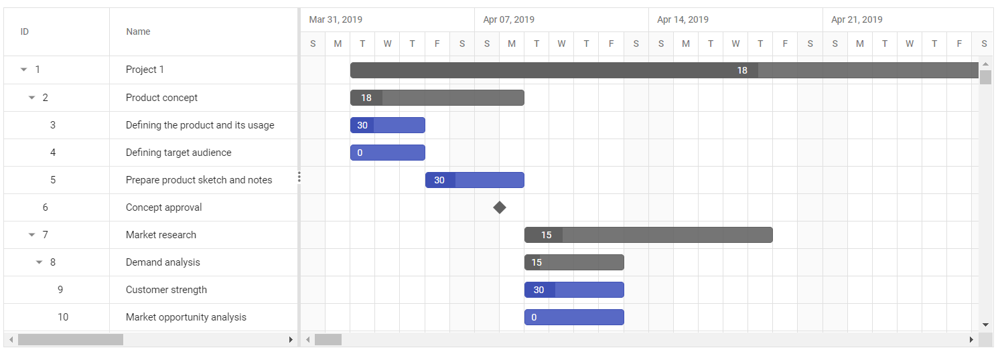

# Virtual Scrolling in Gantt

Virtual Scroll support in Gantt allows you to load large amount of data without performance degradation. To enable Virtual Scrolling, you need to inject `VirtualScroll` module in Gantt.

## Row virtualization

Row virtualization allows you to load and render a large number of tasks in Gantt with effective performance. In this mode, all tasks are fetched initially from the datasource and rendered in the DOM within a compact viewport area.

The number of records displayed in the Gantt is determined by the height.

This mode can be enable by setting the `EnableVirtualization` property to `true`.
























## Timeline virtualization

Timeline virtualization allows you to load a data source having large timespan with high performance. Initially, it renders the timeline with thrice the width of the gantt element, while other timeline cells render on-demand during horizontal scrolling.

This mode can be enable by setting the [EnableTimelineVirtualization](https://help.syncfusion.com/cr/aspnetcore-js2/Syncfusion.EJ2.Gantt.Gantt.html#Syncfusion_EJ2_Gantt_Gantt_EnableTimelineVirtualization) property to `true`.
























## Limitations for virtual scroll

* Due to the element height limitation in browsers, the maximum number of records loaded is limited by the browser capacity.
* Cell selection will not be persisted.
* The number of records rendered will be determined by the `Height` property.
* It is necessary to mention the height of the Gantt in pixels when enabling Virtual Scrolling.
* With virtualization enabled, data is rendered in sets per page. When scrolling to view the next set of records, if a record is selected, only the current page's records are returned by the Gantt's public methods. This occurs because the Gantt chart doesn't maintain records from all pages to optimize performance.
