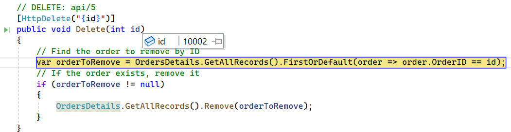

# WebApiAdaptor in Syncfusion ASP.NET MVC Grid

The `WebApiAdaptor` is an extension of the `ODataAdaptor`, designed to interact with Web APIs created with OData endpoints. This adaptor ensures seamless communication between Syncfusion Grid and OData-endpoint based Web APIs, enabling efficient data retrieval and manipulation. For successful integration, the endpoint must be capable of understanding OData-formatted queries sent along with the request.

To enable the OData query option for a Web API, please refer to the corresponding [documentation](https://learn.microsoft.com/en-us/aspnet/web-api/overview/odata-support-in-aspnet-web-api/supporting-odata-query-options), which provides detailed instructions on configuring the endpoint to understand OData-formatted queries.

This section describes a step-by-step process for retrieving data service using `WebApiAdaptor`, then binding it to the Syncfusion ASP.NET MVC Grid to facilitate data and CRUD operations.

## Creating a Web API service

To configure a server with Syncfusion ASP.NET MVC Grid with Web API, follow these steps:

**Step 1: Project Creation**

1. Open **Visual Studio**.
2. Select **Create a new project** → Choose **ASP.NET Web Application (.NET Framework)**.
3. Name the project **WebApiAdaptor** and select **MVC** as the project template.
4. Ensure that the **Web API** option is selected.

For detailed information, refer to this [documentation](https://learn.microsoft.com/en-us/aspnet/mvc/overview/getting-started/introduction/getting-started#create-your-first-app).

**2. Model Class Creation:**

Create a model class named `OrdersDetails.cs` in the server-side **Models** folder to represent the order data.




namespace WebApiAdaptor.Models
{
  public class OrdersDetails
  {
    public static List<OrdersDetails> order = new List<OrdersDetails>();
    public OrdersDetails()
    {
    }
    public OrdersDetails(
    int OrderID, string CustomerId, int EmployeeId, double Freight, bool Verified,
    DateTime OrderDate, string ShipCity, string ShipName, string ShipCountry,
    DateTime ShippedDate, string ShipAddress)
    {
      this.OrderID = OrderID;
      this.CustomerID = CustomerId;
      this.EmployeeID = EmployeeId;
      this.Freight = Freight;
      this.ShipCity = ShipCity;
      this.Verified = Verified;
      this.OrderDate = OrderDate;
      this.ShipName = ShipName;
      this.ShipCountry = ShipCountry;
      this.ShippedDate = ShippedDate;
      this.ShipAddress = ShipAddress;
    }

    public static List<OrdersDetails> GetAllRecords()
    {
      if (order.Count() == 0)
      {
        int code = 10000;
        for (int i = 1; i < 10; i++)
        {
          order.Add(new OrdersDetails(code + 1, "ALFKI", i + 0, 2.3 * i, false, new DateTime(1991, 05, 15), "Berlin", "Simons bistro", "Denmark", new DateTime(1996, 7, 16), "Kirchgasse 6"));
          order.Add(new OrdersDetails(code + 2, "ANATR", i + 2, 3.3 * i, true, new DateTime(1990, 04, 04), "Madrid", "Queen Cozinha", "Brazil", new DateTime(1996, 9, 11), "Avda. Azteca 123"));
          order.Add(new OrdersDetails(code + 3, "ANTON", i + 1, 4.3 * i, true, new DateTime(1957, 11, 30), "Cholchester", "Frankenversand", "Germany", new DateTime(1996, 10, 7), "Carrera 52 con Ave. Bolívar #65-98 Llano Largo"));
          order.Add(new OrdersDetails(code + 4, "BLONP", i + 3, 5.3 * i, false, new DateTime(1930, 10, 22), "Marseille", "Ernst Handel", "Austria", new DateTime(1996, 12, 30), "Magazinweg 7"));
          order.Add(new OrdersDetails(code + 5, "BOLID", i + 4, 6.3 * i, true, new DateTime(1953, 02, 18), "Tsawassen", "Hanari Carnes", "Switzerland", new DateTime(1997, 12, 3), "1029 - 12th Ave. S."));
          code += 5;
        }
      }
      return order;
    }

    public int OrderID { get; set; }
    public string CustomerID { get; set; }
    public int EmployeeID { get; set; }
    public double Freight { get; set; }
    public string ShipCity { get; set; }
    public bool Verified { get; set; }
    public DateTime OrderDate { get; set; }
    public string ShipName { get; set; }
    public string ShipCountry { get; set; }
    public DateTime ShippedDate { get; set; }
    public string ShipAddress { get; set; }
  }
}




**3. Configure Routing in Web API**

Modify `WebApiConfig.cs` inside the `App_Start` folder to enable routing.

```cs
using System.Linq;
using System.Net.Http.Headers;
using System.Web;
using System.Web.Http;

namespace WebApiAdaptor.App_Start
{
  public static class WebApiConfig
    {
        public static void Register(HttpConfiguration config)
        {
            config.MapHttpAttributeRoutes();

            config.Routes.MapHttpRoute(
                name: "OrdersApi",
                routeTemplate: "api/{controller}/{id}",
                defaults: new { id = System.Web.Http.RouteParameter.Optional }
            );
            // Web API routes.
            config.Routes.MapHttpRoute(
                name: "DefaultApi",
                routeTemplate: "api/{controller}/{action}/{id}",
                defaults: new { id = System.Web.Http.RouteParameter.Optional }
            );
            // Configure JSON formatting.
            config.Formatters.JsonFormatter.SerializerSettings.Formatting = Newtonsoft.Json.Formatting.Indented;
            config.Formatters.JsonFormatter.SupportedMediaTypes
            .Add(new MediaTypeHeaderValue("text/html"));
        }
    }
}
```

**4. API Controller Creation:**

Create a file named `OrdersController.cs` under the **Controllers** folder. This controller will handle data communication with the ASP.NET MVC Grid. Implement the **Get** method in the controller to return the data in JSON format, including the **items** and **count** properties as required by `WebApiAdaptor`.




using WebApiAdaptor.Models;
using System;
using System.Linq;
using System.Web;
using System.Web.Http;

namespace WebApiAdaptor.Controllers
{
  public class OrdersController : ApiController
  {
    [HttpGet]
    public object Get()
    {
      var data = OrdersDetails.GetAllRecords().ToList();
      return  new { items = data, count = data.Count() };
    }
  }
}




**5. Run the Application:**

Run the application in Visual Studio. It will be accessible on a URL like **https://localhost:xxxx**. 

After running the application, you can verify that the server-side API controller is successfully returning the order data in the URL(https://localhost:xxxx/api/Orders). Here **xxxx** denotes the port number.


## Connecting Syncfusion ASP.NET MVC Grid to an API service

To integrate the Syncfusion Grid into your ASP.NET MVC project using Visual Studio, follow these steps:

**Step 1:** Install the Syncfusion ASP.NET MVC Package:

To add `ASP.NET MVC` controls to your application, open the NuGet Package Manager in Visual Studio (Tools → NuGet Package Manager → Manage NuGet Packages for Solution), search for [Syncfusion.EJ2.MVC5](https://www.nuget.org/packages/Syncfusion.EJ2.MVC5) and then install it. Alternatively, you can install it using the following Package Manager Console command:




Install-Package Syncfusion.EJ2.MVC5 -Version {{ site.releaseversion }}




**Step 2:** Add Syncfusion ASP.NET MVC namespace

Add `Syncfusion.EJ2` namespace reference in `Web.config` under `Views` folder.

```cs
<namespaces>
    <add namespace="Syncfusion.EJ2"/>
</namespaces>
```

**Step 3:** Add stylesheet and script resources

To include the required styles and scripts, add the following references inside the `<head>` of `~/views/Shared/_Layout.cshtml` file:




<head>
  ...
  <!-- Syncfusion ASP.NET MVC controls styles -->
  <link rel="stylesheet" href="https://cdn.syncfusion.com/ej2/{{ site.ej2version }}/bootstrap5.css" />
  <!-- Syncfusion ASP.NET MVC controls scripts -->
  <script src="https://cdn.syncfusion.com/ej2/{{ site.ej2version }}/dist/ej2.min.js"></script>
  <!-- Include the necessary CSS files to style the Syncfusion ASP.NET MVC component: -->
  <link href="https://cdn.syncfusion.com/ej2/{{ site.ej2version }}/ej2-base/styles/bootstrap5.css" rel="stylesheet" />
  <link href="https://cdn.syncfusion.com/ej2/{{ site.ej2version }}/ej2-grids/styles/bootstrap5.css" rel="stylesheet" />
  <link href="https://cdn.syncfusion.com/ej2/{{ site.ej2version }}/ej2-buttons/styles/bootstrap5.css" rel="stylesheet" />
  <link href="https://cdn.syncfusion.com/ej2/{{ site.ej2version }}/ej2-popups/styles/bootstrap5.css" rel="stylesheet" />
  <link href="https://cdn.syncfusion.com/ej2/{{ site.ej2version }}/ej2-richtexteditor/styles/bootstrap5.css" rel="stylesheet" />
  <link href="https://cdn.syncfusion.com/ej2/{{ site.ej2version }}/ej2-navigations/styles/bootstrap5.css" rel="stylesheet" />
  <link href="https://cdn.syncfusion.com/ej2/{{ site.ej2version }}/ej2-dropdowns/styles/bootstrap5.css" rel="stylesheet" />
  <link href="https://cdn.syncfusion.com/ej2/{{ site.ej2version }}/ej2-lists/styles/bootstrap5.css" rel="stylesheet" />
  <link href="https://cdn.syncfusion.com/ej2/{{ site.ej2version }}/ej2-inputs/styles/bootstrap5.css" rel="stylesheet" />
  <link href="https://cdn.syncfusion.com/ej2/{{ site.ej2version }}/ej2-calendars/styles/bootstrap5.css" rel="stylesheet" />
  <link href="https://cdn.syncfusion.com/ej2/{{ site.ej2version }}/ej2-notifications/styles/bootstrap5.css" rel="stylesheet" />
  <link href="https://cdn.syncfusion.com/ej2/{{ site.ej2version }}/ej2-splitbuttons/styles/bootstrap5.css" rel="stylesheet" />
  <script src="https://cdnjs.cloudflare.com/ajax/libs/systemjs/0.19.38/system.js"></script>
  <script src="https://cdn.syncfusion.com/ej2/syncfusion-helper.js" type="text/javascript"></script>
</head>




**Step 4:** Register Syncfusion Script Manager

To ensure proper script execution, register the Syncfusion Script Manager `EJS().ScriptManager()` at the end of `<body>` in the `~/Views/Shared/_Layout.cshtml` file as follows.




<body>
  <!-- Syncfusion ASP.NET MVC Script Manager -->
  @Html.EJS().ScriptManager()
</body>




**Step 5:** Add the Syncfusion ASP.NET MVC Grid

Now, add the Syncfusion ASP.NET MVC Grid in `~/Views/Home/Index.cshtml` file.




@using Syncfusion.EJ2
// Replace `xxxx` with your actual localhost port number.
@Html.EJS().Grid("Grid").DataSource(dm => dm.Url("https://localhost:xxxx/api/Orders").Adaptor("WebApiAdaptor")).Columns(col =>
  {
		col.Field("OrderID").HeaderText("Order ID").Width("150").TextAlign(Syncfusion.EJ2.Grids.TextAlign.Right).IsPrimaryKey(true).Add();
		col.Field("CustomerID").HeaderText("Customer ID").Width("150").Add();
		col.Field("EmployeeID").HeaderText("Employee ID").Width("150").Add();
		col.Field("ShipCountry").HeaderText("Ship Country").Width("150").Add();
	}).Render()




> Replace https://localhost:xxxx/api/Orders with the actual URL of your endpoint that provides the data in a consumable format (e.g., JSON).

**Step 7:** Run the Project

Run the project in Visual Studio, and the Syncfusion ASP.NET MVC Grid will successfully fetch data from the API service.


## Handling searching operation

To handle search operation, implement search logic on the server side according to the received OData-formatted query.





// GET: api/Orders
[HttpGet]
public object Get()
{
  var queryString = Request.Query;
  var data = OrdersDetails.GetAllRecords().ToList();
  string filter = queryString["$filter"];

  if (filter != null)
  {
    var filters = filter.Split(new string[] { " and " }, StringSplitOptions.RemoveEmptyEntries);
    foreach (var filterItem in filters)
    {
      if (filterItem.Contains("substringof"))
      {
        // Perform Searching.
        var searchParts = filterItem.Split('(', ')', '\'');
        var searchValue = searchParts[3];

        // Apply the search value to all searchable fields.
        data = data.Where(cust =>
          cust.OrderID.ToString().Contains(searchValue) ||
          cust.CustomerID.ToLower().Contains(searchValue) ||
          cust.ShipCity.ToLower().Contains(searchValue) ||
          cust.ShipCountry.ToLower().Contains(searchValue)
        // Add conditions for other searchable fields as needed.
        ).ToList();
      }
      else
      {
        // Perform filtering.
      }
    }
  }
  return new { items = data, count = data.Count() };
}


// Replace `xxxx` with your actual localhost port number.
@Html.EJS().Grid("Grid").DataSource(ds => ds.Url("https://localhost:xxxx/api/Orders").Adaptor("WebApiAdaptor")).Columns(col =>
  {
    col.Field("OrderID").HeaderText("Order ID").Width("150").TextAlign(Syncfusion.EJ2.Grids.TextAlign.Right).IsPrimaryKey(true).Add();
    col.Field("CustomerID").HeaderText("Customer ID").Width("150").Add();
    col.Field("ShipCity").HeaderText("Ship City").Width("150").Add();
    col.Field("ShipCountry").HeaderText("Ship Country").Width("150").Add();
  }).Toolbar(new List<string>() { "Search" }).Render()




## Handling filtering operation

To handle filter operations, ensure that your Web API endpoint supports filtering based on OData-formatted queries. Implement the filtering logic on the server-side as shown in the provided code snippet.





// GET: api/Orders
[HttpGet]
public object Get()
{
  var queryString = Request.Query;
  var data = Orders.GetAllRecords().ToList();
  string filter = queryString["$filter"];
  if (filter != null)
  {
    var filters = filter.Split(new string[] { " and " }, StringSplitOptions.RemoveEmptyEntries);
    foreach (var filterItem in filters)
    {
      var filterfield = "";
      var filtervalue = "";
      var filterParts = filterItem.Split('(', ')', '\'');
      if (filterParts.Length != 9)
      {
        var filterValueParts = filterParts[1].Split();
        filterfield = filterValueParts[0];
        filtervalue = filterValueParts[2];
      }
      else
      {
        filterfield = filterParts[3];
        filtervalue = filterParts[5];
      }
      switch (filterfield)
      {
        case "OrderID":
          data = (from cust in data
                where cust.OrderID.ToString() == filtervalue.ToString()
                select cust).ToList();
        break;
        case "CustomerID":
          data = (from cust in data
                where cust.CustomerID.ToLower().StartsWith(filtervalue.ToString())
                select cust).ToList();
        break;
        case "ShipCity":
          data = (from cust in data
                where cust.ShipCity.ToLower().StartsWith(filtervalue.ToString())
                select cust).ToList();
        break;
        case "ShipCountry":
          data = (from cust in data
                where cust.ShipCountry.ToLower().StartsWith(filtervalue.ToString())
                select cust).ToList();
        break;
      }
    }
    return new { items = data, count = data.Count() };
  }
}


// Replace `xxxx` with your actual localhost port number.
@Html.EJS().Grid("Grid").DataSource(ds => ds.Url("https://localhost:xxxx/api/Orders").Adaptor("WebApiAdaptor")).Columns(col =>
  {
    col.Field("OrderID").HeaderText("Order ID").Width("150").TextAlign(Syncfusion.EJ2.Grids.TextAlign.Right).IsPrimaryKey(true).Add();
    col.Field("CustomerID").HeaderText("Customer ID").Width("150").Add();
    col.Field("ShipCity").HeaderText("Ship City").Width("150").Add();
    col.Field("ShipCountry").HeaderText("Ship Country").Width("150").Add();
  }).AllowFiltering().Render()




## Handling sorting operation

To handle sorting action, implement sorting logic on the server-side according to the received OData-formatted query.

**Ascending Sorting**


**Descending Sorting**





// GET: api/Orders
public object Get()
{
    var queryString = Request.Query;
    var data = OrdersDetails.GetAllRecords().ToList();
    string sort = queryString["$orderby"];   //sorting.  
    if (!string.IsNullOrEmpty(sort))
    {
        var sortConditions = sort.Split(',');
        var orderedData = data.OrderBy(x => 0); // Start with a stable sort.
        foreach (var sortCondition in sortConditions)
        {
            var sortParts = sortCondition.Trim().Split(' ');
            var sortBy = sortParts[0];
            var sortOrder = sortParts.Length > 1 && sortParts[1].ToLower() == "desc";
            switch (sortBy)
            {
                case "OrderID":
                    orderedData = sortOrder ? orderedData.ThenByDescending(x => x.OrderID) : orderedData.ThenBy(x => x.OrderID);
                    break;
                case "CustomerID":
                    orderedData = sortOrder ? orderedData.ThenByDescending(x => x.CustomerID) : orderedData.ThenBy(x => x.CustomerID);
                    break;
                case "ShipCity":
                    orderedData = sortOrder ? orderedData.ThenByDescending(x => x.ShipCity) : orderedData.ThenBy(x => x.ShipCity);
                    break;
                case "ShipCountry":
                orderedData = sortOrder ? orderedData.ThenByDescending(x => x.ShipCountry) : orderedData.ThenBy(x => x.ShipCountry);
                break;
            }
        }
        data = orderedData.ToList();
    }
    return new { items = data, count = data.Count() };
}


// Replace `xxxx` with your actual localhost port number.
@Html.EJS().Grid("Grid").DataSource(ds => ds.Url("https://localhost:xxxx/api/Orders").Adaptor("WebApiAdaptor")).Columns(col =>
  {
    col.Field("OrderID").HeaderText("Order ID").Width("150").TextAlign(Syncfusion.EJ2.Grids.TextAlign.Right).IsPrimaryKey(true).Add();
    col.Field("CustomerID").HeaderText("Customer ID").Width("150").Add();
    col.Field("ShipCity").HeaderText("Ship City").Width("150").Add();
    col.Field("ShipCountry").HeaderText("Ship Country").Width("150").Add();
  }).AllowSorting().Render()




## Handling paging operation

Implement paging logic on the server-side according to the received OData-formatted query. Ensure that the endpoint supports paging based on the specified criteria.





// GET: api/Orders
[HttpGet]
public object Get()
{
    var queryString = Request.Query;
    var data = Orders.GetAllRecords().ToList();
    // Perform Paging operation.
    int skip = Convert.ToInt32(queryString["$skip"]);
    int take = Convert.ToInt32(queryString["$top"]);
    return take != 0 ? new { items = data.Skip(skip).Take(take).ToList(), count = data.Count() } : new { items = data, count = data.Count() };
}


// Replace `xxxx` with your actual localhost port number.
@Html.EJS().Grid("Grid").DataSource(ds => ds.Url("https://localhost:xxxx/api/Orders").Adaptor("WebApiAdaptor")).Columns(col =>
  {
    col.Field("OrderID").HeaderText("Order ID").Width("150").TextAlign(Syncfusion.EJ2.Grids.TextAlign.Right).IsPrimaryKey(true).Add();
    col.Field("CustomerID").HeaderText("Customer ID").Width("150").Add();
    col.Field("ShipCity").HeaderText("Ship City").Width("150").Add();
    col.Field("ShipCountry").HeaderText("Ship Country").Width("150").Add();
  }).AllowPaging().Render()




## Handling CRUD operations

To manage CRUD (Create, Read, Update, Delete) operations using the `WebApiAdaptor`, follow the provided guide for configuring the Syncfusion Grid for [editing](https://ej2.syncfusion.com/aspnetmvc/documentation/grid/editing/edit) and utilize the sample implementation of the `OrdersController` in your server application. This controller handles HTTP requests for CRUD operations such as GET, POST, PUT, and DELETE.

To enable CRUD operations in the Syncfusion Grid within an ASP.NET MVC application, follow the below steps:




// Replace `xxxx` with your actual localhost port number.
@Html.EJS().Grid("Grid").DataSource(ds => ds.Url("https://localhost:xxxx/api/Orders").Adaptor("WebApiAdaptor")).Columns(col =>
  {
    col.Field("OrderID").HeaderText("Order ID").Width("150").TextAlign(Syncfusion.EJ2.Grids.TextAlign.Right).IsPrimaryKey(true).Add();
    col.Field("CustomerID").HeaderText("Customer ID").Width("150").Add();
    col.Field("ShipCity").HeaderText("Ship City").Width("150").Add();
    col.Field("ShipCountry").HeaderText("Ship Country").Width("150").Add();
  }).EditSettings(edit => { edit.AllowAdding(true).AllowEditing(true).AllowDeleting(true).Mode(Syncfusion.EJ2.Grids.EditMode.Normal); }).Toolbar(new List<string>() { "Add", "Edit", "Delete", "Update", "Cancel" }).Render()




> Normal/Inline editing is the default edit `Mode` for the Grid. To enable CRUD operations, ensure that the [IsPrimaryKey](https://help.syncfusion.com/cr/aspnetmvc-js2/Syncfusion.EJ2.Grids.GridColumn.html#Syncfusion_EJ2_Grids_GridColumn_IsPrimaryKey) property is set to **true** for a specific Grid column, ensuring that its value is unique.

**Insert Record**

To insert a new record into your Syncfusion Grid, you can utilize the `HttpPost` method in your server application. Below is a sample implementation of inserting a record using the **OrdersController**:


```cs
// POST: api/Orders
/// <summary>
/// Inserts a new data item into the data collection.
/// </summary>
/// <param name="newRecord">It holds new record detail which is need to be inserted.</param>
/// <returns>Returns void</returns>
[HttpPost]
public void Post([FromBody] OrdersDetails newRecord)
{
  // Insert a new record into the OrdersDetails model.
  OrdersDetails.GetAllRecords().Insert(0, newRecord);
}
```

**Update Record**

Updating a record in the Syncfusion Grid can be achieved by utilizing the `HttpPut` method in your controller. Here's a sample implementation of updating a record:


```cs
// PUT: api/Orders/5
/// <summary>
/// Update a existing data item from the data collection.
/// </summary>
/// <param name="updatedOrder">It holds updated record detail which is need to be updated.</param>
/// <returns>Returns void</returns>
[HttpPut]
public void Put(int id, [FromBody] OrdersDetails updatedOrder)
{
  // Find the existing order by ID.
  var existingOrder = OrdersDetails.GetAllRecords().FirstOrDefault(o => o.OrderID == id);
  if (existingOrder != null)
  {
    // If the order exists, update its properties.
    existingOrder.OrderID = updatedOrder.OrderID;
    existingOrder.CustomerID = updatedOrder.CustomerID;
    existingOrder.ShipCity = updatedOrder.ShipCity;
    existingOrder.ShipCountry = updatedOrder.ShipCountry;
  }
}
```

**Delete Record**

To delete a record from your Syncfusion Grid, you can utilize the `HttpDelete` method in your controller. Below is a sample implementation:



```cs
// DELETE: api/5
/// <summary>
/// Remove a specific data item from the data collection.
/// </summary>
/// <param name="key">It holds specific record detail id which is need to be removed.</param>
/// <returns>Returns void</returns>
[HttpDelete]
public void Delete(int key)
{
  // Find the order to remove by ID.
  var orderToRemove = OrdersDetails.GetAllRecords().FirstOrDefault(order => order.OrderID == key);
  // If the order exists, remove it.
  if (orderToRemove != null)
  {
    OrdersDetails.GetAllRecords().Remove(orderToRemove);
  }
}
```

