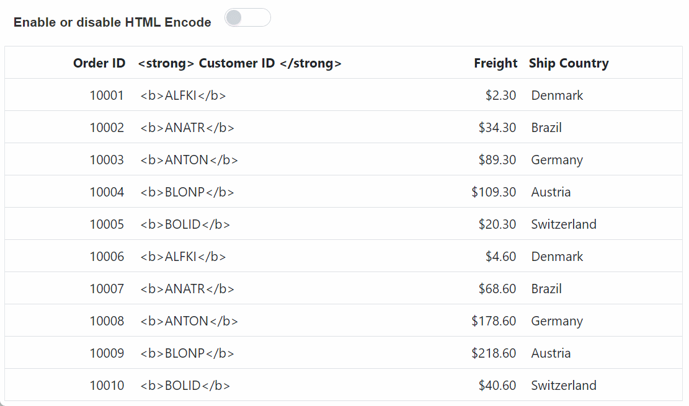
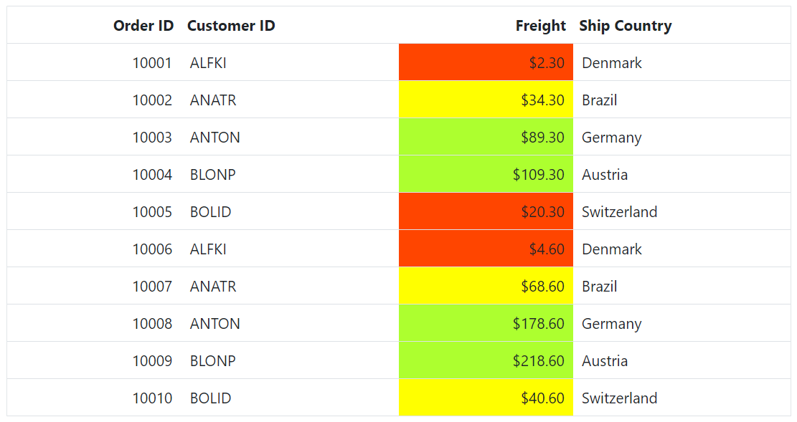
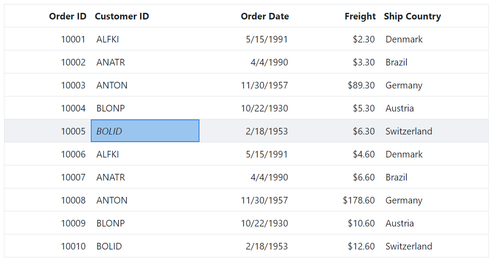
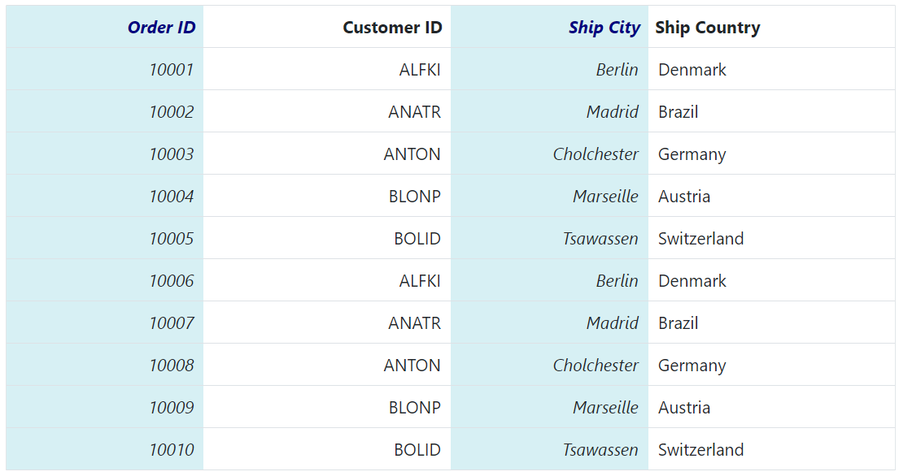
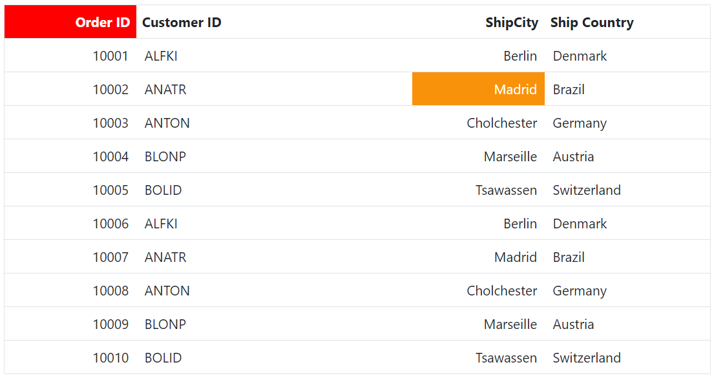

# Cell in ##Platform_Name## Grid component

In the Syncfusion ##Platform_Name## Grid, a **cell** refers to an individual data point or a unit within a grid column that displays data. It represents the intersection of a row and a column, and it contains specific information associated with that row and column. Each cell can display text, numbers, or other content related to the data it represents. 

The Grid component allows you to customize the appearance and behavior of cells using various features and options. You can define templates, format cell values, enable or disable editing, and perform various other operations on the cells to create interactive and informative data grids in your web applications.

## Displaying the HTML content

Displaying HTML content in a Grid can be useful in scenarios where you want to display formatted content, such as images, links, or tables, in a tabular format. Grid component allows you to display HTML tags in the Grid header and content. By default, the HTML content is encoded to prevent potential security vulnerabilities. However, you can enable the `DisableHtmlEncode` property by setting the value as **false** to display HTML tags without encoding. This feature is useful when you want to display HTML content in a grid cell.

In the following example, the [EJ2 Toggle Switch Button](https://ej2.syncfusion.com/aspnetmvc/documentation/switch/getting-started) component is added  to enable and disable the `DisableHtmlEncode` property. When the switch is toggled, the [change](https://help.syncfusion.com/cr/aspnetmvc-js2/Syncfusion.EJ2.Buttons.Switch.html#Syncfusion_EJ2_Buttons_Switch_Change) event is triggered and the `DisableHtmlEncode` property of the column is updated accordingly. The `refreshColumns` method is called to refresh the grid and display the updated content.












> * The `DisableHtmlEncode` property disables HTML encoding for the corresponding column in the grid. 
> * If the property is set to **true**, any HTML tags in the column's data will be displayed. 
> * If the property is set to **false**, the HTML tags will be removed and displayed as plain text.
> * Disabling HTML encoding can potentially introduce security vulnerabilities, so use caution when enabling this feature.
> * If [EnableHtmlSanitizer](https://help.syncfusion.com/cr/aspnetmvc-js2/Syncfusion.EJ2.Grids.Grid.html#Syncfusion_EJ2_Grids_Grid_EnableHtmlSanitizer) property of grid is set to true, then the content is sanitized to prevent any potential security vulnerabilities.
> * You can also disable the `DisableHtmlEncode` property of the column using [getColumns](https://ej2.syncfusion.com/angular/documentation/api/grid#getcolumns) method on [change](https://ej2.syncfusion.com/angular/documentation/api/switch/#change) event of Switch component.This is demonstrated in the below code snippet, 

```javascript
function change(args) {
  if (args.checked) {
    grid.getColumns()[1].disableHtmlEncode = false;
  } else {
    grid.getColumns()[1].disableHtmlEncode = true;
  }
  grid.refresh();
}
```

## Autowrap the content


> * If a column width is not specified, then the Autowrap of columns will be adjusted with respect to the grid's width.
> * If a column's header text contains no white space, the text may not be wrapped.
> * If the content of a cell contains HTML tags, the Autowrap functionality may not work as expected. In such cases, you can use the [headerTemplate](https://ej2.syncfusion.com/angular/documentation/api/grid/column/#headertemplate) and [template](https://ej2.syncfusion.com/angular/documentation/api/grid/column/#template) properties of the column to customize the appearance of the header and cell content.

## Customize cell styles

Customizing the grid cell styles allows you to modify the appearance of cells in the Grid control to meet your design requirements. You can customize the font, background color, and other styles of the cells. To customize the cell styles in the grid, you can use grid event, css, property or method support.

### Using event

To customize the appearance of the grid cell, you can use the [queryCellInfo](https://help.syncfusion.com/cr/aspnetmvc-js2/Syncfusion.EJ2.Grids.Grid.html#Syncfusion_EJ2_Grids_Grid_QueryCellInfo) event of the grid. This event is triggered when each header cell is rendered in the grid, and provides an object that contains information about the header cell. You can use this object to modify the styles of the header cell.

The following example demonstrates how to add a `queryCellInfo` event handler to the grid. In the event handler, checked whether the current column is **Freight** field and then applied the appropriate CSS class to the cell based on its value.












> * The [queryCellInfo](https://help.syncfusion.com/cr/aspnetmvc-js2/Syncfusion.EJ2.Grids.Grid.html#Syncfusion_EJ2_Grids_Grid_QueryCellInfo) event is triggered for every cell of the grid, so it may impact the performance of the grid whether used to modify a large number of cells.

### Using CSS

You can apply styles to the cells using CSS selectors. The Grid provides a class name for each cell element, which you can use to apply styles to that specific cell or cells in a particular column. The `e-rowcell` class is used to style the row cells, and the `e-selectionbackground` class is used to change the background color of the selected row.

```CSS
.e-grid td.e-cellselectionbackground {
  background: #9ac5ee;
  font-style: italic;
}
```

The following example demonstrates how to customize the appearance of a specific row in the grid on selection using `className`. 












### Using property

To customize the style of grid cells, define `customAttributes` property to the column definition object. The `customAttributes` property takes an object with the name-value pair to customize the CSS properties for grid cells. You can also set multiple CSS properties to the custom class using the `customAttributes` property.

```CSS
.custom-css {
  background: #d7f0f4;
  font-style: italic;
  color:navy
}
```
Here, setting the `customAttributes` property of the **ShipCity** column to an object that contains the CSS class **'custom-css'**. This CSS class will be applied to all the cells in the **ShipCity** column of the grid.

```js
		col.Field("ShipCity").HeaderText("Ship City").Width("120").TextAlign(Syncfusion.EJ2.Grids.TextAlign.Right).CustomAttributes(new { @class = "custom-css" }).Add();
```
The following example demonstrates how to customize the appearance of the **OrderID** and **ShipCity** columns using custom attributes. 












> Custom attributes can be used to customize any cell in the grid, including header and footer cells.

### Using methods

The Grid provides below methods to customize the appearance of the grid columns header and cell:

1. **getHeaderContent**: The `getHeaderContent` method is used to customize the appearance of the column header in the grid and accessing the header element using the `querySelector` method and applying the style using the style property of the cell element.

2. **getCellFromIndex**: The `getCellFromIndex` method is used to customize the appearance of a specific cell in the grid by specifying the index of the row and column for which you want to customize the appearance.

The following example demonstrates how to use getColumnHeaderByIndex and getCellFromIndex methods to customize the appearance of the **CustomerID** column header and specific cell inside the [dataBound](https://help.syncfusion.com/cr/aspnetmvc-js2/Syncfusion.EJ2.Grids.Grid.html#Syncfusion_EJ2_Grids_Grid_DataBound) event of the grid.












> Make sure to pass the correct row and column indices to [getCellFromIndex](https://ej2.syncfusion.com/angular/documentation/api/grid/#getcellfromindex) method, or else the appearance of the wrong cell might get customized.

## Clip Mode

The clip mode feature is useful when you have a long text or content in a grid cell, which overflows the cell's width or height. It provides options to display the overflow content by either truncating it, displaying an ellipsis or displaying an ellipsis with a tooltip. You can enable this feature by setting [ClipMode](https://help.syncfusion.com/cr/aspnetmvc-js2/Syncfusion.EJ2.Grids.ClipMode.html) property to one of the below available options.

There are three types of `ClipMode` available:

* **Clip**: Truncates the cell content when it overflows its area.
* **Ellipsis**: Displays ellipsis when the cell content overflows its area.
* **EllipsisWithTooltip**: Displays ellipsis when the cell content overflows its area, also it will display the tooltip while hover on ellipsis is applied. Also it will display the tooltip while hover on ellipsis is applied.

The following example demonstrates, how to set the `clipMode` property to **Clip** , **Ellipsis** and **EllipsisWithTooltip** for the **Main Fields of Invention** column, on changing the dropdown value using the [change](https://ej2.syncfusion.com/angular/documentation/api/drop-down-list/#change) event of the `DropDownList` component. The [refresh](https://ej2.syncfusion.com/angular/documentation/api/grid/#refresh) method is used to refresh the grid and display the updated content.
