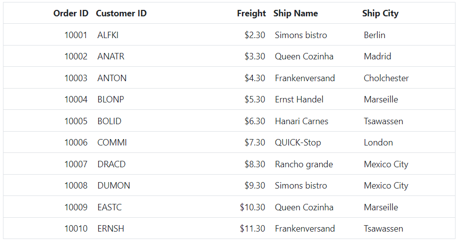
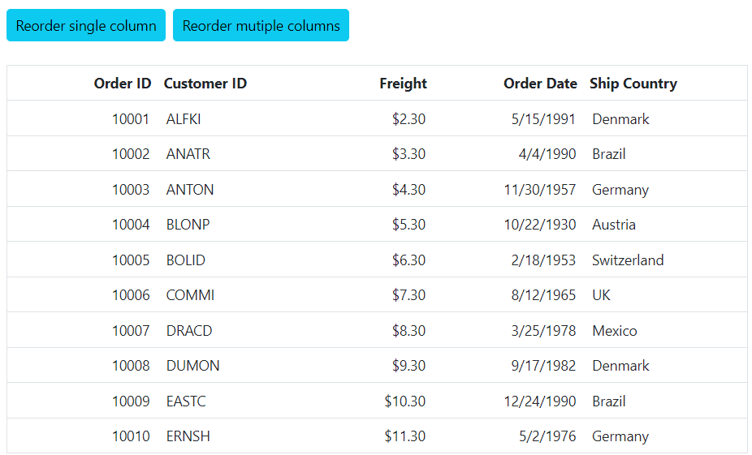
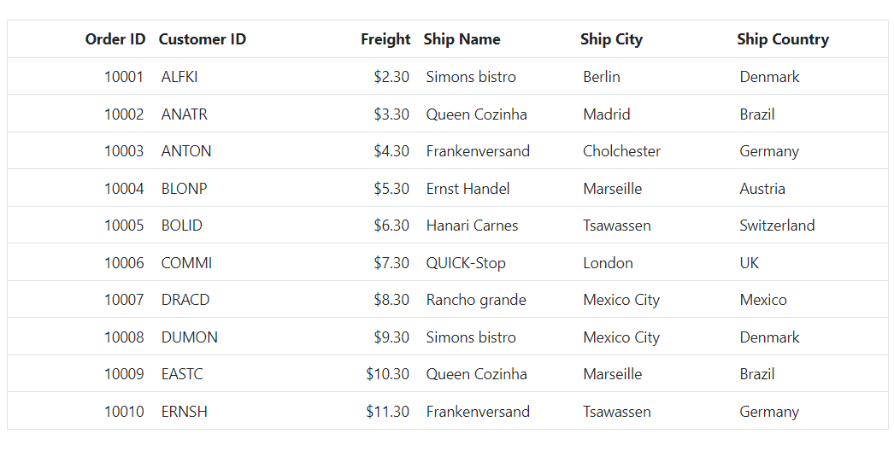

# Column reorder in ##Platform_Name## Grid component
 
The Syncfusion ##Platform_Name## Grid component allows to reorder columns by drag and drop of a particular column header from one index to another index within the grid.

To reorder the columns, set the [AllowReordering](https://help.syncfusion.com/cr/aspnetmvc-js2/Syncfusion.EJ2.Grids.Grid.html#Syncfusion_EJ2_Grids_Grid_AllowReordering) property to **true** in the grid.

Here's an example for column reordering in your Grid component:










>* You can customize the appearance of the column headers during drag and drop by using the [ColumnDrag](https://help.syncfusion.com/cr/aspnetmvc-js2/Syncfusion.EJ2.Grids.Grid.html#Syncfusion_EJ2_Grids_Grid_ColumnDrag) and [ColumnDrop](https://help.syncfusion.com/cr/aspnetmvc-js2/Syncfusion.EJ2.Grids.Grid.html#Syncfusion_EJ2_Grids_Grid_ColumnDrop) events.
>* When columns are reordered, the position of the corresponding column data will also be changed. As a result, you should ensure that any additional code or logic that relies on the order of the column data is updated accordingly.

## Prevent reordering for particular column

By default, all columns in the Syncfusion ##Platform_Name## Grid can be reordered by dragging and dropping their headers to another location within the grid. However, there may be certain columns that you do not want to be reordered. In such cases, you can set the `AllowReordering` property of that particular column to **false**. Here is an example that demonstrates how to prevent reordering for a specific column:

In this example, the **ShipName** column is prevented from being reordered by setting the `AllowReordering` property to **false**.










## Reorder columns externally

The Syncfusion Grid ##Platform_Name## allows you to reorder columns externally, which means that using methods you can programmatically move columns around within the grid, based on their index or target index, or by using their field name.

> When reordering columns externally, you must set the [AllowReordering](https://help.syncfusion.com/cr/aspnetcore-js2/Syncfusion.EJ2.Grids.Grid.html#Syncfusion_EJ2_Grids_Grid_AllowReordering) property of the grid to **true**.

### Reorder column based on index

You can use the `reorderColumnByIndex` method to reorder columns based on their current index. This method takes two arguments:

* **fromIndex** : Current index of the column to be reordered
* **toIndex** : New index of the column after the reordering

Here is an example of how to use the `reorderColumnByIndex` method:

In this example, we are moving the column at index **1** to index **3**.










### Reorder column based on target index

You can also use the `reorderColumnByTargetIndex` method to reorder single column or multiple columns based on the target index. This method takes two arguments:

* **fieldName**: Field name of the column to be reordered
* **toIndex**: New index of the column after the reordering

Here is an example of how to use the `reorderColumnByTargetIndex` method to reorder single column and multiple columns based on target index:










### Reorder column based on field names

The `reorderColumns` method of the Grid allows you to reorder single column or list of columns based on their field names. This method takes two arguments: 

* **fromFName**: The field name of the column you want to move.
* **toFName**: The field name of the column you want to move the column to.

Here is an example of how to use the `reorderColumns` method to reorder single column and multiple columns based on field names:








 

## Reorder events

When reordering columns in the Syncfusion ##Platform_Name## Grid component, you may want to take some specific action in response to the drag and drop events. To handle these events, you can define event handlers for the following events:

1.The [ColumnDragStart](https://help.syncfusion.com/cr/aspnetmvc-js2/Syncfusion.EJ2.Grids.Grid.html#Syncfusion_EJ2_Grids_Grid_ColumnDragStart) event triggers when column header element drag (move) starts.

2.The [ColumnDrag](https://help.syncfusion.com/cr/aspnetmvc-js2/Syncfusion.EJ2.Grids.Grid.html#Syncfusion_EJ2_Grids_Grid_ColumnDrag) event triggers when column header element is dragged (moved) continuously.

3.The [ColumnDrop](https://help.syncfusion.com/cr/aspnetmvc-js2/Syncfusion.EJ2.Grids.Grid.html#Syncfusion_EJ2_Grids_Grid_ColumnDrop) event triggers when a column header element is dropped on the target column.

In the following example, we have implemented the `columnDragStart`, `columnDrag`, and `columnDrop` events in the Syncfusion Grid component.










