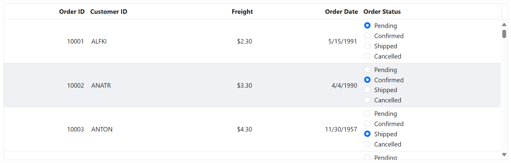

# Column Template in ASP.NET MVC Grid Component

Grid component provides a `Template` option that allows you to display custom elements in a column instead of the field value. This can be useful when you need to display images, buttons, or other custom content within a column.

> When using template columns, they are primarily meant for rendering custom content and may not provide built-in support for grid actions like sorting, filtering, editing. It is must to define the `Field` property of the column to perform any grid actions.

## Render image in a column

To render an image in a grid column, you need to define a `Template` for the column using the template property. The `Template` property expects the HTML element or a function that returns the HTML element.

The following example demonstrates how to define a `Template` for the **Employee Image** field that displays an image element. The `Template` property is set to the HTML element that contains an image tag. You have utilized the `src` and `alt` attributes to an image tag.











> The `Template` option allows to define any HTML content within a column.

## Render hyperlink in a column

The Grid component provides support for rendering hyperlink columns and performing routing on click using the `Template` property. This feature is useful when displaying data that requires a link to another page or website.

The following example demonstrates, how to render hyperlink column in the Grid using the `Template` property of the `Column`. To define a `Template` for the column,  you can use the `Template` with the `a` tag to create the hyperlink.











>The window.open() method is a built-in JavaScript function that opens a new browser window or tab with the specified URL.

## Render other components in a column

The column template has options to render a custom component in a grid column instead of a field value.

### Render LineChart component in a column

The [LineChart](https://ej2.syncfusion.com/aspnetmvc/documentation/sparkline/getting-started) component of Syncfusion<sup style="font-size:70%">&reg;</sup> provides an elegant way to represent and compare data over time. It displays data points connected by straight line segments to visualize trends in data. 

In the following example, we have rendered the Sparkline Chart component in the Grid column by defining the `Template` property.











### Render ColorPicker component in a column

The [ColorPicker](https://ej2.syncfusion.com/aspnetmvc/documentation/color-picker/getting-started) component of Syncfusion<sup style="font-size:70%">&reg;</sup> provides a user-friendly way to select colors from a pre-defined color palette or custom colors. It can be used in a variety of scenarios such as picking a theme color or changing the color of an element on a page.  

In the following code, we rendered the ColorPicker component in the Grid column by defining the `Template` property.

```js
function colorPicker(args) {
  let inputElement = args.cell.querySelector('input')
    let colorPickerObject = new ej.inputs.ColorPicker({
      type: 'color',
      mode: 'Palette',
      change: change,
    });
    colorPickerObject.appendTo(inputElement);
  }
``` 










### Render DropDownList component in a column

To render a custom component in a grid column, you need to define a `Template`  for the column using the `Template`  property. In the following code, we rendered the [DropDownList](https://ej2.syncfusion.com/aspnetmvc/documentation/drop-down-list/getting-started) component in the **Order Status** column by defining the `Template`  property.

```js
function dropdown(args) {
  if (args.column.field === 'OrderStatus') {
      let drop = new ej.dropdowns.DropDownList({
          dataSource: dropData,
          value: args.data['OrderStatus'],
          popupHeight: 150,
          popupWidth: 150,
      });
      drop.appendTo(args.cell.querySelector('#dropElement'));
  }
}
```










### Render Chip component in a column

The Grid component provides support for rendering [Chips](https://ej2.syncfusion.com/aspnetmvc/documentation/chips/getting-started) component in a column using the `Template` property. This feature is useful when displaying data that requires a chip component to be rendered in a column.

In the following code, we rendered the Chips component in the Grid **First Name** column by defining the `Template` property.

```js
function queryCellInfo(args) {
  if (args.column.field === 'FirstName') {
    let chip = new ej.buttons.ChipList({
      text: args.data[args.column.field],
    });
    chip.appendTo(args.cell.querySelector('#chipElement'));
  }
}
```










### Render ProgressBar component in a column

The Syncfusion<sup style="font-size:70%">&reg;</sup> Grid component supports rendering the [Progress Bar](https://ej2.syncfusion.com/aspnetmvc/documentation/progress-bar/getting-started) component within a column using the `Template` property. Displaying the `Progress Bar` component in a grid column allows users to visually track the progress of tasks or operations associated with specific records. This feature is particularly useful for applications involving processes such as data loading, task completion, or other progressive activities.

In the following code, the `Progress Bar` component render in the Grid **Freight** column by defining the `Template` property.

```js
function queryCellInfo(args) {
  if (args.column.field === 'Freight') {
    let percentageProgress = new ej.progressbar.ProgressBar({
      type: 'Linear',
      height: '60',
      value: args.data['Freight'],
      trackThickness:24,
      progressThickness:20
    });
    percentageProgress.appendTo(args.cell.querySelector('#progressBarElement'));
  }
}
``` 










### Render RadioButton in a column

The Syncfusion ASP.NET MVC Grid supports rendering the [RadioButton](https://ej2.syncfusion.com/aspnetmvc/documentation/radio-button/getting-started) within a column using the [Template](https://help.syncfusion.com/cr/aspnetmvc-js2/Syncfusion.EJ2.Grids.GridColumn.html#Syncfusion_EJ2_Grids_GridColumn_Template) property. This feature is particularly useful for displaying selection options, such as order statuses, payment methods, or approval choices, within the Grid.

In the following example, a `RadioButton` is rendered in the **Order Status** column of the Syncfusion ASP.NET Core Grid by defining the `template` property.















## Using condition template

The conditional column `Template` allows you to display template elements based on specific conditions.

The following example demonstrates how to use the `Template` property with the `Template` element and add the condition to render the checkbox based on the value of the **Discontinued** field. The **Discontinued** field will render a checkbox in each row for which the value of the **Discontinued** field is **true**. 

```
  <script id="template" type="text/x-template">
            <div class="template_checkbox">
                ${if(Discontinued)}
                <input type="checkbox" checked> ${else}
                <input type="checkbox"> ${/if}
            </div>
        </script>
```











>You can use any template element or custom component instead of the checkbox in the conditional template based on your requirement.

## How to get the row object by clicking on the template element

The Grid component allows you to retrieve the row object of the selected record when clicking on a `Template` element. This feature can be useful when you need to perform custom actions based on the selected record.

In the following code, the button element is rendered in the **Employee Data** column and `Click` event binding is used to call the showDetails method when the template element is clicked. The showDetails method is passed the data object as an argument, which allows you to access the selected row object and display it in the dialog popup.











## Use custom helper inside the template

The Syncfusion<sup style="font-size:70%">&reg;</sup> Grid allows you to use custom helpers inside the `Template` property of a column. This feature allows you to create complex templates that can incorporate additional helper functions that are not available through the default `Template` syntax.

To use the custom helper function inside a column template, you must first add the function to the template's context.

The following example illustrates how to implement a custom helper function within the template property, utilizing the `Template` property specifically for the Freight column.











> Custom helpers can only be used inside the template property of a column. 

## Dynamically adding template column

The Syncfusion<sup style="font-size:70%">&reg;</sup> Grid component allows you to dynamically add template columns at runtime. This capability is particularly useful when the structure of the grid needs to be modified based on individual interactions or other dynamic conditions.

Dynamically adding template columns involves creating and inserting columns with custom templates after the grid has been initialized. This approach provides flexibility in presenting data in a highly customizable manner.

The following example demonstrates how to add template column using external button click. In this example, the **ShipCountry** column with a [Dropdownlist](https://ej2.syncfusion.com/aspnetmvc/documentation/drop-down-list/getting-started) is added in column `Template`, and an icon is displayed in the column header by using the `HeaderTemplate` for the **ShipCountry** column. 











## Enhancing Grid performance by enabling or disabling Aria Labels

By default, the Syncfusion ASP.NET MVC Grid adds custom **aria-label** attributes to template cells by combining the cell value, the "**is template cell**" identifier, and the column header name. These attributes help screen readers provide meaningful context.

If your application doesn’t require screen reader support and includes multiple template columns, Aria labels may impact performance. To improve rendering, you can disable them for all template columns by setting the `EnableAriaLabel` property to **false** in the `TemplateOptions` of those columns. If accessibility is needed, set it to **true** to retain Aria labels.

The example below enables Aria labels for the **Employee Image** column and disables them for the **First Name** column in the Syncfusion ASP.NET MVC Grid.








