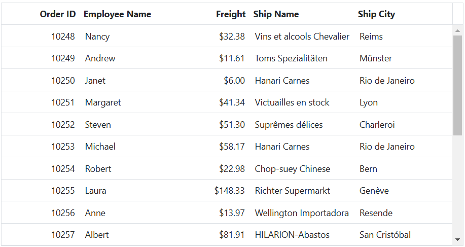
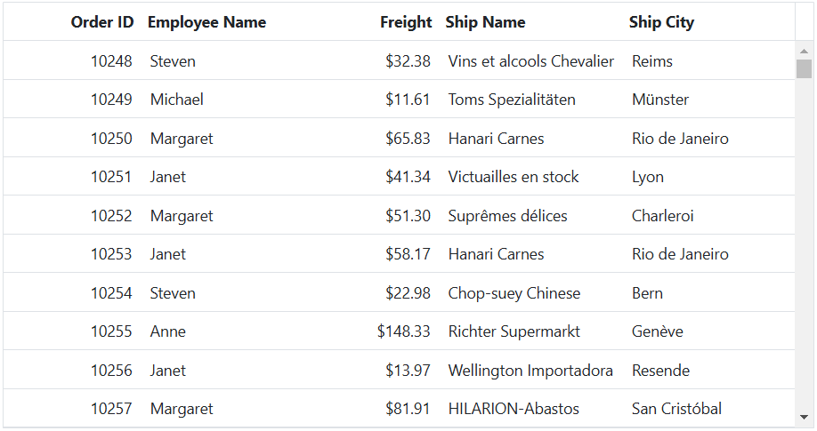
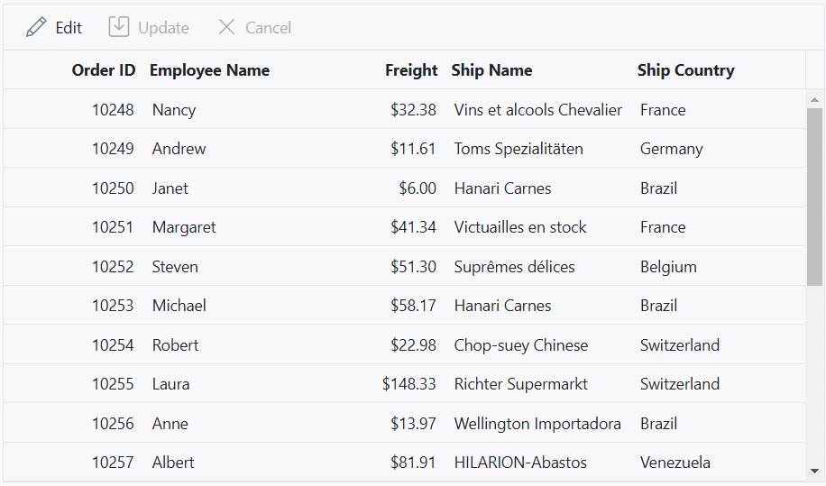
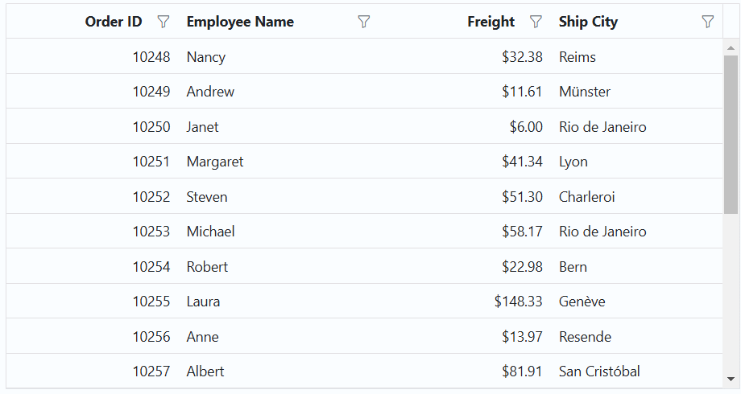
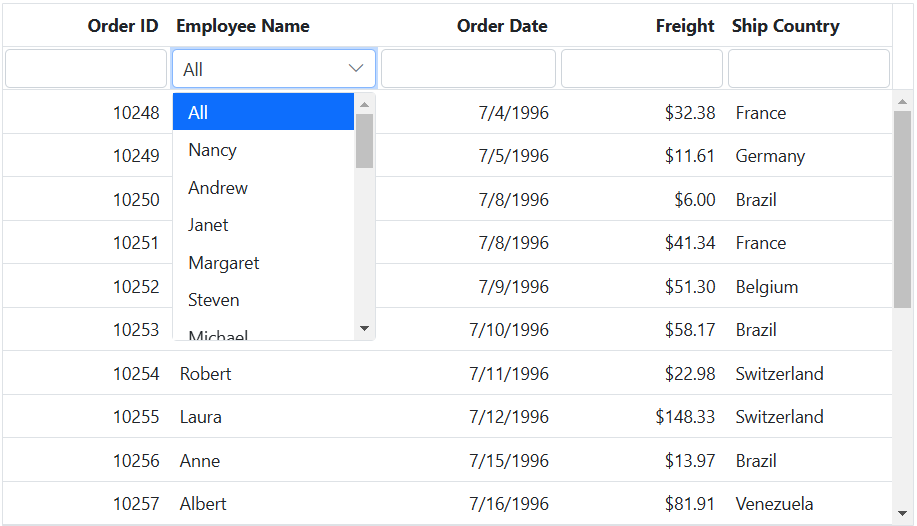
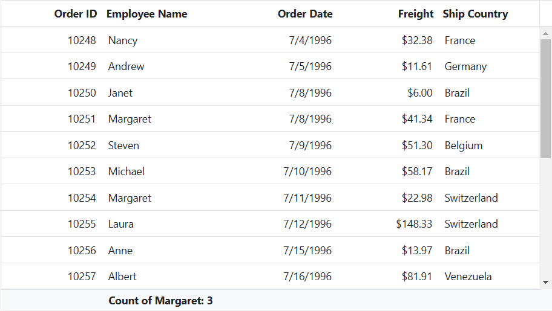
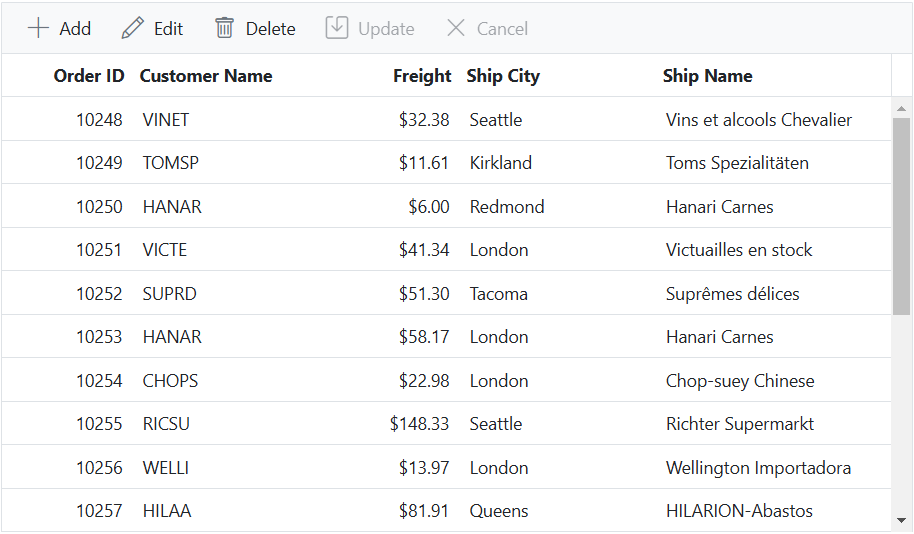

# Foreign key column in ASP.NET MVC Grid component

The Foreign key column in the Syncfusion Grid component allows you to display related data from a foreign key data source in a column within the grid. This feature is particularly useful when you have a column in the grid that represents a foreign key relationship with another data source.

To enable and integrate the foreign key column in the ASP.NET MVC Grid component, follow these steps:

1. Define the foreign key column in the grid using the following properties:

* `DataSource`: Specifies the foreign data source that contains the related data.

* `ForeignKeyField`: Maps the column name in the grid to the field in the foreign data source that represents the foreign key relationship.

* `ForeignKeyValue`: Specifies the field from the foreign data source that should be displayed in the grid as the related data.

```html
    col.Field("EmployeeID").HeaderText("Employee Name").Width("140").foreignKeyField("EmployeeID").ForeignKeyValue("FirstName").DataSource(ViewBag.ForeignData).Add();
```

>The `ForeignKeyField` property should match the name of the field in the foreign data source that represents the foreign key relationship, and the `ForeignKeyValue` property should specify the field from the foreign data source that should be displayed in the grid as the related data.

## Binding local data

The Syncfusion Grid component provides a convenient way to bind local data to a foreign key column. This allows you to display related data from a local data source within the grid. Here's an example of how to bind local data to a Foreign Key column in Syncfusion Grid:

In this example, **data** is the local data source for the Grid, and **employeeData** is the local data source for the foreign key column. The `Field` property of the e-column component is set to **EmployeeID** which represents the foreign key value in the **data**. The `ForeignKeyValue` property is set to **FirstName** which represents the field name in the **employeeData** that you want to display in the foreign key column.















## Binding remote data

The Foreign key column in Syncfusion Grid allows you to bind remote data for a foreign key column. You can assign the service data as an instance of `DataManager` to the `DataSource` property, and provide the endpoint `URL` as the data source URL.

This example demonstrates how to use the foreign key column with remote data binding using the `ODataV4Adaptor` in the grid:









> * For remote data, the sorting and grouping is done based on `Column.ForeignKeyField` instead of `Column.ForeignKeyValue`.
> * If `Column.ForeignKeyField` is not defined, then the column uses `Column.Field`.

## Use edit template in foreign key column

The Syncfusion Grid provides support for using an edit template in a foreign key column. By default, a dropdown component is used for editing foreign key column. However, you can render a different component for editing by using the `Column.Edit` property. Here's an example that demonstrates how to use an edit template in a foreign key column:

In this example, an [AutoComplete](https://ej2.syncfusion.com/aspnetmvc/documentation/auto-complete/getting-started) component is rendered as the edit template for the **"EmployeeID"** foreign key column. The [DataSource](https://help.syncfusion.com/cr/aspnetmvc-js2/Syncfusion.EJ2.DropDowns.AutoComplete.html#Syncfusion_EJ2_DropDowns_AutoComplete_DataSource) property of the AutoComplete component is set to the employees data, and the fields property is configured to display the **"FirstName"** field as the value.












## Customize filter UI of foreign key column

The Syncfusion Grid allows you to customize the filtering user interface (UI) for foreign key columns by using the `Column.Filter` property. By default, a dropdown component is used for filtering foreign key columns. However, you can create your own custom filtering UI by specifying a template function for the `Column.Filter` property. Here's an example that demonstrates how to create a custom filtering UI in a foreign key column:

In this example, a [DropDownList](https://ej2.syncfusion.com/aspnetmvc/documentation/drop-down-list/getting-started) component is rendered as the filter UI for the **"EmployeeID"** foreign key column. The [DataSource](https://help.syncfusion.com/cr/aspnetmvc-js2/syncfusion.ej2.grids.grid.html#Syncfusion_EJ2_Grids_Grid_DataSource) property of the DropDownList component is set to the employees data, and the fields property is configured to display the **FirstName** field as the `Text` and **EmployeeID** field as the `Value`. The `Value` property is set to the current filter value of the column.












## Use filter bar template in foreign key column

You can use the filter bar template in a foreign key column in Grid by defining the `Column.FilterBarTemplate` property. This allows you to customize the filter bar for the foreign key column with a custom component or HTML template. Here's an example that demonstrates how to use a filter bar template in a foreign key column:

In this example, the **"EmployeeID"** column is a foreign key column, and the **filter** function is used as the filter bar template for this column. The `Filter` function can be defined in your component code and should return the desired component or HTML template for the filter bar. The column header shows the custom filter bar template and you can select filter value by using the **DropDown** options.












## Perform aggregation in foreign key column

By default, aggregations are not supported in a foreign key column in the Syncfusion Grid. However, you can achieve aggregation for a foreign key column by using `CustomAggregate`.

To perform aggregation in a foreign key column, follow these steps:

1.Define a foreign key column in the Grid.
2.Implement a custom aggregate function to calculate the aggregation for the foreign key column.
3.Set the `CustomAggregate` property of the column to the custom aggregate function.

Here's an example that demonstrates how to perform aggregation in a foreign key column:

In the provided example, the `customAggregateFn` function is used to filter the data based on the **FirstName** field of the foreign key column, using the `getForeignData` internal function. The function then counts the occurrences of **Margaret**. The result is displayed in the grid's footer template using the ng-template with the `FooterTemplate` reference.












## Enable multiple foreign key columns

The Syncfusion Grid component supports the feature of enabling multiple foreign key columns with editing options. This allows users to display columns from foreign data sources in the Grid component.

In the following example, **Customer Name** and **Ship City** are foreign key columns that display the **ContactName** and **City** columns from foreign data.










