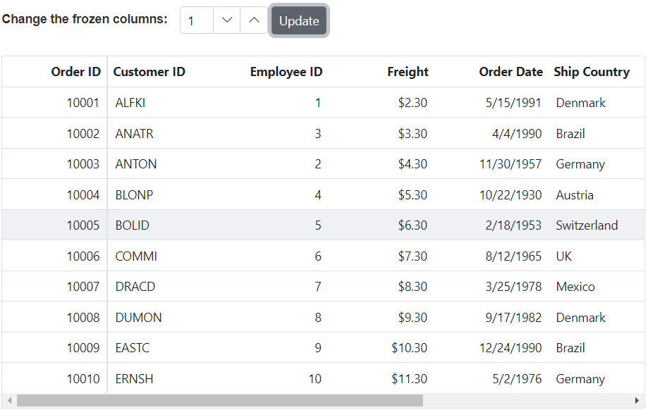
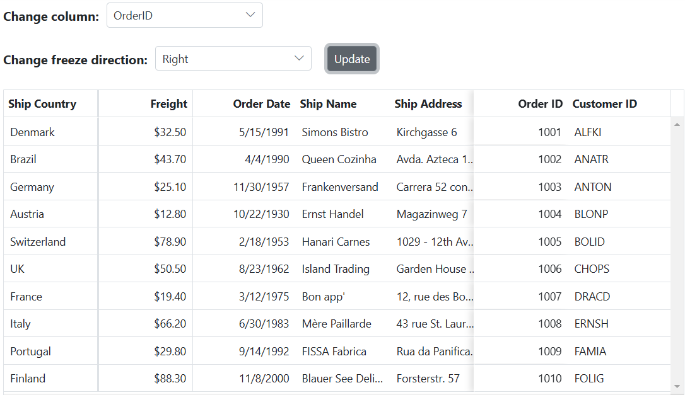

# Column Pinning (Frozen) in ASP.NET MVC Grid component

In the Syncfusion ASP.NET MVC Grid component, you have the capability to **freeze** columns, ensuring they remain visible as you scroll through extensive datasets. This functionality significantly improves user experience by keeping critical information constantly within view, even when navigating through large volumes of data. This means that important columns remain fixed in their positions, making it easier to access and reference key data points while working with the grid.

In the following example, the [FrozenColumns](https://help.syncfusion.com/cr/aspnetmvc-js2/syncfusion.ej2.grids.grid.html#Syncfusion_EJ2_Grids_Grid_FrozenColumns) property is set to **2**. This configuration freezes the left two columns of the grid, and they will remain fixed in their positions while the rest of the columns grid can be scrolled horizontally.












> * Frozen columns should not be set outside the grid view port.
> * Frozen Grid support column virtualization feature, which helps to improve the Grid performance while loading a large dataset.
> * The frozen feature is supported only for the columns that are visible in the current view.
> * You can use both `FrozenColumns` property and [FrozenRows](https://help.syncfusion.com/cr/aspnetmvc-js2/syncfusion.ej2.grids.grid.html#Syncfusion_EJ2_Grids_Grid_FrozenRows) property in the same application.

## Freeze particular columns

The Syncfusion ASP.NET MVC Grid provides a valuable feature that enables you to freeze specific columns, significantly enhancing data visibility and improving your overall user experience. This functionality allows you to select particular columns and freeze them by positioning them at the leftmost side of the grid, ensuring they remain fixed in place while the remaining grid columns can still be scrolled horizontally. While the `FrozenColumns` property freezes columns in the order they are initialized in the grid, you can also use the `IsFrozen` property at the column level to freeze a specific column at any desired index on the left side, offering flexibility in managing which columns are frozen.

To freeze a particular column in the grid, you can utilize the `IsFrozen` property of the grid component as **true**.

The following example demonstrates how to freeze particular column in grid using `IsFrozen` property. This is achieved by the [Change](https://help.syncfusion.com/cr/aspnetmvc-js2/Syncfusion.EJ2.DropDowns.DropDownList.html#Syncfusion_EJ2_DropDowns_DropDownList_Change) event of the `DropDownList` component. Within the change event, you can modify the `isFrozen` property of the selected column using the `getColumnByField` method. Afterward, you can use the `refreshColumns` method to update the displayed columns based on your interaction.











## Freeze direction

In the Syncfusion ASP.NET MVC Grid, the "freeze direction" feature serves to reposition frozen columns either to the left, right, or in a fixed position, while still allowing the remaining columns to be horizontally movable. This feature is designed to optimize user experience by ensuring that critical information remains visible even during horizontal scrolling. By default, when you set the `FrozenColumns` property of the grid or the `IsFrozen` property of individual columns, it results in freezing those columns on the left side of the grid. This helps in keeping important data readily accessible as you navigate through your dataset.

To achieve this, you can utilize the `Column.Freeze` property. This property is used to specify the freeze direction for individual columns. The grid will adjust the column positions based on the `Column.Freeze` value.

The types of the `Column.Freeze` directions:

* **Left**: When you set the `Column.Freeze` property to **Left**, specific columns will be frozen on the left side of the grid. The remaining columns will be movable.

* **Right**: When you set the `Column.Freeze` property to **Right**, certain columns will be frozen on the right side of the grid, while the rest of the columns remain movable.

* **Fixed**: The Fixed direction locks a column at a fixed position within the grid. This ensures that the column is always visible during horizontal scroll.

In the following example, the **ShipCountry** column is frozen on the left side, the **CustomerID** column is frozen on the right side and the **Freight** column is frozen on the fixed of the content table. Additionally, you can modify the `Column.Freeze` property to **Left**, **Right** and **Fixed** based on the selected column by utilizing the [Change](https://help.syncfusion.com/cr/aspnetmvc-js2/Syncfusion.EJ2.DropDowns.DropDownList.html#Syncfusion_EJ2_DropDowns_DropDownList_Change) event of the `DropDownList` component.












> * Freeze Direction is not compatible with the `IsFrozen` and [FrozenColumns](https://help.syncfusion.com/cr/aspnetmvc-js2/syncfusion.ej2.grids.grid.html#Syncfusion_EJ2_Grids_Grid_FrozenColumns) properties.

## Change default frozen line color

You can customize the frozen line borders of frozen columns in the Syncfusion Grid component by applying custom CSS styles to the specific frozen column. This allows you to change the border color of the left frozen columns, right frozen columns, and fixed frozen columns to match your application's design and theme.

To change default frozen line color, use the following class name and apply the border color based on your requirement.

For left frozen columns: 

```css
.e-grid .e-leftfreeze.e-freezeleftborder {
    border-right-color: rgb(198, 30, 204);
}
```
For right frozen columns:

```css
.e-grid .e-rightfreeze.e-freezerightborder {
    border-left-color: rgb(19, 228, 243);
}
```
For fixed frozen columns, you need to specify both left and right border as mentioned below

```css
.e-grid .e-fixedfreeze.e-freezeleftborder{
    border-left-color: rgb(9, 209, 9); 
}

.e-grid .e-fixedfreeze.e-freezerightborder{
    border-right-color: rgb(10, 224, 10);
}
```
The following example demonstrates how to change the default frozen line color using CSS.











## Deprecated methods 

Previous | Current | Explanation 
 ---  | --- | --- 
`getMovableRows()` gridInstance.getMovableRows()[0].querySelectorAll('.e-unfreeze') | `getRows()` gridInstance.getRows()[0].querySelectorAll('.e-unfreeze') | The previous architecture used separate tables for left, right, and movable contents, returning only movable rows when calling the method, whereas the current architecture combines them into one table, returning all rows and introduces the `e-unfreeze` class for selecting movable rows
`getFrozenRightRows()` gridInstance.getFrozenRightRows()[0].querySelectorAll('.e-rightfreeze') | `getRows()` gridInstance.getRows()[0].querySelectorAll('.e-rightfreeze') | In the previous architecture, it returned only the table rows from the right freeze table, but in the current architecture, all rows of the entire table are returned, introducing the `e-rightfreeze` class for selecting right freeze rows. 
`getMovableRowByIndex()` <br> `getFrozenRowByIndex()` <br> `getFrozenRightRowByIndex()` | `getRowByIndex()` gridInstance.getRowByIndex(1).querySelectorAll('.e-unfreeze') | In the previous architecture, separate methods were used to select rows from different table sections, while in the current architecture, the `getMovableRowByIndex()`, `getFrozenRightRowByIndex()`, and `getFrozenRowByIndex()` methods now return the same table row based on the given index. Additionally, class names for table cells (td's) have been separated into `e-leftfreeze`, `e-unfreeze`, and `e-rightfreeze`, making it easier to customize cells within a row.
`getMovableCellFromIndex()` <br> `getFrozenRightCellFromIndex()` | `getCellFromIndex()` gridInstance.getCellFromIndex(1,1) | In the previous approach, the `getMovableCellFromIndex()` method was used to choose a specific cell within the movable table, and the `getFrozenRightCellFromIndex()` method was utilized to target a particular cell within the right freeze table. However, in the current architecture, you have the flexibility to select a specific cell in either the movable or right freeze table by using both the `getFrozenRightCellFromIndex()` and `getMovableCellFromIndex()` methods. This new method simplifies the process of selecting and retrieving specific cells within these tables, offering more versatility and convenience.
`getMovableDataRows()` <br> `getFrozenRightDataRows()` <br> `getFrozenDataRows()` | `getDataRows()` gridInstance.getDataRows()[0].querySelectorAll('.e-unfreeze') | In the previous approach, there were separate methods (`getMovableDataRows()`, `getFrozenRightDataRows()`, and `getFrozenDataRows()`) for obtaining viewport data rows from the freeze, movable, and right tables individually. However, in the new approach, these methods have been enhanced to return the entire viewport data rows for all sections together, simplifying data retrieval. You can now extract specific cells within these rows using selectors such as `e-leftfreeze` for the **left freeze**, `e-unfreeze` for the **movable**, and `e-rightfreeze` for the **right freeze** tables, providing greater flexibility in working with the data.
`getMovableColumnHeaderByIndex()` <br> `getFrozenRightColumnHeaderByIndex()` <br> `getFrozenLeftColumnHeaderByIndex()` | `getColumnHeaderByIndex()` gridInstance.getColumnHeaderByIndex(1) | In the previous architecture, the methods selected movable, right freeze, and left freeze headers separately. However, in the new approach, when using the `getMovableColumnHeaderByIndex()`, `getFrozenRightColumnHeaderByIndex()`, and `getFrozenLeftColumnHeaderByIndex()` methods, you will still obtain the same results as in the previous architecture.

> When a validation message is displayed in the frozen part (Left, Right, Fixed) of the table, scrolling is prevented until the validation message is cleared.

## Limitations

While freezing columns in the Syncfusion ASP.NET MVC Grid provides enhanced visibility and scrolling capabilities, there are certain limitations to consider. The following features are not supported when using frozen columns:

* Detail Template
* Hierarchy Grid
* Autofill