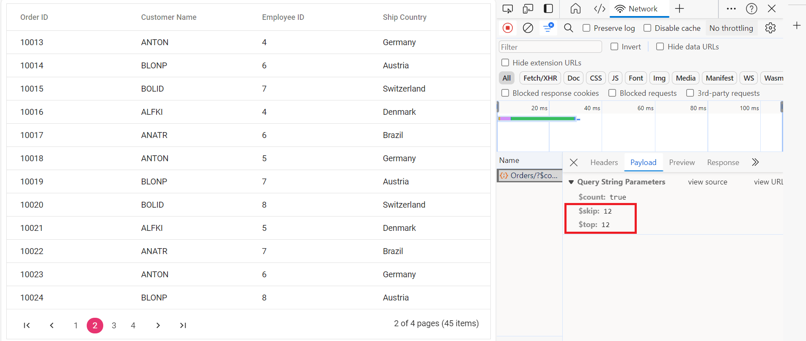
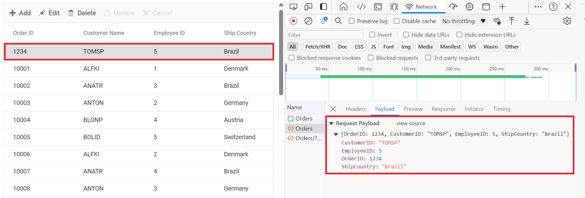

# CustomAdaptor in Syncfusion ASP.NET MVC Grid Component

The `CustomAdaptor` in the Syncfusion ASP.NET MVC Grid Component allows to create their own custom adaptors by extending the built-in adaptors. The custom adaptor involves handling the built-in adaptor query process, request and response. The `CustomAdaptor` to be allows extending the OData V4 services, enabling efficient data fetching and manipulation. By default, there are three method for CustomAdaptor built-in methods.

## Types of CustomAdaptor methods

There are three types of methods in custom adaptors.

### ProcessQuery

It handling or executing a query sent to a data source such as database or custom dataService. This query request for data retrieval, insertion, updating, or deletion. The processQuery can be two argument are `DataManager` and `Query`. The `DataManager` argument using change the url value and `Query` argument are set the additional parameters value or change the any queries such as sort, filter and group etc.

**DataManager**


**Query**


```js
processQuery(dm, query) {
    query.addParams('Syncfusion in ASP.NET MVC Grid', 'true'); // Add additional parameter
    return super.processQuery.apply(this, arguments);
}
```

### beforeSend

It executed before an request is sent to the server. This function provides an modify the parameter and request headers, data or performing validation.The `beforeSend` can be three argument are `DataManager`, `Request` and `Fetch`. The `DataManager` argument are provided the dataSource and adaptor value. The `Request` argument are sending the custom header by setting the `Authorization`. The `Settings` argument is optional. 

**DataManager**


**Request**


**Settings**


```js
beforeSend(dm, request, settings) {
request.headers.set('Authorization', `Bearer${(window as any).token}`);
return super.beforeSend(dm, request, settings);
}
```

### processResponse

It is responsible for handling the response received from a server after the asynchronous request. It performs such as parsing the response data, handling error and preparing the data for consumption. The `processResponse` can be multiple arguments are optional.

```js
processResponse(data, ds, query, xhr, request, changes) {
    const original = super.processResponse(data, ds, query, xhr, request, changes);
    let i =0;
    if (original.result){
        original.result.forEach((item) => ej.base.setValue('SNo', ++i, item));
    }
return original;
}
```

This guide provides detailed instructions on binding data and performing CRUD (Create, Read, Update, Delete) actions using the `CustomAdaptor` by extending the `ODataV4Adaptor` in your Syncfusion ASP.NET MVC Grid.
 
## Creating an Custom service

To configure a server with Syncfusion ASP.NET MVC Grid using OData, follow these steps:

**1. Project Creation**

1. Open **Visual Studio**.
2. Select **Create a new project** → Choose **ASP.NET Web Application (.NET Framework)**.
3. Name the project **ODataV4Adaptor** and select **MVC** as the project template.
4. Ensure that the **Web API** option is selected (this is crucial for enabling OData).

For detailed information, refer to this [documentation](https://learn.microsoft.com/en-us/aspnet/mvc/overview/getting-started/introduction/getting-started#create-your-first-app).

**2. Install NuGet Packages**

Using the NuGet package manager in Visual Studio (Tools → NuGet Package Manager → Manage NuGet Packages for Solution), install the `Microsoft.AspNet.OData` NuGet package for OData support and `Newtonsoft.Json` for JSON serialization support.

**3. Model Class Creation:**

Create a model class named `OrdersDetails.cs` inside the **Models** folder.




 namespace ODataV4Adaptor.Models
{
  public class OrdersDetails
  {
      public static List<OrdersDetails> order = new List<OrdersDetails>();
      public OrdersDetails()
      {

      }
      public OrdersDetails(
      int OrderID, string CustomerId, int EmployeeId, double Freight, bool Verified,
      DateTime OrderDate, string ShipCity, string ShipName, string ShipCountry,
      DateTime ShippedDate, string ShipAddress)
      {
          this.OrderID = OrderID;
          this.CustomerID = CustomerId;
          this.EmployeeID = EmployeeId;
          this.Freight = Freight;
          this.ShipCity = ShipCity;
          this.Verified = Verified;
          this.OrderDate = OrderDate;
          this.ShipName = ShipName;
          this.ShipCountry = ShipCountry;
          this.ShippedDate = ShippedDate;
          this.ShipAddress = ShipAddress;
      }

      public static List<OrdersDetails> GetAllRecords()
      {
          if (order.Count() == 0)
          {
              int code = 10000;
              for (int i = 1; i < 10; i++)
              {
                  order.Add(new OrdersDetails(code + 1, "ALFKI", i + 0, 2.3 * i, false, new DateTime(1991, 05, 15), "Berlin", "Simons bistro", "Denmark", new DateTime(1996, 7, 16), "Kirchgasse 6"));
                  order.Add(new OrdersDetails(code + 2, "ANATR", i + 2, 3.3 * i, true, new DateTime(1990, 04, 04), "Madrid", "Queen Cozinha", "Brazil", new DateTime(1996, 9, 11), "Avda. Azteca 123"));
                  order.Add(new OrdersDetails(code + 3, "ANTON", i + 1, 4.3 * i, true, new DateTime(1957, 11, 30), "Cholchester", "Frankenversand", "Germany", new DateTime(1996, 10, 7), "Carrera 52 con Ave. Bolívar #65-98 Llano Largo"));
                  order.Add(new OrdersDetails(code + 4, "BLONP", i + 3, 5.3 * i, false, new DateTime(1930, 10, 22), "Marseille", "Ernst Handel", "Austria", new DateTime(1996, 12, 30), "Magazinweg 7"));
                  order.Add(new OrdersDetails(code + 5, "BOLID", i + 4, 6.3 * i, true, new DateTime(1953, 02, 18), "Tsawassen", "Hanari Carnes", "Switzerland", new DateTime(1997, 12, 3), "1029 - 12th Ave. S."));
                  code += 5;
              }
          }
          return order;
      }
      [Key]
      public int OrderID { get; set; }
      public string CustomerID { get; set; }
      public int? EmployeeID { get; set; }
      public double Freight { get; set; }
      public string ShipCity { get; set; }
      public bool Verified { get; set; }
      public DateTime OrderDate { get; set; }
      public string ShipName { get; set; }
      public string ShipCountry { get; set; }
      public DateTime ShippedDate { get; set; }
      public string ShipAddress { get; set; }
  }
}



**4. Build the Entity Data Model**

To construct the Entity Data Model for your OData service, utilize the `ODataConventionModelBuilder` to define the model's structure. Start by creating an instance of the `ODataConventionModelBuilder`, then register the entity set **Orders** using the `EntitySet<T>` method, where `OrdersDetails` represents the CLR type containing order details. 

```cs
        private static IEdmModel GetEdmModel()
        {
            var builder = new ODataConventionModelBuilder();
            builder.EntitySet<OrdersDetails>("Orders");  // Define OData Entity.
            return builder.GetEdmModel();
        }
```

**5. Register the OData Services**

Once the Entity Data Model is built, you need to register the OData services in your ASP.NET MVC application. Here's how:

```cs
// WebApiConfig.cs
using Microsoft.AspNet.OData.Builder;
using Microsoft.AspNet.OData.Extensions;
using Microsoft.OData.Edm;
using ODataV4Adaptor.Models;
using System;
using System.Collections.Generic;
using System.Linq;
using System.Web;
using System.Web.Http;
using System.Web.UI.WebControls;

namespace CustomAdaptor.App_Start
{
    public static class WebApiConfig
    {
        public static void Register(HttpConfiguration config)
        {
            // Enable OData.
            config.MapODataServiceRoute(
                routeName: "ODataRoute",
                routePrefix: "odata",
                model: GetEdmModel()
            );
            // Enable Query Support.
            config.Count().Filter().OrderBy().Expand().Select().MaxTop(null);
            // Web API routes.
            config.Routes.MapHttpRoute(
                name: "DefaultApi",
                routeTemplate: "api/{controller}/{action}/{id}",
                defaults: new { id = System.Web.Http.RouteParameter.Optional }
            );
            // Configure JSON formatting.
            config.Formatters.JsonFormatter.SerializerSettings.Formatting = Newtonsoft.Json.Formatting.Indented;
        }
        private static IEdmModel GetEdmModel()
        {
            var builder = new ODataConventionModelBuilder();
            builder.EntitySet<OrdersDetails>("Orders");  // Define OData Entity.
            return builder.GetEdmModel();
        }
    }
}
```

**5. Add Controllers**

Create a controllers to expose the OData endpoints.



using System.Linq;
using Microsoft.AspNet.OData;
using System.Web.Http;
using CustomAdaptor.Models;

namespace CustomAdaptor.Controllers
{
    public class OrdersController : ODataController
    {
        /// <summary>
        /// Retrieves all orders.
        /// </summary>
        /// <returns>The collection of orders.</returns>
        [EnableQuery]
        public IHttpActionResult Get()
        {
            var data = OrdersDetails.GetAllRecords().AsQueryable();
            return Ok(data);
        }
    }
}



**6. Run the Application**

Run the application in Visual Studio. It will be accessible on a URL like **https://localhost:xxxx**. 

After running the application, you can verify that the server-side API controller is successfully returning the order data in the URL(https://localhost:xxxx/odata/Orders). Here **xxxx** denotes the port number.

## Connecting Syncfusion ASP.NET MVC Grid to an Custom service extending the ODataV4 service

To integrate the Syncfusion Grid into your ASP.NET MVC project using Visual Studio, follow these steps:

**Step 1:** Install the Syncfusion ASP.NET MVC Package:

To add `ASP.NET MVC` in the application, open the NuGet package manager in Visual Studio (Tools → NuGet Package Manager → Manage NuGet Packages for Solution), search for [Syncfusion.EJ2.MVC5](https://www.nuget.org/packages/Syncfusion.EJ2.MVC5) and install it.
Alternatively, you can install it using the following Package Manager Console command:




Install-Package Syncfusion.EJ2.MVC5 -Version {{ site.releaseversion }}




**Step 2:** Add Syncfusion ASP.NET MVC namespace

Add `Syncfusion.EJ2` namespace reference in `Web.config` under `Views` folder.

```cs
<namespaces>
    <add namespace="Syncfusion.EJ2"/>
</namespaces>
```

**Step 3:** Add stylesheet and script resources

To include the required styles and scripts, add the following references inside the `<head>` of `~/Pages/Shared/_Layout.cshtml` file:



<head>
    ...
    <!-- Syncfusion ASP.NET MVC control styles -->
    <link rel="stylesheet" href="https://cdn.syncfusion.com/ej2/{{ site.ej2version }}/bootstrap5.css" />
    <!-- Syncfusion ASP.NET MVC control scripts -->
    <script src="https://cdn.syncfusion.com/ej2/{{ site.ej2version }}/dist/ej2.min.js"></script>
    <!-- Include the necessary CSS files to style the Syncfusion ASP.NET MVC controls: -->
    <link href="https://cdn.syncfusion.com/ej2/{{ site.ej2version }}/ej2-base/styles/bootstrap5.css" rel="stylesheet" />
    <link href="https://cdn.syncfusion.com/ej2/{{ site.ej2version }}/ej2-grids/styles/bootstrap5.css" rel="stylesheet" />
    <link href="https://cdn.syncfusion.com/ej2/{{ site.ej2version }}/ej2-buttons/styles/bootstrap5.css" rel="stylesheet" />
    <link href="https://cdn.syncfusion.com/ej2/{{ site.ej2version }}/ej2-popups/styles/bootstrap5.css" rel="stylesheet" />
    <link href="https://cdn.syncfusion.com/ej2/{{ site.ej2version }}/ej2-richtexteditor/styles/bootstrap5.css" rel="stylesheet" />
    <link href="https://cdn.syncfusion.com/ej2/{{ site.ej2version }}/ej2-navigations/styles/bootstrap5.css" rel="stylesheet" />
    <link href="https://cdn.syncfusion.com/ej2/{{ site.ej2version }}/ej2-dropdowns/styles/bootstrap5.css" rel="stylesheet" />
    <link href="https://cdn.syncfusion.com/ej2/{{ site.ej2version }}/ej2-lists/styles/bootstrap5.css" rel="stylesheet" />
    <link href="https://cdn.syncfusion.com/ej2/{{ site.ej2version }}/ej2-inputs/styles/bootstrap5.css" rel="stylesheet" />
    <link href="https://cdn.syncfusion.com/ej2/{{ site.ej2version }}/ej2-calendars/styles/bootstrap5.css" rel="stylesheet" />
    <link href="https://cdn.syncfusion.com/ej2/{{ site.ej2version }}/ej2-notifications/styles/bootstrap5.css" rel="stylesheet" />
    <link href="https://cdn.syncfusion.com/ej2/{{ site.ej2version }}/ej2-splitbuttons/styles/bootstrap5.css" rel="stylesheet" />
    <script src="https://cdnjs.cloudflare.com/ajax/libs/systemjs/0.19.38/system.js"></script>
    <script src="https://cdn.syncfusion.com/ej2/syncfusion-helper.js" type="text/javascript"></script>
</head>




**Step 4:** Register Syncfusion Script Manager

To ensure proper script execution, register the Syncfusion Script Manager `EJS().ScriptManager()` at the end of `<body>` in the `~/Pages/Shared/_Layout.cshtml` file as follows.



<body>
...
<!-- Syncfusion ASP.NET MVC Script Manager -->
@Html.EJS().ScriptManager()
</body>



**Step 4: Adding Custom Adaptor and Syncfusion Grid**

To create a custom adaptor, extend the ODataV4Adaptor. This custom adaptor will implement three key methods:

* The `processQuery` method is used to change the URL of your API endpoint and set the additional parameters for executing the query.

* The `beforeSend` method is used to send the custom header for `Authorization` in the request header.

* The `processResponse` method is used to set the value for customize the column for new field is `SNo`.

**Implementing the Custom Adaptor**

Define a `DataManager` instance, specifying the API endpoint (https://localhost:xxxx/odata/Orders) in the url property and setting the adaptor to `CustomAdaptor`.



@Html.EJS().Grid("Grid").Columns(col =>
	{
		col.Field("SNo").HeaderText("S. No").Width("100").Add();
		col.Field("OrderID").HeaderText("Order ID").Width("150").TextAlign(Syncfusion.EJ2.Grids.TextAlign.Right).IsPrimaryKey(true).Add();
		col.Field("CustomerID").HeaderText("Customer ID").Width("150").Add();
		col.Field("ShipCity").HeaderText("Ship City").Width("150").Add();
		col.Field("ShipCountry").HeaderText("Ship Country").Width("150").Add();
	}).Render()
<script>
    class CustomAdaptor extends ejs.data.ODataV4Adaptor {}
    document.addEventListener("DOMContentLoaded", function () {
        let grid = document.getElementById("Grid").ej2_instances[0];
        if (grid) {
            let dataManager = new ejs.data.DataManager({
                url: "https://localhost:xxxx/odata/Orders",
                adaptor: new CustomAdaptor()
            });
            grid.dataSource = dataManager;
        }
    });
</script>



> Replace https://localhost:xxxx/odata/Orders with the actual **URL** of your API endpoint that provides the data in a consumable format (e.g., JSON).

Run the application in Visual Studio. It will be accessible on a URL like **https://localhost:xxxx**.

## Handling Searching Operation

To enable search operations in your web application using OData, you first need to configure the OData support in your service collection. This involves adding the `Filter` method within the OData setup, allowing you to filter data based on specified criteria. Once enabled, clients can utilize the **$filter** query option in their requests to search for specific data entries.



...
// Enable OData.
config.MapODataServiceRoute(
    routeName: "ODataRoute",
    routePrefix: "odata",
    model: GetEdmModel()
);
// Enable Query Support.
config.Count().Filter(); // Handles searching operation.
...


@Html.EJS().Grid("Grid").Columns(col =>
{
    col.Field("OrderID").HeaderText("Order ID").Width("150").IsPrimaryKey(true).Add();
    col.Field("CustomerID").HeaderText("Customer ID").Width("150").Add();
    col.Field("EmployeeID").HeaderText("Employee ID").Width("150").Add();
    col.Field("ShipCountry").HeaderText("Ship Country").Width("150").Add();
}).Toolbar(new List<string>() { "Search" }).Render()
<script>
    class CustomAdaptor extends ejs.data.ODataV4Adaptor { }
    document.addEventListener("DOMContentLoaded", function () {
        let grid = document.getElementById("Grid").ej2_instances[0];
        if (grid) {
            let dataManager = new ejs.data.DataManager({
                url: "/odata/Orders",
                adaptor: new CustomAdaptor()
            });
            grid.dataSource = dataManager;
        }
    });
</script>




## Handling Filtering Operation

To enable filter operations in your web application using OData, you first need to configure the OData support in your service collection. This involves adding the `Filter` method within the OData setup, allowing you to filter data based on specified criteria. Once enabled, clients can utilize the **$filter** query option in your requests to filter for specific data entries.



...
// Enable OData.
config.MapODataServiceRoute(
    routeName: "ODataRoute",
    routePrefix: "odata",
    model: GetEdmModel()
);
// Enable Query Support.
config.Count().Filter(); // Handles filtering  operation.
...


@Html.EJS().Grid("Grid").Columns(col =>
{
    col.Field("OrderID").HeaderText("Order ID").Width("150").IsPrimaryKey(true).Add();
    col.Field("CustomerID").HeaderText("Customer ID").Width("150").Add();
    col.Field("EmployeeID").HeaderText("Employee ID").Width("150").Add();
    col.Field("ShipCountry").HeaderText("Ship Country").Width("150").Add();
}).AllowFiltering().Render()
<script>
    class CustomAdaptor extends ejs.data.ODataV4Adaptor { }
    document.addEventListener("DOMContentLoaded", function () {
        let grid = document.getElementById("Grid").ej2_instances[0];
        if (grid) {
            let dataManager = new ejs.data.DataManager({
                url: "/odata/Orders",
                adaptor: new CustomAdaptor()
            });
            grid.dataSource = dataManager;
        }
    });
</script>



**Single column filtering**

**Multi column filtering**


## Handling Sorting Operation

To enable sorting operations in your web application using OData, you first need to configure the OData support in your service collection. This involves adding the `OrderBy` method within the OData setup, allowing you to sort data based on specified criteria. Once enabled, clients can utilize the **$orderby** query option in their requests to sort data entries according to desired attributes.



...
// Enable OData
config.MapODataServiceRoute(
    routeName: "ODataRoute",
    routePrefix: "odata",
    model: GetEdmModel()
);
// Enable Query Support
config.Count().OrderBy(); // Handles sorting  operation.
...



@Html.EJS().Grid("Grid").Columns(col =>
{
    col.Field("OrderID").HeaderText("Order ID").Width("150").IsPrimaryKey(true).Add();
    col.Field("CustomerID").HeaderText("Customer ID").Width("150").Add();
    col.Field("EmployeeID").HeaderText("Employee ID").Width("150").Add();
    col.Field("ShipCountry").HeaderText("Ship Country").Width("150").Add();
}).AllowSorting().Render()
<script>
    class CustomAdaptor extends ejs.data.ODataV4Adaptor { }
    document.addEventListener("DOMContentLoaded", function () {
        let grid = document.getElementById("Grid").ej2_instances[0];
        if (grid) {
            let dataManager = new ejs.data.DataManager({
                url: "/odata/Orders",
                adaptor: new CustomAdaptor()
            });
            grid.dataSource = dataManager;
        }
    });
</script>



**Single column sorting**


**Multi column sorting**


## Handling Paging Operation

To implement paging operations in your web application using OData, you can utilize the `SetMaxTop` method within your OData setup to limit the maximum number of records that can be returned per request. While you configure the maximum limit, clients can utilize the **$skip** and **$top** query options in their requests to specify the number of records to skip and the number of records to take, respectively.



....
// Enable OData
config.MapODataServiceRoute(
    routeName: "ODataRoute",
    routePrefix: "odata",
    model: GetEdmModel()
);
// Enable Query Support
config.Count().MaxTop(null); // Handles paging  operation.
....



@Html.EJS().Grid("Grid").Columns(col =>
{
    col.Field("OrderID").HeaderText("Order ID").Width("150").IsPrimaryKey(true).Add();
    col.Field("CustomerID").HeaderText("Customer ID").Width("150").Add();
    col.Field("EmployeeID").HeaderText("Employee ID").Width("150").Add();
    col.Field("ShipCountry").HeaderText("Ship Country").Width("150").Add();
}).AllowPaging().Render()
<script>
    class CustomAdaptor extends ejs.data.ODataV4Adaptor { }
    document.addEventListener("DOMContentLoaded", function () {
        let grid = document.getElementById("Grid").ej2_instances[0];
        if (grid) {
            let dataManager = new ejs.data.DataManager({
                url: "/odata/Orders",
                adaptor: new CustomAdaptor()
            });
            grid.dataSource = dataManager;
        }
    });
</script>





## Handling CRUD Operations

To manage CRUD (Create, Read, Update, Delete) operations using the ODataV4Adaptor, follow the provided guide for configuring the Syncfusion Grid for [editing](https://ej2.syncfusion.com/aspnetmvc/documentation/grid/editing/edit) and utilize the sample implementation of the `OrdersController` in your MVC application. This controller handles HTTP requests for CRUD operations such as GET, POST, PATCH, and DELETE.

To enable CRUD operations in the Syncfusion Grid within an ASP.NET MVC application, follow the below steps:



@using Syncfusion.EJ2

@Html.EJS().Grid("Grid").EditSettings(edit => edit.AllowAdding(true).AllowEditing(true).AllowDeleting(true).Mode(Syncfusion.EJ2.Grids.EditMode.Normal)).Toolbar(new List<string>
	() { "Add", "Edit", "Delete", "Update", "Cancel" }).Columns(col =>
	{
		col.Field("OrderID").HeaderText("Order ID").Width("150").TextAlign(Syncfusion.EJ2.Grids.TextAlign.Right).IsPrimaryKey(true).Add();
		col.Field("CustomerID").HeaderText("Customer ID").Width("150").Add();
		col.Field("ShipCity").HeaderText("Ship City").Width("150").Add();
		col.Field("ShipCountry").HeaderText("Ship Country").Width("150").Add();
	}).Render()
	<script>
		class CustomAdaptor extends ejs.data.ODataV4Adaptor { }
		document.addEventListener("DOMContentLoaded", function () {
			let grid = document.getElementById("Grid").ej2_instances[0];
			if (grid) {
				let dataManager = new ejs.data.DataManager({
					url: "/odata/Orders",
					adaptor: new CustomAdaptor()
				});
				grid.dataSource = dataManager;
			}
		});
	</script>



> Normal/Inline editing is the default edit mode for the Grid component. To enable CRUD operations, ensure that the [isPrimaryKey](https://help.syncfusion.com/cr/aspnetmvc-js2/Syncfusion.EJ2.Grids.GridColumn.html#Syncfusion_EJ2_Grids_GridColumn_IsPrimaryKey)property is set to **true** for a specific Grid column, ensuring that its value is unique.

**Insert Record**

To insert a new record into your Grid, you can utilize the `HttpPost` method in your application. Below is a sample implementation of inserting a record using the **OrdersController**:

```cs
 /// <summary>
 /// Inserts a new order to the collection.
 /// </summary>
 /// <param name="addRecord">The order to be inserted.</param>
 /// <returns>It returns the newly inserted record detail.</returns>
 [EnableQuery]
 public IHttpActionResult Post(OrdersDetails addRecord)
 {
     if (addRecord == null)
     {
         return BadRequest("Null order");
     }
     OrdersDetails.GetAllRecords().Insert(0, addRecord);
     return Ok(addRecord);
 }
```



**Update Operation:**

Updating a record in the Syncfusion Grid can be achieved by utilizing the `HttpPatch` method in your controller. Here's a sample implementation of updating a record:

```cs
/// <summary>
/// Updates an existing order.
/// </summary>
/// <param name="key">The ID of the order to update.</param>
/// <param name="updateRecord">The updated order details.</param>
/// <returns>It returns the updated order details.</returns>
public IHttpActionResult Patch(int key, OrdersDetails updateRecord)
{
    if (updateRecord == null)
    {
        return BadRequest("No records");
    }
    var existingOrder = OrdersDetails.GetAllRecords().FirstOrDefault(order => order.OrderID == key);
    if (existingOrder != null)
    {
        // If the order exists, update its properties
        existingOrder.CustomerID = updateRecord.CustomerID ?? existingOrder.CustomerID;
        existingOrder.EmployeeID = updateRecord.EmployeeID ?? existingOrder.EmployeeID;
        existingOrder.ShipCountry = updateRecord.ShipCountry ?? existingOrder.ShipCountry;
    }
    return Ok(updateRecord);
}
```


**Delete Operation**

To delete existing records, use the `RemoveUrl` property to specify the controller action mapping URL for the delete operation.

```cs
/// <summary>
/// Deletes an order.
/// </summary>
/// <param name="key">The ID of the order to delete.</param>
/// <returns>It returns the deleted record detail</returns>
public IHttpActionResult Delete(int key)
{
    var deleteRecord = OrdersDetails.GetAllRecords().FirstOrDefault(order => order.OrderID == key);
    if (deleteRecord != null)
    {
        OrdersDetails.GetAllRecords().Remove(deleteRecord);
    }
    return Ok(deleteRecord);
}
```
