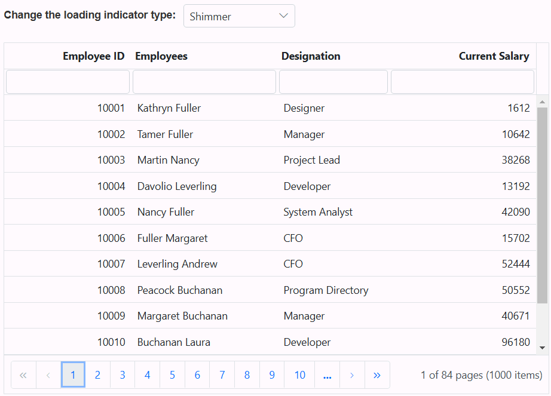
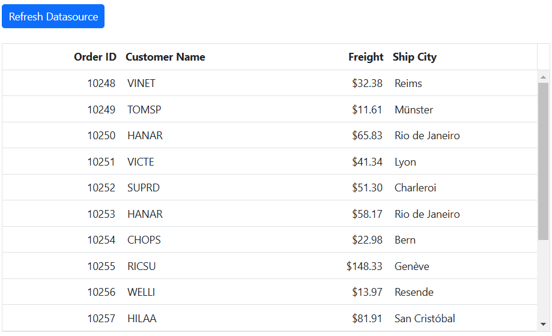
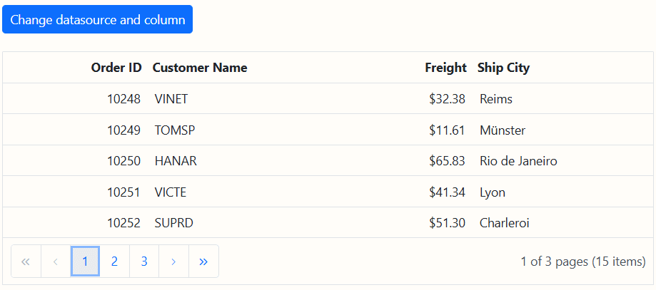

# Data binding in ASP.NET MVC Grid component

Data binding is a fundamental technique that empowers the Grid component to integrate data into its interface, enabling the creation of dynamic and interactive grid views. This feature is particularly valuable when working with large datasets or when data needs to be fetched remotely. 

The Syncfusion Grid utilizes the **DataManager**, which supports both local binding with JavaScript object arrays and remote binding with RESTful JSON data services. The key property, [DataSource](https://help.syncfusion.com/cr/aspnetmvc-js2/Syncfusion.EJ2.Grids.Grid.html#Syncfusion_EJ2_Grids_Grid_DataSource), can be assigned to a DataManager instance or a collection of JavaScript object arrays.

It supports two kinds of data binding methods:

* List binding
* DataTable binding
* Remote data

## Loading indicator

The Syncfusion ASP.NET MVC Grid offers a loading animation feature, which makes it easy to identify when data is being loaded or refreshed. This feature provides a clear understanding of the grid's current state and actions, such as sorting, filtering, grouping, and more.

To achieve this, you can utilize the `LoadingIndicator.IndicatorType` property of the grid, which supports two types of indicators:

* Spinner (default indicator)
* Shimmer

The following example demonstrates how to set the `LoadingIndicator.IndicatorType` property based on changing the dropdown value using the [Change](https://help.syncfusion.com/cr/aspnetmvc-js2/Syncfusion.EJ2.DropDowns.DropDownList.html#Syncfusion_EJ2_DropDowns_DropDownList_Change) event of the [DropDownList](https://ej2.syncfusion.com/aspnetmvc/documentation/drop-down-list/getting-started) component. The `refreshColumns` method is used to apply the changes and display the updated loading indicator type. 












## Refresh the datasource using property

Refreshing the data source in a Syncfusion Grid involves updating the data that the grid displays dynamically. This operation is essential when you need to reflect changes in the underlying data without reloading the entire page or component.

To achieve this, you can make use of the [Datasource](https://help.syncfusion.com/cr/aspnetmvc-js2/Syncfusion.EJ2.Grids.Grid.html#Syncfusion_EJ2_Grids_Grid_DataSource) property in conjunction with the `setProperties` method. This ensures that the grid reflects the changes in the data source without requiring a complete page or component reload.

For example, if you add or delete data source records, follow these steps:

**Step 1**: Add/delete the datasource record by using the following code.

```typescript
    var grid = document.getElementById("grid").ej2_instances[0];
    grid.dataSource.unshift(data); // Add a new record.
    grid.dataSource.splice(selectedRow, 1); // Delete a record.
```

**Step 2**:  Refresh the datasource after changes by invoking the `setProperties` method.

```typescript
   grid.setProperties({ dataSource:  grid.dataSource});
```
The following example demonstrates adding a new record to the data source through an external button:












## Dynamically change the datasource or columns or both

The Grid component in Syncfusion allows dynamic modification of the data source, columns, or both . This feature is particularly valuable when you need to refresh the grid's content and structure without requiring a complete page reload.

To achieve dynamic changes, you can utilize the `changeDataSource` method. This method enables you to update the data source, columns, or both, based on your application's requirements. However, it is important to note that during the changing process for the data source and columns, the grid's existing actions such as sorting, filtering, grouping, aggregation, and searching will be reset.The `changeDataSource` method has two optional arguments: the first argument represents the data source, and the second argument represents the columns. The various uses of the `changeDataSource` method are explained in the following topic.

**1. Change both data source and columns:**

To modify both the existing columns and the data source, you need to pass the both arguments to the `changeDataSource` method. The following example demonstrates how to change both the data source and columns.

You can assign a JavaScript object array to the [DataSource](https://help.syncfusion.com/cr/aspnetmvc-js2/Syncfusion.EJ2.Grids.Grid.html#Syncfusion_EJ2_Grids_Grid_DataSource) property to bind local data to the grid. The code below provides an example of how to create a data source for the grid.

```typescript
    export let data= [
    {
        OrderID: 10248, CustomerID: 'VINET', Freight: 32.38,
        ShipCity: 'Reims'
    },
    {
        OrderID: 10249, CustomerID: 'TOMSP', Freight: 11.61,
        ShipCity: 'Münster'
    },
    {
        OrderID: 10250, CustomerID: 'HANAR', Freight: 61.34,
        ShipCity: 'Rio de Janeiro'
    }];
```

The following code demonstrates how to create the [Columns](https://help.syncfusion.com/cr/aspnetmvc-js2/Syncfusion.EJ2.Grids.Grid.html#Syncfusion_EJ2_Grids_Grid_Columns) for the grid, which are based on the provided grid data source.

```typescript
    newColumn= [
        { field: 'OrderID', headerText: 'Order ID', textAlign: 'Right', width: 125 },
        { field: 'CustomerID', headerText: 'Customer ID', width: 125 },
    ];
```

The following code demonstrates updating the data source and columns defined above using the `changeDataSource` method.

```typescript
    var grid = document.getElementById("grid").ej2_instances[0];
    grid.changeDataSource(data, newColumn);
```

**2. Modify only the existing columns:**

To modify the existing columns in a grid, you can either add or remove columns or change the entire set of columns using the `changeDataSource` method. To use this method, you should set the first parameter to null and provide the new columns as the second parameter. However, please note that if a column field is not specified in the data source, its corresponding column values will be empty. The following example illustrates how to modify existing columns.

The following code demonstrates how to add new columns with existing grid columns ('newColumn') by using `changeDataSource` method.

```typescript
    var grid = document.getElementById("grid").ej2_instances[0];
    newColumn1= [
        { field: 'Freight', headerText: 'Freight', textAlign: 'Right', width: 125 },
        { field: 'ShipCity', headerText: 'ShipCity', width: 125 },
    ];
    let column = this.newColumn.push(...this.newColumn1);
    grid.changeDataSource(null, column);
```

**3. Modify only the data source:**

You can change the entire data source in the grid using the `changeDataSource` method. To use this method, you should provide the data source as the first argument, and  the second argument which is optional can be used to specify new columns for the grid. If you are not specifying the columns, the grid will generate the columns automatically based on the data source. The following example demonstrates how to modify the data source.

You can assign a JavaScript object array to the [DataSource](https://help.syncfusion.com/cr/aspnetmvc-js2/Syncfusion.EJ2.Grids.Grid.html#Syncfusion_EJ2_Grids_Grid_DataSource) property to bind local data to the grid. The code below provides an example of how to create a new data source for the grid.

```typescript
     export let employeeData = [
    {
        FirstName: 'Nancy', City: 'Seattle', Region: 'WA',
        Country: 'USA'
    },
    {
        FirstName: 'Andrew', City: 'London', Region: null,
        Country: 'UK',
    },
    {
        FirstName: 'Janet', City: 'Kirkland', Region: 'WA',
        Country: 'USA'
    }];
```

The following code demonstrates, how to use the `changeDataSource` method to bind the new **employeeData** to the grid.

```typescript
    var grid = document.getElementById("grid").ej2_instances[0];
    grid.changeDataSource(employeeData);
```












>* The Grid state persistence feature does not support the  `changeDataSource` method.
>* In this document, the above sample uses the local data for `changeDataSource` method. For those using a remote data source, refer to the [FlexibleData](https://ej2.syncfusion.com/aspnetmvc/grid/flexibledata#/fluent2) resource.

## DataTable

The DataTable feature represents a structured table with relational data, equipped with an in-built schema that simplifies working with data column and row objects. This allows for a more intuitive way to manage and display complex data in the Syncfusion Grid.

To bind a DataTable to the Syncfusion Grid, utilize the [DataSource](https://help.syncfusion.com/cr/aspnetmvc-js2/Syncfusion.EJ2.Grids.Grid.html#Syncfusion_EJ2_Grids_Grid_DataSource) property. When you bind a DataTable, grid actions such as Sorting, Filtering, Grouping, and Paging are processed on the client side, enhancing performance and responsiveness.

Here's how to bind a `DataTable` to the Syncfusion Grid:










### DataTable with on-demand Grid actions

The [On-Demand Grid Actions](#handling-on-demand-grid-actions/) feature in Syncfusion Grid enables server-side processing of grid actions, such as sorting, filtering, grouping, and paging. This is especially useful for applications with large datasets, where client-side operations can impact performance.

To implement on-demand server-side actions with a DataTable, you need to:

1. Convert the `DataTable` to an **IEnumerable** object using the **Utils.DataTableToJson** method.
2. Use the **DataOperations** class in the controller to process grid actions like sorting, filtering, and paging.
3. Return the result as a JSON object with a **result** (data) and **count** (total record count) pair.










### DataTable with CRUD operations

To perform server side CRUD operations for DataTable, you need to use **InsertUrl**, **UpdateUrl** and **RemoveUrl** of DataManager for inserting, updating and deleting the records in the specified controller actions.

To pass the data from client side to server side when performing CRUD operations, you need to use `ExpandoObject` as a parameter for inserting and adding actions.










## Troubleshoot: Grid render rows without data

In ASP.NET Core, by default the JSON results are returned in camelCase format. So grid field names are also changed in camelCase.

To avoid this problem, you need to add **DefaultContractResolver** in **Startup.cs** file.

```javascript
public void ConfigureServices(IServiceCollection services)
{
    services.AddMvc().AddJsonOptions(options =>
    {
        options.SerializerSettings.ContractResolver = new Newtonsoft.Json.Serialization.DefaultContractResolver();
    });
}
```

## See Also

* [JSON binding to Grid and monitoring with knockout.js](https://www.syncfusion.com/blogs/post/json-binding-to-mvc-grid-and-monitoring-changes-with-knockoutjs.aspx)
* [How to bind the Grid data using Dictionary collection in ASP.NET MVC Grid](https://www.syncfusion.com/forums/137829/how-to-bind-the-grid-data-using-dictionary-collection-in-asp-net-mvc-grid)