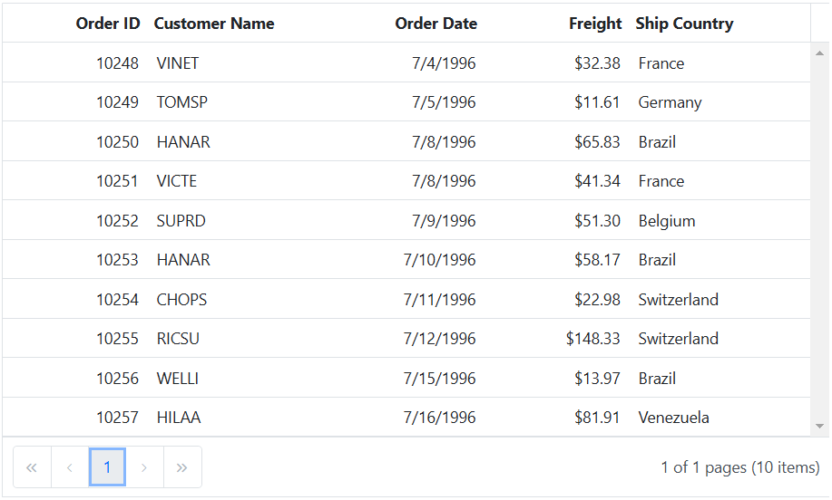
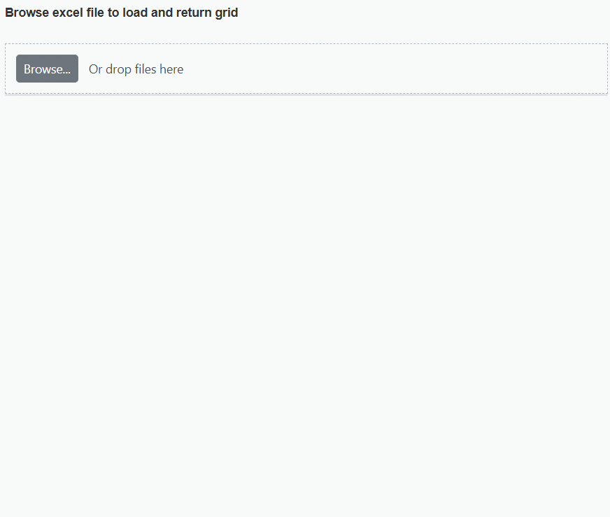
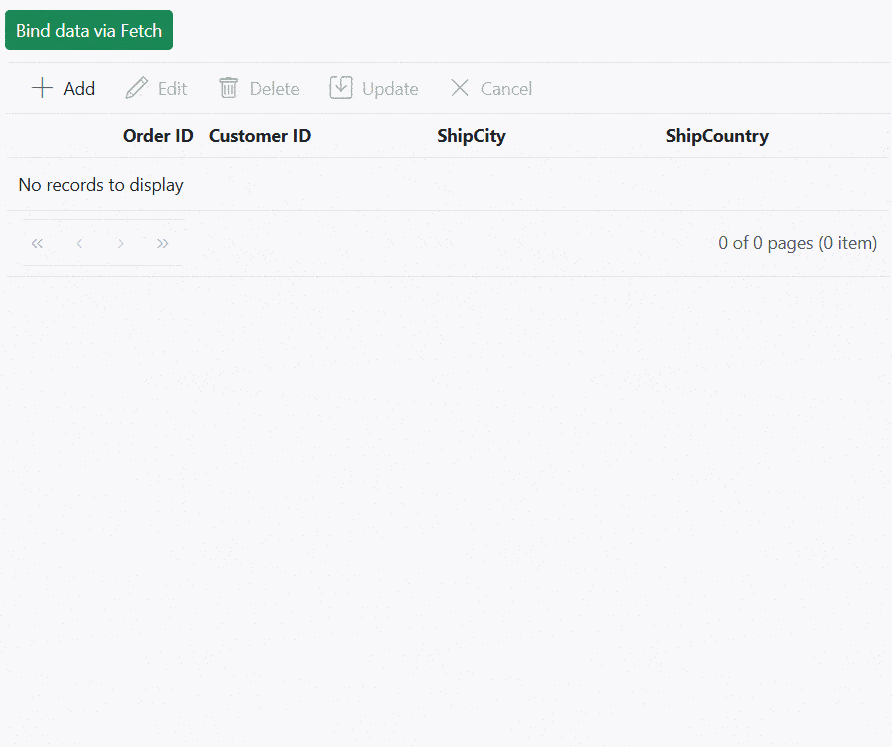
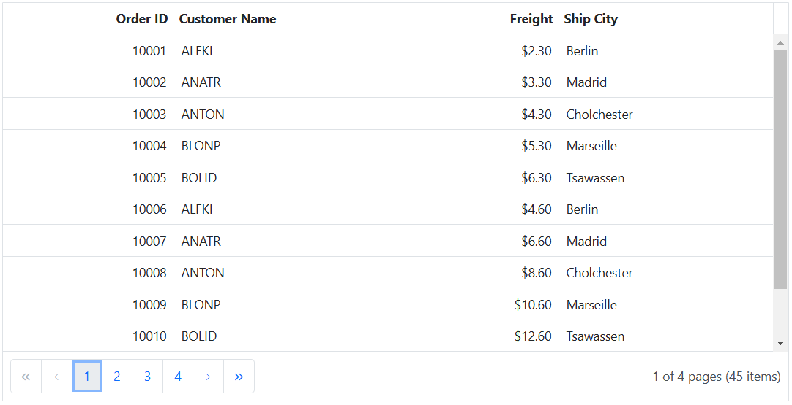
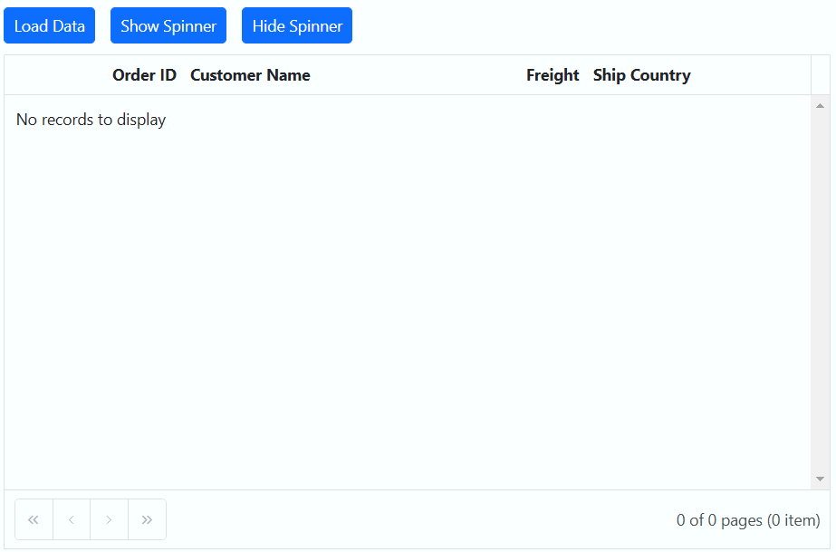
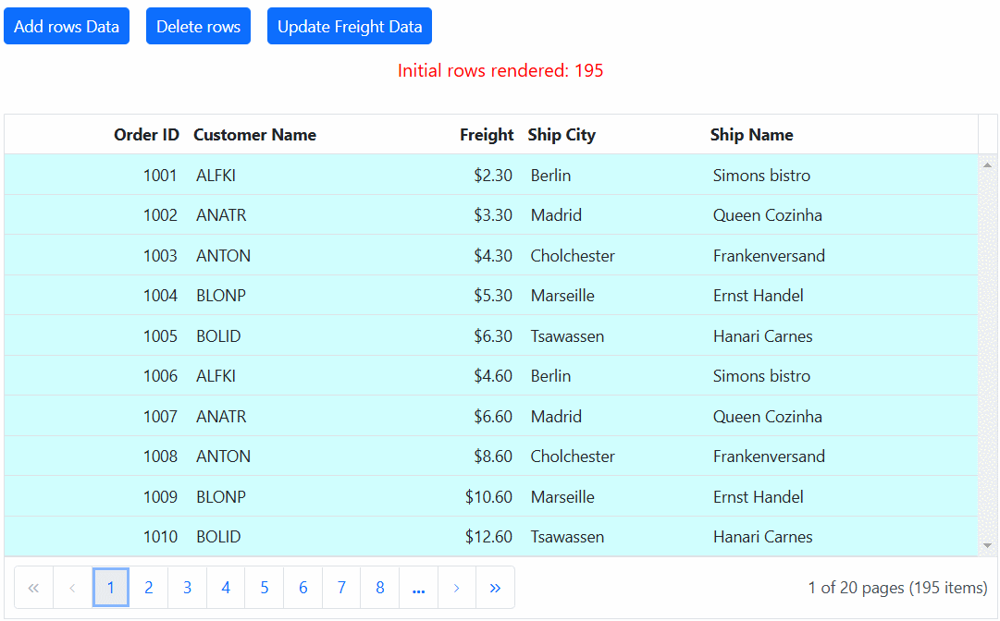
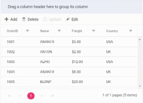
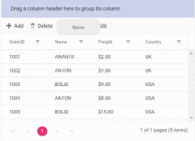

# Local data in ASP.NET MVC Grid component

The Syncfusion Grid offers a straightforward way to bind local data, such as arrays or JSON objects, to the grid component. This feature allows you to display and manipulate data within the grid without the need for external server calls, making it particularly useful for scenarios where you're working with static or locally stored data.

To achieve this, you can assign a JavaScript object array to the [DataSource](https://help.syncfusion.com/cr/aspnetmvc-js2/Syncfusion.EJ2.Grids.Grid.html#Syncfusion_EJ2_Grids_Grid_DataSource) property. Additionally, you have an option to provide the local data source using an instance of the **DataManager**.

The following example demonstrates how to utilize the local data binding feature in the ASP.NET MVC Grid component:












## Data binding with SignalR 

The syncfusion Grid provides support for real-time data binding using SignalR, allowing you to update the grid automatically as data changes on the server-side. This feature is particularly useful for applications requiring live updates and synchronization across multiple clients.

To achieve real-time data binding with SignalR in your Syncfusion ASP.NET MVC Grid, follow the steps below:












## Binding data from excel file

The Syncfusion Grid component allows you to import data from Excel files into your web application for display and manipulation within the grid. This feature streamlines the process of transferring Excel data to a web-based environment. This can be achieved by using [Uploader](https://ej2.syncfusion.com/aspnetcore/documentation/uploader/getting-started) component [Change](https://help.syncfusion.com/cr/aspnetmvc-js2/Syncfusion.EJ2.Inputs.Uploader.html#Syncfusion_EJ2_Inputs_Uploader_Change) event.

To import excel data in to grid, you can follow these steps:

1. Import excel file using Uploader component. 
2. Parse the excel file data using **XLSX** library.
3. Bind the JSON to the grid component. 

The following example demonstrates how to import Excel data into the grid by utilizing the `Uploader` component's `change` event along with the **XLSX** library:











## Binding data and performing CRUD actions via Fetch request

The Syncfusion Grid provides a seamless way to bind data from external sources using Fetch requests, facilitating CRUD (Create, Read, Update, Delete) operations with data retrieved from a server. This feature is particularly valuable for sending data to a server for database updates and asynchronously retrieving data without refreshing the entire web page.

To achieve data binding and perform CRUD actions using Fetch requests in the Syncfusion Grid, follow these steps:

**Step 1:** To create a new ASP.NET Web Application (.NET Framework) project named FetchRequest, follow these steps:

* Open Visual Studio.
* Select “Create a new project”
* Choose ASP.NET Web Application (.NET Framework) project template.
* Name the project **FetchRequest**.
* Click “Create”

**Step 2:**  Create a simple ASP.NET Core Grid by following the [Getting Started documentation link](https://ej2.syncfusion.com/aspnetmvc/documentation/grid/getting-started-core).

**Step 3:**  In the **Views/Home/Index.cshtml** file, follow the steps below.

A. To bind data from an external Fetch request, utilize the [dataSource](https://help.syncfusion.com/cr/aspnetmvc-js2/Syncfusion.EJ2.Grids.Grid.html#Syncfusion_EJ2_Grids_Grid_DataSource) property of the Grid. Fetch data from the server and provide it to the `dataSource` property using the `onSuccess` event of the Fetch request.

B. To perform CRUD actions, leverage the [actionBegin](https://help.syncfusion.com/cr/aspnetmvc-js2/Syncfusion.EJ2.Grids.Grid.html#Syncfusion_EJ2_Grids_Grid_ActionBegin) event. You can cancel the default CRUD operations by utilizing the **cancel** argument provided by this event. This allows you to dynamically call your server-side method using Fetch, along with the relevant data received from the `actionBegin` event, to update your server data accordingly.

C. In the Fetch success event, you have the flexibility to utilize the Grid `endEdit` and `deleteRecord` methods to handle the addition, editing, and deletion of corresponding data in the Grid. However, invoking these methods triggers the `actionBegin` event once again to save the changes in the Grid. To prevent this behavior and maintain control over the execution flow, you can employ a flag variable and manage it within the `actionComplete` and Fetch failure events: The following code snippet demonstrates this approach:

```ts
<div style="padding: 10px 0px 20px 0px">
   @Html.EJS().Button("sample").CssClass("e-success").Content("Bind data via Fetch").Render()
</div>
@Html.EJS().Grid("grid").Height("348px").Columns(col =>
{
    col.Field("OrderID").HeaderText("Order ID").IsPrimaryKey(true).TextAlign(Syncfusion.EJ2.Grids.TextAlign.Right).Width("120").Add();
    col.Field("CustomerID").HeaderText("Customer ID").Width("150").Add();
    col.Field("ShipCity").HeaderText("Ship City").Width("150").Add();
    col.Field("ShipCountry").HeaderText("Ship Country").Width("150").Add();
}).ActionBegin("actionBegin").ActionComplete("actionComplete").Toolbar(new List<string>() { "Add", "Edit", "Delete", "Update", "Cancel" }).EditSettings(edit => { edit.AllowAdding(true).AllowEditing(true).AllowDeleting(true).Mode(Syncfusion.EJ2.Grids.EditMode.Normal); }).AllowPaging().Render()
<script>
   let flag = false;
   document.getElementById('sample').onclick = function () {
       var grid = document.getElementById("grid").ej2_instances[0];
       const fetchRequest = new ej.base.Fetch("/Home/Getdata", 'POST'); 
        fetchRequest.send();
        fetchRequest.onSuccess = (data) => {
            grid.dataSource = data;
        };
    };
    function actionComplete(e) {
        if (e.requestType === 'save' || e.requestType === 'delete') {
            flag = false;
        }
    }
    function actionBegin(e) {
        var grid = document.getElementById("grid").ej2_instances[0];
        if (!flag) {
            if (e.requestType == 'save' && (e.action == 'add')) {
                var editedData = e.data;
                e.cancel = true;
                var fetchRequest = new ej.base.Fetch({
                    url: '/Home/Insert',
                    type: 'POST',
                    contentType: 'application/json; charset=utf-8',
                    data: JSON.stringify({ value: editedData })
                });
                fetchRequest.onSuccess = () => {
                    flag = true;
                    grid.endEdit();
                };
                fetchRequest.onFailure = () => {
                    flag = false;
                };
                fetchRequest.send();
            }
            if (e.requestType == 'save' && (e.action == "edit")) {
                var editedData = e.data;
                e.cancel = true;
                var fetchRequest = new ej.base.Fetch({
                    url: '/Home/Update',
                    type: 'POST',
                    contentType: 'application/json; charset=utf-8',
                    data: JSON.stringify({ value: editedData })
                }); 
                fetchRequest.onSuccess = () => {
                    flag = true;
                    grid.endEdit();
                };
                fetchRequest.onFailure = () => {
                    flag = false;
                };
                fetchRequest.send();
            }
            if (e.requestType == 'delete') {
                var editedData = e.data;
                e.cancel = true;
                var fetchRequest = new ej.base.Fetch({
                    url: '/Home/Delete',
                    type: 'POST',
                    contentType: 'application/json; charset=utf-8',
                    data: JSON.stringify({ key: editedData[0][grid.getPrimaryKeyFieldNames()[0]] })
                });
                fetchRequest.onSuccess = () => {
                    flag = true;
                    grid.deleteRecord();
                };
                fetchRequest.onFailure = () => {
                    flag = false;
                };
                fetchRequest.send();
            }
        }
    }
</script>

```

**Step 7:** In the **HomeController.cs** file under the **Controllers** folder, there is a method named GetData within the HomeController that provides the data source for the grid. When the button is clicked, a Fetch request is sent to retrieve the data from the server and bind it to the Grid component. Additionally, implement server-side logic to perform add, edit, and delete operations.

```cs
using System;
using System.Collections;
using System.Collections.Generic;
using System.Linq;
using System.Web;
using System.Web.Mvc;
using FetchRequest.Models;
namespace FetchRequest.Controllers
{
    public class HomeController : Controller
    {
        public ActionResult Index()
        {
            return View();
        }
        public ActionResult Getdata()
        {
            IEnumerable DataSource = OrdersDetails.GetAllRecords();
            return Json(DataSource);
        }
        public ActionResult Update(OrdersDetails value)
        {
            var ord = value;
            OrdersDetails val = OrdersDetails.GetAllRecords().Where(or => or.OrderID == ord.OrderID).FirstOrDefault();
            val.OrderID = ord.OrderID;
            val.EmployeeID = ord.EmployeeID;
            val.CustomerID = ord.CustomerID;
            val.Freight = ord.Freight;
            val.OrderDate = ord.OrderDate;
            val.ShipCity = ord.ShipCity;
            val.ShipCountry = ord.ShipCountry;
            return Json(value);
        }
        //insert the record
        public ActionResult Insert(OrdersDetails value)
        {
            OrdersDetails.GetAllRecords().Insert(0, value);
            return Json(value);
        }
        //Delete the record
        public ActionResult Delete(int key)
        {
            OrdersDetails.GetAllRecords().Remove(OrdersDetails.GetAllRecords().Where(or => or.OrderID == key).FirstOrDefault());
            var data = OrdersDetails.GetAllRecords();
            return Json(data);
        }
    }
}

```

**Step 5:** Create a model class named **OrdersDetails.cs** under the Models folder in the server-side project to represent the order data. Add the following code.

```cs
using System;
using System.Collections.Generic;
using System.Linq;
using System.Web;

namespace FetchRequest.Models
{
    public class OrdersDetails
    {
        public OrdersDetails() { }
        public OrdersDetails(int OrderID, string CustomerId, int EmployeeId, double Freight, bool Verified, DateTime OrderDate, string ShipCity, string ShipName, string ShipCountry, DateTime ShippedDate, string ShipAddress)
        {
            this.OrderID = OrderID;
            this.CustomerID = CustomerId;
            this.EmployeeID = EmployeeId;
            this.Freight = Freight;
            this.ShipCity = ShipCity;
            this.Verified = Verified;
            this.OrderDate = OrderDate;
            this.ShipName = ShipName;
            this.ShipCountry = ShipCountry;
            this.ShippedDate = ShippedDate;
            this.ShipAddress = ShipAddress;
        }
        public static List<OrdersDetails> GetAllRecords()
        {
            List<OrdersDetails> order = new List<OrdersDetails>();
            int code = 10000;
            for (int i = 1; i < 10; i++)
            {
                order.Add(new OrdersDetails(code + 1, "ALFKI", i + 0, 2.3 * i, false, new DateTime(1991, 05, 15), "Berlin", "Simons bistro", "Denmark", new DateTime(1996, 7, 16), "Kirchgasse 6"));
                order.Add(new OrdersDetails(code + 2, "ANATR", i + 2, 3.3 * i, true, new DateTime(1990, 04, 04), "Madrid", "Queen Cozinha", "Brazil", new DateTime(1996, 9, 11), "Avda. Azteca 123"));
                order.Add(new OrdersDetails(code + 3, "ANTON", i + 1, 4.3 * i, true, new DateTime(1957, 11, 30), "Cholchester", "Frankenversand", "Germany", new DateTime(1996, 10, 7), "Carrera 52 con Ave. Bolívar #65-98 Llano Largo"));
                order.Add(new OrdersDetails(code + 4, "BLONP", i + 3, 5.3 * i, false, new DateTime(1930, 10, 22), "Marseille", "Ernst Handel", "Austria", new DateTime(1996, 12, 30), "Magazinweg 7"));
                order.Add(new OrdersDetails(code + 5, "BOLID", i + 4, 6.3 * i, true, new DateTime(1953, 02, 18), "Tsawassen", "Hanari Carnes", "Switzerland", new DateTime(1997, 12, 3), "1029 - 12th Ave. S."));
                code += 5;
            }
            return order;
        }
        public int? OrderID { get; set; }
        public string CustomerID { get; set; }
        public int? EmployeeID { get; set; }
        public double? Freight { get; set; }
        public string ShipCity { get; set; }
        public bool Verified { get; set; }
        public DateTime OrderDate { get; set; }
        public string ShipName { get; set; }
        public string ShipCountry { get; set; }
        public DateTime? ShippedDate { get; set; }
        public string ShipAddress { get; set; }
    }
}

```
The following screenshot represents loading data when the button is clicked and CRUD operations are performed:



### Display the loading indicator with local data

The Syncfusion Grid allows you to display a loading indicator while loading local data. This feature is useful when there is a delay in loading data from a local source, and you want to inform the you that the data is being fetched.

To display the loading indicator with local data, you need to set the `ShowSpinner` property to **true**. This property controls the visibility of the loading indicator.

The following example demonstrates how to display the loading indicator in the Syncfusion Grid using the [Load](https://help.syncfusion.com/cr/aspnetmvc-js2/Syncfusion.EJ2.Grids.Grid.html#Syncfusion_EJ2_Grids_Grid_Load) and [Created](https://help.syncfusion.com/cr/aspnetmvc-js2/Syncfusion.EJ2.Grids.Grid.html#Syncfusion_EJ2_Grids_Grid_Created) events:










## Binding data and performing CRUD actions via AJAX request

The Syncfusion Grid provides a seamless way to bind data from external sources using AJAX requests, facilitating CRUD (Create, Read, Update, Delete) operations with data retrieved from a server. This feature is particularly valuable for sending data to a server for database updates and asynchronously retrieving data without refreshing the entire web page

To achieve data binding and perform CRUD actions using Ajax requests in the Syncfusion Grid, follow these steps:

**Step 1:** To create a new ASP.NET Web Application (.NET Framework) project named AJAXRequest, follow these steps:

* Open Visual Studio.
* Select “Create a new project”
* Choose ASP.NET Web Application (.NET Framework) project template.
* Name the project **AJAXRequest**.
* Click “Create”

**Step 2:**  Create a simple ASP.NET Core Grid by following the [Getting Started documentation link](https://ej2.syncfusion.com/aspnetmvc/documentation/grid/getting-started-core).

**Step 3:**  In the **Views/Home/Index.cshtml** file, follow the steps below.

A. To bind data from an external AJAX request, utilize the [DataSource](https://help.syncfusion.com/cr/aspnetmvc-js2/Syncfusion.EJ2.Grids.Grid.html#Syncfusion_EJ2_Grids_Grid_DataSource) property of the Grid. AJAX data from the server and provide it to the `dataSource` property using the `onSuccess` event of the AJAX request.

B. To perform CRUD actions, leverage the [ActionBegin](https://help.syncfusion.com/cr/aspnetmvc-js2/Syncfusion.EJ2.Grids.Grid.html#Syncfusion_EJ2_Grids_Grid_ActionBegin) event. You can cancel the default CRUD operations by utilizing the **cancel** argument provided by this event. This allows you to dynamically call your server-side method using Fetch, along with the relevant data received from the `ActionBegin` event, to update your server data accordingly.

C. In the AJAX success event, you have the flexibility to utilize the Grid `endEdit` and `deleteRecord` methods to handle the addition, editing, and deletion of corresponding data in the Grid. However, invoking these methods triggers the `ActionBegin` event once again to save the changes in the Grid. To prevent this behavior and maintain control over the execution flow, you can employ a flag variable and manage it within the `ActionComplete` and AJAX failure events: The following code snippet demonstrates this approach:

```ts

<div style="padding: 10px 0px 20px 0px">
    @Html.EJS().Button("sample").CssClass("e-success").Content("Bind data via ajax").Render()
</div>
@Html.EJS().Grid("grid").Height("348px").Columns(col =>
{
    col.Field("OrderID").HeaderText("Order ID").IsPrimaryKey(true).TextAlign(Syncfusion.EJ2.Grids.TextAlign.Right).Width("120").Add();
    col.Field("CustomerID").HeaderText("Customer ID").Width("150").Add();
    col.Field("ShipCity").HeaderText("Ship City").Width("150").Add();
    col.Field("ShipCountry").HeaderText("Ship Country").Width("150").Add();
}).ActionBegin("actionBegin").ActionComplete("actionComplete").Toolbar(new List<string>() { "Add", "Edit", "Delete", "Update", "Cancel" }).EditSettings(edit => { edit.AllowAdding(true).AllowEditing(true).AllowDeleting(true).Mode(Syncfusion.EJ2.Grids.EditMode.Normal); }).AllowPaging().Render()
<script>
   let flag = false;
   document.getElementById('sample').onclick = function () {
       var grid = document.getElementById("grid").ej2_instances[0];
       const ajax = new ej.base.Ajax("/Home/Getdata", 'POST');
       ajax.send();
        ajax.onSuccess = (data) => {
            grid.dataSource = JSON.parse(data);
        };
    };
    function actionComplete(e) {
        if (e.requestType === 'save' || e.requestType === 'delete') {
            flag = false;
        }
    }
    function actionBegin(e) {
        var grid = document.getElementById("grid").ej2_instances[0];
        if (!flag) {
            if (e.requestType == 'save' && (e.action == 'add')) {
                var editedData = e.data;
                e.cancel = true;
                var ajax = new ej.base.Ajax({
                    url: '/Home/Insert',
                    type: 'POST',
                    contentType: 'application/json; charset=utf-8',
                    data: JSON.stringify({ value: editedData })
                });
                ajax.onSuccess = () => {
                    flag = true;
                    grid.endEdit();
                };
                ajax.onFailure = () => {
                    flag = false;
                };
                ajax.send();
            }
            if (e.requestType == 'save' && (e.action == "edit")) {
                var editedData = e.data;
                e.cancel = true;
                var ajax = new ej.base.Ajax({
                    url: '/Home/Update',
                    type: 'POST',
                    contentType: 'application/json; charset=utf-8',
                    data: JSON.stringify({ value: editedData })
                });
                ajax.onSuccess = () => {
                    flag = true;
                    grid.endEdit();
                };
                ajax.onFailure = () => {
                    flag = false;
                };
                ajax.send();
            }
            if (e.requestType == 'delete') {
                var editedData = e.data;
                e.cancel = true;
                var ajax = new ej.base.Ajax({
                    url: '/Home/Delete',
                    type: 'POST',
                    contentType: 'application/json; charset=utf-8',
                    data: JSON.stringify({ key: editedData[0][grid.getPrimaryKeyFieldNames()[0]] })
                });
                ajax.onSuccess = () => {
                    flag = true;
                    grid.deleteRecord();
                };
                ajax.onFailure = () => {
                    flag = false;
                };
                ajax.send();
            }
        }
    }
</script>

```

**Step 7:** In the **HomeController.cs** file under the **Controllers** folder, there is a method named GetData within the HomeController that provides the data source for the grid. When the button is clicked, a AJAX request is sent to retrieve the data from the server and bind it to the Grid component. Additionally, implement server-side logic to perform add, edit, and delete operations.

```cs
using System;
using System.Collections;
using System.Collections.Generic;
using System.Linq;
using System.Web;
using System.Web.Mvc;
using AJAXRequest.Models;
namespace AJAXRequest.Controllers
{
    public class HomeController : Controller
    {
        public ActionResult Index()
        {
            return View();
        }
        public ActionResult Getdata()
        {
            IEnumerable DataSource = OrdersDetails.GetAllRecords();
            return Json(DataSource);
        }
        public ActionResult Update(OrdersDetails value)
        {
            var ord = value;
            OrdersDetails val = OrdersDetails.GetAllRecords().Where(or => or.OrderID == ord.OrderID).FirstOrDefault();
            val.OrderID = ord.OrderID;
            val.EmployeeID = ord.EmployeeID;
            val.CustomerID = ord.CustomerID;
            val.Freight = ord.Freight;
            val.OrderDate = ord.OrderDate;
            val.ShipCity = ord.ShipCity;
            val.ShipCountry = ord.ShipCountry;
            return Json(value);
        }
        //insert the record
        public ActionResult Insert(OrdersDetails value)
        {
            OrdersDetails.GetAllRecords().Insert(0, value);
            return Json(value);
        }
        //Delete the record
        public ActionResult Delete(int key)
        {
            OrdersDetails.GetAllRecords().Remove(OrdersDetails.GetAllRecords().Where(or => or.OrderID == key).FirstOrDefault());
            var data = OrdersDetails.GetAllRecords();
            return Json(data);
        }
    }
}

```

**Step 5:** Create a model class named **OrdersDetails.cs** under the Models folder in the server-side project to represent the order data. Add the following code.

```cs
using System;
using System.Collections.Generic;
using System.Linq;
using System.Web;

namespace AJAXRequest.Models
{
    public class OrdersDetails
    {
        public OrdersDetails() { }
        public OrdersDetails(int OrderID, string CustomerId, int EmployeeId, double Freight, bool Verified, DateTime OrderDate, string ShipCity, string ShipName, string ShipCountry, DateTime ShippedDate, string ShipAddress)
        {
            this.OrderID = OrderID;
            this.CustomerID = CustomerId;
            this.EmployeeID = EmployeeId;
            this.Freight = Freight;
            this.ShipCity = ShipCity;
            this.Verified = Verified;
            this.OrderDate = OrderDate;
            this.ShipName = ShipName;
            this.ShipCountry = ShipCountry;
            this.ShippedDate = ShippedDate;
            this.ShipAddress = ShipAddress;
        }
        public static List<OrdersDetails> GetAllRecords()
        {
            List<OrdersDetails> order = new List<OrdersDetails>();
            int code = 10000;
            for (int i = 1; i < 10; i++)
            {
                order.Add(new OrdersDetails(code + 1, "ALFKI", i + 0, 2.3 * i, false, new DateTime(1991, 05, 15), "Berlin", "Simons bistro", "Denmark", new DateTime(1996, 7, 16), "Kirchgasse 6"));
                order.Add(new OrdersDetails(code + 2, "ANATR", i + 2, 3.3 * i, true, new DateTime(1990, 04, 04), "Madrid", "Queen Cozinha", "Brazil", new DateTime(1996, 9, 11), "Avda. Azteca 123"));
                order.Add(new OrdersDetails(code + 3, "ANTON", i + 1, 4.3 * i, true, new DateTime(1957, 11, 30), "Cholchester", "Frankenversand", "Germany", new DateTime(1996, 10, 7), "Carrera 52 con Ave. Bolívar #65-98 Llano Largo"));
                order.Add(new OrdersDetails(code + 4, "BLONP", i + 3, 5.3 * i, false, new DateTime(1930, 10, 22), "Marseille", "Ernst Handel", "Austria", new DateTime(1996, 12, 30), "Magazinweg 7"));
                order.Add(new OrdersDetails(code + 5, "BOLID", i + 4, 6.3 * i, true, new DateTime(1953, 02, 18), "Tsawassen", "Hanari Carnes", "Switzerland", new DateTime(1997, 12, 3), "1029 - 12th Ave. S."));
                code += 5;
            }
            return order;
        }
        public int? OrderID { get; set; }
        public string CustomerID { get; set; }
        public int? EmployeeID { get; set; }
        public double? Freight { get; set; }
        public string ShipCity { get; set; }
        public bool Verified { get; set; }
        public DateTime OrderDate { get; set; }
        public string ShipName { get; set; }
        public string ShipCountry { get; set; }
        public DateTime? ShippedDate { get; set; }
        public string ShipAddress { get; set; }
    }
}

```
The following screenshot represents loading data when the button is clicked and CRUD operations are performed:


### Display the loading indicator using AJAX

The Syncfusion Grid allows you to display a loading indicator while loading data using AJAX. This feature is useful when there is a delay in loading data from data , and you want to inform the you that the data is being fetched. This is particularly beneficial when working with large datasets or under conditions of slower internet connections.

To display the loading indicator with local data, you need to set the `ShowSpinner` property to **true**. This property controls the visibility of the loading indicator.

The following example demonstrates how to display the loading indicator in the Syncfusion Grid using the [Load](https://help.syncfusion.com/cr/aspnetmvc-js2/Syncfusion.EJ2.Grids.Grid.html#Syncfusion_EJ2_Grids_Grid_Load) and [Created](https://help.syncfusion.com/cr/aspnetmvc-js2/Syncfusion.EJ2.Grids.Grid.html#Syncfusion_EJ2_Grids_Grid_Created) events:












## Managing spinner visibility during data loading

Showing a spinner during data loading in the Syncfusion ASP.NET MVC Grid enhances the experience by providing a visual indication of the loading progress. This feature helps to understand that data is being fetched or processed.

To show or hide a spinner during data loading in the grid, you can utilize the `showSpinner` and `hideSpinner` methods provided by the Grid component

The following example demonstrates how to show and hide the spinner during data loading using external buttons in a grid:












## Immutable mode  

Immutable mode in the Syncfusion Grid is designed to optimize re-rendering performance by utilizing the object reference and [deep compare](https://dmitripavlutin.com/how-to-compare-objects-in-javascript/#4-deep-equality) concept. This mode ensures that when performing Grid actions, only the modified or newly added rows are re-rendered, preventing unnecessary re-rendering of unchanged rows. 

To enable this feature, you need to set the [EnableImmutableMode](https://help.syncfusion.com/cr/aspnetmvc-js2/Syncfusion.EJ2.Grids.Grid.html#Syncfusion_EJ2_Grids_Grid_EnableImmutableMode) property as **true**.

If immutable mode is enabled, when the datasource changes, only newly added rows are regenerated or reused. Consequently, the grid's [QueryCellInfo](https://help.syncfusion.com/cr/aspnetmvc-js2/Syncfusion.EJ2.Grids.Grid.html#Syncfusion_EJ2_Grids_Grid_QueryCellInfo) and [RowDataBound](https://help.syncfusion.com/cr/aspnetmvc-js2/Syncfusion.EJ2.Grids.Grid.html#Syncfusion_EJ2_Grids_Grid_RowDataBound) events trigger only for newly generated rows, not for existing rows. 

If immutable mode is not enabled, both newly added rows and existing rows are regenerated or reused when the datasource changes. As a result, the `RowDataBound` and `QueryCellInfo` events trigger for both newly added and existing rows. 

> This feature uses the primary key value for data comparison. So, you need to provide the `IsPrimaryKey` column.

The following example demonstrates how to enable immutable mode in an ASP.NET MVC component. When add, delete, or update actions are performed, existing rows are not regenerated or reused, ensuring efficient rendering of only the modified or newly added rows:












## ExpandoObject binding

The Syncfusion Grid component is typically bound to a specific model type. However, there are scenarios where the model type is unknown during compile time. In such cases, you can bind data to the grid using a list of ExpandoObject. This allows for dynamic data structures that can adapt to various data shapes without a predefined schema.

To bind an `ExpandoObject` to the grid, you need to assign it to the `DataSource` property. The grid supports various data operations such as sorting, filtering, and editing when using `ExpandoObject`.

The following sample demonstrates ExpandoObject binding:










## ExpandoObject with complex column binding

You can achieve complex data binding with ExpandoObject in the Syncfusion Grid by using the dot (.) operator in the column.field property. This feature allows you to access and bind to nested properties within the ExpandoObject, enabling more structured data representation in the grid.

In the following example, the fields Customer.CustomerID, Customer.OrderDate, Customer.Freight, and Customer.ShipCountry represent complex data that is bound to the grid:










N> Perform data and CRUD operations for complex ExpandoObject binding fields as well.

The following image represents ExpandoObject complex data binding.



## DynamicObject binding

The Syncfusion Grid component is typically bound to a specific model type. However, there are scenarios where the model type is unknown during compile time. In such cases, you can bind data to the grid using a list of ExpandoObject. This allows for dynamic data structures that can adapt to various data shapes without a predefined schema.

To bind an `ExpandoObject` to the grid, you need to assign it to the `dataSource` property. This enables the grid to perform various supported data operations and editing on the DynamicObject.

N> You must override the [`GetDynamicMemberNames`](https://learn.microsoft.com/en-us/dotnet/api/system.dynamic.dynamicobject.getdynamicmembernames?view=netcore-3.1) method of the DynamicObject class and return the property names to perform data operation and editing while using DynamicObject.

Here's an example of how to bind a list of DynamicObject to the Syncfusion Grid:










## DynamicObject with complex column binding

You can achieve complex data binding with DynamicObject in the Syncfusion Grid by using the dot (.) operator in the column.field property. This allows you to access and bind to nested properties within the DynamicObject, enabling the display of structured data in the grid.

In the following example, Customer.OrderDate, Customer.Freight, and Customer.ShipCountry are considered complex data fields that are bound to the grid:










N> Perform data and CRUD operations for complex DynamicObject binding fields as well.

The following image represents DynamicObject complex data binding.



### Limitations

The following features are not supported in the immutable mode:

* Frozen rows and columns
* Grouping
* Row Template 
* Detail Template
* Hierarchy Grid
* Scrolling 
* Virtual scroll
* Infinite scroll
* Column reorder
* Rows,column spanning
* PDF export ,Excel export,Print
* Column Resize
* Drag and drop
* Column template
* Column chooser
* Clipboard
* AutoFit
* Filtering

