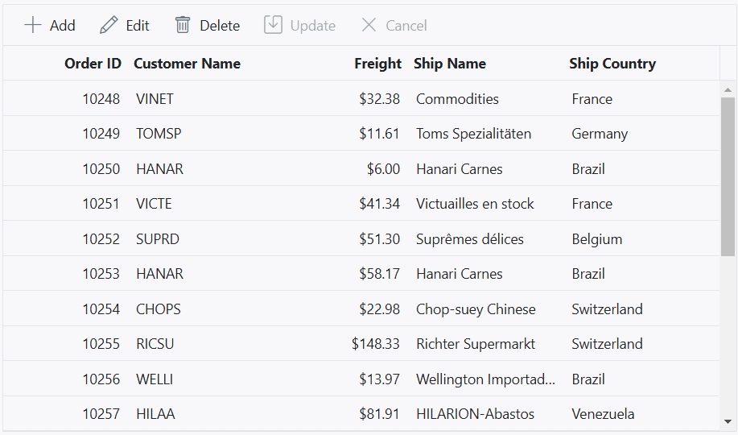

# Inline editing in angular grid component

The Angular Grid component provides a powerful in-line editing feature that allows you to edit cell values of row directly within the grid. This feature is especially useful when you want to quickly modify data without the need for a separate edit form. In normal edit mode, the selected record is changed to an edit state, and you can modify the cell values and save the edited data to the data source.

To enable in-line editing in the grid component, you need to set the [editSettings.mode](https://ej2.syncfusion.com/angular/documentation/api/grid/editSettings/#mode) property of the Grid's configuration to **Normal**. This property determines the editing mode of the Grid.











> Normal edit mode is default mode of editing.
> When enabling editing, it is necessary to set the [isPrimaryKey](https://ej2.syncfusion.com/angular/documentation/api/grid/columnModel/#isprimarykey) property value to **true** for the unique column.

## Automatically update a specific column based on another column edited value

You can automatically update the value of a column based on the edited value of another column using Cell Edit Template feature. This feature is useful when you want to dynamically calculate and update a column's value in real-time based on the changes made in another related column. To enable this functionality, define the [editType](https://ej2.syncfusion.com/angular/documentation/api/grid/columnModel/#edittype) of the column to specify the type of editor used for editing the column, and provide an object for the [edit](https://ej2.syncfusion.com/angular/documentation/api/grid/columnModel/#edit) property to customize the editing behavior. 

In the following example, the **TotalCost** column value is updated based on changes to the **UnitPrice** and **UnitInStock** columns during batch editing.











## Cancel edit based on condition

The grid provides the ability to cancel the edit operations for particular row or cell based on specific conditions. This feature allows you to control over whether editing should be allowed or prevented for certain rows or cells in the grid. You can achieve this functionality by leveraging the [actionBegin](https://ej2.syncfusion.com/angular/documentation/api/grid/#actionbegin) event of the Grid component. This event is triggered when a CRUD (Create, Read, Update, Delete) operation is initiated in the grid.  

To cancel the edit operation based on a specific condition, you can handle the `actionBegin` event of the grid component and check the **requestType** parameter. This parameter indicates the type of action being performed, such as **beginEdit** for editing, **add** for adding, and **delete** for deleting. By applying your desired condition, you can cancel the edit, delete, or add operation by setting the `args.cancel` property to **true**.

In the below demo, prevent the CRUD operation based on the **Role** column value. If the Role Column is **Admin**, then edit/delete action is prevented for that row.











## Perform CRUD action programmatically

Performing CRUD actions programmatically refers to the ability to create, read, update, and delete data in a system or application using code instead of manual user interaction.

* To add a new record to the Grid, use the [addRecord](https://ej2.syncfusion.com/angular/documentation/api/grid/#addrecord) method. In this method, you can pass the **data** parameter to add a new record to the Grid, and the **index** parameter to add a record at a specific index. If you call this method without any parameters, it will create an empty row in the Grid. If an index is not specified, the newly added record will be displayed at the zeroth index.

* To change the selected row to the edit state, use the [startEdit](https://ej2.syncfusion.com/angular/documentation/api/grid/#startedit) method. Before invoking this method, it is necessary to select a row in the grid.

* If you need to update the row data in the Grid’s data source, you can use the [updateRow](https://ej2.syncfusion.com/angular/documentation/api/grid/#updaterow) method. In this method, you need to pass the **index** value of the row to be updated along with the updated **data**.

* If you need to update the particular cell in the row, you can use the [setCellValue](https://ej2.syncfusion.com/angular/documentation/api/grid/#setcellvalue) method. In this method, you need to pass the primary key value of the data source, field name, and new value for the particular cell. When using this method, any changes made to a cell will only be reflected visually in the UI of Grid alone, not persisted or saved in the underlying data source. This method is commonly employed for unbound columns, such as auto-calculated columns or formula columns, where the values are derived or computed based on other data within the Grid or external calculations. By using this method, you can update the visual representation of these unbound columns without modifying the actual data source.

* To remove a selected row from the Grid, use the [deleteRecord](https://ej2.syncfusion.com/angular/documentation/api/grid/#deleterecord) method. For both edit and delete operations, you must select a row first.

> In both normal and dialog editing modes, these methods can be used.











## Show confirmation dialog while deleting

Displaying a confirmation dialog adds an extra layer of confirmation when deleting a record from the grid. This dialog prompts for confirmation before proceeding with the deletion, ensuring that accidental or undesired deletions are avoided. The deletion can proceed only if the decision is certain. The grid component provides a built-in confirmation dialog that can be used to confirm a deleting action.

To enable the confirmation dialog for the delete operation in the Grid, you can set the [showDeleteConfirmDialog](https://ej2.syncfusion.com/angular/documentation/api/grid/editSettings/#showdeleteconfirmdialog) property of the `editSettings` configuration to **true**. By default, this property is set to **false**.











> The **showDeleteConfirmDialog** supports all type of edit modes.

## Display default value for columns while adding

This feature is useful when you want to pre-fill certain column values with default values to streamline the data entry process. The grid component allows you to set default values for columns when adding a new record. 

To set a default value for a specific column in the Grid, you can use the [defaultValue](https://ej2.syncfusion.com/angular/documentation/api/grid/column/#defaultvalue) property of the `columns` configuration. By providing a default value, the grid will automatically populate that value in the corresponding column when a new row is added.

Here's an example of how to set a default value for a column:











## Delete multiple rows

The delete multiple rows feature in the grid component allows you to easily remove multiple rows from the grid at once. This feature is useful when you want to delete multiple records simultaneously. There are two approaches to implement this feature: using the inbuilt toolbar delete option or using a method.

**Using the inbuilt toolbar delete option**

The grid component provides a user-friendly interface for performing various actions, including deleting rows using the inbuilt toolbar. To enable the delete multiple rows using the toolbar, you need to configure the [toolbar](https://ej2.syncfusion.com/angular/documentation/api/grid#toolbar) property of the grid and set the [selectionSettings.type](https://ej2.syncfusion.com/angular/documentation/api/grid/selectionSettings/#type) property as **multiple** to enable multiple row selection.

To delete multiple selected records in the grid, first you need to select multiple rows in the grid by highlighting or checking the corresponding checkboxes. Once the desired rows are selected, you can click on the delete icon located in the toolbar. This action will initiate the deletion process and remove the selected records from the grid.











> Also delete the selected records using keyboard shortcut key **delete**.

**Using method**

You can delete multiple rows programmatically by using following method.

1. [deleteRecord](https://ej2.syncfusion.com/angular/documentation/api/grid/#deleterecord) -This method allows you to delete a record with the given options. If the **fieldname** (field name of the primary key column) and **data** parameters are not provided, the grid will delete the selected records.

    ```ts
        this.grid.deleteRecord();
    ```

2. [deleteRow](https://ej2.syncfusion.com/angular/documentation/api/grid/#deleterow) - Using this method, you have the ability to delete any visible row by providing the corresponding <tr> element. To achieve this, you can utilize the `getSelectedRows` method to retrieve the selected rows and then iterate over the rows. For each row, you can pass the <tr> element to the deleteRow method to initiate the deletion process. This approach allows you to selectively delete rows based on the <tr> elements obtained from the `getSelectedRows` method.

    ```ts
        const selectedRows: any[] = this.grid.getSelectedRows();
        selectedRows.forEach((row: HTMLTableRowElement) => {
        this.grid.deleteRow(row);
       });
    ```

> The `selectionSettings.type` property is set to **Multiple** to enable multiple row selection.
> To prevent accidental or undesired deletions, it is recommended to enable the `showDeleteConfirmDialog` property of the `editSettings` configuration











## Adding a new row at the bottom of the grid

The grid component allows you to add a new row at the bottom of the grid, allowing you to insert a new record at the end of the existing data set. This feature is particularly useful when you want to conveniently add new records without the need of scroll up or manually reposition the newly added row.

By default, when adding a new row in the grid component, the row is inserted at the top of the grid. However, you can change this behavior by setting the [newRowPosition](https://ej2.syncfusion.com/angular/documentation/api/grid/editSettings/#newrowposition) property of the `editSettings` configuration to **Bottom**. This property determines the position where the new row will be inserted.

Here's an example of how to enable adding new rows at the bottom of the grid:











>* Add `newRowPostion` is supported for **Normal** and **Batch** editing modes.
>* If you set `newRowPosition` as **Bottom**, the grid will display a blank row form at the bottom by default, allowing you to enter data for the new record. However, when the data is saved or updated, it will be inserted at the top of the grid. 

## Show add new row always in grid

The Syncfusion Grid simplifies the addition of new records by consistently presenting a blank, "add new row" form within the grid. To enable this feature, you can set the `showAddNewRow` property within the `editSettings` configuration to **true**. This allows for continuous addition of new records. You can display the add a new row at either the **top** or **bottom** of the grid content, depending on the [newRowPosition](https://ej2.syncfusion.com/angular/documentation/api/grid/editSettings/#newrowposition) property of `editSettings`. By default, the add new row is displayed at the top row of the grid content.

The following sample demonstrates how to add a new record continuously using `showAddNewRow` property.











> To save the newly added records, you can either hit the **Enter** key or click on the **Update** button located on the toolbar after filling in the new add form.

### Limitations

* This feature is supported only for Inline/Normal editing mode and is not compatible with other edit modes.
* The new blank add row form will always be displayed at the top, even if you have set the new row position as the bottom for Virtual Scrolling and Infinite Scrolling enabled grid.
* This feature is not compatible with the column virtualization feature.

## Move the focus to a particular cell instead of first cell while editing a row

The grid component allows you to move the focus to a specific cell when editing a row, rather than the default behavior of focusing on the first cell in the row. This feature can be useful when you want to improve the editing experience by automatically focusing on a particular cell that requires immediate attention.

To achieve this functionality, you can leverage the [recordDoubleClick](https://ej2.syncfusion.com/angular/documentation/api/grid/#recordDoubleClick) event of the Grid component. The `recordDoubleClick` event is triggered when a row in the grid is double-clicked, indicating the intention to edit that row. By handling this event and programmatically moving the focus to the desired cell within the row.

Here's an example of how to use the `recordDoubleClick` event to move the focus to a particular cell:











## Enable editing in single click

Enabling single-click editing in the Syncfusion Grid's **Normal** editing mode is a valuable feature that allows you to make a row editable with just one click.This can be achieved by using the [startEdit](https://ej2.syncfusion.com/angular/documentation/api/grid/#startedit) and [endEdit](https://ej2.syncfusion.com/angular/documentation/api/grid/#endedit) methods.

To implement this feature, you need to bind the `mouseup` event for the Grid and, within the event handler, call the `startEdit` and `endEdit` methods based on the clicked target element. This ensures that the editing mode is triggered when clicking on a specific element within the Grid.

The following sample demonstrates how to enable editing in a single click using the `mouseup` event along with the `load` event:











## Disable editing for a particular row

In the Syncfusion Grid component, you can prevent editing of specific rows based on certain conditions. This feature is useful when you want to restrict editing for certain rows , such as read-only data, calculated values, or protected information. It helps maintain data integrity and ensures that only authorized changes can be made in the grid.

To disable editing for a particular row, use the [actionBegin](https://ej2.syncfusion.com/angular/documentation/api/grid/#actionbegin) event of the grid based on **requestType** as **beginEdit**. You can then set the **args.cancel** property to **true** to prevent editing for that row.

In the below demo, the rows which are having the value for **ShipCountry** column as **France** is prevented from editing.












