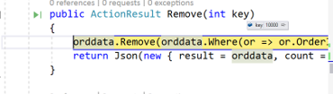
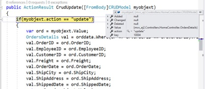
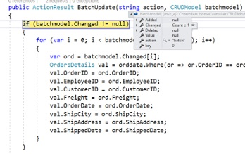

# Persisting Data in Server

Edited data can be persisted in the database using the RESTful web services.

All the CRUD operations in the grid are done through **DataManager**. The **DataManager** has an option to bind all the CRUD related data in server-side.

> For your information, the ODataAdaptor persists data in the server as per OData protocol.

In the below section, we have explained how to get the edited data details on the server-side using the **UrlAdaptor**.

## Using URL adaptor

You can use the **UrlAdaptor** of **DataManager** when binding data source from remote data.
In the initial load of grid, data are fetched from remote data and bound to the grid using **url** property of **DataManager**.
You can map The CRUD operation in grid can be mapped to server-side Controller actions using the properties **InsertUrl**, **RemoveUrl**, **UpdateUrl**, **CrudUrl** and **BatchUrl**.

The following code example describes the above behavior.

























Also, when using the **UrlAdaptor**, you need to return the data as JSON from the controller action and the JSON object must contain a property as **result** with dataSource as its value and one more property **count** with the dataSource total records count as its value.

The following code example describes the above behavior.

























### Insert record

Using the **InsertUrl** property, you can specify the controller action mapping URL to perform insert operation on the server-side.

The following code example describes the above behavior.

























The newly added record details are bound to the **Object** parameter. Please refer to the following screenshot.


### Update record

Using the **UpdateUrl** property, the controller action mapping URL can be specified to perform save/update operation on the server-side.

The following code example describes the previous behavior.

























The updated record details are bound to the **Object** parameter. Please refer to the following screenshot.


### Delete record

Using the **RemoveUrl** property, the controller action mapping URL can be specified to perform delete operation on the server-side.

The following code example describes the previous behavior.

























The deleted record primary key value is bound to the **key** parameter. Please refer to the following screenshot.



### CRUD URL

Using the **CrudUrl** property, the controller action mapping URL can be specified to perform all the CRUD operation at server-side using a single method instead of specifying separate controller action method for CRUD (insert, update and delete) operations.

The action parameter of **CrudUrl** is used to get the corresponding CRUD action.

The following code example describes the above behavior.

























Please refer to the following screenshot to know about the action parameter.



> If you specify **InsertUrl** along with **CrudUrl**, then while adding **InsertUrl** only will be invoked.

### Batch URL

The **BatchUrl** property supports only for batch editing mode.
You can specify the controller action mapping URL to perform batch operation on the server-side.

The following code example describes the above behavior.

























```typescript
public ActionResult BatchUpdate([FromBody]string action, List<EditableOrder> added, List<EditableOrder> changed, List<EditableOrder> deleted, int? key)
{
//Save the batch changes in database
}
```

