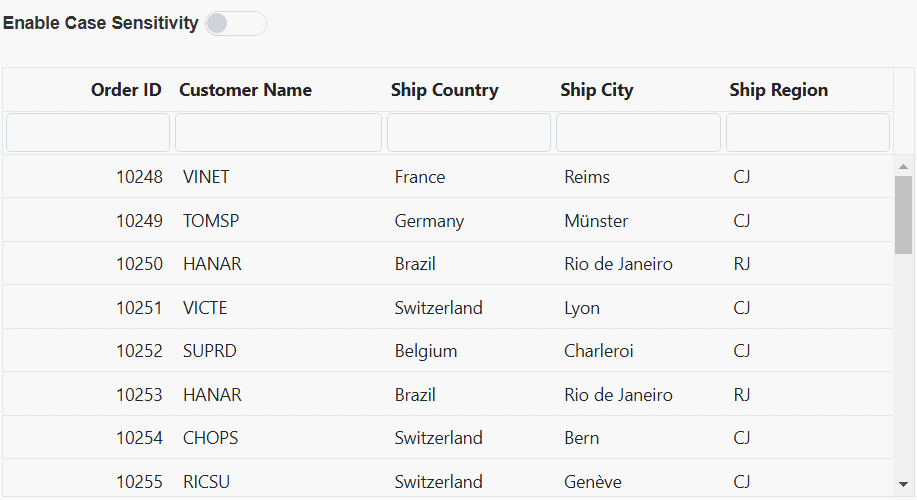
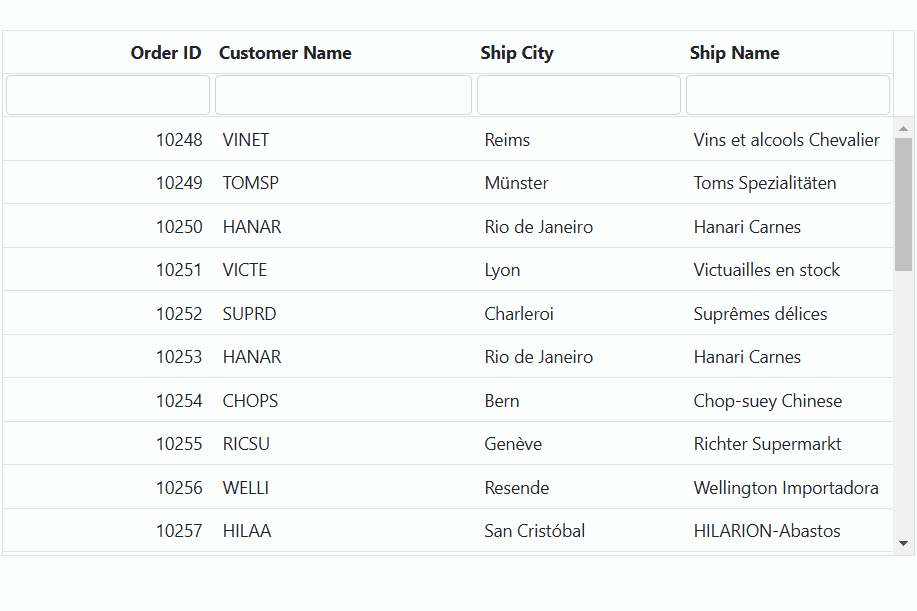

# Filtering in ASP.NET MVC Grid component

Filtering is a powerful feature in the Syncfusion Grid component that enables you to selectively view data based on specific criteria. It allows you to narrow down large datasets and focus on the information you need, thereby enhancing data analysis and decision-making.

To enable filtering in the Grid, you need to set the [AllowFiltering](https://help.syncfusion.com/cr/aspnetmvc-js2/syncfusion.ej2.grids.grid.html#Syncfusion_EJ2_Grids_Grid_AllowFiltering) property of the Grid component to true. Once filtering is enabled, you can configure various filtering options through the [FilterSettings](https://help.syncfusion.com/cr/aspnetmvc-js2/syncfusion.ej2.grids.grid.html#Syncfusion_EJ2_Grids_Grid_FilterSettings) property of the Grid component. This property allows you to define the behavior and appearance of the filter.

Here is an example that demonstrates the default filtering feature of the grid:











> * You can apply and clear filtering, by using `filterByColumn` and `clearFiltering` methods.
> * To disable Filtering for a particular column, by specifying `Columns.AllowFiltering` to false.

## Initial filter

To apply an initial filter, you need to specify the filter criteria using the `predicate` object in [FilterSettings.Columns](https://help.syncfusion.com/cr/aspnetmvc-js2/Syncfusion.EJ2.Grids.GridFilterSettings.html#Syncfusion_EJ2_Grids_GridFilterSettings_Columns). The `predicate` object represents the filtering condition and contains properties such as field, operator, and value.

Here is an example of how to configure the initial filter using the `predicate` object:











### Initial filter with multiple values for same column

In the Syncfusion ASP.NET MVC Grid, you can establish an initial filter containing multiple values for a particular column, which helps you to preset filter conditions for a specific column using multiple values. This functionality allows you to display a filtered records in the grid right after the grid is initially loaded.

To apply the filter with multiple values for same column at initial rendering, set the filter `predicate` object in [FilterSettings.Columns](https://help.syncfusion.com/cr/aspnetmvc-js2/Syncfusion.EJ2.Grids.GridFilterSettings.html#Syncfusion_EJ2_Grids_GridFilterSettings_Columns).

The following example demonstrates, how to perform an initial filter with multiple values for same **CustomerID** column using `FilterSettings.Columns` and `predicate`.











### Initial filter with multiple values for different columns 

By applying an initial filter with multiple values for different columns in the Syncfusion ASP.NET MVC Grid, you have the flexibility to set predefined filter settings for each column. This results in a filtered records of the grid right after the grid is initially loaded.

To apply the filter with multiple values for different column at initial rendering, set the filter `predicate` object in [FilterSettings.Columns](https://help.syncfusion.com/cr/aspnetmvc-js2/Syncfusion.EJ2.Grids.GridFilterSettings.html#Syncfusion_EJ2_Grids_GridFilterSettings_Columns).

The following example demonstrates how to perform an initial filter with multiple values for different **Order ID** and **Customer ID** columns using `FilterSettings.Columns` and `predicate`.











## Filter operators

The Syncfusion Grid component provides various filter operators that can be used to define filter conditions for columns. The filter operator for a column can be defined using the [Operator](https://help.syncfusion.com/cr/aspnetmvc-js2/Syncfusion.EJ2.Grids.GridFilterSettings.html#Syncfusion_EJ2_Grids_GridFilterSettings_Operators) property in the [FilterSettings.Columns](https://help.syncfusion.com/cr/aspnetmvc-js2/Syncfusion.EJ2.Grids.GridFilterSettings.html#Syncfusion_EJ2_Grids_GridFilterSettings_Columns) object.

The available operators and its supported data types are,

Operator |Description |Supported Types
-----|-----|-----
startsWith |Checks whether a value begins with the specified value. |String
endsWith |Checks whether a value ends with specified value. |String
contains |Checks whether a value contains with specified value. |String
doesnotstartwith |Checks whether the value does not begin with the specified value. |String
doesnotendwith |Checks whether the value does not end with the specified value. |String
doesnotcontain |Checks whether the value does not contain the specified value. |String
equal |Checks whether a value equal to specified value. |String &#124; Number &#124; Boolean &#124; Date
notEqual |Checks whether a value not equal to specified value. |String &#124; Number &#124; Boolean &#124; Date
greaterThan |Checks whether a value is greater than with specified value. |Number &#124; Date
greaterThanOrEqual|Checks whether a value is greater than or equal to specified value. |Number &#124; Date
lessThan |Checks whether a value is less than with specified value. |Number &#124; Date
lessThanOrEqual |Checks whether a value is less than or equal to specified value. |Number &#124; Date
isnull |Returns the values that are null. |String &#124; Number &#124; Date
isnotnull |Returns the values that are not null. |String &#124; Number &#124; Date
isempty |Returns the values that are empty. |String
isnotempty |Returns the values that are not empty. |String
between|Filter the values based on the range between the start and end specified values. |Number &#124; Date

## Wildcard and LIKE operator filter

**Wildcard** and **LIKE** filter operators filters the value based on the given string pattern, and they apply to string-type columns. But it will work slightly differently.

### Wildcard filtering

The **Wildcard** filter can process one or more search patterns using the "*" symbol, retrieving values matching the specified patterns.

* The **Wildcard** filter option is supported for the DataGrid that has all search options.

**For example:**

Operator |Description
-----|-----
a*b |Everything that starts with "a" and ends with "b".
a* |Everything that starts with "a".
*b |Everything that ends with "b".
*a* |Everything that has an "a" in it.
*a*b* |Everything that has an "a" in it, followed by anything, followed by a "b", followed by anything.


### LIKE filtering

The **LIKE** filter can process single search patterns using the "%" symbol, retrieving values matching the specified patterns. The following Grid features support LIKE filtering on string-type columns:

* Filter Menu
* Filter Bar with the [FilterSettings.ShowFilterBarOperator](https://help.syncfusion.com/cr/aspnetmvc-js2/Syncfusion.EJ2.Grids.GridFilterSettings.html#Syncfusion_EJ2_Grids_GridFilterSettings_ShowFilterBarOperator) property enabled on the Grid [filterSettings](https://help.syncfusion.com/cr/aspnetmvc-js2/Syncfusion.EJ2.Grids.Grid.html#Syncfusion_EJ2_Grids_Grid_FilterSettings).
* Custom Filter of Excel filter type.

**For example:**

Operator |Description
-----|-----
%ab% |Returns all the value that are contains "ab" character.
ab% |Returns all the value that are ends with "ab" character.
%ab |Returns all the value that are starts with "ab" character.


>By default, the Syncfusion ASP.NET MVC Grid uses different filter operators for different column types. The default filter operator for string type columns is **startsWith**, for numerical type columns is **equal**, and for boolean type columns is also **equal**.

## Diacritics filter

The diacritics filter feature in the Syncfusion ASP.NET MVC Grid is useful when working with text data that includes accented characters (diacritic characters). By default, the grid ignores these characters during filtering. However, if you need to consider diacritic characters in your filtering process, you can enable this feature by setting the [FilterSettings.IgnoreAccent](https://help.syncfusion.com/cr/aspnetmvc-js2/Syncfusion.EJ2.Grids.GridFilterSettings.html#Syncfusion_EJ2_Grids_GridFilterSettings_IgnoreAccent) property to true using the [FilterSettings](https://help.syncfusion.com/cr/aspnetmvc-js2/Syncfusion.EJ2.Grids.Grid.html#Syncfusion_EJ2_Grids_Grid_FilterSettings).

Consider the following sample where the `ignoreAccent` property is set to true in order to include diacritic characters in the filtering process:











## Filtering with case sensitivity

The Syncfusion ASP.NET MVC Grid provides the flexibility to enable or disable case sensitivity during filtering. This feature is useful when you want to control whether filtering operations should consider the case of characters. It can be achieved by using the  [EnableCaseSensitivity](https://help.syncfusion.com/cr/aspnetmvc-js2/Syncfusion.EJ2.Grids.GridFilterSettings.html#Syncfusion_EJ2_Grids_GridFilterSettings_EnableCaseSensitivity) property within the [FilterSettings](https://help.syncfusion.com/cr/aspnetmvc-js2/Syncfusion.EJ2.Grids.Grid.html#Syncfusion_EJ2_Grids_Grid_FilterSettings) of the grid.

Below is an example code demonstrating how to enable or disable case sensitivity while filtering:













## Enable different filter for a column

The Syncfusion ASP.NET MVC Grid offers the flexibility to customize filtering behavior for different columns by enabling various types of filters such as **Menu**, **Excel**, **Checkbox**. This feature allows you to tailor the filtering experience to suit the specific needs of each column in your grid. For example, you might prefer a menu-based filter for a category column, an Excel-like filter for a date column, and a checkbox filter for a status column. 

It can be achieved by adjusting the `column.filter.type` property based on your requirements.

Here's an example where the menu filter is enabled by default for all columns, but you can dynamically modify the filter types through a dropdown:











## Change default filter operator for particular column

The Syncfusion Grid component provides the flexibility to change the default filter operator for a particular column. By default, the filter operator for string-type columns is **startsWith**, for numerical-type columns is **equal**, and for boolean-type columns is also **equal**. However, you may need to customize the filter operator to better match the nature of the data in a specific column. This can be achieved using the operator property within the [FilterSettings](https://help.syncfusion.com/cr/aspnetmvc-js2/Syncfusion.EJ2.Grids.Grid.html#Syncfusion_EJ2_Grids_Grid_FilterSettings) configuration.

Here's an example that demonstrates how to change the default filter operator column :











## Filter grid programmatically with single and multiple values using method 

Programmatic filtering in the Syncfusion ASP.NET MVC Grid with single and multiple values allows you to apply filters to specific columns in the grid without relying on interactions through the interface.

This can be achieved by utilizing the `filterByColumn` method of the Grid.

The following example demostrates, how to programmatically filter the Grid using single and multiple values for the **OrderID** and **CustomerID** columns. This is accomplished by calling the `filterByColumn` method within an external button click function.











## How to get filtered records

Retrieving filtered records in the Syncfusion ASP.NET MVC Grid is essential when you want to work with data that matches the currently applied filters. You can achieve this using available methods and properties in the grid component.

**1.Using the getFilteredRecords() method**

The `getFilteredRecords` method is used to obtain an array of records that match the currently applied filters on the grid.

This method retrieves an array of records that match the currently applied filters on the grid.

Here's an example of how to get the filtering data in a Syncfusion grid using the `getFilteredRecords` method:











**2.Using the properties in the FilterEventArgs object**

Alternatively, you can use the properties available in the `FilterEventArgs` object to obtain the filter record details.

* `columns`: This property returns the collection of filtered columns.

* `currentFilterObject`: This property returns the object that is currently filtered.

* `currentFilteringColumn`: This property returns the column name that is currently filtered.

To access these properties, you can use the [ActionComplete](https://help.syncfusion.com/cr/aspnetmvc-js2/Syncfusion.EJ2.Grids.Grid.html#Syncfusion_EJ2_Grids_Grid_ActionComplete) event handler as shown below:

```typescript
actionComplete(args) {
    var column = args.columns;
    var object = args.currentFilterObject;
    var name = args.currentFilteringColumn;
}
```

## Clear filtering using methods

The Syncfusion Grid provides a method called `clearFiltering` to clear the filtering applied to the grid. This method is used to remove the filter conditions and reset the grid to its original state. 

Here's an example of how to clear the filtering in a Syncfusion grid using the `clearFiltering` method:











## Filtering events

Filtering events allow you to customize the behavior of the grid when filtering is applied. You can prevent filtering for specific columns, show messages to users, or perform other actions to suit your application's needs.

To implement filtering events in the Syncfusion ASP.NET MVC Grid, you can utilize the available events such as [ActionBegin](https://help.syncfusion.com/cr/aspnetmvc-js2/Syncfusion.EJ2.Grids.Grid.html#Syncfusion_EJ2_Grids_Grid_ActionBegin) and [ActionComplete](https://help.syncfusion.com/cr/aspnetmvc-js2/Syncfusion.EJ2.Grids.Grid.html#Syncfusion_EJ2_Grids_Grid_ActionComplete). These events allow you to intervene in the filtering process and customize it as needed.

In the given example, the filtering is prevented for **ShipCity** column during `ActionBegin` event.












## See Also

* [Customizing Filter Dialog by using an additional parameter](../how-to/add-params-for-filtering)
* [Hide sorting options on Excel filter Dialog](../how-to/hide-sorting-in-excel-filter)