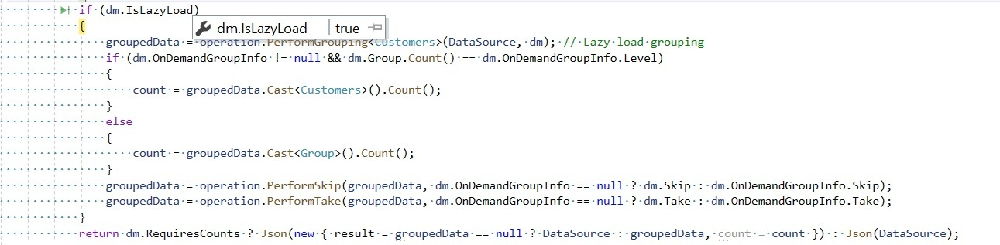
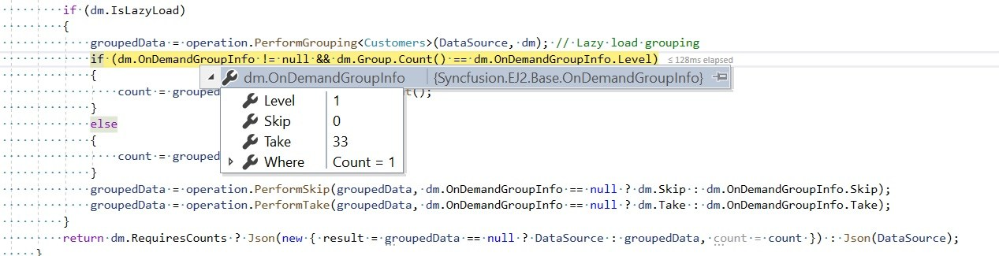

# Lazy Load Grouping in ASP.NET MVC Grid Component

The lazy load grouping allows you to load grouped records to the Grid through the on-demand concept. So, you can use this feature to load a huge amount of grouped data to the Grid without any performance degradation.

When you enable this feature, the Grid will render only the initial level caption rows in the collapsed state at grouping. The child rows of each caption will be fetched from the server and render in the Grid when you expand the caption row. The fetching child records count will be implicitly determined by the content area occupying rows count. So, if the child records exceed the count, then the Grid will request the server again to fetch the next block of child records on scrolling.

The caption row expand/collapse state will be persisted on paging and Grid pages count will be determined based on the caption rows count instead of the child rows.

To enable this feature, you have to set the [`groupSettings.enableLazyLoading`](https://help.syncfusion.com/cr/aspnetcore-js2/Syncfusion.EJ2.Grids.GridGroupSettings.html#Syncfusion_EJ2_Grids_GridGroupSettings_EnableLazyLoading) property as **true**.

























## Handling the lazy load grouping at server-side

You can use the `UrlAdaptor` of `DataManager` when binding the remote data. Along with the default server request, this feature will additionally send the below details to handle the lazy load grouping. In the server end, these details are bound with the `IsLazyLoad` and `OnDemandGroupInfo` parameters in the `DataManagerRequest` model. Please refer to the below table and screenshots.

|Property Name |Description|
|-----|-----|
|`isLazyLoad` |To differentiate the default grouping and lazy load grouping|
|`onDemandGroupInfo` |Have the details of expanded caption row grouping `level`, `skip`, `take` and `filter` query of the child records|





The following code example describes the lazy load grouping handled at the server-side with other the grid actions.

```typescript
public IActionResult UrlDatasource([FromBody] DataManagerRequest dm)
{
    IEnumerable groupedData = null;
    IEnumerable<Customers> DataSource = customers;
    DataOperations operation = new DataOperations();

    if (dm.Search != null && dm.Search.Count > 0)
    {
        DataSource = operation.PerformSearching(DataSource, dm.Search);  //Search
    }
    if (dm.Sorted != null && dm.Sorted.Count > 0) //Sorting
    {
        DataSource = operation.PerformSorting(DataSource, dm.Sorted);
    }
    if (dm.Where != null && dm.Where.Count > 0) //Filtering
    {
        DataSource = operation.PerformFiltering(DataSource, dm.Where, dm.Where[0].Operator);
    }
    int count = DataSource.Cast<Customers>().Count();
    if (dm.IsLazyLoad == false && dm.Skip != 0)
    {
        DataSource = operation.PerformSkip(DataSource, dm.Skip); // Paging
    }
    if (dm.IsLazyLoad == false && dm.Take != 0)
    {
        DataSource = operation.PerformTake(DataSource, dm.Take);
    }
    if (dm.IsLazyLoad)
    {
        groupedData = operation.PerformGrouping<Customers>(DataSource, dm); // Lazy load grouping
        if (dm.OnDemandGroupInfo != null && dm.Group.Count() == dm.OnDemandGroupInfo.Level)
        {
            count = groupedData.Cast<Customers>().Count();
        }
        else
        {
            count = groupedData.Cast<Group>().Count();
        }
        groupedData = operation.PerformSkip(groupedData, dm.OnDemandGroupInfo == null ? dm.Skip : dm.OnDemandGroupInfo.Skip);
        groupedData = operation.PerformTake(groupedData, dm.OnDemandGroupInfo == null ? dm.Take : dm.OnDemandGroupInfo.Take);
    }
return dm.RequiresCounts ? Json(new { result = groupedData == null ? DataSource : groupedData, count = count }) : Json(DataSource);
}

```

## Lazy load grouping with infinite scrolling

Infinite scrolling loads a huge amount of data without degrading the Grid's performance. By default, infinite scrolling is enabled only for expanded grouped rows when lazy loading is enabled. Now, the Grid has an option to enable infinite scrolling for group caption rows. This is achieved by setting the [enableInfiniteScrolling](../../api/grid/#enableinfinitescrolling) property as true when lazy loading is enabled in the grouped records.

This is demonstrated in the following sample:

























> The Grid also supports the lazy load grouping with virtualization(virtual scrolling).

## Limitations for lazy load grouping

* Due to the element height limitation in browsers, the maximum number of records loaded by the grid is limited due to the browser capability.
* DataManager's `UrlAdaptor` and `JsonAdaptor` only have the built-in lazy load grouping support.
* Lazy load grouping is not compatible with virtual scroll, infinite scroll and batch editing, row template etc.
* Programmatic selection is not supported.