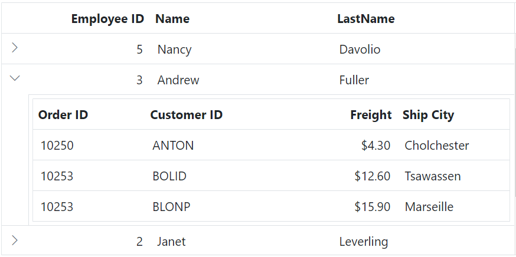
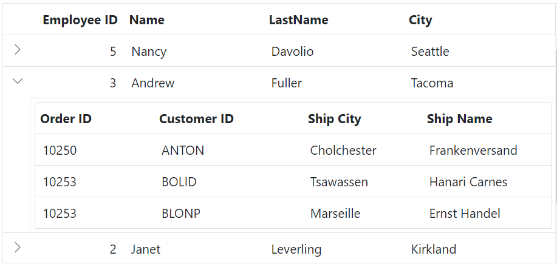
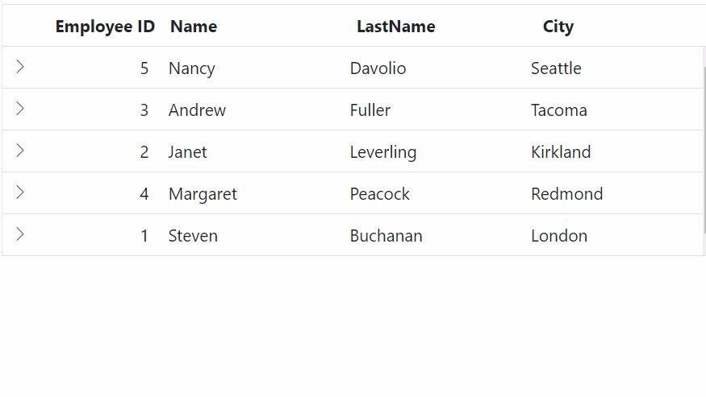
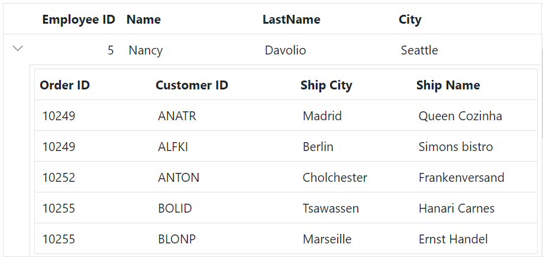
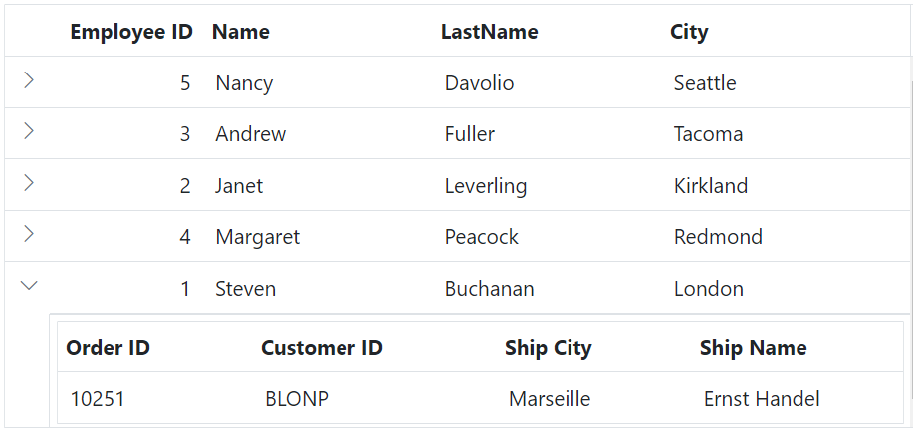
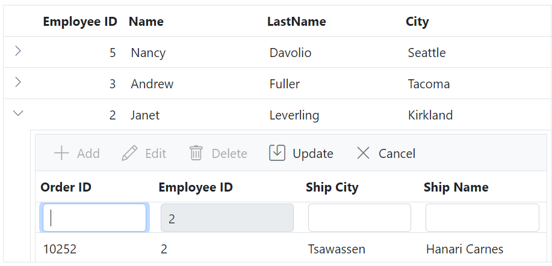
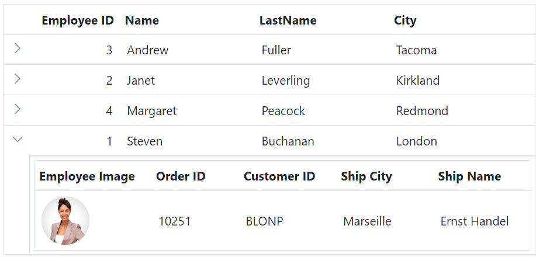
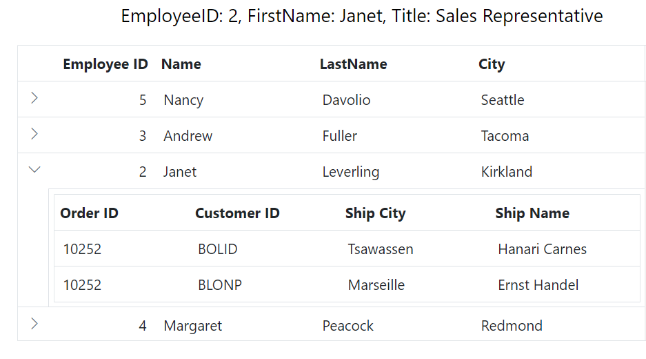
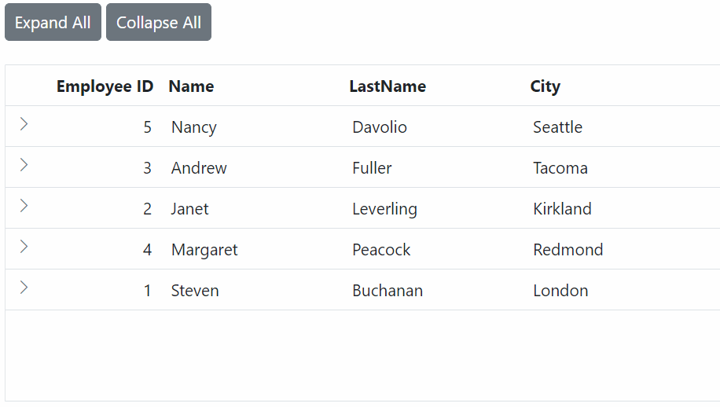

# Hierarchy grid in ASP.NET MVC Grid component

The Hierarchy Grid in an ASP.NET MVC Grid component is typically used when you need to display hierarchical data in a tabular format with expandable and collapsible rows. It allows you to represent parent and child relationships within the grid, making it easier for you to navigate and understand the data.

This feature can be enabled by utilizing the [childGrid](https://help.syncfusion.com/cr/aspnetmvc-js2/Syncfusion.EJ2.Grids.Grid.html#Syncfusion_EJ2_Grids_Grid_ChildGrid) and [childGrid.queryString](https://help.syncfusion.com/cr/aspnetmvc-js2/Syncfusion.EJ2.Grids.Grid.html#Syncfusion_EJ2_Grids_Grid_QueryString) properties of the grid component.

To enable the Hierarchy Grid feature:

1. Define the `childGrid` property within the Grid component configuration. This property describes the options of the child grid.

2. Specify the `childGrid.queryString` property to establish the relation between the parent and child grids and visualizes the data in a hierarchical structure. This property determines how the child records are fetched based on the parent record.

The following example demonstrates how to enable the hierarchy feature in the grid










## Bind hierarchy grid with different field

By default, the parent and child grids have the same field name to map and render a hierarchical grid. However, the component supports establishing a parent-child relationship between grids with different field names. This feature is beneficial when you want to create a parent-child relationship between grids but need to use distinct field names for mapping the data. As a result, you can easily establish the desired relationship between the parent and child grids, even with different field names for data mapping.

By default, the parent and child grid relation is maintained using the [queryString](https://help.syncfusion.com/cr/aspnetmvc-js2/Syncfusion.EJ2.Grids.Grid.html#Syncfusion_EJ2_Grids_Grid_QueryString) property, which requires the same field name for both grids. However, to achieve the parent and child relation with different fields, you need to modify the mapping value in the [load](https://help.syncfusion.com/cr/aspnetmvc-js2/Syncfusion.EJ2.Grids.Grid.html#Syncfusion_EJ2_Grids_Grid_Load) event of child grid. 

In the following example, the `load` event is utilized to customize the mapping value for the child grid. By accessing the `parentDetails` property and its **parentKeyFieldValue**, you can set the desired mapping value. The `parentRowData` property contains the data of the parent row, and by using the **EmployeeID** field name, you can extract the corresponding value from the parent row data.










> Make sure to adjust the field name according to your specific scenario.

## Expand child grid initially

Expanding the child grid initially in the Syncfusion ASP.NET MVC Grid component is helpful when you want to display the child rows of the hierarchical grid expanded by default upon grid load. This can be beneficial in scenarios where you want to provide immediate visibility into the hierarchical data without requiring you to manually expand each child row.

To achieve this, you can use the `expand` method with the desired target index (number) in the [dataBound](https://help.syncfusion.com/cr/aspnetmvc-js2/Syncfusion.EJ2.Grids.Grid.html#Syncfusion_EJ2_Grids_Grid_DataBound) event of the grid. 

In the provided example, expand the third record of the grid by utilizing the `expand` method within the `dataBound` event.










## Dynamically load child grid data

Dynamically load child grid data in Syncfusion ASP.NET MVC Grid helps improve performance, optimize data transmission, and enhance the your experience by providing on-demand access to relevant information. Additionally, it offers flexibility in data presentation, which helps improve the overall efficiency of your application.

To dynamically load the `dataSource` of a child grid in the Grid, you can utilize the [load](https://help.syncfusion.com/cr/aspnetmvc-js2/Syncfusion.EJ2.Grids.Grid.html#Syncfusion_EJ2_Grids_Grid_Load) event of parent grid. This event allows you to customize the loading behavior of the child grid based on the data of parent grid.

The following example demonstrates how to dynamically load child grid data using the `load` event.










## Dynamically bind data to child grid based on parent row data

Dynamically binding data to a child grid based on the parent row data in the Syncfusion ASP.NET MVC Grid component is useful when you want to display child grid data that is specific to each parent row. This feature allows for a dynamic and contextual representation of data within the child grid.

To dynamically bind data to the child grid based on the parent row data instead of using the [queryString](https://help.syncfusion.com/cr/aspnetmvc-js2/Syncfusion.EJ2.Grids.Grid.html#Syncfusion_EJ2_Grids_Grid_QueryString) property, you can utilize the [detailDataBound](https://help.syncfusion.com/cr/aspnetmvc-js2/Syncfusion.EJ2.Grids.Grid.html#Syncfusion_EJ2_Grids_Grid_DetailDataBound) event of the grid. This event is triggered when expanding the child grid.

In the `detailDataBound` event handler, you can filter the child grid's dataSource based on the **EmployeeID** column value of the parent row data. This can be achieved by using the `DataManager` plugin and applying a filter to the child grid's dataSource. The filtered data can be assigned as the new dataSource for the child grid. This can be demonstrated by the following sample.










## Adding record in child grid

Adding a record in a child grid within the Syncfusion ASP.NET MVC Grid component is useful when you want to provide the ability to add new records to the child grid. This feature allows you to input and save additional data specific to each parent row.

To maintain the parent-child relationship in the Grid when adding a record to the child grid, you need to set the value for the `queryString` in the added data. This can be done using the [actionBegin](https://help.syncfusion.com/cr/aspnetmvc-js2/Syncfusion.EJ2.Grids.Grid.html#Syncfusion_EJ2_Grids_Grid_ActionBegin) event.

In the following example, the parent and child grids are related by the **EmployeeID** field. To add a new record in the child grid, the **EmployeeID** field needs to be set with the value of the parent record's `queryString` in the `actionBegin` event. 










## Template column in child grid

A template column in a child grid within the Syncfusion ASP.NET MVC Grid component is valuable when you want to customize the appearance and functionality of specific columns in the child grid. It is useful for incorporating interactive elements, custom formatting, or complex data representation within specific columns of the child grid.

To achieve this, you can utilize the `template` property of a column to display a custom element instead of a field value in the Grid.

The following example demonstrates, how to show a custom image in the **Employee Image** column of the child grid by utilizing the `template` property of the column.










## How to get parent detail in child grid

Getting parent details in a child grid in an ASP.NET MVC Grid component is useful when you want to display and utilize information from the parent row within the child grid. This can be beneficial in scenarios where you need to provide additional context or perform calculations based on the parent row's data

To achieve this, you can utilize the [created](https://help.syncfusion.com/cr/aspnetmvc-js2/Syncfusion.EJ2.Grids.Grid.html#Syncfusion_EJ2_Grids_Grid_Created) event. This event is triggered when the child grid is created and can be used to handle the child grid.

The following example demonstrates how to obtain parent details in a child grid using the `created` event. Within the `created` event, you can access the parent row data using `this.parentDetails.parentRowData` and display the desired details in the message.










## Expand all by external button

The Hierarchy Grid in the Syncfusion ASP.NET MVC Grid component allows you to expand all child grid rows using an external button. This feature provides you with a convenient overview of all the hierarchical data within the grid, eliminating the need to manually expand each row individually.

By default, Grid renders all child grid rows in collapsed state. To expand all child grid rows in the Grid using an external button, you can utilize the `expandAll` method provided by the DetailRow module. Similarly, to collapse all grid rows, you can use the `collapseAll` method. 

The following example demonstrates how to expand and collapse the hierarchy grid using an external button click function.










