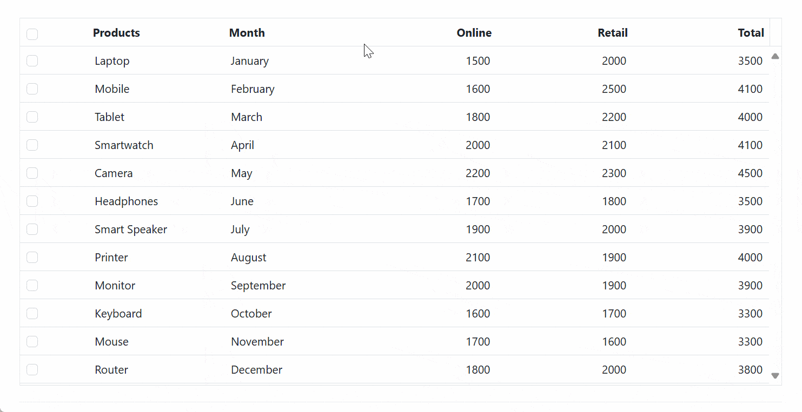
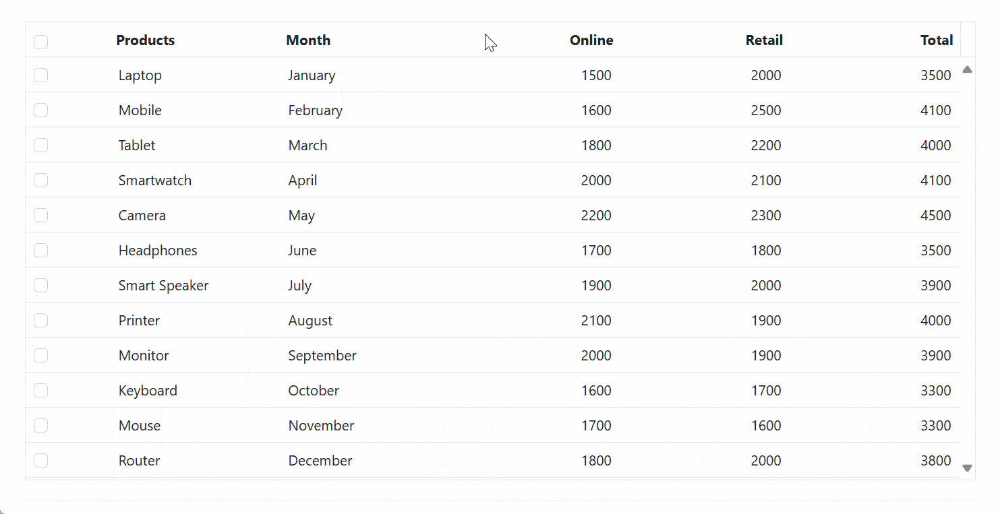

# Integrate Chart in Syncfusion ASP.NET MVC Grid

The Grid and Chart Integration feature in Syncfusion allows users to visualize tabular data in a graphical format by linking the Grid with the Chart.This feature allows seamless integration with Charts to visualize selected data interactively. You can generate various Chart types such as bar, line, or pie directly from Grid data using the [ContextMenu](https://ej2.syncfusion.com/aspnetmvc/documentation/grid/context-menu) feature. This feature is particularly useful in scenarios where tabular data can be better understood through graphical representation.

This feature is particularly useful in dashboards, reporting tools, and data-driven applications where both tabular and visual representations of data are required.

## Steps for Chart integration

To integrate Charts into your Grid, follow these steps:

### Create ASP.NET MVC application with HTML helper

* [Create a Project using Microsoft Templates](https://learn.microsoft.com/en-us/aspnet/mvc/overview/getting-started/introduction/getting-started#create-your-first-app)

* [Create a Project using Syncfusion ASP.NET MVC Extension](https://ej2.syncfusion.com/aspnetmvc/documentation/getting-started/project-template)

### Install ASP.NET MVC package in the application

To add `ASP.NET MVC` controls in the application, open the NuGet package manager in Visual Studio (Tools → NuGet Package Manager → Manage NuGet Packages for Solution), search for [Syncfusion.EJ2.MVC5](https://www.nuget.org/packages/Syncfusion.EJ2.MVC5) and then install it.




Install-Package Syncfusion.EJ2.MVC5 -Version {{ site.ej2version }}




N> Syncfusion ASP.NET MVC controls are available in [nuget.org.](https://www.nuget.org/packages?q=syncfusion.EJ2) Refer to [NuGet packages topic](https://ej2.syncfusion.com/aspnetmvc/documentation/nuget-packages) to learn more about installing NuGet packages in various OS environments. The Syncfusion.EJ2.MVC5 NuGet package has dependencies, [Newtonsoft.Json](https://www.nuget.org/packages/Newtonsoft.Json/) for JSON serialization and [Syncfusion.Licensing](https://www.nuget.org/packages/Syncfusion.Licensing/) for validating Syncfusion license key.

### Add namespace

Add **Syncfusion.EJ2** namespace reference in `Web.config` under `Views` folder.

```
<namespaces>
    <add namespace="Syncfusion.EJ2"/>
</namespaces>
```

### Add stylesheet and script resources

Here, the theme and script is referred using CDN inside the `<head>` of `~/Pages/Shared/_Layout.cshtml` file as follows,




<head>
    ...
    <!-- Syncfusion ASP.NET MVC controls styles -->
    <link rel="stylesheet" href="https://cdn.syncfusion.com/ej2/{{ site.ej2version }}/fluent.css" />
    <!-- Syncfusion ASP.NET MVC controls scripts -->
    <script src="https://cdn.syncfusion.com/ej2/{{ site.ej2version }}/dist/ej2.min.js"></script>
</head>




N> Checkout the [Themes topic](https://ej2.syncfusion.com/aspnetmvc/documentation/appearance/theme) to learn different ways (CDN, NPM package, and [CRG](https://ej2.syncfusion.com/aspnetmvc/documentation/common/custom-resource-generator)) to refer styles in ASP.NET MVC application, and to have the expected appearance for Syncfusion ASP.NET MVC controls. Checkout the [Adding Script Reference](https://ej2.syncfusion.com/aspnetmvc/documentation/common/adding-script-references) topic to learn different approaches for adding script references in your ASP.NET MVC application.

### Register Syncfusion script manager

Also, register the script manager `EJS().ScriptManager()` at the end of `<body>` in the `~/Pages/Shared/_Layout.cshtml` file as follows.




<body>
...
    <!-- Syncfusion ASP.NET MVC Script Manager -->
    @Html.EJS().ScriptManager()
</body>




### Chart integration via Context Menu in Grid

This section explains how to dynamically render Charts based on user interactions within the Syncfusion ASP.NET MVC Grid using the context menu. Users can **right-click** on selected rows and choose from various Chart types such as bar, pie, line Charts etc to visualize the data instantly. This feature enhances interactivity and provides a seamless analytical experience.

For example, in a sales dashboard, you can select sales records for specific products and instantly view a comparative bar or pie Chart illustrating online sales versus retail sales or revenue trends over several month. This functionality helps improve decision-making by providing immediate visual feedback.

Steps to be followed to integrate Chart into Grid via Context Menu:

**Step 1: Define Chart options to Grid Context Menu:**

Add Chart visualization options as context menu items within the Grid configuration using [ContextMenuItems](https://help.syncfusion.com/cr/aspnetmvc-js2/Syncfusion.EJ2.Grids.Grid.html#Syncfusion_EJ2_Grids_Grid_ContextMenuItems) property. These items allow  you to right-click on selected rows and choose a Chart type to visualize the data.

```cs

@Html.EJS().Grid("Grid").DataSource((IEnumerable<object>)ViewBag.dataSource).Height(418).Columns(col =>
{

}).ContextMenuItems(new List<object>() { 
    "Bar", "StackingBar", "StackingBar100", "Pie", 
    "Column", "StackingColumn", "StackingColumn100", 
    "Line", "StackingLine", "StackingLine100", "Area", 
    "StackingArea", "StackingArea100", "Scatter" 
}).Render()

```

**Step 2: Initialize GridChart instance on Grid creation:**

Inside the Grid’s [Created](https://help.syncfusion.com/cr/aspnetmvc-js2/Syncfusion.EJ2.Grids.Grid.html#Syncfusion_EJ2_Grids_Grid_Created) event, instantiate a **GridChart** object. This instance will be used to render Charts dynamically based on the selected Grid data.

```cs

function created() {
  var grid = document.getElementById("Grid").ej2_instances[0];
  gridChart = new ej.gridchart.GridChart({
    enablePropertyPanel: true,
    enableRtl: grid.enableRtl,
    allowExport: true,
    locale: grid.locale,
    updateChartSettings: updateChartSettings
  });
}

```
This ensures that the Chart instance is ready as soon as the Grid is initialized, allowing seamless interaction through the context menu.

**Step 3: Handle context menu click to render Chart:**

Use the [ContextMenuClick](https://help.syncfusion.com/cr/aspnetmvc-js2/Syncfusion.EJ2.Grids.Grid.html#Syncfusion_EJ2_Grids_Grid_ContextMenuClick) event to detect which Chart type was selected and render the Chart accordingly using the `gridChart.render()` method.

`ContextMenuClick` event passes the below arguments:

  * `args.chartType:` The selected Chart type.

  * `args.gridInstance:` The current Grid instance.

  * `args.records:` The selected data records to be visualized in the Chart.

* Use the `gridChart.render` to render the Chart. It accepts three arguments discussed below:

  * `chartArgs`: Contains Grid instance, [Chart type](https://ej2.syncfusion.com/aspnetmvc/documentation/chart/chart-types), and selected records.

  * `chartModel:` This specifies various Chart configurations related to the appearance and behavior of the Chart. The model allows you to configure axes, labels, legends, tooltips, and other Chart attributes. Refer to Syncfusion's Chart Model for detailed configurations, options, and customization possibilities.

  * `categorySeries:` This specifies the fields in your data used for [categories](https://ej2.syncfusion.com/aspnetmvc/documentation/chart/category-axis) and [series](https://ej2.syncfusion.com/aspnetmvc/documentation/chart/chart-series) in the Chart.

    * Category fields: Define the grouping axis.
    * Series fields: Define the actual values plotted on the Chart.


```cs

function contextMenuClick(args) 
{
  // Check if the Chart type is defined in the clicked context menu item.
  if (args.chartType) 
  {
    // Prepare the Chart arguments including the Grid instance, Chart type, and records to plot.
    const chartArgs = {
      gridInstance: (args.gridInstance),
      chartType: args.chartType,
      records: (args.records),
    };

    // Set up the Chart model configurations.
    const chartModel = {
      primaryXAxis: {
        valueType: 'Category',
        labelRotation: 315,
      }   
    };

    // Combine both Chart models into a single model for rendering.
    const model = {
      chart: chartModel,
      accumulationChart: {}
    };

    // Determine fields for category and series data in the Chart.
    const categorySeries = {
      category: ['Product', 'Month'],
      series: ['Online', 'Retail']
    };

    // Render the Chart using the configured arguments and models.
    // The render function uses the defined chartArgs, model, and categorySeries to display the Chart.
    gridChart.render(chartArgs, model, categorySeries);
  }
}

```

The following complete example demonstrates how to integrate Charts into a Grid context menu using the `ContextMenuClick` event with `gridChart.render` method:












## Enable export functionality in GridChart

The export functionality in GridChart allows Charts to be saved or shared externally in various formats. This is particularly useful for preserving visualized data or including Charts in reports and presentations.

To enable this feature, set the `allowExport` property to true when creating the **GridChart** instance. Once enabled, an export option appears in the Chart popup toolbar, allowing the Chart to be exported in various formats such as PDF, CSV, Print, JPEG, XLSX, SVG, and PNG.

The following code snippet demonstrates how to enable export functionality in **GridChart**:

```cs

gridChart = new ej.gridchart.GridChart({
  allowExport: true
});

```

## Enable property panel in GridChart

The property panel in GridChart provides a built-in interface to modify Chart settings dynamically at runtime. By default, the property panel is disabled. To enable it, set the `enablePropertyPanel` option to true during the instantiation of the **GridChart** object. Here’s how to do it:

```cs

gridChart = new ej.gridchart.GridChart({
  enablePropertyPanel: true
});

```

When enabled, the property panel appears alongside the Chart popup and offers three main configuration sections:

* **Chart Types:** Choose from a variety of Chart types, including Column, Line, Pie, and others.

* **Chart Data:** Configure the category axis and series fields for data visualization.

* **Formatting Options:** Adjust styling properties such as Chart style, title style, legend appearance, series settings, and axes formatting.

  * **Chart Style:** 

    * **Margin :** Adjust the [margins](https://help.syncfusion.com/cr/aspnetmvc-js2/Syncfusion.EJ2.Charts.ChartMargin.html#properties) around the Chart (top, bottom, left, right) for better layout spacing.
    * **Color**: Set distinct colors for different Chart elements to improve visual clarity.

  * **Title Style** 

    * **Legend** - Toggle the visibility of the legend and customize its font, size, color, and position.
    * **Series** - Enable/disable tooltips and customize [Series](https://help.syncfusion.com/cr/aspnetmvc-js2/Syncfusion.EJ2.Charts.ChartSeries.html) color and data labels based on categories such as online, retail, or revenue.

  * **Axes:** - Select axes as either category or value type, and customize:

    * Reverse Order to change the data sequence.
    * **Title:** Adjust text, font, size, color, and rotation.
    * **Label:** Modify text, font, size, color, and rotation for better label presentation.

**customize the Chart model:**   

You can customize the [Chart](https://ej2.syncfusion.com/aspnetmvc/documentation/chart/getting-started) by defining a `chartModel` object in the `chart` property of the `model` object within the [ContextMenuClick](https://help.syncfusion.com/cr/aspnetmvc/Syncfusion.EJ2.Grids.Grid.html#Syncfusion_EJ2_Grids_Grid_ContextMenuClick) event .This allows you to configure various Chart properties such as axes, margins, tooltips, titles, and more. Additionally, you can use the [events](https://help.syncfusion.com/cr/aspnetmvc-js2/Syncfusion.EJ2.Charts.Chart.html#properties) of the Chart within the `chartModel` configuration to apply further customizations when the Chart is rendered. 

To customize [Accumulation Charts](https://ej2.syncfusion.com/aspnetmvc/documentation/accumulation-chart/getting-started) (such as Pie), use the `accumulationChart` property of the `model` object. This property allows you to configure Chart options like titles, legends, data labels, and visual styles tailored for accumulation-type visualizations.  You can also use Accumulation Chart [events](https://help.syncfusion.com/cr/aspnetmvc-js2/Syncfusion.EJ2.Charts.AccumulationChart.html#properties) to apply additional customizations when the Chart is rendered.

The following code snippets demonstrate how to achieve this:

```cs

function contextMenuClick(args) {
  if (args.chartType) {
    const chartModel = {
      primaryXAxis: {
      valueType: 'Category',
      labelRotation: 315,
      },
      margin: {
        top: 20,
        bottom: 20,
        right: 20,
        left: 20
      },
      tooltip: {
        enable: true,
        textStyle: {
          size: '16px',
          fontFamily: 'Arial, Helvetica, sans-serif'
        }
      },
      title: 'Sales Data',
      titleStyle: {
        size: '24px',
        fontFamily: 'Arial, Helvetica, sans-serif',
        fontWeight: 'Bold'
      },
      subTitle: 'Sales data for various products over the months',
      load: (args) => {
        if (args.chart.titleStyle) {
          args.chart.titleStyle.color = '#1976d2';
        }
      }
    };
    const accumulationChartModel= {
      title :'Sales Distribution'
    };
    const model = {
      chart: chartModel,
      accumulationChart: accumulationChartModel
    };
  }
}

```

You can also programmatically update the Chart’s appearance using the `updateChartSettings` event provided by the **GridChart** integration. This event is triggered when you modify Chart properties through the Chart popup’s property panel. This is useful for applying custom themes, adjusting axis settings, or modifying series styles.

The following code snippet demonstrates how to dynamically customize chart margins and restrict their values to a minimum of 20 using the `updateChartSettings` event.

```cs

function created() {
  var grid = document.getElementById("Grid").ej2_instances[0];
  gridChart = new ej.gridchart.GridChart({
    enablePropertyPanel: true,
    enableRtl: grid.enableRtl,
    allowExport: true,
    locale: grid.locale,
    updateChartSettings: updateChartSettings
  });
}

function updateChartSettings(args) {
  const chart = args.changes?.chart;
  if (!chart) return;

  // Restrict margin values to minimum 20.
  const margin = chart.margin;
  if (margin) {
    if (margin.top < 20) margin.top = 20;
    if (margin.bottom < 20) margin.bottom = 20;
    if (margin.left < 20) margin.left = 20;
    if (margin.right < 20) margin.right = 20;
  }
}

```

The following complete example demonstrates how to enable the property panel by setting `enablePropertyPanel` to **true**, customize the chart using the `chartModel` within `ContextMenuClick` event, and dynamically control or customize the behavior of the `updateChartSettings` event.










