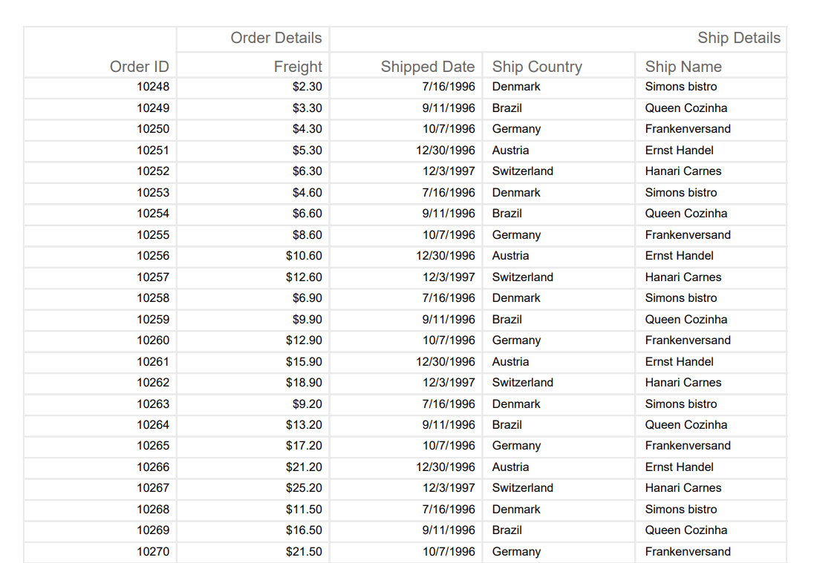

# Pdf Export Options in ASP.NET MVC Grid component

The Syncfusion ASP.NET MVC Grid component allows you to customize the PDF export options functionality. This flexibility enables you to have greater component over the exported content and layout to meet your specific requirements.

The PDF export action can be customized based on your requirements using the `PdfExportProperties` property. By using the `PdfExportProperties` property, you can export the current page records, selected records, or filtered records. Additionally, you can customize the page alignments using the `PdfExportProperties` property.

## Export current page records

Exporting the current page in Syncfusion ASP.NET MVC Grid to a PDF document provides the ability to export the currently displayed page records. This feature allows for generating PDF documents that specifically include the content from the current page of the grid.

To export the current page of the grid to a PDF document, you need to specify the `ExportType` property as **CurrentPage**.

The following example demonstrates how to export current page to a PDF document when a toolbar item is clicked.










## Export selected records

Exporting only the selected records from the Syncfusion ASP.NET MVC Grid allows generating PDF document that include only the desired data from the Grid. This feature provides the flexibility to export specific records that are relevant to the needs, enabling more focused and targeted PDF exports.

To export only the selected records by utilizing tthe `ExportProperties->DataSource` property in the [ToolbarClick](https://help.syncfusion.com/cr/aspnetmvc-js2/Syncfusion.EJ2.Grids.Grid.html#Syncfusion_EJ2_Grids_Grid_ToolbarClick) event. 

To export the selected records from the grid to a PDF file, you can follow these steps:

1. Handle the `ToolbarClick` event of the Grid.

2. Retrieve the selected records using the `GetSelectedRecords` method.

3. Assign the selected data to the `ExportProperties.DataSource `property.

4. Trigger the export operation using the `PdfExport` method.

The following example demonstrates how to export the selected records to a PDF document.










## Export filtered records

Exporting only the filtered records from the Syncfusion ASP.NET MVC Grid allows you to generate PDF document that include only the data that matches your applied filters. This feature is useful when you want to export a subset of data based on specific criteria.

This can be achieved by defining the filtered data in the `ExportProperties.DataSource` property before initiating the export.

To export only the filtered data from the grid to a PDF file, you can follow these steps:

1. Apply the desired filter to the grid data.

2. Get the filtered data using the `GetFilteredRecords` method.

3. Assign the filtered data to the `ExportProperties.DataSource` property.

4. Trigger the export operation using the `PdfExport` method.

The following example demonstrates how to export the filtered records to a PDF document.










## Export with hidden columns

Exporting hidden columns in the Syncfusion ASP.NET MVC Grid allows you to include hidden columns in the exported PDF document. This feature is useful when you have columns that are hidden in the UI but still need to be included in the exported document.

To export hidden columns of the grid to a PDF file, you need to set the `IncludeHiddenColumn` property as **true** in the `PdfExportProperties` property.

The following example demonstrates how to export hidden columns to a PDF file. In this example, the **ShipCity** column, which is not visible in the UI, is exported to the PDF document. You can also export the grid by changing the `PdfExportProperties.IncludeHiddenColumn` property based on the switch toggle using the `Checked` property of the [EJ2 Toggle Switch Button](https://ej2.syncfusion.com/aspnetmvc/documentation/switch/getting-started) component.










## Show or hide columns while exporting

The Syncfusion ASP.NET MVC Grid component provides the functionality to show or hide columns dynamically during the export process. This feature allows you to selectively display or hide specific columns based on your requirements.

To show or hide columns based on user interaction during the export process, you can follow these steps:

1. Handle the [ToolbarClick](https://help.syncfusion.com/cr/aspnetmvc-js2/Syncfusion.EJ2.Grids.Grid.html#Syncfusion_EJ2_Grids_Grid_ToolbarClick) event of the Grid component.

2. Update the visibility of the desired columns by setting the `Visible` property of the column to **true** or **false**.

3. Export the grid to PDF.

4. Handle the [PdfExportComplete](https://help.syncfusion.com/cr/aspnetmvc-js2/Syncfusion.EJ2.Grids.Grid.html#Syncfusion_EJ2_Grids_Grid_PdfExportComplete) event to restore the column visibility to its original state.

In the following example, the **CustomerID** is initially a hidden column in the grid. However, during the export process, the **CustomerID** column is made visible, while the **ShipCity** column is hidden.










## Show or hide columns while exporting with stacked header

The Syncfusion ASP.NET MVC Grid allows you to control the visibility of columns during export operations. This feature is particularly useful when customizing the data presented in exported files while using stacked headers.

To implement the show or hide columns feature during PDF export in the Syncfusion ASP.NET MVC Grid, follow these steps:

1. Handle the [ToolbarClick](https://help.syncfusion.com/cr/aspnetmvc-js2/Syncfusion.EJ2.Grids.Grid.html#Syncfusion_EJ2_Grids_Grid_ToolbarClick) event of the Syncfusion ASP.NET MVC Grid.

2. Update the visibility of the desired columns by setting the [Visible](https://help.syncfusion.com/cr/aspnetmvc-js2/Syncfusion.EJ2.Grids.GridColumn.html#Syncfusion_EJ2_Grids_GridColumn_Visible) property of the column to **true** or **false**.

3. Export the Syncfusion ASP.NET MVC Grid to PDF document using `PdfExport` method.

4. Handle the [PdfExportComplete](https://help.syncfusion.com/cr/aspnetmvc-js2/Syncfusion.EJ2.Grids.Grid.html#Syncfusion_EJ2_Grids_Grid_PdfExportComplete) event to restore the column visibility to its original state.

In the following example, the **ShipName** is initially a hidden column in the Syncfusion ASP.NET MVC Grid. However, during the PDF export process, the **ShipName** column is made visible, while the **OrderDate** column is hidden:










## Change page orientation

The Syncfusion ASP.NET MVC Grid component allows you to change the page orientation of the exported PDF document from the default portrait mode to landscape mode. This feature provides the flexibility to adjust the layout and presentation of the exported PDF according to your needs.

To change the page orientation to landscape for the exported document, you can set the `PageOrientation` property of the `PdfExportProperties`   property. 

The supported `PageOrientation` options are:

1. **Landscape**: Exports the grid with a landscape PDF page orientation.

2. **Portrait**: Exports the grid with a portrait PDF page orientation.

The following example demonstrates how to export the grid into PDF document by setting the `PdfExportProperties.PageOrientation` property using the `Value` property of the `DropDownList` component.










## Change page size

The Syncfusion ASP.NET MVC Grid component allows you to customize the page size of the exported PDF document according to your requirements. This feature provides the flexibility to adjust the layout and dimensions of the exported PDF to fit different paper sizes or printing needs. 

To customize the page size for the exported document, you can set the `PageSize` property of the `PdfExportProperties` property to the desired page size. 

Supported `PdfPageSize` are:
* Letter
* Note
* Legal
* A0
* A1
* A2
* A3
* A4
* A5
* A6
* A7
* A8
* A9
* B0
* B1
* B2
* B3
* B4
* B5
* Archa
* Archb
* Archc
* Archd
* Arche
* Flsa
* HalfLetter
* Letter11x17
* Ledger

The following example demonstrates how to export the grid into PDF document by setting the `PdfExportProperties.PageSize` property by using `Value` property of the `DropDownList` component.










## Define file name

The Syncfusion ASP.NET MVC Grid component allows you to specify a custom file name for the exported PDF document. This feature enables you to provide a meaningful and descriptive name for the exported file, making it easier to identify and manage the exported data.

To assign a custom file name for the exported document, you can set the `FileName` property of the `PdfExportProperties` property to the desired file name.

The following example demonstrates how to define a file name using `PdfExportProperties.FileName` property when exporting to PDF, based on the entered value as the file name.










## Enabling horizontal overflow

The Syncfusion ASP.NET MVC Grid component allows you to display all defined grid columns on a single page even when the number of columns exceeds the maximum limits for columns in the exported PDF document. This ensures that your exported PDF maintains its readability and comprehensiveness.

You can achieve this by utilizing the `PdfExportProperties.AllowHorizontalOverflow` property of the grid.

In the following example, the [EJ2 Toggle Switch Button](https://ej2.syncfusion.com/aspnetmvc/documentation/switch/getting-started) component is added to enable and disable the `PdfExportProperties.AllowHorizontalOverflow` property. Based on the switch toggle, the `PdfExportProperties.AllowHorizontalOverflow` property is updated using the `Checked` property, and the export action is performed accordingly when the toolbar is clicked.










## Customizing columns on export

The Syncfusion ASP.NET MVC Grid component allows you to customize the appearance of grid columns in your exported PDF documents. This feature empowers you to tailor specific column attributes such as field, header text, and text alignment, ensuring that your exported PDFs align perfectly with your design and reporting requirements.

To customize the grid columns, you can follow these steps:

1. Access the `PdfExportProperties.Column` of the Grid component.

2. Set the `column` object with attributes such as `Field`, `HeaderText`, and `TextAlign` to define the desired format.

3. Trigger the PDF export operation to apply the customized column settings.

The following example demonstrates how to customize the grid columns when exporting a document. In this scenario, the attributes for different columns have been customized: **OrderID** with `TextAlign` set to **Right**, **CustomerID** with `HeaderText` as **"Customer Name"**, and **Freight** with a center-aligned `TextAlign` property, which is not rendered in the grid columns.










## Font and color customization

The Syncfusion ASP.NET MVC Grid component provides the ability to customize the font in the exported PDF document. This feature allows you to component the appearance and styling of the text in the exported file, ensuring consistency with your application's design.

### Default fonts

By default, the Grid uses the **Helvetica** font in the exported document. However, you can change the default font by utilizing the `PdfExportProperties.Theme` property. The available default fonts that you can choose from are:

* Helvetica
* TimesRoman
* Courier
* Symbol
* ZapfDingbats

To change the default font, you can follow these steps:

1. Access the `PdfExportProperties` of the Grid component.

2. Set the `Theme` property to the desired default font.

3. Trigger the PDF export operation.

The following example demonstrates, how to change the default font when exporting a document.










### Add custom font

In addition to changing the default font, the Syncfusion ASP.NET MVC Grid allows you to use a custom font for the Grid header, content, and caption cells in the exported document. This can be achieved by utilizing the `PdfExportProperties.Theme` property.

When using a custom font, it's important to provide the font in a format that can be easily embedded in the exported document. This is typically done by encoding the font file into a base64 string. This base64 encoded font data can then be used within the export settings to ensure the custom font is applied to the exported PDF.

The following example demonstrates how to use the custom **Algeria** font for exporting the grid. The **base64AlgeriaFont** variable contains the base64 encoded string representing the **Algeria** font file. This encoded font data is used in the PDF export properties to specify the custom font.










> **PdfTrueTypeFont** accepts base64 format of the custom font.

## Conditional cell customization

When exporting data from the Syncfusion ASP.NET MVC Grid, you have an option to conditionally format the cells in the exported PDF document. This allows you to customize the appearance of specific cells based on their values or other criteria.

To implement conditional cell formatting, you can utilize the [PdfQueryCellInfo](https://help.syncfusion.com/cr/aspnetmvc-js2/Syncfusion.EJ2.Grids.Grid.html#Syncfusion_EJ2_Grids_Grid_PdfQueryCellInfo) event of the Grid. Within this event, you can access the cell object using the `args.cell` property and modify its properties, such as the background color, based on your desired conditions.

The following example demonstrate how to customize the background color of the **Freight** column in the exported PDF document using the **args.cell** and **backgroundColor** properties of the `PdfQueryCellInfo` event.










## Export grid as blob

The Grid offers an option to export the data as a Blob instead of downloading it as a file in the browser. To export the grid as a Blob, set the `IsBlob` parameter to **true** in the `PdfExport` method. The grid returns the promise of a blob in the [PdfExportComplete](https://help.syncfusion.com/cr/aspnetmvc-js2/syncfusion.ej2.grids.grid.html#Syncfusion_EJ2_Grids_Grid_PdfExportComplete) event.

The following example demonstrates how to obtain the blob data of the exported grid by executing the promise in the `PdfExportComplete` event.








