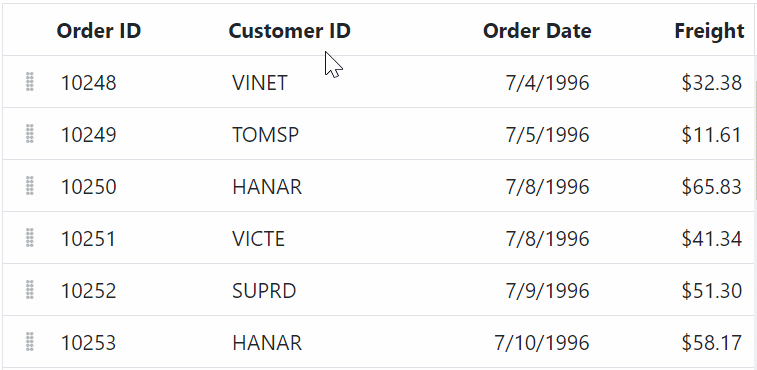
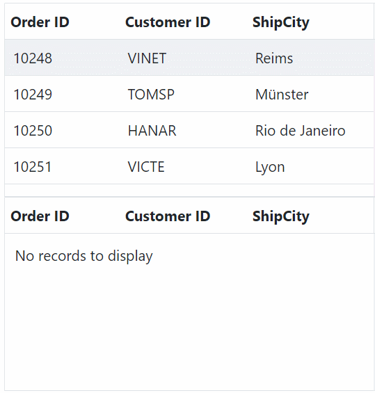
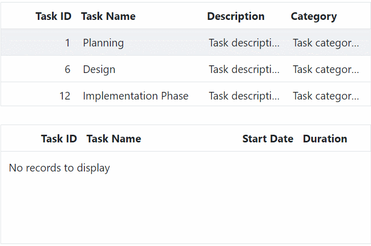
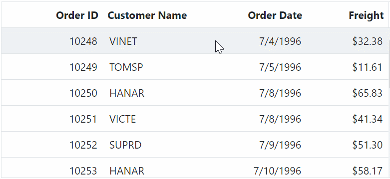
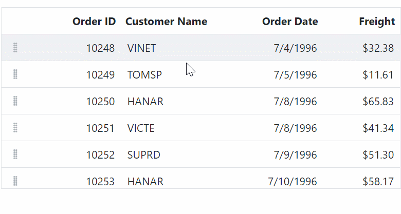

# Drag and drop in ASP.NET MVC Grid component

The Syncfusion ASP.NET MVC Grid component provides built-in support for row drag and drop functionality. This feature allows you to easily rearrange rows within the grid by dragging and dropping them to new positions. Additionally, you can also drag and drop rows from one grid to another grid, as well as drag and drop rows to custom components.

To use the row drag and drop feature in Grid component, you need to set the [AllowRowDragAndDrop](https://help.syncfusion.com/cr/aspnetmvc-js2/Syncfusion.EJ2.Grids.Grid.html#Syncfusion_EJ2_Grids_Grid_AllowRowDragAndDrop) and [TargetID](https://help.syncfusion.com/cr/aspnetmvc-js2/Syncfusion.EJ2.Grids.GridRowDropSettings.html#Syncfusion_EJ2_Grids_GridRowDropSettings_TargetID) properties to enable and configure this feature in the Grid. 

## Drag and drop within grid 

The drag and drop feature allows you to rearrange rows within the grid by dragging them using a drag icon. This feature can be enabled by setting the [AllowRowDragAndDrop](https://help.syncfusion.com/cr/aspnetmvc-js2/Syncfusion.EJ2.Grids.Grid.html#Syncfusion_EJ2_Grids_Grid_AllowRowDragAndDrop) property to **true**. This property is a boolean value that determines whether row drag and drop is enabled or not. By default, it is set to **false**, which means that row drag and drop is disabled.

Here's an example of how to enable drag and drop within the Grid:










## Drag and drop to grid 

The grid row drag and drop allows you to drag grid rows and drop to another grid. This feature can be enabled by setting the [AllowRowDragAndDrop](https://help.syncfusion.com/cr/aspnetmvc-js2/Syncfusion.EJ2.Grids.Grid.html#Syncfusion_EJ2_Grids_Grid_AllowRowDragAndDrop) property to **true** in the Grid component. This property specifies whether to enable or disable the row drag and drop feature in the Grid. By default, this property is set to **false**, which means that row drag and drop functionality is not enabled.

To specify the target component where the grid rows should be dropped, use the [TargetID](https://help.syncfusion.com/cr/aspnetmvc-js2/Syncfusion.EJ2.Grids.GridRowDropSettings.html#Syncfusion_EJ2_Grids_GridRowDropSettings_TargetID) property of the [RowDropSettings](https://help.syncfusion.com/cr/aspnetmvc-js2/Syncfusion.EJ2.Grids.GridRowDropSettings.html) object. The `TargetID` property takes the ID of the target component as its value.

Here's an example code snippet that demonstrates how to enable Row drag and drop another Grid component:










> The row drag and drop feature is not supported in virtual scrolling and frozen rows and columns mode.

## Drag and drop to custom component 

The Grid provides the feature to drag and drop grid rows to any custom component. This feature allows you to easily move rows from one component to another without having to manually copy and paste data. To enable row drag and drop, you need to set the [AllowRowDragAndDrop](https://help.syncfusion.com/cr/aspnetmvc-js2/Syncfusion.EJ2.Grids.Grid.html#Syncfusion_EJ2_Grids_Grid_AllowRowDragAndDrop) property to **true** and defining the custom component ID in the [TargetID](https://help.syncfusion.com/cr/aspnetmvc-js2/Syncfusion.EJ2.Grids.GridRowDropSettings.html#Syncfusion_EJ2_Grids_GridRowDropSettings_TargetID) property of the [RowDropSettings](https://help.syncfusion.com/cr/aspnetmvc-js2/Syncfusion.EJ2.Grids.GridRowDropSettings.html) object. The ID provided in `TargetID` should correspond to the ID of the target component where the rows are to be dropped.

In the below example, the selected grid row is dragged and dropped in to the TreeView component by using [RowDrop](https://help.syncfusion.com/cr/aspnetmvc-js2/Syncfusion.EJ2.Grids.Grid.html#Syncfusion_EJ2_Grids_Grid_RowDrop) event. Once the row is dropped into the TreeView component, we have removed the corresponding grid row from grid and its data inserted in custom component. 










> * The `RowDrop` event is fired when a row is dropped onto a custom component, regardless of whether the drop is successful or not. You can use the `args.cancel` property to prevent the default action.

## Drag and drop rows without drag icons

By default, when performing a drag and drop operation in the Syncfusion Grid, drag icons are displayed. However, in some cases, you may want to hide these drag icons. This can be achieved by setting the [TargetID](https://help.syncfusion.com/cr/aspnetmvc-js2/Syncfusion.EJ2.Grids.GridRowDropSettings.html#Syncfusion_EJ2_Grids_GridRowDropSettings_TargetID) property of the [RowDropSettings](https://help.syncfusion.com/cr/aspnetmvc-js2/Syncfusion.EJ2.Grids.GridRowDropSettings.html) object to the current Grid's ID.

By setting the `TargetID`, the Grid will render without a helper icon for row dragging. You can then customize the drag and drop action by binding to the [RowDrop](https://help.syncfusion.com/cr/aspnetmvc-js2/Syncfusion.EJ2.Grids.Grid.html#Syncfusion_EJ2_Grids_Grid_RowDrop) event of the Grid. In the `RowDrop` event, you can prevent the default action by setting `args.cancel` to **true**, and reorder the rows using the `reorderRows` method of the Grid.

Here's an example of how to hide the drag and drop icon in the Syncfusion Grid:










> * The selection feature must be enabled in the Grid to allow users to select rows before performing the drag and drop operation.
> * Multiple rows can be selected by clicking and dragging inside the grid. For multiple row selection, the [Type](https://help.syncfusion.com/cr/aspnetmvc-js2/Syncfusion.EJ2.Grids.GridSelectionSettings.html#Syncfusion_EJ2_Grids_GridSelectionSettings_Type) property must be set to **Multiple**.

## Drag and drop events

The Grid component provides a set of events that are triggered during drag and drop operations on grid rows. These events allow you to customize the drag element, track the progress of the dragging operation, and perform actions when a row is dropped on a target element. The following events are available:

1. [RowDragStartHelper](https://help.syncfusion.com/cr/aspnetmvc-js2/Syncfusion.EJ2.Grids.Grid.html#Syncfusion_EJ2_Grids_Grid_RowDragStartHelper): This event is triggered when a click occurs on the drag icon or a grid row. It allows you to customize the drag element based on specific criteria.

2. [RowDragStart](https://help.syncfusion.com/cr/aspnetmvc-js2/Syncfusion.EJ2.Grids.Grid.html#Syncfusion_EJ2_Grids_Grid_RowDragStart): This event is triggered when the dragging of a grid row starts.

3. [RowDrag](https://help.syncfusion.com/cr/aspnetmvc-js2/Syncfusion.EJ2.Grids.Grid.html#Syncfusion_EJ2_Grids_Grid_RowDrag): This event is triggered continuously while the grid row is being dragged.

4. [RowDrop](https://help.syncfusion.com/cr/aspnetmvc-js2/Syncfusion.EJ2.Grids.Grid.html#Syncfusion_EJ2_Grids_Grid_RowDrop): This event is triggered when a drag element is dropped onto a target element.










## Limitations

* Single row is able to drag and drop in same grid without enable the row selection.
* Row drag and drop feature is not having built in support with row template, detail template and hierarchy grid features of grid.

## See also

[Sorting data in the Syncfusion Grid](https://ej2.syncfusion.com/aspnetmvc/documentation/grid/sorting)
[Filtering data in the Syncfusion Grid](https://ej2.syncfusion.com/aspnetmvc/documentation/grid/filtering)