# Row in ASP.NET MVC Grid control

Each row typically represents a single record or item from a data source. Rows in a grid are used to present data in a tabular format. Each row displays a set of values representing the fields of an individual data record. Rows allow users to interact with the data in the grid. Users can select rows, edit cell values, perform sorting or filtering operations, and trigger events based on actions.

## Customize row styles 

Customizing the styles of rows in a Syncfusion Grid allows you to modify the appearance of rows to meet your design requirements. This feature is useful when you want to highlight certain rows or change the font style, background color, and other properties of the row to enhance the visual appeal of the grid. To customize the row styles in the grid, you can use CSS, properties, methods, or event support provided by the Syncfusion ASP.NET MVC Grid component.

### Using event

You can customize the appearance of the rows by using the [RowDataBound](https://help.syncfusion.com/cr/aspnetmvc-js2/Syncfusion.EJ2.Grids.Grid.html#Syncfusion_EJ2_Grids_Grid_RowDataBound) event. This event triggers for every row when it is bound to the data source. In the event handler, you can get the `RowDataBoundEventArgs` object, which contains details of the row. You can use this object to modify the row's appearance, add custom elements, or perform any other customization.

Here's an example of how you can use the `RowDataBound` event to customize the styles of rows based on the value of the **Freight** column. This example involves checking the value of the Freight column for each row and adding a CSS class to the row based on the value. The CSS classes **below-30**, **below-80**, and **above-80** can then be defined in your stylesheet to apply the desired styles to the rows.










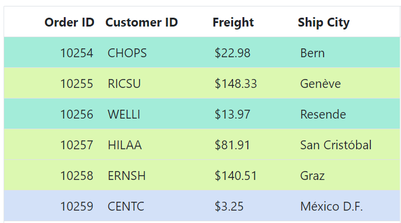

> The [QueryCellInfo](https://help.syncfusion.com/cr/aspnetmvc-js2/Syncfusion.EJ2.Grids.Grid.html#Syncfusion_EJ2_Grids_Grid_QueryCellInfo) event can also be used to customize cells and is triggered for every cell in the grid. It can be useful when you need to customize cells based on certain conditions or criteria.

### Using CSS

You can apply styles to the rows using CSS selectors. The Grid provides a class name for each row element, which you can use to apply styles to that specific row. 

**Customize alternate rows**

You can customize the appearance of the alternate rows using CSS. This can be useful for improving the readability of the data and making it easier to distinguish between rows. By default, Syncfusion Grid provides the CSS class **.e-altrow** to style the alternate rows. You can customize this default style by overriding the **.e-altrow** class with your custom CSS styles. 

To change the background color of the alternate rows, you can add the following CSS code to your application's stylesheet:

```css
.e-grid .e-altrow {
    background-color: #fafafa;
}
```

Here's an example of how to use the **.e-altrow** class to style alternate rows:










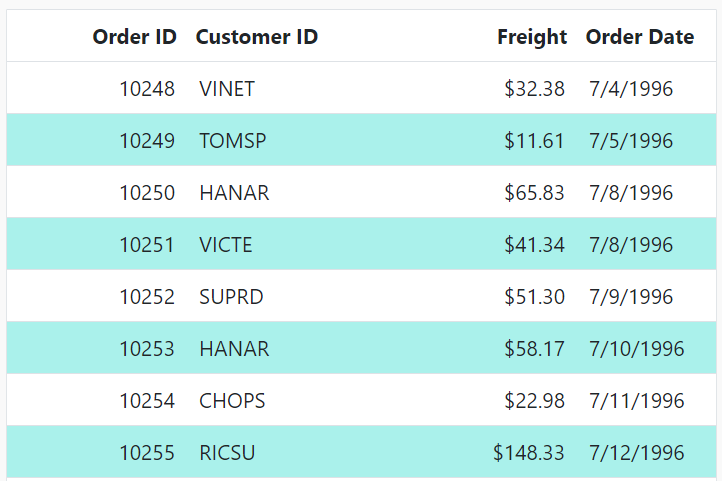

**Customize selected row**

You can customize the appearance of the selected row using CSS. This is useful when you want to highlight the currently selected row for improve the visual appeal of the Grid. By default, the Grid provides the CSS class **.e-selectionbackground** to style the selected row. You can customize this default style by overriding the **.e-selectionbackground** class with your own custom CSS styles.

To change the background color of the selected row, you can add the following CSS code to your application:

```css
.e-grid td.e-selectionbackground {
    background-color: #f9920b;
}
```

Here's an example of how to use the **.e-selectionbackground** class to style the selected row:










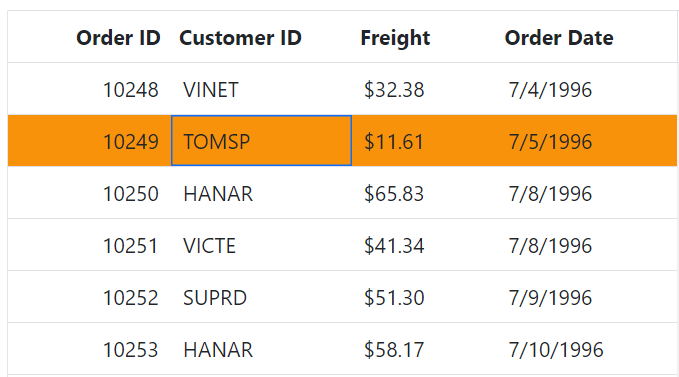

### Using method 

The Grid provides below methods to customize the appearance of the grid rows :

1. `getRowByIndex`: This method returns the HTML element of a row at the specified index. You can use this method to apply custom styles to a specific row.
2. `getRowIndexByPrimaryKey`: This method returns the index of the row with the specified primary key. You can use this method to get the index of a specific row and then apply custom styles to it.
3. `getRows`: This method returns an array of all the row elements in the Grid. You can use this method to apply custom styles to all rows or to a specific set of rows based on some condition.
4. `getRowInfo`: This method returns the data object and index of the row corresponding to the specified row element. You can use this method to apply custom styles based on the data in a row.
5. `getSelectedRowIndexes`: This method returns an array of the indexes of the selected rows in the Grid. You can use this method to apply custom styles to the selected rows.
6. `getSelectedRows`:This method returns an array of the HTML elements representing the selected rows in the grid. You can use this method to directly loop through the selected rows and customize their styles.

The following example demonstrates how to use `getRowByIndex` methods to customize the appearance of the row inside the [DataBound](https://help.syncfusion.com/cr/aspnetmvc-js2/Syncfusion.EJ2.Grids.Grid.html#Syncfusion_EJ2_Grids_Grid_DataBound) event of the grid.










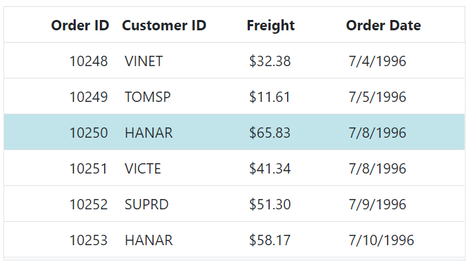

## Row height

The Syncfusion Grid allows you to customize the height of rows based on your needs. This feature can be useful when you need to display more content in a row or when you want to reduce the height of rows to fit its content. You can achieve this by using the [RowHeight](https://help.syncfusion.com/cr/aspnetmvc-js2/Syncfusion.EJ2.Grids.Grid.html#Syncfusion_EJ2_Grids_Grid_RowHeight) property of the Grid component. This property allows you to change the height of the entire grid row to your desired value.

In the below example, we will demonstrate how to dynamically change the height of the rows using the `RowHeight` property.










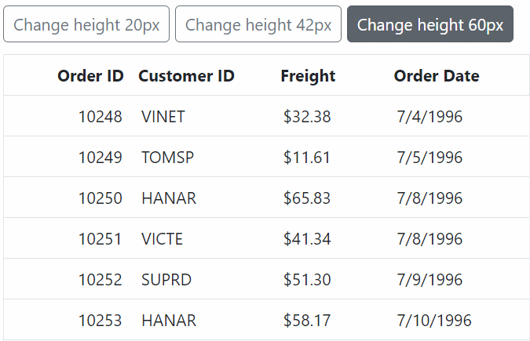

> *	The [RowHeight](https://help.syncfusion.com/cr/aspnetmvc-js2/Syncfusion.EJ2.Grids.Grid.html#Syncfusion_EJ2_Grids_Grid_RowHeight) property can only be used to set the height of the entire grid row. It cannot be used to set the height of individual cells within a row.
> *  The `RowHeight` property applies the height to all rows in the grid, including the header and footer rows.
> *	You can also set the height for a specific row using the `RowHeight` property of the corresponding row object in the [RowDataBound](https://help.syncfusion.com/cr/aspnetmvc-js2/Syncfusion.EJ2.Grids.Grid.html#Syncfusion_EJ2_Grids_Grid_RowDataBound) event.

### Customize row height for particular row 

Customizing the row height for a particular row can be useful when you want to display more content in a particular row, reduce the height of a row to fit its content, or make a specific row stand out from the other rows in the grid. This can be achieved by using the [RowHeight](https://help.syncfusion.com/cr/aspnetmvc-js2/Syncfusion.EJ2.Grids.Grid.html#Syncfusion_EJ2_Grids_Grid_RowHeight) property of the Grid component along with the [RowDataBound](https://help.syncfusion.com/cr/aspnetmvc-js2/Syncfusion.EJ2.Grids.Grid.html#Syncfusion_EJ2_Grids_Grid_RowDataBound) event.

The `RowHeight` property of the Grid component allows you to set the height of all rows in the grid to a specific value. However, if you want to customize the row height for a specific row based on the row data, you can use the `RowDataBound` event. This event is triggered every time a request is made to access row information, element, or data, and before the row element is appended to the Grid element.

In the below example, the row height for the row with **OrderID** as '10249' is set as '90px' using the `RowDataBound` event.










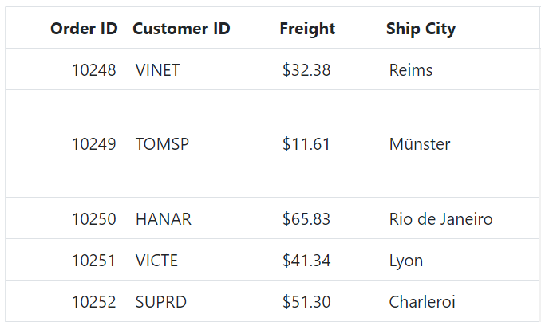

> * In virtual scrolling mode, it is not applicable to set different row heights.
> * You can customize the row height of multiple rows by checking the relevant criteria in the `RowDataBound` event and setting the `RowHeight` property accordingly.
> * In the `RowDataBound` event handler, you can access the current row using the `args.row` property and set the `RowHeight` property for that row using the setAttribute method.

## Row hover

The Row Hover feature in Grid provides a visual effect when the mouse pointer hovers over the rows, making it easy to highlight and identify the selected row. This feature can also improve the readability of data in the grid. The row hover effect can be enabled or disabled using the [EnableHover](https://help.syncfusion.com/cr/aspnetmvc-js2/Syncfusion.EJ2.Grids.Grid.html#Syncfusion_EJ2_Grids_Grid_EnableHover) property of the Grid component.

By default, the `enableHover` property is set to **true**, which means that the row hovering effect is enabled. To disable the row hover effect, set the `enableHover` property to **false**.

Here is an example that demonstrates how to enable/disable row hover based on the Switch Component:










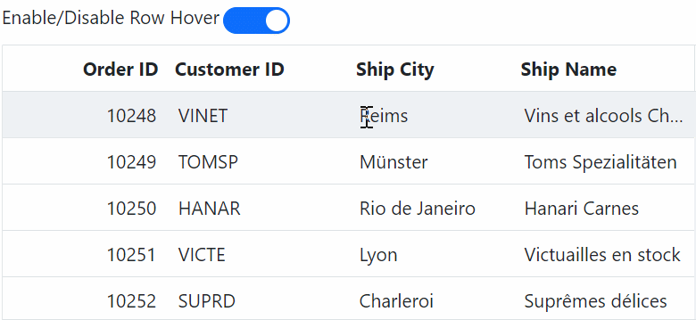

> The `EnableHover` property applies to the entire grid, not individual rows or columns.

### How to get the row information when hovering over the cell

You can retrieve row information when hovering over a specific cell. This can be useful if you want to display additional details or perform some action based on the data in the row. This can be achieved by using the [RowDataBound](https://help.syncfusion.com/cr/aspnetmvc-js2/Syncfusion.EJ2.Grids.Grid.html#Syncfusion_EJ2_Grids_Grid_RowDataBound) event and the `getRowInfo` method of the Grid.

* The `RowDataBound` event is triggered every time a request is made to access row information, element, or data, before the row element is appended to the Grid element.
* The `getRowInfo` method is used to retrieve the row information when hovering over a specific cell. This method takes a single parameter, which is the target element that is being hovered over.

Here's an example that demonstrates how to use the `RowDataBound` event and `getRowInfo` method to retrieve the row information when hovering over a cell in the Syncfusion Grid.










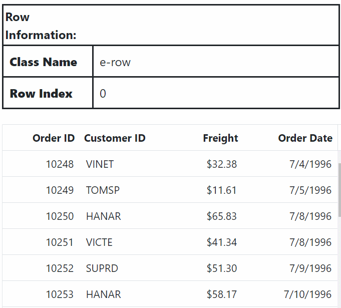

> The `getRowInfo` method can only be used in the `RowDataBound` event. Attempting to use it elsewhere will result in an error.

## Row pinning (Frozen)

The Syncfusion ASP.NET MVC Grid allows you to freeze rows to keep them visible while scrolling vertically through large datasets. This feature enhances the experience by maintaining important information within view at all times.

In the following example, the [FrozenRows](https://help.syncfusion.com/cr/aspnetmvc-js2/Syncfusion.EJ2.Grids.Grid.html#Syncfusion_EJ2_Grids_Grid_FrozenRows) property is set to **2**. This configuration freezes the top three rows of the grid, and they will remain fixed in their positions while the rest of the grid can be scrolled vertically.










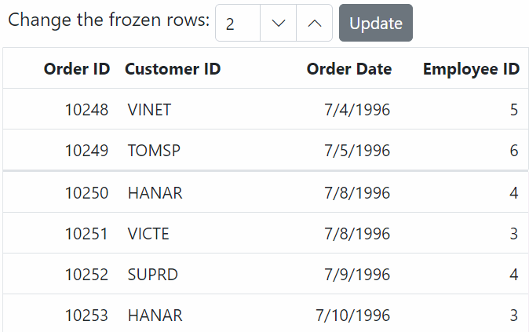

> * Frozen rows should not be set outside the grid view port.
> * Frozen Grid will support row virtualization feature, which helps to improve the Grid performance while loading a large dataset.
> * The frozen feature is supported only for the rows that are visible in the current view.
> * You can use both  [FrozenColumns](https://ej2.syncfusion.com/aspnetmvc/documentation/grid/columns/frozen-column) property and `FrozenRows` property in the same application.

### Change default frozen rows line color

You can easily customize the frozen line background color of frozen rows in the Syncfusion Grid component by applying custom CSS styles to the specific frozen row. This allows you to change the background color of frozen rows to match your application's design and theme.

To change the default frozen rows line color, you can use the following CSS class:

```css
.e-grid .e-frozenrow-border {
    background-color: rgb(5, 114, 47);
}
```
By applying this CSS class, you can set the background color of frozen rows to the specified RGB color. The following example demonstrates how to change the default frozen rows line color using CSS.










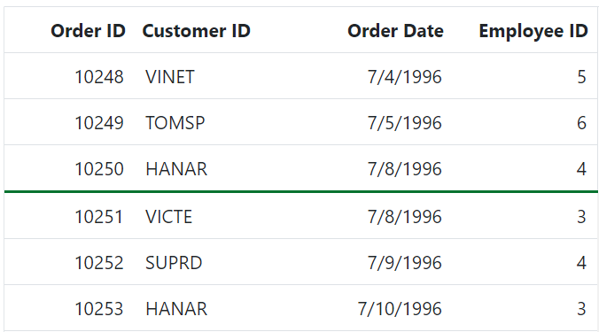

### Deprecated methods

Previous | Current | Explanation 
 ---  | --- | --- 
`getMovableRows()` gridInstance.getMovableRows()[0].querySelectorAll('.e-unfreeze') | `getRows()` gridInstance.getRows()[0].querySelectorAll('.e-unfreeze') | The previous architecture used separate tables for left, right, and movable contents, returning only movable rows when calling the method, whereas the current architecture combines them into one table, returning all rows and introduces the `e-unfreeze` class for selecting movable rows
`getFrozenRightRows()` gridInstance.getFrozenRightRows()[0].querySelectorAll('.e-rightfreeze') | `getRows()` gridInstance.getRows()[0].querySelectorAll('.e-rightfreeze') | In the previous architecture, it returned only the table rows from the right freeze table, but in the current architecture, all rows of the entire table are returned, introducing the `e-rightfreeze` class for selecting right freeze rows. 
`getMovableRowByIndex()` <br> `getFrozenRowByIndex()` <br> `getFrozenRightRowByIndex()` | `getRowByIndex()` gridInstance.getRowByIndex(1).querySelectorAll('.e-unfreeze') | In the previous architecture, separate methods were used to select rows from different table sections, while in the current architecture, the `getMovableRowByIndex()`, `getFrozenRightRowByIndex()`, and `getFrozenRowByIndex()` methods now return the same table row based on the given index. Additionally, class names for table cells (td's) have been separated into `e-leftfreeze`, `e-unfreeze`, and `e-rightfreeze`, making it easier to customize cells within a row.
`getMovableCellFromIndex()` <br> `getFrozenRightCellFromIndex()` | `getCellFromIndex()` gridInstance.getCellFromIndex(1,1) | In the previous approach, the `getMovableCellFromIndex()` method was used to choose a specific cell within the movable table, and the `getFrozenRightCellFromIndex()` method was utilized to target a particular cell within the right freeze table. However, in the current architecture, you have the flexibility to select a specific cell in either the movable or right freeze table by using both the `getFrozenRightCellFromIndex()` and `getMovableCellFromIndex()` methods. This new method simplifies the process of selecting and retrieving specific cells within these tables, offering more versatility and convenience.
`getMovableDataRows()` <br> `getFrozenRightDataRows()` <br> `getFrozenDataRows()` | `getDataRows()` gridInstance.getDataRows()[0].querySelectorAll('.e-unfreeze') | In the previous approach, there were separate methods (`getMovableDataRows()`, `getFrozenRightDataRows()`, and `getFrozenDataRows()`) for obtaining viewport data rows from the freeze, movable, and right tables individually. However, in the new approach, these methods have been enhanced to return the entire viewport data rows for all sections together, simplifying data retrieval. You can now extract specific cells within these rows using selectors such as `e-leftfreeze` for the **left freeze**, `e-unfreeze` for the **movable**, and `e-rightfreeze` for the **right freeze** tables, providing greater flexibility in working with the data.
`getMovableColumnHeaderByIndex()` <br> `getFrozenRightColumnHeaderByIndex()` <br> `getFrozenLeftColumnHeaderByIndex()` | `getColumnHeaderByIndex()` gridInstance.getColumnHeaderByIndex(1) | In the previous architecture, the methods selected movable, right freeze, and left freeze headers separately. However, in the new approach, when using the `getMovableColumnHeaderByIndex()`, `getFrozenRightColumnHeaderByIndex()`, and `getFrozenLeftColumnHeaderByIndex()` methods, you will still obtain the same results as in the previous architecture.

> When a validation message is displayed in the frozen part (Left, Right, Fixed) of the table, scrolling is prevented until the validation message is cleared.

### Limitations

* Frozen row is not compatible with the following features:
    1. Autofill

## Adding a new row programmatically

The Syncfusion Grid provides a way to add a new row to the grid programmatically. This feature is useful when you want to add a new record to the grid without having the manually enter data in the grid.This can be done using the `addRecord` method of the Grid.

The addRecord method takes two parameters:

* The **data** object representing the new row to be added
* The **index** at which the new row should be inserted. If no index is specified, the new row will be added at the end of the Grid.

Here's an example of how to add a new row using the `addRecord` method:










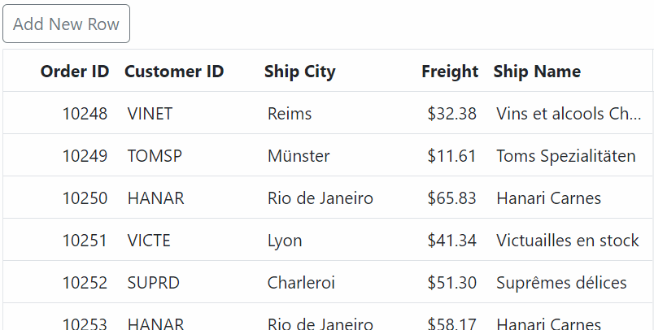

>* When working with remote data, it is impossible to add a new row between the existing rows.
>* If you want to add a new record to the beginning of the data source, you can pass **0** as the second parameter to the `addRecord `method.
>* If you do not specify an index, the new row will be added at the end of the grid.

## Show or hide a row using an external actions

In a Syncfusion grid, you can show or hide a particular row based on some external action, such as a checkbox click.This can be useful in scenarios where you want to hide certain rows from the grid temporarily, without removing them from the underlying data source. This can be achieved by using  the `getRowByIndex` and `getRowsObject` methods of the grid along with the [Change](https://help.syncfusion.com/cr/aspnetmvc-js2/Syncfusion.EJ2.DropDowns.DropDownList.html#Syncfusion_EJ2_DropDowns_DropDownList_Change) event of the checkbox

The `getRowsObject` method returns an array of row objects that represents all the rows in the grid. You can use this method to iterate through all the rows and access their data and index.

The `getRowByIndex` method returns the HTML element of a row at the specified index. You can use this method to get a specific row and apply changes to it.

In the following example, the **onCheckBoxChange** method is used to check whether the checkbox is checked or not. If it is checked, the method iterates through all the rows in the grid using the `getRowsObject` method. For each row, it checks whether the value in the **CustomerID** column is equal to "VINET". If it is, the index of that row is obtained using the `getRowByIndex` method and hidden by setting its display style to "none". The index of the hidden row is also added to an array called hiddenRows.

If the checkbox is unchecked, the method iterates through the hiddenRows array and shows each row by setting its display style to an empty string. The hiddenRows array is also cleared.










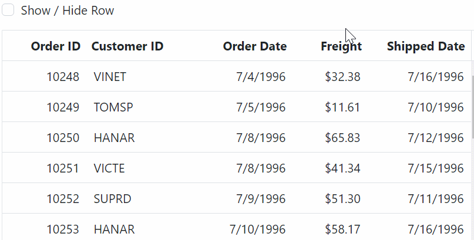

## How to get the row data and element

Grid provides several methods to retrieve row data and elements. This feature is useful when you need to access specific rows, perform custom operations, or manipulate the data displayed in the grid.

1. `getRowByIndex`: This method returns the HTML element of a row at the specified index. It can be used to retrieve the element of a specific row in the grid.

    ```ts
    const rowElement = grid.getRowByIndex(rowIndex);
    ```

2. `getRowIndexByPrimaryKey`: The method allows you to retrieve the row index based on a specific primary key value or row data.

    ```ts
    const rowIndex = grid.getRowIndexByPrimaryKey(primaryKey);
    ```

3. `getRowInfo`: This method allows you to retrieve row information based on a cell target element.

    ```ts
    const rowInformation = grid.getRowInfo(targetElement);
    ```

4. `getRows`: This method returns an array of all the row elements in the Grid. If you need to retrieve row data and elements, you can combine the `getRows` method with the `getRowInfo` method.

    ```ts
     const rowElements = grid.getRows();
    ```

5. `getSelectedRowIndexes`: This method allows you to retrieve the collection of indexes of the selected rows. However, it does not directly provide the row elements and associated data. To access the row elements and data of the selected rows, you can combine the `getSelectedRowIndexes` method with `getRowByIndex` and `getRowInfo` method.

    ```ts
    const selectedIndexes = grid.getSelectedRowIndexes();
    ```
6. `getSelectedRows`: This method returns an array of HTML elements representing the selected rows in the grid.By iterating over this array, you can access each row element and data using the `getRowInfo` method. This way, you can access both the row elements and their associated data for the selected rows.

    ```ts
    const selectedRowElements = grid.getSelectedRows();
    ```

## See Also

* [How to set textbox and Grid in one row in ASP.NET MVC Grid](https://www.syncfusion.com/forums/164975/how-to-set-textbox-and-grid-in-one-row-in-asp-net-mvc-grid)