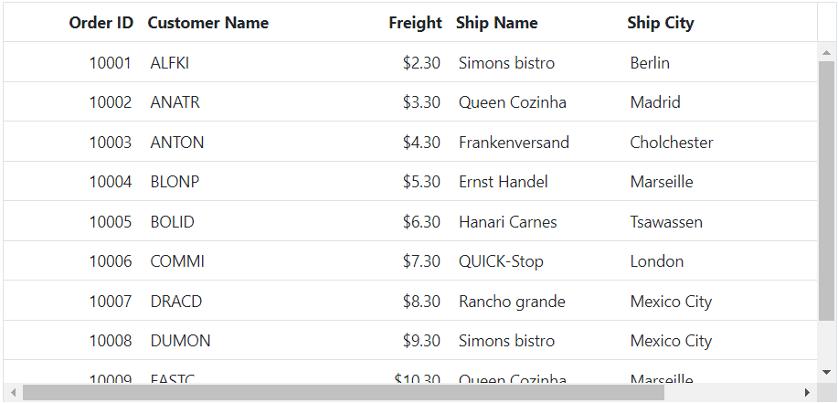
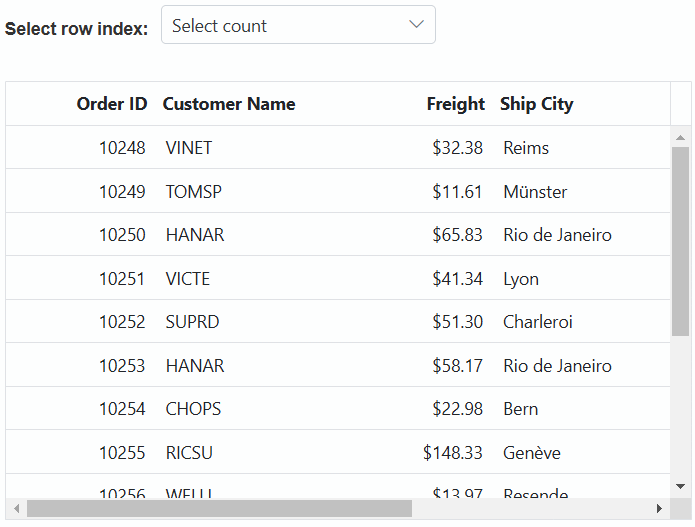
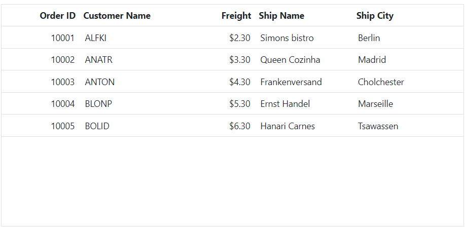

# Scrolling in ASP.NET MVC Grid component

The scrolling feature in the ASP.NET MVC Grid component allows you to navigate through the content that extends beyond the visible area of the grid . It provides scrollbars that are automatically displayed when the content exceeds the specified `Width` or `Height` of the grid element. This feature is useful when you have a large amount of data or when the content needs to be displayed within a limited space. The vertical and horizontal scrollbars will be displayed based on the following criteria:

* The vertical scrollbar appears when the total height of rows present in the grid exceeds its element height.
* The horizontal scrollbar appears when the sum of columns width exceeds the grid element width.
* The [Height](https://help.syncfusion.com/cr/aspnetmvc-js2/Syncfusion.EJ2.Grids.Grid.html#Syncfusion_EJ2_Grids_Grid_Height) and [Width](https://help.syncfusion.com/cr/aspnetmvc-js2/Syncfusion.EJ2.Grids.Grid.html#Syncfusion_EJ2_Grids_Grid_Width) are used to set the grid height and width, respectively.

> The default value for `Height`and `Width` is `auto`.

## Set width and height

The ASP.NET MVC Grid component offers a straightforward method to tailor the width and height of the scroller to meet your specific requirements. This is particularly useful when you want precise control over the dimensions of the scroller. To achieve this, you can use pixel values as numbers for the [Width](https://help.syncfusion.com/cr/aspnetmvc-js2/Syncfusion.EJ2.Grids.Grid.html#Syncfusion_EJ2_Grids_Grid_Width) and [Height](https://help.syncfusion.com/cr/aspnetmvc-js2/Syncfusion.EJ2.Grids.Grid.html#Syncfusion_EJ2_Grids_Grid_Height) properties of the Grid.

In the following example, the scrollbar is enabled, and the grid's `Height` is set to 315 pixels, while the `Width` is set to 400 pixels:










## Responsive with parent container

The Grid component allows you to create a responsive layout by making it fill its parent container and automatically adjust its size based on the available space and changes in the container's dimensions. This capability is particularly useful for building applications that need to adapt to various screen sizes and devices.

To achieve this, you need to specify the [Width](https://help.syncfusion.com/cr/aspnetmvc-js2/Syncfusion.EJ2.Grids.Grid.html#Syncfusion_EJ2_Grids_Grid_Width) and [Height](https://help.syncfusion.com/cr/aspnetmvc-js2/Syncfusion.EJ2.Grids.Grid.html#Syncfusion_EJ2_Grids_Grid_Height) properties of the Grid as 100%. However, keep in mind that setting the height property to 100% requires the Grid's parent element to have an explicit height defined.

In the following example, the parent container has explicit height and width set, and the Grid container's height and width are both set to 100%. This ensures that the Grid adjusts its size responsively based on the dimensions of the parent container:










## Sticky header

The ASP.NET MVC Grid component provides a feature that allows you to make column headers remain fixed while scrolling, ensuring they stay visible at all times. To achieve this, you can utilize the [EnableStickyHeader](https://help.syncfusion.com/cr/aspnetmvc-js2/Syncfusion.EJ2.Grids.Grid.html#Syncfusion_EJ2_Grids_Grid_EnableStickyHeader) property by setting it to **true**.

In the below demo, the Grid headers will be sticky while scrolling the Grid's parent div element.










## Scroll to selected row

The ASP.NET MVC Grid component allows you to scroll the grid content to the position of the selected row, ensuring that the selected row is automatically brought into view. This feature is particularly useful when dealing with a large dataset and wanting to maintain focus on the selected row. To achieve this, you can utilize the [RowSelected](https://help.syncfusion.com/cr/aspnetmvc-js2/Syncfusion.EJ2.Grids.Grid.html#Syncfusion_EJ2_Grids_Grid_RowSelected) event provided by the Grid.

The following example that demonstrates how to use the `RowSelected` event to scroll to the selected row:










## Hide the empty placehoder of scrollbar

The Syncfusion Grid component provides a feature to hide the empty placeholder of the scrollbar, offering a cleaner interface without unnecessary scrollbars. To achieve this, you can utilize the `hideScroll` method. This method allows you to determine whether the scrollbar should be hidden based on the content's overflow.

The following example that demonstrates how to use the `hideScroll` method inside the [DataBound](https://help.syncfusion.com/cr/aspnetmvc-js2/Syncfusion.EJ2.Grids.Grid.html#Syncfusion_EJ2_Grids_Grid_DataBound) event:










