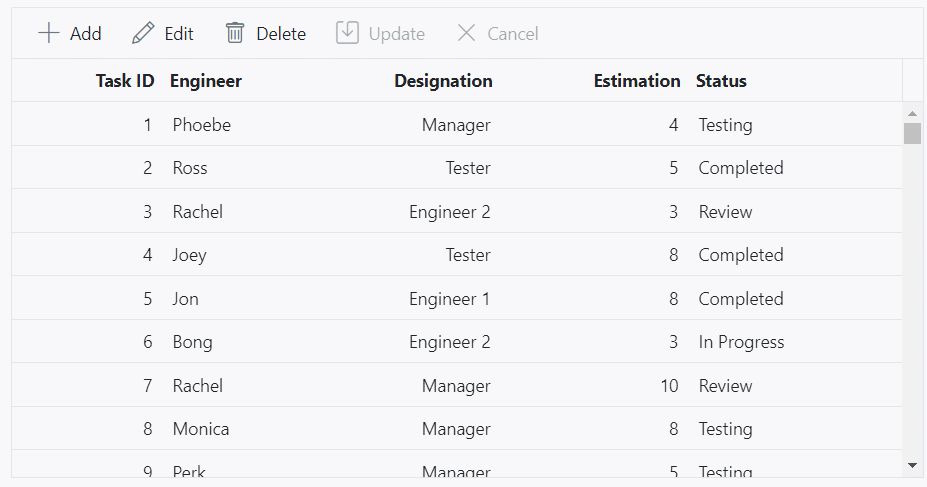

# Virtual scrolling in ASP.NET MVC Grid component

The virtual scrolling feature in the Grid allows you to efficiently handle and display a large amount of data without experiencing any performance degradation. It optimizes the rendering process by loading only the visible rows in the Grid viewport, rather than rendering the entire dataset at once. This is particularly useful when dealing with datasets that contain thousands of records.

To enable virtualization in the Grid, you need to inject the **VirtualScrollService**. This service is responsible for managing the virtual scrolling behavior and optimizing the rendering of data to enhance performance.

## Row virtualization

Row virtualization is a feature in the Syncfusion Grid that allows you to load and render rows only in the content viewport. It provides an alternative way of paging where data is loaded dynamically while scrolling vertically, rather than loading all the data at once. This is particularly useful when dealing with large datasets, as it improves the performance and reduces the initial load time.

To set up row virtualization, you need to define the [enableVirtualization](https://help.syncfusion.com/cr/aspnetmvc-js2/Syncfusion.EJ2.Grids.Grid.html#Syncfusion_EJ2_Grids_Grid_EnableVirtualization) property as **true** and specify the content height using the [height](https://help.syncfusion.com/cr/aspnetmvc-js2/Syncfusion.EJ2.Grids.Grid.html#Syncfusion_EJ2_Grids_Grid_Height) property in the Grid configuration.

The number of records displayed in the Grid is implicitly determined by the height of the content area. Additionally, you have an option to explicitly define the visible number of records using the [pageSettings.pageSize](https://help.syncfusion.com/cr/aspnetmvc-js2/Syncfusion.EJ2.Grids.GridPageSettings.html#Syncfusion_EJ2_Grids_GridPageSettings_PageSize) property. The loaded data will be cached and reused when needed in the future.

The following example enable row virtualization using `enableVirtualization` property.












### Limitations 

* Row virtual scrolling is not compatible with the following feature
	1. Batch editing
	2. Detail template
	3. Row template
	4. Rowspan
	5. Autofill
	6. Hierarchy grid
    7. Page
* AutoFill support for Batch mode editing, so this feature is not compatible with Row Virtualization feature. 
* When row virtual scrolling is activated, compatibility for copy-paste and drag-and-drop operations is limited to the data items visible in the current viewport of the grid.
* The cell-based selection is not supported for row virtual scrolling. 
* Using different row heights with a template column, when the template height differs for each row, is not supported.
* Group expand and collapse state will not be persisted for remote data.
* Due to the element height limitation in browsers, the maximum number of records loaded by the Grid is limited by the browser capability.
* The height of the grid content is calculated using the row height and total number of records in the data source and hence features which changes row height such as text wrapping are not supported.
* If you want to increase the row height to accommodate the content then you can specify the row height as below to ensure all the table rows are in same height.

    ```css
    .e-grid .e-row {
        height: 2em;
    }
    ```
* Since data is virtualized in grid, the aggregated information and total group items are displayed based on the current view items. To get these information regardless of the view items, refer to the [Group with paging](https://ej2.syncfusion.com/aspnetmvc/documentation/grid/grouping/grouping#group-with-paging) topic. 
* It is necessary to set a static height for the component or its parent container when using row virtualization. The 100% height will work only if the component height is set to 100%, and its parent container has a static height.

## Column virtualization

Column virtualization feature in the Syncfusion Grid that allows you to optimize the rendering of columns by displaying only the columns that are currently within the viewport. It allows horizontal scrolling to view additional columns. This feature is particularly useful when dealing with grids that have a large number of columns, as it helps to improve the performance and reduce the initial loading time.

To enable column virtualization, you need to set the [enableColumnVirtualization](https://help.syncfusion.com/cr/aspnetmvc-js2/Syncfusion.EJ2.Grids.Grid.html#Syncfusion_EJ2_Grids_Grid_EnableColumnVirtualization) property of the Grid to **true**. This configuration instructs the Grid to only render the columns that are currently visible in the viewport. 

The following example enable column virtualization using `enableColumnVirtualization`  property.











> Column's [width](https://help.syncfusion.com/cr/aspnetmvc-js2/Syncfusion.EJ2.Grids.Grid.html#Syncfusion_EJ2_Grids_Grid_Width) is required for column virtualization. If column's width is not defined then Grid will consider its value as **200px**.

### Limitations 

* While using column virtual scrolling, column width should be in pixel. Percentage values are not accepted.
* Selected column details are only retained within the viewport. When the next set of columns is loaded, the selection for previously visible columns is lost.
* The cell selection is not supported for column virtual scrolling
* The following features are compatible with column virtualization and work within the viewport:
   1. Column resizing
   2. Column reordering
   3. Column chooser
   4. Auto-fit
   5. Print
   6. Clipboard
   7. Column menu - Column chooser, AutofitAll

* Column virtual scrolling is not compatible with the following feature
    1. Grouping
    2. Colspan
    3. Batch editing
    4. Column with infinite scrolling
    6. Stacked header
    7. Row template
    8. Detail template
    9. Hierarchy grid
    10. Autofill
    11. Column chooser
    12. Page

## Limitations for virtual scrolling

* While using column virtual scrolling, column width should be in the pixel. Percentage values are not accepted.
* Due to the element height limitation in browsers, the maximum number of records loaded by the grid is limited by the browser capability.
* The cell selection is not supported for both row and column virtual scrolling.
* While using column virtualization, fixed position applied only viewport column. If scroll the next set of column fixed position is removed.
* Virtual scrolling is not compatible with batch editing, detail template, rowspan, colspan, autofill and hierarchy features.
* Group expand and collapse state will not be persisted.
* Since data is virtualized in grid, the aggregated information and total group items are displayed based on the current view items. To get these information regardless of the view items, refer to the [`Group with Page`](./grouping/#group-with-paging) topic.
* The page size provided must be two times larger than the number of visible rows in the grid. If the page size is failed to meet this condition then the size will be determined by grid.
* The height of the grid content is calculated using the row height and total number of records in the data source and hence features which changes row height such as text wrapping are not supported. If you want to increase the row height to accommodate the content then you can specify the row height as below to ensure all the table rows are in same height.

```css
.e-grid .e-row {
    height: 2em;
}
```
* Programmatic selection using the **selectRows** method is not supported in virtual scrolling.

## Browser height limitation in virtual scrolling and solution

You can load millions of records in the Grid by using virtual scrolling, where the grid loads and renders rows on-demand while scrolling vertically. As a result, Grid lightens the browser’s load by minimizing the DOM elements and rendering elements visible in the viewport. The height of the grid is calculated using the Total Records Count * [Row Height](https://help.syncfusion.com/cr/aspnetmvc-js2/Syncfusion.EJ2.Grids.Grid.html#Syncfusion_EJ2_Grids_Grid_RowHeight) property.

The browser has some maximum pixel height limitations for the scroll bar element. The content placed above the maximum height can't be scrolled if the element height is greater than the browser's maximum height limit. The browser height limit affects the virtual scrolling of the grid. When a large number of records are bound to the Grid, it can only display the records until the maximum height limit of the browser. Once the browser's height limit is reached while scrolling, the user won't able to scroll further to view the remaining records.

For example, if the row height is set as 30px and the total record count is 1000000(1 million), then the height of the grid element will be 30,000,000 pixels. In this case, the browser's maximum height limit for a div is about 22,369,600 (The maximum pixel height limitation differs for different browsers). The records above the maximum height limit of the browser can't be scrolled.

This height limitation is not related to the Grid component. It fully depends on the default behavior of the browser. The same issue is reproduced in the normal HTML table too.

The following image illustrates the height limitation issue of a normal HTML table in different browsers (Chrome and Firefox).


Grid component also faced the same issue as mentioned in the below image.


The Grid has an option to overcome this limitation of the browser in the following ways.

### Solution 1: Using external buttons

You can prevent the height limitation problem in the browser when scrolling through millions of records by loading the segment of data through different strategy.

In the following sample, Grid is rendered with a large number of records(nearly 2 million). Here, you can scroll 0.5 million records at a time in Grid. Once you reach the last page of 0.5 million records, the **Load Next Set** button will be shown at the bottom of the Grid. By clicking that button, you can view the next set of 0.5 million records in Grid. Also, the **Load Previous Set** button will be shown at the top of the Grid to load the previous set of 0.5 million records.

Let's see the step by step procedure for how we can overcome the limitation in the Syncfusion Grid component.

1.Create a custom adaptor by extending UrlAdaptor and binding it to the grid DataSource property. In the processQuery method of the custom adaptor, we handled the Skip query based on the current page set to perform the data operation with whole records on the server.

```csharp
export class CustomUrlAdaptor extends UrlAdaptor {
    processQuery(args) {
        if (arguments[1].queries) {
            for (var i = 0; i < arguments[1].queries.length; i++) {
                if (arguments[1].queries[i].fn === 'onPage') {
                    // pageSet - defines the number of segments that we are going to split the 2million records. In this example we have considered 0.5 million records for each set so the pageSet is 1, 2, 3 and 4.
                    // maxRecordsPerPageSet – In this example we define the value as 0.5 million.

                    // gridPageSize – the pageSize that we have defined in the Grid pageSettings->pageSize property

                    // customize the pageIndex based on the current pageSet (It send the skip query including the previous pageSet ) so that the other operations performed for total 2millions records instead of 0.5 million alone.
                    arguments[1].queries[i].e.pageIndex = (((pageSet - 1) * maxRecordsPerPageSet) / gridPageSize) + arguments[1].queries[i].e.pageIndex;
                }
            }
        }
        var original = super.processQuery.apply(this, arguments);
        return original;
    }
}

this.dataManager = new DataManager({
    adaptor: new CustomUrlAdaptor(),
    url: "Home/UrlDatasource"
});
```

2.Render the grid by define the following features.

```csharp
<GridComponent id='grid' ref={g => this.grid = g} dataSource={this.dataManager} enableVirtualization={true} pageSettings={this.pageSettings} height={360} beforeDataBound={this.beforeDataBound}>
        <ColumnsDirective>
            …………..
            …………..
        </ColumnsDirective>
</GridComponent>
```                

3.In the beforeDataBound event, we set the args.count as 0.5 million to perform scrolling with 0.5 million records and all the data operations are performed with whole records which is handled using the custom adaptor. And also particular segment records count is less than 0.5 million means it will directly assigned the original segmented count instead of 0.5 million.

```csharp
    beforeDataBound(args) {
        // storing the total records count which means 2 million records count
        totalRecords = args.count; 

        // change the count with respect to maxRecordsPerPageSet (maxRecordsPerPageSet = 500000)
        args.count = args.count - ((pageSet - 1) * maxRecordsPerPageSet) > maxRecordsPerPageSet ? maxRecordsPerPageSet : args.count - ((pageSet - 1) * maxRecordsPerPageSet);   
    }
```

4.Render “Load Next Set” button and “Load Previous Set” button at bottom and top of the grid component.

```csharp
<div className="pagearea1">
    <ButtonComponent cssClass='e-info prevbtn' onClick={this.prevBtnClick} style="width:100%" >Load Previous Set...</ButtonComponent>
</div>

<GridComponent id='grid' ref={g => this.grid = g} dataSource={this.dataManager} enableVirtualization={true} pageSettings={this.pageSettings} height={360} beforeDataBound={this.beforeDataBound} >
    <ColumnsDirective>
        …………..
        …………..
    </ColumnsDirective>
</GridComponent>
<div className="pagearea2">
    <ButtonComponent cssClass='e-info nxtbtn' onClick={this.nxtBtnClick} style="width:100%" >Load Next Set...</ButtonComponent>
</div>
```

5.While click on the `Load Next Set` / `Load Previous Set` button corresponding page data set is loaded to view remaining records of total 2 millions records after doing some simple calculation.

```typescript
    // Triggered when clicking the Previous/ Next button.
    prevNxtBtnClick(args) {
        if (this.grid.element.querySelector('.e-content') && this.grid.element.querySelector('.e-content').getAttribute('aria-busy') === 'false') {
            // Increase/decrease the pageSet based on the target element.
            pageSet = args.target.classList.contains('prevbtn') ? --pageSet : ++pageSet;
            this.rerenderGrid(); // Re-render the Grid component.
        }
    }
 ``` 

 You can find the full code sample from the below GitHub location.

Also, you can view the hosted link for this sample [here](https://github.com/SyncfusionExamples/react-grid-load-millions-of-records/).


N> If you perform grid actions such as filtering, sorting, etc., after scrolling through the 0.5 million data, the Grid performs those data actions with the whole records, not just the current loaded 0.5 million data.

### Solution 2: Using RowHeight property

You can reduce the [row height](https://ej2.syncfusion.com/aspnetmvc/documentation/grid/row/row-height) using the [RowHeight](https://help.syncfusion.com/cr/aspnetmvc-js2/Syncfusion.EJ2.Grids.Grid.html#Syncfusion_EJ2_Grids_Grid_RowHeight) property of the Grid. It will reduce the overall height to accommodate more rows. But this approach optimizes the limitation, but if the height limit is reached after reducing row height also, you have to opt for the previous solution or use paging.

In the following image, you can see how many records will be scrollable when setting rowHeight to "36px" and "30px".


### Solution 3: Using paging instead of virtual scrolling

Similar to virtual scrolling, the [paging](https://ej2.syncfusion.com/aspnetmvc/documentation/grid/paging) feature also loads the data in an on-demand concept. Pagination is also compatible with all the other features(Grouping, Editing, etc.) in Grid. So, use the paging feature instead of virtual scrolling to view a large number of records in the Grid without any kind of performance degradation or browser height limitation.

* Programmatic selection using the `selectRows` method is not supported in virtual scrolling.