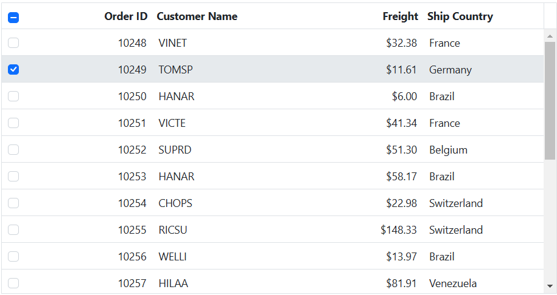
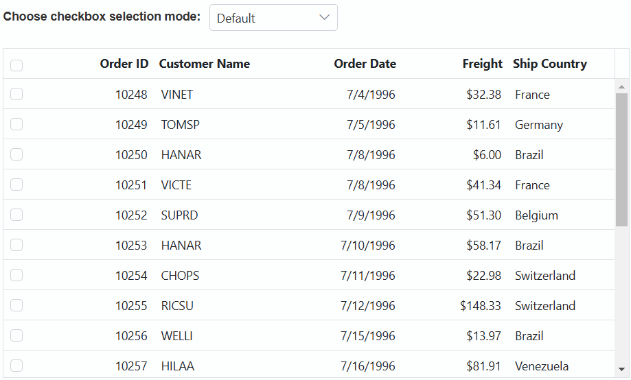
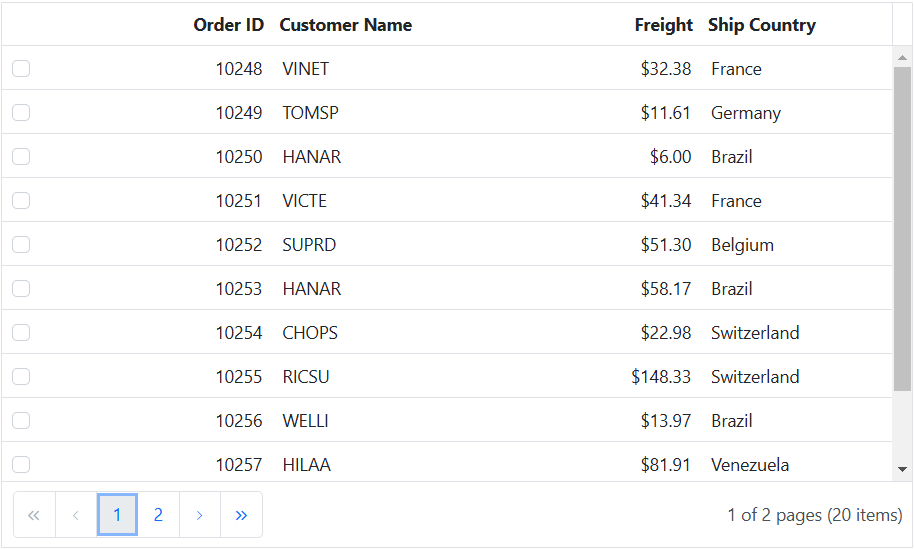
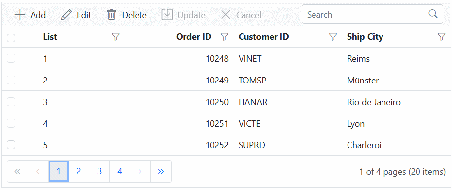
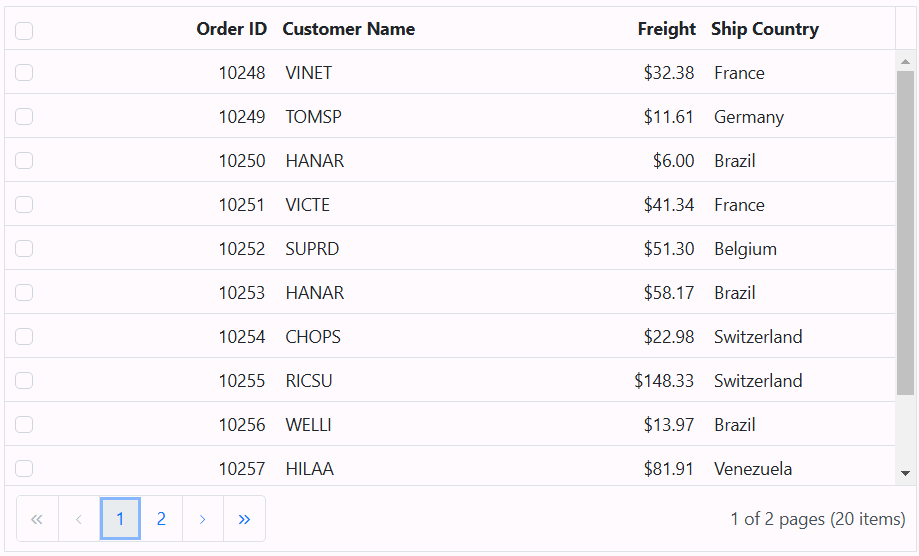
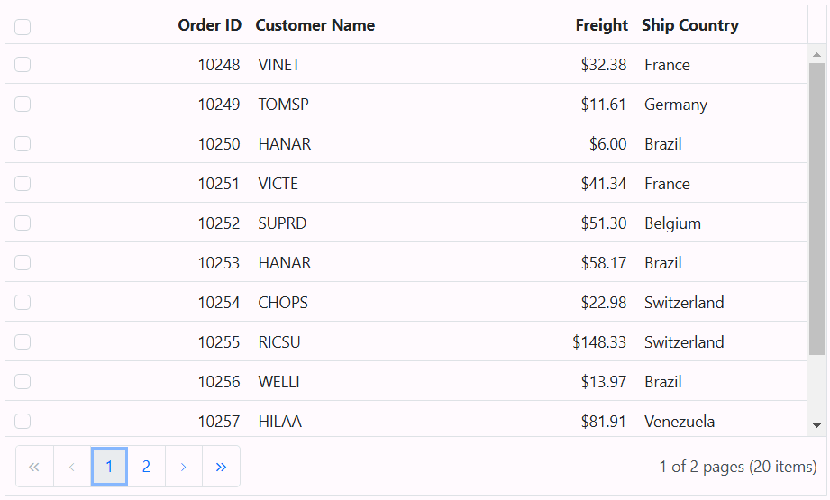

# Check box Selection in ASP.NET MVC Grid component

Checkbox selection in the Grid component allows you to provide an option to select multiple records by using a checkbox in each row. This feature is particularly useful when you need to perform bulk actions or operations on selected records within the Grid.

To render checkbox in each grid row, you need to use checkbox column with type as **checkbox** using column `Type` property.

Here's an example of how to enable check box selection using `Type` property in the Grid component:










> By default selection is allowed by clicking a grid row or checkbox in that row. To allow selection only through checkbox, you can set [SelectionSettings.CheckboxOnly](https://help.syncfusion.com/cr/aspnetmvc-js2/Syncfusion.EJ2.Grids.GridSelectionSettings.html#Syncfusion_EJ2_Grids_GridSelectionSettings_CheckboxOnly) property to **true**.
> Selection can be persisted on all the operations using [SelectionSettings.PersistSelection](https://help.syncfusion.com/cr/aspnetmvc-js2/Syncfusion.EJ2.Grids.GridSelectionSettings.html#Syncfusion_EJ2_Grids_GridSelectionSettings_PersistSelection) property. For persisting selection on the Grid, any one of the column should be defined as a primary key using `Columns.IsPrimaryKey` property.

## Checkbox selection mode

The checkbox selection mode in the Grid allows you to select rows either by clicking on checkboxes or by clicking on the rows themselves. This feature provides two types of checkbox selection modes that can be set using the [SelectionSettings.CheckboxMode](https://help.syncfusion.com/cr/aspnetmvc-js2/Syncfusion.EJ2.Grids.GridSelectionSettings.html#Syncfusion_EJ2_Grids_GridSelectionSettings_CheckboxMode) property. The available modes are:

* **Default**: This is the default value of the `CheckboxMode`. In this mode, you can select multiple rows by clicking rows one by one. When you click on a row, the checkbox associated with that row also switches to the 'checked' state.
* **ResetOnRowClick**: In `ResetOnRowClick` mode, when clicking on row it will reset previously selected row. Also you can perform multiple-selection in this mode by press and hold CTRL key and click the desired rows. To select range of rows, press and hold the SHIFT key and click the rows.

In the following example, it demonstrates how to dynamically enable and change the `CheckboxMode` using the `DropDownList` component:










## Hide selectall checkbox in column header

You can hide the select all checkbox in the column header of the Syncfusion Grid. This is a useful feature in various scenarios where you want to customize the appearance and behavior of the checkboxes within the grid.

By default, when you set the column type as `checkbox`, it renders a column with checkboxes for selection purposes. However, if you want to hide the header checkbox, you can achieve this by defining an empty `HeaderTemplate` directive in the grid Column.

Here's an example of how to hide selectall checkbox in column header using empty `HeaderTemplate` directive in the Grid component:










## Prevent specific rows from being selected in checkbox selection

The checkbox selection mode allows you to select rows either by clicking on checkboxes or by clicking on the rows themselves. However, there might be scenarios where you want to prevent specific rows from being selected based on certain conditions or business requirements.

To achieve this, you can use the [RowDataBound](https://help.syncfusion.com/cr/aspnetmvc-js2/Syncfusion.EJ2.Grids.Grid.html#Syncfusion_EJ2_Grids_Grid_RowDataBound) event of the Grid. The `RowDataBound` event is triggered for each row after it is bound to the data source. In this event, you can check the row data and determine whether the row should be selectable or not. If you want to prevent the row from being selected, you can set the `isSelectable` argument of the event to **false**.

In the following sample, the selection of specific rows has been prevented based on the `isSelectable` argument in the `RowDataBound` event.










## How to select single row in checkbox selection mode

The ASP.NET MVC Grid allows you to select only one row at a time within the Grid. This feature is particularly useful when you want to ensure that only a single row is selected, and any previous selections are cleared when a new row is selected.

To achieve single-row selection in checkbox selection mode within the Grid, you can handle the [RowSelecting](https://help.syncfusion.com/cr/aspnetmvc-js2/Syncfusion.EJ2.Grids.Grid.html#Syncfusion_EJ2_Grids_Grid_RowSelecting) event and use the `clearSelection` method to clear any previous selections before selecting a new row. This ensures that only one row is selected at a time, and any prior selections are deselected when a new row is chosen.

> When you set the [CheckboxMode](https://help.syncfusion.com/cr/aspnetmvc-js2/Syncfusion.EJ2.Grids.GridSelectionSettings.html#Syncfusion_EJ2_Grids_GridSelectionSettings_CheckboxMode) property to **ResetOnRowClick**, it will reset the previously selected row when you click on a new row. Please note that this behavior applies to rows and not checkboxes, and it is the default behavior of the grid.

Here's an example of how to select a single row in checkbox selection mode using the `clearSelection` method along with the `RowSelecting` event:










## Allow selection only through checkbox click

By default, the Grid component allows selection by clicking either a grid row or the checkbox within that row. If you want to restrict selection so that it can only be done by clicking the checkboxes, you can set the [SelectionSettings.CheckboxOnly](https://help.syncfusion.com/cr/aspnetmvc-js2/Syncfusion.EJ2.Grids.GridSelectionSettings.html#Syncfusion_EJ2_Grids_GridSelectionSettings_CheckboxOnly) property to **true**.

Here's an example of how to enable selection only through checkbox click using `checkboxOnly` property:
 









