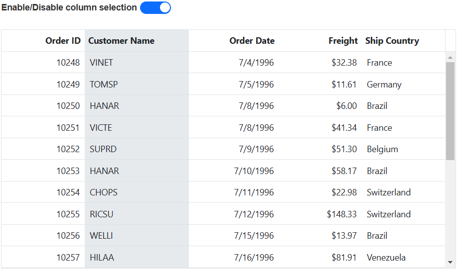

# Selection in Angular Grid component

Selection in the Grid component allows you to interactively select specific cells, rows, or columns within the grid. This selection can be done through mouse clicks or arrow keys (up, down, left, and right) or touch. This feature is useful when you want to highlight, manipulate, or perform actions on specific  cells, rows, or columns within the Grid.

To disable selection in the Grid, set the [allowSelection](https://ej2.syncfusion.com/angular/documentation/api/grid/#allowselection) to **false**.

The grid supports two types of selection that can be set by using the [selectionSettings.type](https://ej2.syncfusion.com/angular/documentation/api/grid/selectionSettings/#type).They are:

* **Single** - The **Single** value is set by default. Allows you to select only a single row or cell or column.
* **Multiple** - Allows you to select multiple rows or cells or columns.

To perform the multi-selection, press and hold CTRL key and click the desired rows or cells or columns.

To select range of rows or cells or columns, press and hold the SHIFT key and click the rows or cells or columns.










> By default, the Grid will be rendered with only the basic features such as Grid rendering and selection. The default module, including the `SelectionService`, is automatically loaded. Therefore, there is no need to inject the `SelectionService` module separately as it will be injected by default.

## Selection mode

The selection mode feature allows you to choose between different modes for selecting rows or cells or both within the Grid based on your specific requirements. This feature is particularly useful when you want to highlight and manipulate specific rows or cells in the Grid.

To enable selection mode, you can set the [selectionSettings.mode](https://ej2.syncfusion.com/angular/documentation/api/grid/selectionSettings/#mode) property. The Grid component supports three types of selection modes:

* **Row** - The row value is set by default. Allows you to select rows only.

* **Cell** - Allows you to select cells only.

* **Both** - Allows you to select rows and cells at the same time.

The following example, demonstrates how to dynamically enable and change the `selectionSettings.mode` using the `DropDownList` component:










## Touch interaction

The touch interaction feature in Grid allows you to easily interact with the grid on touch screen devices. This feature is particularly useful for improving the user experience on mobile devices and tablets, making it easier to navigate and interact with the grid's content using touch gestures.

**Single Row Selection**

When you tap on a grid row using a touch screen, the tapped row is automatically selected. This provides a straightforward way to select single rows with a touch interface.

**Multi-Row Selection**

To select multiple rows in the grid, you can utilize the multi-row selection feature. When you tap on a row, a popup is displayed, indicating the option for multi-row selection. You can tap on the popup, and then proceed to tap on the desired rows that you want to select. This allows you to select and interact with multiple rows simultaneously, as shown in the following image:

 

**Multi-Row or Cell Selection**

In addition to selecting multiple rows, you can also perform multi-row or cell selection in the grid. By tapping on the popup, you can choose the option for multi-row or cell selection. Once selected, you can then tap on the desired rows or cells to make the selection, as shown in the following image:

> For multi-selection, it requires the selection [type](https://ej2.syncfusion.com/angular/documentation/api/grid/selectionSettings/#type) to be **Multiple**.

The following screenshot represents a Grid touch selection in the device.

## Toggle selection

The toggle selection feature in the Grid component allows you to easily select and unselect specific rows, cells, or columns. With toggle selection enabled, you can easily switch the selection state of an item by clicking on it. This means that if you click on a selected row, cell, or column, it will become unselected, and vice versa.

To enable the toggle selection feature, you need to set the [selectionSettings.enableToggle](https://ej2.syncfusion.com/angular/documentation/api/grid/selectionSettings/#enabletoggle) property to **true**.

The following example demonstrates how to enable the toggle selection for both cells and rows in a Grid using the `selectionSettings.enableToggle` property.










> * If multi selection is enabled, then first click on any selected row (without pressing Ctrl key), it will clear the multi selection and in second click on the same row, it will be unselected.
>* Toggle selection is a feature that can be applied to all types of selections. When the `checkboxOnly` property is set to **true**, it restricts the ability to select or deselect rows or cells by clicking on them.

## Clear all selection programmatically

The clear selection programmatically feature is particularly useful when you need to remove the selected rows or cells or columns from the Grid component.

To clear the selection in the component programmatically, you can use the [clearSelection](https://ej2.syncfusion.com/angular/documentation/api/grid/selection/#clearselection)  method. 

In the following example, it demonstrates how to clear all selection by calling the [clearSelection](https://ej2.syncfusion.com/angular/documentation/api/grid/selection/#clearselection) method in the button click event.










  


> In **Both** mode, if you call `clearCellSelection` first, it will clear cell selections, and then if you call `clearRowSelection`, it will clear row selections. The order of method calls determines which type of selection is cleared first.
> To remove a specific selection in a row, cell, or column, utilize the following methods: clearRowSelection for clearing row selections, clearCellSelection for clearing cell selections, and clearColumnSelection for clearing column selections.

## Persist selection 

Persist selection feature in the Grid allows you to retain the selected items even after data manipulation or refreshing the grid. This feature is useful when you want to keep track of the selected items across different grid operations.

To enable persist selection, set the [selectionSettings.persistSelection](https://ej2.syncfusion.com/angular/documentation/api/grid/selectionSettings/#persistselection) property to **true**.

> * While using persist selection feature, at least one column in your grid should be enabled as a primary key. This ensures that the grid can identify and persist the selected items correctly.
>* The `persistSelection` feature is not supported for cell selections in the Syncfusion Angular Grid component.
>* The `persistSelection` feature is only supported for grid `multiple` type selections.

In the following example, it demonstrates how to enable the persist selection feature for both rows and columns using the `selectionSettings.persistSelection` property :










  
