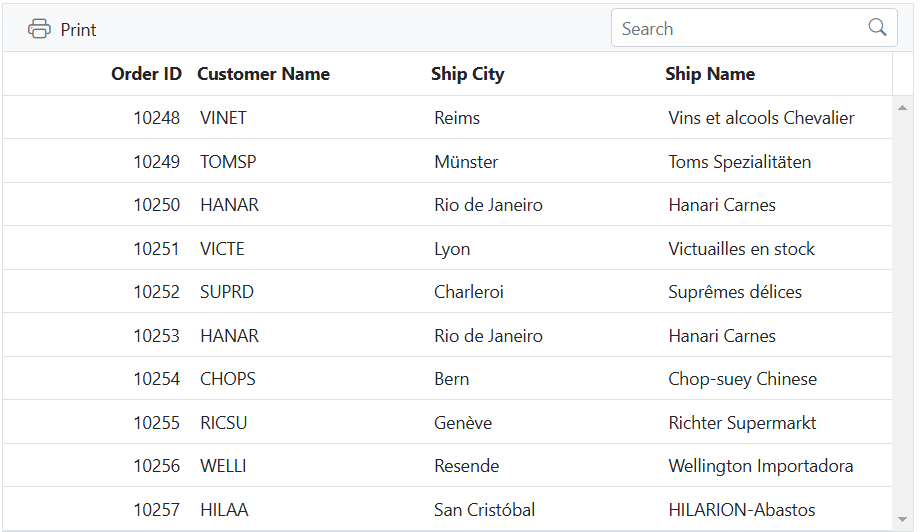

# Custom toolbar in Angular Grid component

Custom toolbar in Syncfusion Angular Grid allows you to create a distinctive toolbar layout, style, and functionality that aligns with the specific needs of your application, providing a personalized experience within the Grid component.

This can be achieved by utilizing the `toolbarTemplate` property, which offers extensive customization options for the toolbar. You can define a custom template for the toolbar and handle the actions of the toolbar items in the **clicked** event.

The following example demonstrates, how to render the custom toolbar using `toolbarTemplate`










## Render image with text in custom toolbar

Render an image with text in custom toolbar in Syncfusion Angular Grid allows easily render an image along with text in the toolbar of the Grid. This feature enhances the visual presentation of the Grid, providing additional context and improving the overall experience.

To render an image with text in custom toolbar, you can utilize the `ng-template` along with the `DomSanitizer` service and the `bypassSecurityTrustResourceUrl` method in your code. This ensures the secure presentation of an image provided as a base64-encoded string.

1. `DomSanitizer`: The `DomSanitizer` service furnishes methods that enable you to mark a value as trusted for specific security contexts. By doing so, you inform Angular that you have already verified the value's safety, permitting it to be rendered. This plays a pivotal role in preventing XSS attacks.

2. `bypassSecurityTrustResourceUrl`: This specific method of `DomSanitizer` is used when you want to assure Angular that a URL is secure and suitable for use as a resource source. In your code example, by applying this method to denote a base64-encoded image as secure, you explicitly signify that the supplied image data is trustworthy and does not pose a security risk.

The following example demonstrates how to render an image in the toolbar of the grid using `ng-template`.  










> You can further customize the styles and layout of the image and text in the custom toolbar to suit your specific design requirements.

## Render DropDownList in custom toolbar

Render DropDownList in custom toolbar in Syncfusion Angular Grid enables you to extend the functionality of the custom toolbar by incorporating a [DropDownList](https://ej2.syncfusion.com/angular/documentation/drop-down-list/getting-started) component, allowing you to perform various actions within the Grid based on their selections.

This can be achieved by utilizing the `ng-template`. The example below demonstrates how to render the **DropDownList** component in the custom toolbar, where the toolbar template includes the its [change](https://ej2.syncfusion.com/angular/documentation/api/drop-down-list#change) event is bound to the **onChange** method.

In the **onChange** method, the text of the selected item is checked to determine the appropriate action. For example, if **Update** is chosen, the [endEdit](https://ej2.syncfusion.com/angular/documentation/api/grid#endedit) method is called to exit the edit mode. If **Edit** is selected, the selected record is passed to the [startEdit](https://ej2.syncfusion.com/angular/documentation/api/grid#startedit) method to initiate the edit mode dynamically. Similarly, if **Delete** is picked, the selected record is passed to the [deleteRecord](https://ej2.syncfusion.com/angular/documentation/api/grid#deleterecord) method to remove it from the grid.










## Render a component or element using the toolbar template

Rendering a component or element using the toolbar template in the Syncfusion Angular Grid allows you to extend the capabilities of the grid toolbar by incorporating custom components or elements. This provides flexibility to enhance the toolbar with custom buttons, dropdowns, input fields, icons, or any other desired UI elements. You can bind event handlers or handle interactions within the template to enable specific actions or behaviors associated with the added components or elements.

To render custom components or elements within the toolbar, use the `ng-template` directive. This allows you to include other components, such as a [Button](https://ej2.syncfusion.com/angular/documentation/button/getting-started), and perform specific grid actions based on the button click. For example, when the **ExcelExport** button is clicked, the [excelExport](https://ej2.syncfusion.com/angular/documentation/api/grid/#excelexport) method is called to export the grid to Excel. Similarly, when the **PdfExport** button is clicked, the [pdfExport](https://ej2.syncfusion.com/angular/documentation/api/grid/#pdfexport) method is called to export the grid to PDF format.Likewise, when the **Print** button is clicked, the [print](https://ej2.syncfusion.com/angular/documentation/api/grid/#print) method will triggered to print the grid.

The following example demonstrates how to render a **Button** component in the toolbar using `ng-template` and perform grid action based on the respected button click.










