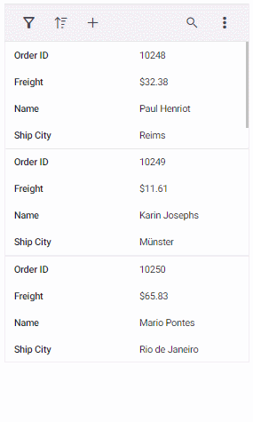
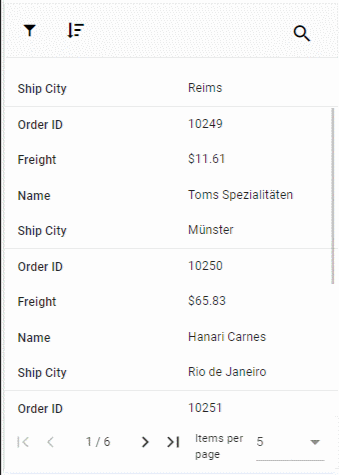

# Adaptive View

The Grid user interface (UI) was redesigned to provide an optimal viewing experience and improve usability on small screens. This interface will render the filter, sort, column chooser, column menu(supports only when the `rowRenderingMode` as Horizontal) and edit dialogs adaptively and have an option to render the grid row elements in the vertical direction.

## Render adaptive dialogs

When we enable the [enableAdaptiveUI](https://help.syncfusion.com/cr/aspnetcore-js2/Syncfusion.EJ2.Grids.Grid.html#Syncfusion_EJ2_Grids_Grid_EnableAdaptiveUI) property, the grid will render the filter, sort, and edit dialogs in full screen for a better user experience. This behavior is demonstrated in the below demo.
























## Vertical row rendering

The grid will render the row elements in vertical order while setting the [`rowRenderingMode`](https://help.syncfusion.com/cr/aspnetcore-js2/Syncfusion.EJ2.Grids.Grid.html#Syncfusion_EJ2_Grids_Grid_RowRenderingMode) property value as **Vertical**.
























N> * [`enableAdaptiveUI`](https://help.syncfusion.com/cr/aspnetcore-js2/Syncfusion.EJ2.Grids.Grid.html#Syncfusion_EJ2_Grids_Grid_EnableAdaptiveUI) property must be enabled for vertical row rendering.

### Supported features by vertical row rendering

The following features are only supported in vertical row rendering:

* Paging, including Page size dropdown
* Sorting
* Filtering
* Selection
* Dialog Editing
* Aggregate
* Infinite scroll
* Toolbar - Options like **Add**, **Filter**, **Sort**, **Edit**, **Delete**, **Search**, and **Toolbar template** are available when their respective features are enabled. The toolbar dynamically includes a three-dotted icon, containing additional features like **ColumnChooser**, **Print**, **PdfExport**, **ExcelExport**, or **CsvExport**, once these features are enabled. Please refer to the following snapshot.

A snapshot of the adaptive grid displaying enabled paging along with a pager dropdown.

> The Column Menu feature, which includes grouping, sorting, autofit, filter, and column chooser, is exclusively supported for the Grid in **Horizontal** [`rowRenderingMode`](https://help.syncfusion.com/cr/aspnetcore-js2/Syncfusion.EJ2.Grids.Grid.html#Syncfusion_EJ2_Grids_Grid_RowRenderingMode).

## Rendering an adaptive layout for smaller screens alone

By default, adaptive UI layout is rendered in both mobile devices and desktop mode too while setting the [enableAdaptiveUI](https://help.syncfusion.com/cr/aspnetcore-js2/Syncfusion.EJ2.Grids.Grid.html#Syncfusion_EJ2_Grids_Grid_EnableAdaptiveUI) property as **true**. Now the DataGrid component has an option to render an adaptive layout only for mobile screen sizes. This can be achieved by specifying the `AdaptiveUIMode` property value as `Mobile`. The default value of the `AdaptiveUIMode` property is "Both".

> The [rowRenderingMode](https://help.syncfusion.com/cr/aspnetcore-js2/Syncfusion.EJ2.Grids.Grid.html#Syncfusion_EJ2_Grids_Grid_RowRenderingMode) property is rendered on the adaptive layout based on the `AdaptiveUIMode` property.









