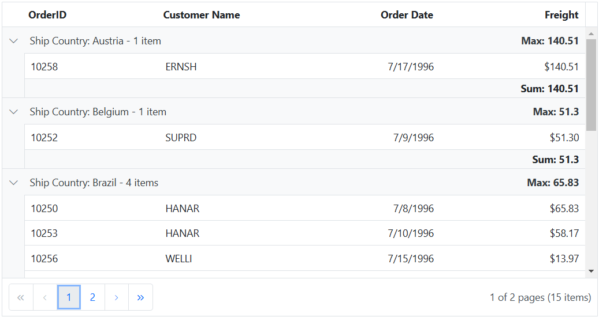
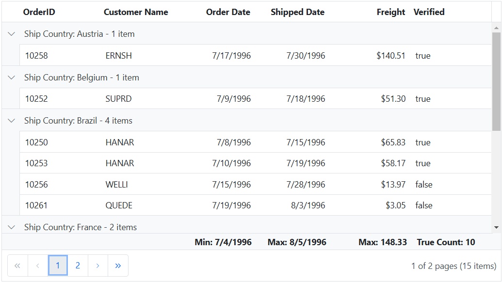

# Aggregates in ASP.Net Core Grid component

The Aggregates feature in the Syncfusion ASP.Net Core Grid component allows you to display aggregate values in the footer, group footer, and group caption of the grid. With this feature, you can easily perform calculations on specific columns and show summary information. This feature can be configured using the **e-grid-aggregates** directive. To represent an aggregate column, you need to specify the minimum required properties, such as `field` and [type](https://help.syncfusion.com/cr/aspnetcore-js2/Syncfusion.EJ2.Grids.AggregateType.html).

**Displaying aggregate values**

By default, the aggregate values are displayed in the footer, group, and caption cells of the grid. However, you can choose to display the aggregate value in any of these cells by using the following properties:

* **`footerTemplate`:** Use this property to display the aggregate value in the footer cell. You can define a custom template to format the aggregate value as per your requirements.

* **`groupFooterTemplate`:** Use this property to display the aggregate value in the group footer cell. Similar to the footerTemplate, you can provide a custom template to format the aggregate value.

* **`groupCaptionTemplate`:** Use this property to display the aggregate value in the group caption cell. You can define a custom template to format the aggregate value.










> * When using local data, the total summary is calculated based on the entire dataset available in the grid. The aggregate values will reflect calculations across all the rows in the grid.

> * When working with remote data, the total summary is calculated based on the current page records. This means that if you have enabled pagination and are displaying data in pages, the aggregate values in the footer will represent calculations only for the visible page.

## Built-in aggregate types

The Syncfusion ASP.Net Core Grid component provides several built-in aggregate types that can be specified in the [type](https://help.syncfusion.com/cr/aspnetcore-js2/Syncfusion.EJ2.Grids.AggregateType.html) property to configure an aggregate column.

The available built-in aggregate types are:

* **Sum:** Calculates the sum of the values in the column.
* **Average:** Calculates the average of the values in the column.
* **Min:** Finds the minimum value in the column.
* **Max:** Finds the maximum value in the column.
* **Count:** Counts the number of values in the column.
* **TrueCount:** Counts the number of true values in the column.
* **FalseCount:** Counts the number of false values in the column.

Here is an example that demonstrates how to use built-in aggregates types in the Syncfusion Grid:










