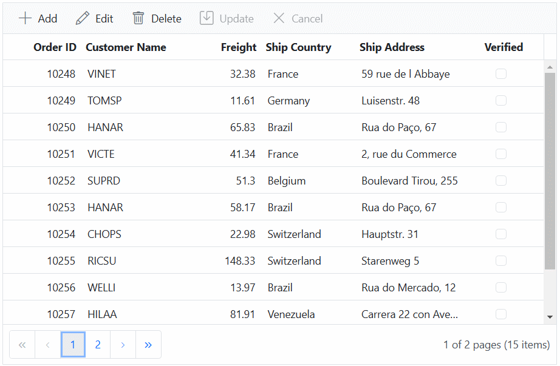

# Template editing in ASP.NET Core Grid control

## Inline or dialog template editing

The dialog/inline template editing provides an option to customize the default behavior of dialog editing. Using the dialog template, you can render your own editors by defining the [editSettings.mode](https://help.syncfusion.com/cr/aspnetcore-js2/Syncfusion.EJ2.Grids.GridEditSettings.html#Syncfusion_EJ2_Grids_GridEditSettings_Mode) as `Dialog/Inline` and [editSetting.template](https://help.syncfusion.com/cr/aspnetcore-js2/Syncfusion.EJ2.Grids.GridEditSettings.html#Syncfusion_EJ2_Grids_GridEditSettings_Template) as SCRIPT element ID or HTML string which holds the template.

In some cases, you need to add the new field editors in the dialog which are not present in the column model. In that situation, the dialog template will help you to customize the default edit dialog.

In the following sample, grid enabled with dialog template editing.


























> The template form editors should have **name** attribute.

## Using template context

You can enhance the customization of your grid's edit forms by utilizing template contexts, such as accessing row details inside template, rendering editors as components, getting values from editors, setting focus to editors, and disabling default form validation, and adding custom validation. These features are applicable in both **inline** and **dialog** editing modes.

The following template context topics are demonstrated through a practical example in the [Render tab component inside the dialog template](https://ej2.syncfusion.com/vue/documentation/grid/editingtemplate-editing#render-tab-component-inside-the-dialog-template) topic.

### Access row details inside template using template context

When utilizing edit templates in the Grid , you can access crucial row information within an template when utilizing edit templates. This enables dynamic binding of attributes, values, or elements based on the specific row being edited. This is particularly useful for conditionally rendering or modifying elements in the edit template based on the row's state.

The following properties will be available at the time of template execution:

| Property Name | Usage |
|---------------|-------|
| <kbd>isAdd</kbd> | A Boolean property that defines whether the current row is a new record or not. |

The following code example demonstrates the usage of the `isAdd` property in an edit template to disable the **OrderID** textbox when it's not a new record:

```ts
    <input id="OrderID" name="OrderID" type="text" value=${if(isAdd)} '' ${else} ${OrderID} ${/if}  ${if(isAdd)}'' ${else} disabled ${/if}/>
```

### Render editors as components 

The Syncfusion Grid provides a powerful feature that allows you to dynamically render Syncfusion EJ2 controls as form editors during the editing process. This functionality is particularly useful when you want to provide feature-rich controls for data entry within the edit form.

To achieve this by utilizing the [actionComplete](https://help.syncfusion.com/cr/aspnetcore-js2/syncfusion.ej2.grids.grid.html#Syncfusion_EJ2_Grids_Grid_ActionComplete) event of the Grid and specifying `requestType` as **beginEdit** or **add**.

The following code example illustrates rendering the `DropDownList` component in the `actionComplete` event.

```js

    function actionComplete(args) {
        if ((args.requestType === 'beginEdit' || args.requestType === 'add')) {
            let countryData: {}[] = DataUtil.distinct(data, 'ShipCountry', true);
            new DropDownList({value: args.rowData.ShipCountry, popupHeight: '200px', floatLabelType: 'Always',
                dataSource: countryData, fields: {text: 'ShipCountry', value: 'ShipCountry'}, placeholder: 'Ship Country'}, args.form.elements.namedItem('ShipCountry'));
        }
    }

```

### Get value from editor

The get value from editor feature in the Syncfusion Grid allows you to read, format, and update the current editor value before it is saved. This feature is particularly valuable when you need to perform specific actions on the data, such as formatting or validation, before it is committed to the underlying data source. 

To achieve this feature, you can utilize the [actionBegin](https://help.syncfusion.com/cr/aspnetcore-js2/syncfusion.ej2.grids.grid.html#Syncfusion_EJ2_Grids_Grid_ActionBegin) event with the **requestType** set to **save**.

In the following code example, the freight value has been formatted and updated.
 
```ts
    function actionBegin(args) {
        if (args.requestType === 'save') {
            // cast string to integer value.
            args.data['Freight'] = parseFloat(args.form.querySelector("#Freight").value);
        }
    }

```

### Set focus to particular column editor 

The Syncfusion Grid allows you to control the focus behavior of input elements in edit forms. By default, the first input element in the dialog receives focus when the dialog is opened. However, in scenarios where the first input element is disabled or hidden, you can specify which valid input element should receive focus. This can be achieved using the [actionComplete](https://help.syncfusion.com/cr/aspnetcore-js2/syncfusion.ej2.grids.grid.html#Syncfusion_EJ2_Grids_Grid_ActionComplete) event of the Grid,  where the **requestType** is set to **beginEdit**.

In the following code example, the CustomerID column focused.
 
```ts

    function actionComplete(args) {
        // Set initail Focus
        if (args.requestType === 'beginEdit') {
            (args.form.elements.namedItem('CustomerID')).focus();
        }
    }

```

## Disable default form validation

The Syncfusion Grid provides built-in support for [vue form validation](https://vue-bootstrap.netlify.app/docs/forms/validation/) to ensure data integrity and accuracy during editing. However, there might be scenarios where you want to disable the default form validation rules. This can be achieved using the `removeRules` method within the [actionComplete](https://help.syncfusion.com/cr/aspnetcore-js2/syncfusion.ej2.grids.grid.html#Syncfusion_EJ2_Grids_Grid_ActionComplete) event of the Grid.

To disable default form validation rules in the Grid, follow these steps:

```typescript

    function actionComplete: (args) {
        if ((args.requestType === 'beginEdit' || args.requestType === 'add')) {
            // Disable the Validation Rules
            args.form.ej2_instances[0].removeRules();
        }
    }

```
> * You can use this method to disable validation rules: **args.form.ej2_instances[0].rules = {}**.

## Adding validation rules for custom editors

The Syncfusion Grid provides the ability to add validation rules for fields that are not present in the column model. This feature is particularly useful to prevent erroneous or inconsistent data from being submitted, ultimately enhancing the reliability of your application's data.

To accomplish this, you can utilize the [actionComplete](https://help.syncfusion.com/cr/aspnetcore-js2/syncfusion.ej2.grids.grid.html#Syncfusion_EJ2_Grids_Grid_ActionComplete) event along with the [addRules](https://ej2.syncfusion.com/documentation/api/form-validator/#addrules) method.

Here's how you can use the `addRules` method to add validation rules for custom editors in the `actionComplete` event: 
 
```ts

    function actionComplete(args) {
        if ((args.requestType === 'beginEdit' || args.requestType === 'add')) {
            // Add Validation Rules
            args.form.ej2_instances[0].addRules('Freight', {max: 500});
        }
    }

```

## Render tab control inside the dialog template

You can enhance the editing experience in the Grid by rendering a [Tab](https://ej2.syncfusion.com/aspnetcore/documentation/tab/getting-started) component inside the dialog template. This feature is especially useful when you want to present multiple editing sections or categories in a tabbed layout, ensuring a more intuitive and easily navigable interface for data editing.

To enable this functionality, you need to set the [editSettings.mode](https://help.syncfusion.com/cr/aspnetcore-js2/Syncfusion.EJ2.Grids.GridEditSettings.html#Syncfusion_EJ2_Grids_GridEditSettings_Mode) property of the Grid to **Dialog**. This configures the Grid to use the dialog editing mode. Additionally, you can use the [editSettings.template](https://help.syncfusion.com/cr/aspnetcore-js2/Syncfusion.EJ2.Grids.GridEditSettings.html#Syncfusion_EJ2_Grids_GridEditSettings_Template) property to define a template variable that contains the `Tab` component and its corresponding content.

The following example renders a tab component inside the edit dialog. The tab component has two tabs, and once you fill in the first tab and navigate to the second one, the validation for the first tab is performed before navigating to the second.












