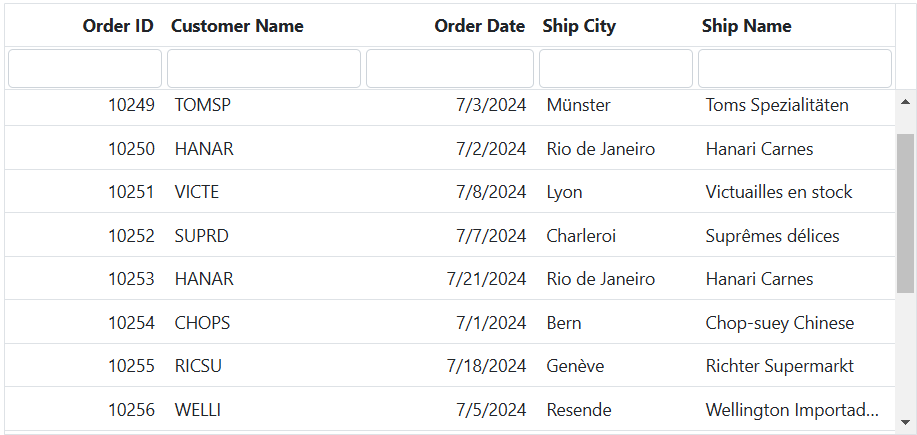
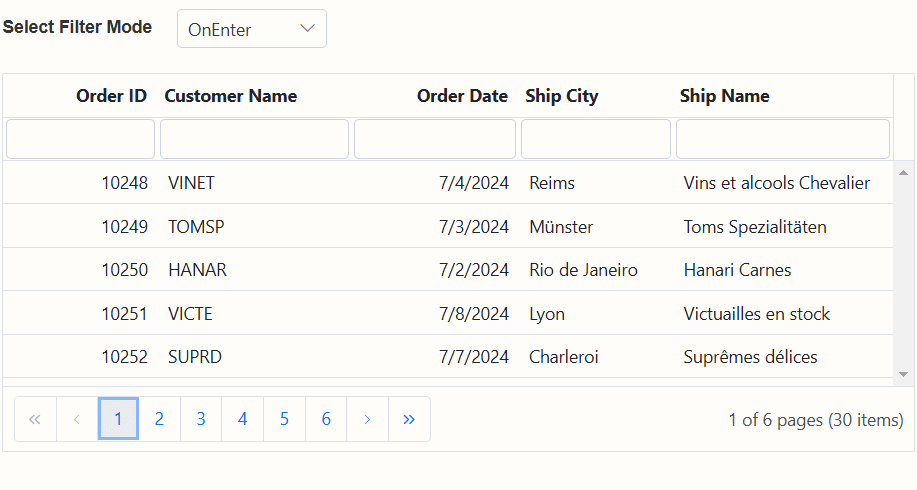
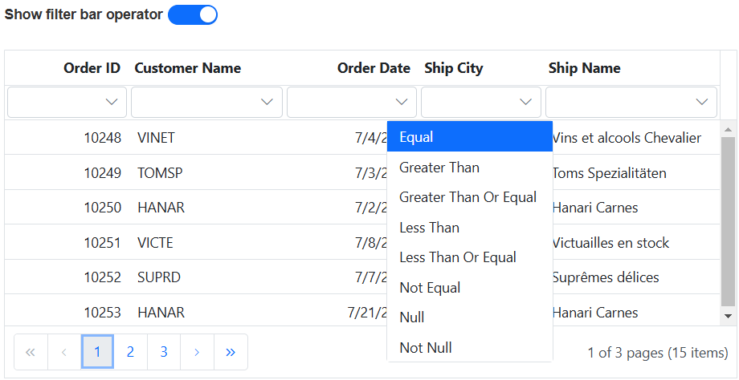
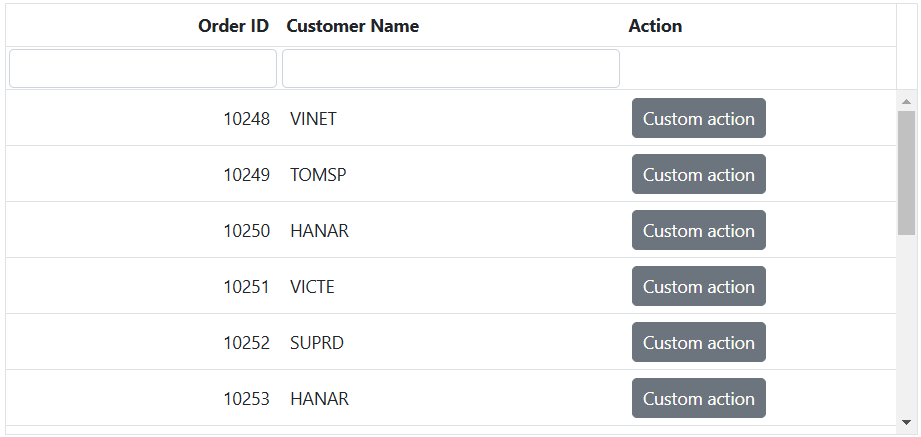
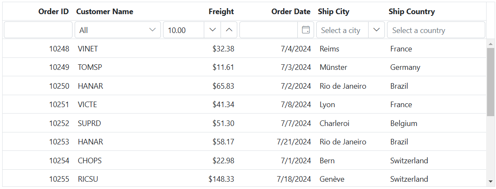

 
# Filter bar in ASP.NET Core Grid component

The filter bar feature provides a user-friendly way to filter data in the Syncfusion ASP.NET Core Grid. It displays an input field for each column, allowing you to enter filter criteria and instantly see the filtered results.

By defining the [allowFiltering](https://help.syncfusion.com/cr/aspnetcore-js2/syncfusion.ej2.grids.grid.html#Syncfusion_EJ2_Grids_Grid_AllowFiltering) to true, then filter bar row will be rendered next to header which allows you to filter data. You can filter the records with different expressions depending upon the column type.
 
**Filter bar expressions:**
You can enter the following filter expressions(operators) manually in the filter bar.

Expression |Example |Description |Column Type
-----|-----|-----|-----
= |=value |equal |Number
!= |!=value |notequal |Number
> |>value |greaterthan |Number
< |<value |lessthan |Number
>= |>=value |greaterthanorequal |Number
<=|<=value|lessthanorequal |Number
* |*value |startswith |String
% |%value |endswith |String
N/A |N/A |Always **equal** operator will be used for Date filter |Date
N/A |N/A |Always **equal** operator will be used for Boolean filter |Boolean
 
The following example demonstrates how to activate default filtering in the grid.










> To enable or dynamically switch the filter type, you must set the [filterSettings.type](https://help.syncfusion.com/cr/aspnetcore-js2/Syncfusion.EJ2.Grids.GridFilterSettings.html#Syncfusion_EJ2_Grids_GridFilterSettings_Type) as **FilterBar**.

## Filter bar modes

The Syncfusion ASP.NET Core Grid component refers to two different ways in which the grid's filter bar can operate when filtering criteria are applied. These modes, "OnEnter Mode" and "Immediate Mode," offer users different experiences and behaviors when interacting with the filter bar.

**OnEnter Mode:**
By settings [filterSettings.mode](https://help.syncfusion.com/cr/aspnetcore-js2/Syncfusion.EJ2.Grids.GridFilterSettings.html#Syncfusion_EJ2_Grids_GridFilterSettings_Mode) as **OnEnter**, the filter bar captures the filter criteria entered but doesn't initiate filtering until the **Enter** key is pressed. This allows multiple criteria modifications without triggering immediate filtering actions.

**Immediate Mode:**
By settings [filterSettings.mode](https://help.syncfusion.com/cr/aspnetcore-js2/Syncfusion.EJ2.Grids.GridFilterSettings.html#Syncfusion_EJ2_Grids_GridFilterSettings_Mode) as **Immediate**, the filter bar instantly applies filtering as filter criteria are entered. Filtering actions take place as soon as criteria are input or modified, providing real-time previews of filtering results.










## Display filter text in pager

The Syncfusion ASP.NET Core Grid component provides an option to display filter text within the pager, indicating the current filtering status. Enabling this feature provides you with a clear understanding of the applied filters and the criteria used for filtering.

To enable the display of filter text within the pager, you should set the [showFilterBarStatus](https://help.syncfusion.com/cr/aspnetcore-js2/Syncfusion.EJ2.Grids.GridFilterSettings.html#Syncfusion_EJ2_Grids_GridFilterSettings_ShowFilterBarStatus) property within the [filterSettings](https://help.syncfusion.com/cr/aspnetcore-js2/Syncfusion.EJ2.Grids.Grid.html#Syncfusion_EJ2_Grids_Grid_FilterSettings) configuration.










## Show or hide filter bar operator in filter bar cell

In the Syncfusion ASP.NET Core Grid component, you have the ability to modify the filter operator for a column directly within the user interface during the filtering process through the filter bar cell. For instance, the default operator for filtering string-type columns in the filter bar is "startswith". Now, you can customize the default operator for a specific column using the filter operator feature.

To achieve this functionality, you can enable the  [showFilterBarOperator](https://help.syncfusion.com/cr/aspnetcore-js2/Syncfusion.EJ2.Grids.GridFilterSettings.html#Syncfusion_EJ2_Grids_GridFilterSettings_ShowFilterBarOperator) property within the [filterSettings](https://help.syncfusion.com/cr/aspnetcore-js2/Syncfusion.EJ2.Grids.Grid.html#Syncfusion_EJ2_Grids_Grid_FilterSettings).










## Prevent filtering for particular column

In the Syncfusion ASP.NET Core Grid, you can prevent filtering for a specific column by utilizing the [allowFiltering](https://help.syncfusion.com/cr/aspnetcore-js2/Syncfusion.EJ2.Grids.Grid.html#Syncfusion_EJ2_Grids_Grid_AllowFiltering) property of the [column](https://help.syncfusion.com/cr/aspnetcore-js2/Syncfusion.EJ2.Grids.GridColumns.html) object and setting it to **false**. This feature is useful when you want to disable filtering options for a particular column.

Here's an example that demonstrates how to remove the filter bar for the **CustomerID** column in Syncfusion ASP.NET Core Grid:










## Hide filter bar for template column

By default, the filter bar is set to a disabled mode for template columns in the grid. However, in certain cases, you may want to hide the filter bar for a template column to provide a customized filtering experience.

To hide the filter bar for a template column, you can use the `filterTemplate` property of the [column](https://help.syncfusion.com/cr/aspnetcore-js2/Syncfusion.EJ2.Grids.GridColumns.html). This property allows you to define a custom template for the filter bar of a column.

Here's an example that demonstrates how to hide the filter bar for a template column in the Syncfusion ASP.NET Core Grid:










## Filter bar template with custom component 

The `filterBarTemplate` feature in the Syncfusion ASP.NET Core Grid allows you to customize the components displayed in the filter bar. Normally, a text box is the default element rendered in the filter bar cell. This flexibility allows you to use various components, such as datepicker, numerictextbox, combobox, and multiselect, within the filter bar based on your specific requirements.

To utilize this feature, you can define a custom template for the filter bar by setting the `filterBarTemplate` property of a column in your ASP.NET Core application:










## See also

* [How to perform filter by using Wildcard and LIKE operator filter](./filtering/#wildcard-and-like-operator-filter)