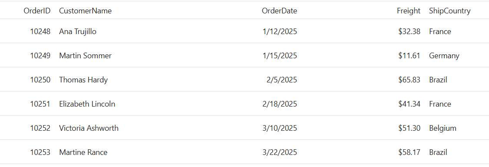

# Getting Started with ASP.NET Core DataGrid Control

The Syncfusion [ASP.NET Core DataGrid](https://www.syncfusion.com/aspnet-core-ui-controls/grid) is a powerful control for displaying and manipulating tabular data. In this tutorial, you'll learn how to add the DataGrid to a new ASP.NET Core Razor Pages application using [Visual Studio](https://visualstudio.microsoft.com/vs/) or [Visual Studio Code](https://code.visualstudio.com/).

## Prerequisites

### .NET and Visual Studio compatibility

| .NET version | Minimum Visual Studio version |
|--------------|------------------------------|
| .NET 10.0 | Visual Studio 2026 18.0.0 or later |
| .NET 9.0 | Visual Studio 2022 17.12.0 or later |
| .NET 8.0 | Visual Studio 2022 17.8.0 or later |
| .NET Core SDK 3.1 | Visual Studio 2019 16.4 or later |
| .NET Core SDK 2.0 | Visual Studio 2017 15.7 or later |

### Browser Support

|    Browser    |    Versions    |
|--------------|---------------|
|    Google Chrome, including Android & iOS    |    Latest Version  |
|    Mozilla Firefox    |    Latest Version  |
|    Microsoft Edge    |    Latest Version  |
|    Apple Safari, including iOS    |    Latest Version  |
|    Opera    |    Latest Version  |
|    Microsoft Internet Explorer    |    11  |

> **Ready to streamline your ASP.NET Core development?** Discover the full potential of ASP.NET Core controls with AI Coding Assistant. Effortlessly integrate, configure, and enhance your projects with intelligent, context-aware code suggestions, streamlined setups, and real-time insights—all seamlessly integrated into your preferred AI-powered IDEs like Visual Studio, Visual Studio Code, Cursor, Code Studio and more. [Explore AI Coding Assistant](https://ej2.syncfusion.com/aspnetcore/documentation/ai-coding-assistant/overview)

To get started quickly with ASP.NET Core DataGrid control, you can check out this video.



## Create an ASP.NET Core Web App with Razor pages





Create an ASP.NET Core Web App using Visual Studio via [Microsoft Templates](https://learn.microsoft.com/en-us/aspnet/core/tutorials/razor-pages/razor-pages-start?view=aspnetcore-10.0&tabs=visual-studio#create-a-razor-pages-web-app) or the [ASP.NET Core Extension](https://ej2.syncfusion.com/aspnetcore/documentation/visual-studio-integration/create-project).





Run the following command to create a new ASP.NET Core Web App.




dotnet new webapp -o RazorPagesGrid
code -r RazorPagesGrid




Alternatively, create an ASP.NET Core Web App using Visual Studio Code via [Microsoft Templates](https://learn.microsoft.com/en-us/aspnet/core/tutorials/razor-pages/razor-pages-start?view=aspnetcore-10.0&tabs=visual-studio-code#create-a-razor-pages-web-app) or the [ASP.NET Core Extension](https://ej2.syncfusion.com/aspnetcore/documentation/visual-studio-code-integration/create-project), or the [C# Dev Kit](https://marketplace.visualstudio.com/items?itemName=ms-dotnettools.csdevkit) extension.





## Install the required ASP.NET Core package

Install the [Syncfusion.EJ2.AspNet.Core](https://www.nuget.org/packages/Syncfusion.EJ2.AspNet.Core/) NuGet package (latest stable version on NuGet is recommended; this guide uses `26.1.35`). All Syncfusion ASP.NET Core packages are available on [nuget.org](https://www.nuget.org/packages?q=Syncfusion.EJ2). See the [NuGet packages](https://ej2.syncfusion.com/aspnetcore/documentation/nuget-packages) topic for details and private/enterprise feed configuration.





1. Go to *Tools → NuGet Package Manager → Manage NuGet Packages for Solution*.
2. Search the required NuGet package (`Syncfusion.EJ2.AspNet.Core`) and install it.

Alternatively, you can install the same package using the Package Manager Console with the following command. Visual Studio restores packages automatically after install.




Install-Package Syncfusion.EJ2.AspNet.Core -Version {{ site.releaseversion }}








Open the terminal and run the following command (then run `dotnet restore` if packages are not restored automatically):




dotnet add package Syncfusion.EJ2.AspNet.Core --version {{ site.releaseversion }}








## Register the Syncfusion license key

Open **~/Program.cs** and register your Syncfusion license key before building the application. This is required for non-evaluation use.




using Syncfusion.Licensing;

SyncfusionLicenseProvider.RegisterLicense("YOUR_LICENSE_KEY");




> Replace `YOUR_LICENSE_KEY` with a valid key from your [Syncfusion account](https://www.syncfusion.com/account/downloads). Trial keys are also accepted for evaluation.

## Add ASP.NET Core Tag Helper

After the package is installed, open the **~/Pages/_ViewImports.cshtml** file and import the Syncfusion.EJ2 tag helpers. If `_ViewImports.cshtml` does not exist, create it under `~/Pages/`.




@addTagHelper *, Syncfusion.EJ2




## Add stylesheet and script resources

Reference the theme stylesheet and script from the [CDN](https://ej2.syncfusion.com/aspnetcore/documentation/appearance/theme#cdn-reference). Include the [stylesheet](https://ej2.syncfusion.com/aspnetcore/documentation/appearance/theme) and [script references](https://ej2.syncfusion.com/aspnetcore/documentation/common/adding-script-references) inside the `<head>` of **~/Pages/Shared/_Layout.cshtml** file. Available built-in themes include `material3.css`, `tailwind.css`, `bootstrap5.css`, `fluent2.css`, and `fabric.css` — swap the filename in the `<link>` below to switch themes.

> **Note:** The bundled `ej2.min.js` script shown here is for the classic script-tag pattern. For modular ESM imports or per-component scripts, see the official [Adding script references](https://ej2.syncfusion.com/aspnetcore/documentation/common/adding-script-references) topic.




<head>
    ...
    <!-- Syncfusion ASP.NET Core controls styles -->
    <link rel="stylesheet" href="https://cdn.syncfusion.com/ej2/{{ site.ej2version }}/fluent2.css" />
    <!-- Syncfusion ASP.NET Core controls scripts -->
    
</head>




## Register the script manager

Open the **~/Pages/Shared/_Layout.cshtml** file and register the script manager `<ejs-scripts>` at the end of the `<body>` element as follows.

> The order matters: add the stylesheet and `<script>` reference inside `<head>`, then place `<ejs-scripts>` at the end of `<body>`.




<body>
    ...
    <!-- Syncfusion ASP.NET Core Script Manager -->
    <ejs-scripts></ejs-scripts>
</body>




## Add ASP.NET Core DataGrid control

Add the [ASP.NET Core DataGrid](https://www.syncfusion.com/aspnet-core-ui-controls/grid) control in `~/Pages/Index.cshtml` file.






....
....
public class IndexModel : PageModel
{
    public void OnGet() { }
}

public class Order
{
    public Order() { }
    public Order(int id, string customer, DateTime date, string country, double freight)
    {
        this.OrderID = id;
        this.CustomerID = customer;
        this.OrderDate = date;
        this.ShipCountry = country;
        this.Freight = freight;
    }

    public int? OrderID { get; set; }
    public string CustomerID { get; set; }
    public DateTime? OrderDate { get; set; }
    public string ShipCountry { get; set; }
    public double? Freight { get; set; }
}



## Run the application





Press <kbd>Ctrl</kbd>+<kbd>F5</kbd> (Windows) or <kbd>⌘</kbd>+<kbd>F5</kbd> (macOS) to launch the application. The DataGrid will render in your default web browser. If prompted, run `dotnet dev-certs https --trust` to trust the local development certificate.





Open the terminal and run the following command. If prompted, run `dotnet dev-certs https --trust` to trust the local development certificate.




dotnet run








## Troubleshooting

- **Grid renders blank or with no styling** — verify the theme stylesheet `<link>` and the Syncfusion `<script>` reference are inside `<head>` of `_Layout.cshtml`, and that `<ejs-scripts>` is the last element in `<body>`.
- **`ejs-grid` tag is not recognized** — make sure `@addTagHelper *, Syncfusion.EJ2` is present in `~/Pages/_ViewImports.cshtml` and rebuild the project.
- **`ejs-scripts` cannot be found** — confirm the `Syncfusion.EJ2.AspNet.Core` package is installed and restored (`dotnet restore`).
- **Tag helpers do not appear after a package upgrade** — restart Visual Studio / VS Code and rebuild the project to clear cached tag helper discovery.
- **License warning overlay** — register a valid license key in `Program.cs` as shown in the "Register the Syncfusion license key" step above.
- **HTTPS certificate error on first run** — run `dotnet dev-certs https --trust` once on the development machine.

## See also

- [Data Binding in ASP.NET Core DataGrid](https://ej2.syncfusion.com/aspnetcore/documentation/grid/data-binding)
- [Columns in ASP.NET Core DataGrid](https://ej2.syncfusion.com/aspnetcore/documentation/grid/columns)
- [Sorting in ASP.NET Core DataGrid](https://ej2.syncfusion.com/aspnetcore/documentation/grid/sorting)
- [Paging in ASP.NET Core DataGrid](https://ej2.syncfusion.com/aspnetcore/documentation/grid/paging)
- [Editing in ASP.NET Core DataGrid](https://ej2.syncfusion.com/aspnetcore/documentation/grid/editing)
- [ASP.NET Core DataGrid API Reference](https://ej2.syncfusion.com/aspnetcore/documentation/api/grid)
- [Getting Started with ASP.NET Core using Razor Pages](https://ej2.syncfusion.com/aspnetcore/documentation/getting-started/razor-pages)
- [Getting Started with ASP.NET Core MVC (Tag Helper)](https://ej2.syncfusion.com/aspnetcore/documentation/getting-started/aspnet-core-mvc-taghelper)
