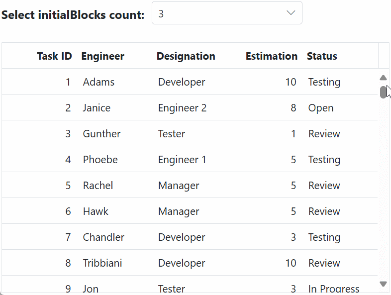

# Infinite scrolling in ASP.NET Core Grid component

The infinite scrolling feature in the Grid is a powerful tool for seamlessly handling extensive data sets without compromising grid performance. It operates on a “load-on-demand” concept, ensuring that data is fetched only when needed. In the default infinite scrolling mode, a new block of data is loaded each time the scrollbar reaches the end of the vertical scroller. This approach significantly enhances the user experience when working with large data collections in the ASP.NET Core Grid.

In this mode, a block of data accumulates every time the scrollbar reaches the end of the scroller. To clarify, in this context, a **block** represents the [pageSettings.pageSize](https://help.syncfusion.com/cr/aspnetcore-js2/Syncfusion.EJ2.Grids.GridPageSettings.html#Syncfusion_EJ2_Grids_GridPageSettings_PageSize) of the Grid. If the `pageSize` is not explicitly specified, the Grid will automatically calculate it based on the grid viewport height and row height.

To enable infinite scrolling, you need to define [enableInfiniteScrolling](https://help.syncfusion.com/cr/aspnetcore-js2/Syncfusion.EJ2.Grids.Grid.html#Syncfusion_EJ2_Grids_Grid_EnableInfiniteScrolling) as **true** and content height by [height](https://help.syncfusion.com/cr/aspnetcore-js2/Syncfusion.EJ2.Grids.Grid.html#Syncfusion_EJ2_Grids_Grid_Height)  property.

> In this feature, the Grid will not initiate a new data request when revisiting the same page.
> The `height` property must be specified when enabling `enableInfiniteScrolling`.

The following an example that demonstrates how to enable infinite scroll in the Grid:










## Number of blocks rendered during initial loading

The number of blocks to be initially rendered when the Grid is loaded. Each block corresponds to a page size of the Grid, resulting in the rendering of a certain number of row elements determined by multiplying the initial block size with the page size.

You can define the initial loading pages count by using [infiniteScrollSettings.initialBlocks](https://help.syncfusion.com/cr/aspnetcore-js2/Syncfusion.EJ2.Grids.GridInfiniteScrollSettings.html#Syncfusion_EJ2_Grids_GridInfiniteScrollSettings_InitialBlocks) property . By default, this property loads three pages during the initial rendering. Subsequently, additional data is buffered and loaded based on either the page size or the number of rows rendered within the provided height.

The following an example of how you can use the `initialBlocks` property to set the initial loading pages based on **DropDownList** input:










## Efficient data caching and DOM management in grid cache mode

In Grid cache mode, cached data blocks are reused when revisiting them, reducing the need for frequent data requests while navigating the same block. This mode also manages DOM row elements based on the [infiniteScrollSettings.maxBlocks](https://help.syncfusion.com/cr/aspnetcore-js2/Syncfusion.EJ2.Grids.GridInfiniteScrollSettings.html#Syncfusion_EJ2_Grids_GridInfiniteScrollSettings_MaxBlocks) count value. If this limit is exceeded, it removes a block of row elements to create new rows.

To enable cache mode, you need to define [enableCache](https://help.syncfusion.com/cr/aspnetcore-js2/Syncfusion.EJ2.Grids.GridInfiniteScrollSettings.html#Syncfusion_EJ2_Grids_GridInfiniteScrollSettings_EnableCache) property of `infiniteScrollSettings` as **true**.

To enable maximum blocks, you need to define `maxBlocks` count of [infiniteScrollSettings](https://help.syncfusion.com/cr/aspnetcore-js2/Syncfusion.EJ2.Grids.GridInfiniteScrollSettings.html), By default this property value is 3.

The following example that demonstrates how to enable/disable cache mode in infinite scrolling of the grid based on a [Switch](https://ej2.syncfusion.com/aspnetcore/documentation/switch/getting-started) component[change](https://help.syncfusion.com/cr/aspnetcore-js2/Syncfusion.EJ2.Buttons.Switch.html#Syncfusion_EJ2_Buttons_Switch_Change) event :










## Limitations

* Due to the element height limitation in browsers, the maximum number of records loaded by the grid is limited due to the browser capability.
* It is necessary to set a static height for the component or its parent container when using infinite scrolling. The 100% height will work only if the component height is set to 100%, and its parent container has a static height.
* When infinite scrolling is activated, compatibility for copy-paste and drag-and-drop operations is limited to the data items visible in the current viewport of the grid.
* Cell selection will not be persisted in cache mode.
* The group records cannot be collapsed in cache mode.
* Lazy load grouping with infinite scrolling does not support cache mode, and the infinite scrolling mode is exclusively applicable to parent-level caption rows in this scenario.
* The aggregated information and total group items are displayed based on the current view items. To get these information regardless of the view items, refer to the [Group with paging](https://ej2.syncfusion.com/aspnetcore/documentation/grid/grouping/grouping#group-with-paging) topic.
* InfiniteScrolling support for Normal and Dialog mode editing, so this feature is not compatible with AutoFill.
* Programmatic selection using the `selectRows` and `selectRow` method is not supported in infinite scrolling.
* Infinite scrolling is not compatible with the following features:
    1. Batch editing
    2. Normal editing
    3. Row spanning
    4. Column spanning
    5. Row template
    6. Row virtual scrolling
    8. Detail template
    9. Hierarchy features
    10. Autofill
    11. Page
* Limitations of row drag and drop with infinite scrolling
    1. In cache mode, the grid refreshes automatically if the content's **tr** element count exceeds the cache limit of the grid's content after the drop action.
    2. When performing row drag and drop with lazy load grouping, the grid will refresh automatically.
    3. In remote data, changes are applied only in the UI. They will be lost once the grid is refreshed. To restore them, you need to update the changes in your database. By using the [rowDrop](https://help.syncfusion.com/cr/aspnetcore-js2/Syncfusion.EJ2.Grids.Grid.html#Syncfusion_EJ2_Grids_Grid_RowDrop) event, you can send the request to the server and apply the changes in your database. After this, you need to refresh the grid to show the updated data.
