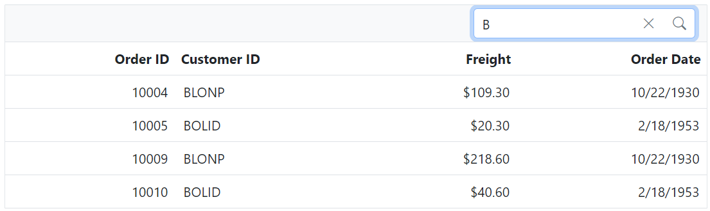
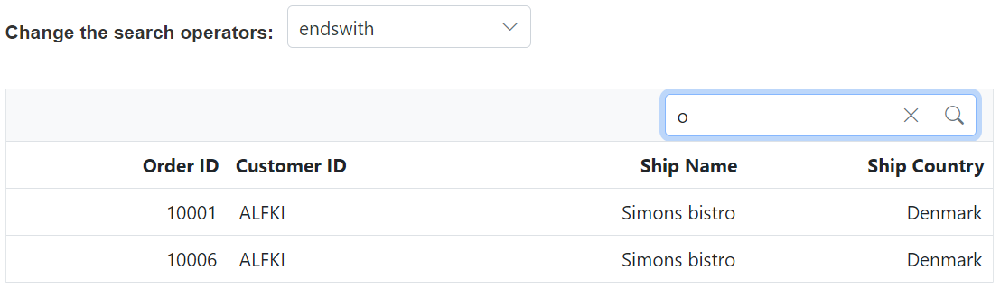
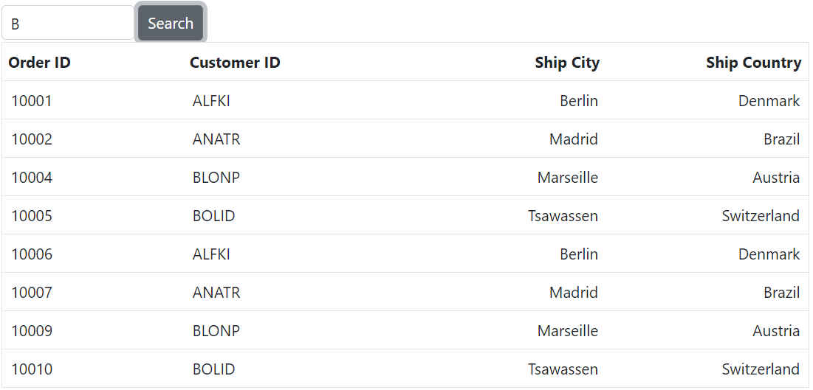

# Searching in ASP.NET Core Grid Component

The Syncfusion ##Platform_Name## Grid includes a powerful built-in searching feature that allows users to search for specific data within the grid. This feature enables efficient filtering of grid records based on user-defined search criteria, making it easier to locate and display relevant information. Whether you have a large dataset or simply need to find specific records quickly, the search feature provides a convenient solution.

To further enhance the search functionality, you can integrate a search text box directly into the grid's toolbar. This allows users to enter search criteria conveniently within the grid interface. To add the search item to the grid's toolbar, use the [toolbar](https://help.syncfusion.com/cr/aspnetmvc-js2/Syncfusion.EJ2.Grids.Grid.html#Syncfusion_EJ2_Grids_Grid_Toolbar) property and add **Search** item.










N> The clear icon is shown in the Data Grid search text box when it is focused on search text or after typing the single character in the search text box. A single click of the clear icon clears the text in the search box as well as the search results in the Data Grid.

## Initial search

By default, the search operation can be performed on the grid data after the grid renders. However, there might be scenarios where need to perform a search operation on the grid data during the initial rendering of the grid. In such cases, you can make use of the initial search feature provided by the grid.

To apply search at initial rendering, need to set the following properties in the [SearchSettings](https://help.syncfusion.com/cr/aspnetcore-js2/Syncfusion.EJ2.Grids.GridSearchSettings.html) object.

| Property         | Description                                                                                                                                                                                                                                                     |
| ---------------- | --------------------------------------------------------------------------------------------------------------------------------------------------------------------------------------------------------------------------------------------------------------- |
| **fields**       | Specifies the [Fields](https://help.syncfusion.com/cr/aspnetcore-js2/Syncfusion.EJ2.Grids.GridSearchSettings.html#Syncfusion_EJ2_Grids_GridSearchSettings_Fields) in which the search operation needs to be performed.                                          |
| **operator**     | Specifies the [Operator](https://help.syncfusion.com/cr/aspnetcore-js2/Syncfusion.EJ2.Grids.GridSearchSettings.html#Syncfusion_EJ2_Grids_GridSearchSettings_Operator) to be used for the search operation.                                                      |
| **key**          | Specifies the [Key](https://help.syncfusion.com/cr/aspnetcore-js2/Syncfusion.EJ2.Grids.GridSearchSettings.html#Syncfusion_EJ2_Grids_GridSearchSettings_Key) value to be searched.                                                                               |
| **ignoreCase**   | [IgnoreCase](https://help.syncfusion.com/cr/aspnetcore-js2/Syncfusion.EJ2.Grids.GridSearchSettings.html#Syncfusion_EJ2_Grids_GridSearchSettings_IgnoreCase) specifies whether the search operation needs to be case-sensitive or case-insensitive.              |
| **ignoreAccent** | [IgnoreAccent](https://help.syncfusion.com/cr/aspnetcore-js2/Syncfusion.EJ2.Grids.GridSearchSettings.html#Syncfusion_EJ2_Grids_GridSearchSettings_IgnoreAccent) property will ignore the diacritic characters or accents in the text during a search operation. |

The following example demonstrates how to set an initial search in the grid using the `searchSettings` property. The `searchSettings` property is set with the following values:

1. `Fields`: **CustomerID** specifies that the search should be performed only in the 'CustomerID' field.
2. `Operator`: **contains** indicates that the search should find records that contain the specified search key.
3. `Key`: **Ha** is the initial search key that will be applied when the grid is rendered.
4. `IgnoreCase`: **true** makes the search case-insensitive.
5. `IgnoreAccent`: **true** will ignores diacritic characters or accents during the search operation.










[Initial Search](../images/searching/initial-search.png)

N> By default, grid searches all the bound column values. To customize this behavior define the [Fields](https://help.syncfusion.com/cr/aspnetcore-js2/Syncfusion.EJ2.Grids.GridSearchSettings.html#Syncfusion_EJ2_Grids_GridSearchSettings_Fields) property of **e-grid-searchSettings** tag helper.

## Search operators

Search operators are symbols or keywords used to define the type of comparison or condition applied during a search operation. They help specify how the search key should match the data being searched. The [Operator](https://help.syncfusion.com/cr/aspnetmvc-js2/Syncfusion.EJ2.Grids.GridSearchSettings.html#Syncfusion_EJ2_Grids_GridSearchSettings_Operator) property of **e-grid-searchSettings** can be used to define the search operator in the grid. 

By default, the `Operator` is set to **contains**, which returns the values contains the search key. The following operators are supported in searching:

| Operator   | Description                                                                                                     |
| ---------- | --------------------------------------------------------------------------------------------------------------- |
| startswith | Checks whether a value begins with the specified value.                                                         |
| endswith   | Checks whether a value ends with the specified value.                                                           |
| contains   | Checks whether a value contains with the specified value.                                                       |
| wildcard   | Processes one or more search patterns using the **"*"** symbol, returning values that match the given patterns. |
| like       | Processes a single search pattern using the **"%"** symbol, retrieving values that match the specified pattern. |
| equal      | Checks whether a value equal to the specified value.                                                            |
| notequal   | Checks whether a value not equal to the specified value.                                                        |

These operators provide flexibility in defining the search behavior and allow you to perform different types of comparisons based on your requirements.

The following example demonstrates how to set the `Operator` property based on changing the dropdown value using the [Change](https://help.syncfusion.com/cr/aspnetcore-js2/Syncfusion.EJ2.DropDowns.DropDownList.html#Syncfusion_EJ2_DropDowns_DropDownList_Change) event of the [DropDownList](https://ej2.syncfusion.com/aspnetmvc/documentation/drop-down-list/getting-started) component.










N> By default, the [Operator](https://help.syncfusion.com/cr/aspnetmvc-js2/Syncfusion.EJ2.Grids.GridSearchSettings.html#Syncfusion_EJ2_Grids_GridSearchSettings_Operator) value is **contains**.

## Search by external button

The Syncfusion Grid component allows you to perform searches programmatically, enabling you to search for records using an external button instead of relying solely on the built-in search bar. This feature provides flexibility and allows for custom search implementations within your application. To search for records using an external button, you can utilize the `search` method provided by the Grid component.

The `search` method allows you to perform a search operation based on a search key or criteria. The following example demonstatres how to implement `search` by an external button using the following steps:

1. Add a button element outside of the grid component.
2. Attach a click event handler to the button.
3. Inside the event handler, get the reference of the grid component.
4. Invoke the `search` method of the grid by passing the search key as a parameter.










## Search specific columns

By default, the `search` functionality searches all visible columns. However, if you want to `search` only specific columns, you can define the specific column's field names in the [Fields](https://help.syncfusion.com/cr/aspnetmvc-js2/Syncfusion.EJ2.Grids.GridSearchSettings.html#Syncfusion_EJ2_Grids_GridSearchSettings_Fields) property of [SearchSettings](https://help.syncfusion.com/cr/aspnetmvc-js2/Syncfusion.EJ2.Grids.GridSearchSettings.html). This allows you to narrow down the search to a targeted set of columns, which is particularly useful when dealing with large datasets or grids with numerous columns.

The following example demonstrates how to search specific columns such as **CustomerID**, **Freight**, and **ShipCity** by using the `Fields` property.










## Clear search by external button

To clear the searched grid records from the external button, set [`key`](https://help.syncfusion.com/cr/aspnetcore-js2/Syncfusion.EJ2.Grids.GridSearchSettings.html#Syncfusion_EJ2_Grids_GridSearchSettings_Key) property of **e-grid-searchSettings** as **empty** string.
























## Search on each key stroke

You can search the Grid data on each key stroke by binding the `keyup` event for the search input element inside the [`created`](https://help.syncfusion.com/cr/aspnetcore-js2/Syncfusion.EJ2.Grids.Grid.html#Syncfusion_EJ2_Grids_Grid_Created) event. Inside the `keyup` handler you can search the Grid by invoking the [`search`](https://ej2.syncfusion.com/javascript/documentation/api/grid/#search) method of the Grid component.
























## Perform search operation in Grid using multiple keywords

You can perform a searching operation in the Grid using multiple keywords. This can be achieved by the [ActionBegin](https://help.syncfusion.com/cr/aspnetcore-js2/Syncfusion.EJ2.Grids.Grid.html#Syncfusion_EJ2_Grids_Grid_ActionBegin) event of the Grid.
In the following sample, we have performed the searching with multiple keywords by using the query property of grid when the requestType is searching in the [ActionBegin](https://help.syncfusion.com/cr/aspnetcore-js2/Syncfusion.EJ2.Grids.Grid.html#Syncfusion_EJ2_Grids_Grid_ActionBegin) event.
















 







N> * Define multiple keywords by using a comma separator in search bar to search.

N> * Search operation can be performed in foreign key column based on following way.
N> * When a value is searched on a grid with the foreign key column, a filter query is sent to the foreign key data source, and the appropriate column is filtered depending on the search value. The search query will be sent to the grid data source, and the value of the associated field will be returned.

## See also

* [How to perform search by using Wildcard and LIKE operator filter](./filtering/filtering/#wildcard-and-like-operator-filter)