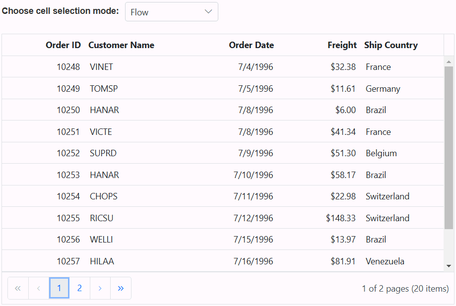
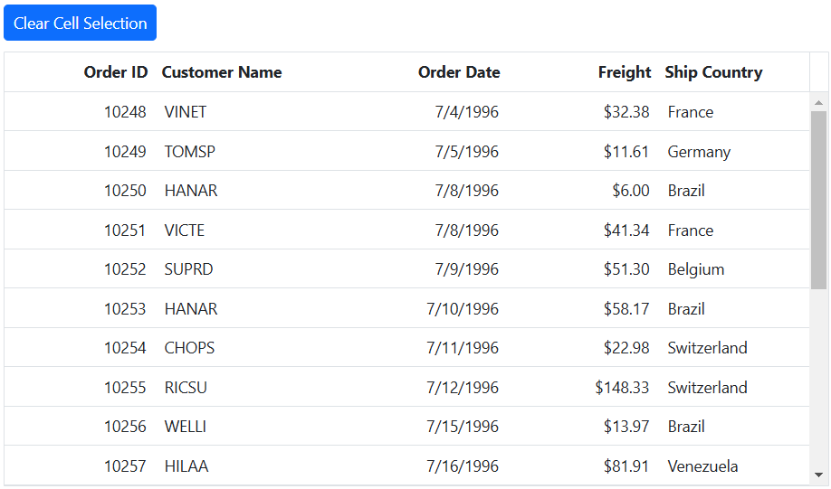
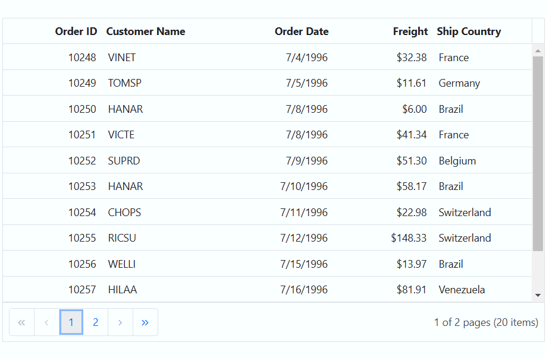

# Cell Selection in ASP.NET MVC Grid component 

Cell selection in the Grid component allows you to interactively select specific cells or ranges of cells within the grid. This selection can be done effortlessly through mouse clicks or arrow keys (up, down, left, and right). This feature is useful when you want to highlight, manipulate, or perform actions on specific cell within the Grid.

> To enable cell selection, you should set the [selectionSettings.mode](https://help.syncfusion.com/cr/aspnetcore-js2/Syncfusion.EJ2.Grids.GridSelectionSettings.html#Syncfusion_EJ2_Grids_GridSelectionSettings_Mode) property to either **Cell** or **Both**. This property determines the selection mode of the grid.

## Single cell selection 

Single cell selection allows you to select a single cell within a Grid. This feature is useful when you want to focus on a specific cell or perform actions on individual cells within the grid.

To enable single cell selection, set the [selectionSettings.mode](https://help.syncfusion.com/cr/aspnetcore-js2/Syncfusion.EJ2.Grids.GridSelectionSettings.html#Syncfusion_EJ2_Grids_GridSelectionSettings_Mode) property to **Cell** and the [selectionSettings.type](https://help.syncfusion.com/cr/aspnetcore-js2/Syncfusion.EJ2.Grids.GridSelectionSettings.html#Syncfusion_EJ2_Grids_GridSelectionSettings_Type) property to **Single**. This configuration allows you to select a single cell at a time within the grid.

In the following example demonstrates how to enable single cell selection using property:










## Multiple cell selection 

Multiple cell selection allows you to select multiple cells within a Grid. This feature is beneficial when you need to perform actions on multiple cells simultaneously or focus on specific areas of your data.

To enable multiple cell selection, set the [selectionSettings.mode](https://help.syncfusion.com/cr/aspnetcore-js2/Syncfusion.EJ2.Grids.GridSelectionSettings.html#Syncfusion_EJ2_Grids_GridSelectionSettings_Mode) property to **Cell** and the [selectionSettings.type](https://help.syncfusion.com/cr/aspnetcore-js2/Syncfusion.EJ2.Grids.GridSelectionSettings.html#Syncfusion_EJ2_Grids_GridSelectionSettings_Type) property to **Multiple**. This configuration allows you to select and interact with multiple cells within the grid.

In the following example demonstrates how to enable multiple cell selection using property:










## Cell selection mode 

The cell selection mode allows you to interactively select specific cells or ranges of cells within the grid. This feature is particularly useful when you want to perform actions on specific cells or obtain data from selected cells.

The grid supports three types of cell selection mode which can be set by using [selectionSettings.cellSelectionMode](https://help.syncfusion.com/cr/aspnetcore-js2/Syncfusion.EJ2.Grids.GridSelectionSettings.html#Syncfusion_EJ2_Grids_GridSelectionSettings_CellSelectionMode). These modes are:

* **Flow** - This is the default mode. It allows you to select a range of cells between the start index and end index, including all cells in between the rows. It provides a continuous flow of cell selection.
* **Box** - In this mode, you can select a range of cells within the start and end column indexes, including all cells in between the rows within the specified range. This mode is useful when you need to select cells within specific columns.
* **BoxWithBorder**:  This mode is similar to the Box mode, but it adds borders to the selected range of cells. This visual distinction makes it easy to identify the selected cells within the grid.

> Cell Selection requires the `selectionSettings.mode` to be **Cell** or  **Both** and [type](https://help.syncfusion.com/cr/aspnetcore-js2/Syncfusion.EJ2.Grids.GridSelectionSettings.html#Syncfusion_EJ2_Grids_GridSelectionSettings_Type) should be **Multiple**.

In the following example demonstrates how to dynamically enable and change the `cellSelectionMode` using the `DropDownList` component:










## Select cells externally 

You can perform single cell selection, multiple cell selection, and range of cell selection externally in a Grid using built-in methods. This feature allows you to interact with specific cells within the Grid. The following topic demonstrates how you can achieve these selections using methods.

### Single cell selection 

The ASP.NET MVC Grid allows you to select a single cell within a grid. This feature is useful when you want to focus on a specific cell or perform actions on individual cells within the grid.

To achieve single cell selection, you can use the `selectCell` method. This method selects a cell based on the given index.

The following example demonstrates how to select a single cell within the Grid by obtaining the selected row index and cell index through a textbox component and passing these row and cell indexes as arguments to the `selectCell` method. When the button event is triggered by clicking the **Select cell** button, a single cell is selected within the Grid:










### Multiple cell selection

Multiple cell selection allows you to select multiple cells within a Grid. This feature is beneficial when you need to perform actions on multiple cells simultaneously or focus on specific areas of your data.

To achieve multiple cell selection, you can use the `selectCells` method. This method allows you to select a collection of cells based on their row and column indexes.

In the following example, it demonstrates how to select multiple cells in the Grid by calling the `selectCells` method within the button click event and passing an collection of row and column indexes as arguments.










> Cell Selection requires the `selectionSettings.mode` to be **Cell** or  **Both** and [type](https://help.syncfusion.com/cr/aspnetcore-js2/Syncfusion.EJ2.Grids.GridSelectionSettings.html#Syncfusion_EJ2_Grids_GridSelectionSettings_Type) should be **Multiple**.

### Range of cell selection 

Range of cell selection in the Grid allows you to select multiple cells in a continuous range. This capability is particularly useful when you need to perform actions on multiple cells simultaneously or focus on specific areas of your data.

To achieve range of cell selection, you can use the `selectCellsByRange` method. This method selects a range of cells based on the specified start and end indexes.

>* Range cell selection allows you to select multiple cells in box mode when `cellSelectionMode` is set to **Box**. However, if you set `cellSelectionMode` to **Flow**, it will select the range of cells between the start and end indexes, including other cells of the selected rows.
> * Cell Selection requires the `selectionSettings.mode` to be **Cell** or  **Both** and [type](https://help.syncfusion.com/cr/aspnetcore-js2/Syncfusion.EJ2.Grids.GridSelectionSettings.html#Syncfusion_EJ2_Grids_GridSelectionSettings_Type) should be **Multiple**.

The following example demonstrates how to select a range of cells within the Grid by obtaining the selected cells start index and end index through textbox components. Then, pass these row and cell indexes as arguments to the `selectCellsByRange` method. When you trigger the button event by clicking the **Select Cells** button, a range of cells is selected within the Grid.










##  How to get selected row cell indexes

You can retrieve the collection of selected row and cell indexes of the currently selected cells in the Grid component. This is useful for performing various actions or manipulations on the selected cells within the grid. To achieve this, you can utilize the `getSelectedRowCellIndexes` method. 

The following example demonstrates how to obtain the selected row cell indexes using the `getSelectedRowCellIndexes` method and display them in a dialog when a button is clicked:










##  Clear cell selection programmatically 

Clearing cell selection programmatically in the Grid component is a useful feature when you want to remove any existing cell selections. To achieve this, you can use the `clearCellSelection` method.

> The `clearCellSelection` method is applicable when the selection [type](https://help.syncfusion.com/cr/aspnetcore-js2/Syncfusion.EJ2.Grids.GridSelectionSettings.html#Syncfusion_EJ2_Grids_GridSelectionSettings_Type) is set to **Multiple** or **Single**.

The following example demonstrates how to clear cell selection by calling the `clearCellSelection` method in the button click event.










## Cell selection events 

The Grid provides several events related to cell selection, allowing you to respond to and customize the behavior of cell selection. Here are the available cell selection events:

[cellSelecting](https://help.syncfusion.com/cr/aspnetcore-js2/Syncfusion.EJ2.Grids.Grid.html#Syncfusion_EJ2_Grids_Grid_CellSelecting): This event is triggered before any cell selection occurs. It provides an opportunity to implement custom logic or validation before a cell is selected, allowing you to control the selection process.

[cellSelected](https://help.syncfusion.com/cr/aspnetcore-js2/Syncfusion.EJ2.Grids.Grid.html#Syncfusion_EJ2_Grids_Grid_CellSelected): This event is triggered after a cell is successfully selected. You can use this event to perform actions or updates when a cell is selected.

[cellDeselecting](https://help.syncfusion.com/cr/aspnetcore-js2/Syncfusion.EJ2.Grids.Grid.html#Syncfusion_EJ2_Grids_Grid_CellSelecting): This event is triggered just before a selected cell is deselected. It allows you to perform custom logic or validation to decide whether the cell should be deselected or not.

[cellDeselected](https://help.syncfusion.com/cr/aspnetcore-js2/Syncfusion.EJ2.Grids.Grid.html#Syncfusion_EJ2_Grids_Grid_CellDeselected): This event is triggered when a particular selected cell is deselected. You can use this event to perform actions or validations when a cell is no longer selected.

In the following example, cell selection is canceled when the value of **ShipCountry** is equal to **France** within the `cellSelecting` event. The background color changes to green when the `cellSelected` event is triggered, and it changes to red when the `cellDeselecting` event is triggered. Furthermore, the text color switches to white when the `cellDeselected` event is triggered. A notification message is displayed to indicate which event was triggered whenever a cell is selected.










