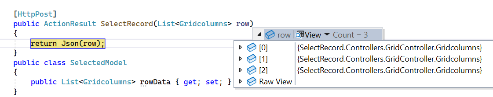

# Row selection in ASP.NET Core Grid component

Row selection in the Grid component allows you to interactively select specific rows or ranges of rows within the grid. This selection can be done effortlessly through mouse clicks or arrow keys (up, down, left, and right). This feature is useful when you want to highlight, manipulate, or perform actions on specific row within the Grid.

> To enable row selection, you should set the [selectionSettings.mode](https://help.syncfusion.com/cr/aspnetcore-js2/Syncfusion.EJ2.Grids.GridSelectionSettings.html#Syncfusion_EJ2_Grids_GridSelectionSettings_Mode) property to either **Row** or **Both**. This property determines the selection mode of the grid.

## Single row selection 

Single row selection allows you to select a single row at a time within the Grid. This feature is useful when you want to focus on specific rows or perform actions on the data within a particular row.

To enable single row selection, set the [selectionSettings.mode](https://help.syncfusion.com/cr/aspnetcore-js2/Syncfusion.EJ2.Grids.GridSelectionSettings.html#Syncfusion_EJ2_Grids_GridSelectionSettings_Mode) property to **Row** and the [selectionSettings.type](https://help.syncfusion.com/cr/aspnetcore-js2/Syncfusion.EJ2.Grids.GridSelectionSettings.html#Syncfusion_EJ2_Grids_GridSelectionSettings_Type) property to **Single**. This configuration allows you to select a only one row at a time within the grid.

Here's an example of how to enable single row selection using properties:











## Multiple row selection 

Multiple row selection allows you to select multiple rows within the Grid. This feature is valuable when you need to perform actions on several rows simultaneously or focus on specific data areas.

To enable multiple row selection, set the [selectionSettings.mode](https://help.syncfusion.com/cr/aspnetcore-js2/Syncfusion.EJ2.Grids.GridSelectionSettings.html#Syncfusion_EJ2_Grids_GridSelectionSettings_Mode) property to **Row** and the [selectionSettings.type](https://help.syncfusion.com/cr/aspnetcore-js2/Syncfusion.EJ2.Grids.GridSelectionSettings.html#Syncfusion_EJ2_Grids_GridSelectionSettings_Type) property to **Multiple**. This configuration allows you to select a multiple rows at a time within the grid.

Here's an example of how to enable multiple rows selection using properties:











## Select row at initial rendering 

You have the ability to select a specific row during the initial rendering of the Grid component. This feature is particularly useful when you want to highlight or pre-select a specific row in the grid. To achieve this, you can utilize the [selectedRowIndex](https://help.syncfusion.com/cr/aspnetcore-js2/Syncfusion.EJ2.Grids.Grid.html#Syncfusion_EJ2_Grids_Grid_SelectedRowIndex) property provided by the Grid component.

In the following example, it demonstrates how to select a row at initial rendering:











## Select rows in any page based on index value 

The Grid allows you to select rows in any page based on their index value. This feature is useful when you want to perform specific actions on rows, such as highlighting, applying styles, or executing operations, regardless of their location across multiple pages within the grid.

To achieve this, you can utilize the `selectRow` method and the `goToPage` method of the Grid control. By handling the [change](https://help.syncfusion.com/cr/aspnetcore-js2/Syncfusion.EJ2.DropDowns.DropDownList.html#Syncfusion_EJ2_DropDowns_DropDownList_Change) event of [DropDownList](https://ej2.syncfusion.com/aspnetcore/documentation/drop-down-list/getting-started) component, you can implement the logic to navigate to the desired page and select the row based on the index value. 

Additionally, by handling the [actionComplete](https://help.syncfusion.com/cr/aspnetcore-js2/Syncfusion.EJ2.Grids.Grid.html#Syncfusion_EJ2_Grids_Grid_ActionComplete) event of the Grid, you can maintain the selection of the desired row after completing the paging action.

The following example demonstrates how to select rows in any page based on index value using `actionComplete` and `change` event:











## Multiple row selection by single click on row 

The Grid component allows you to perform multiple row selection by simply clicking on rows one by one without pressing CTRL or SHIFT keys. This means that when you click on a row, it will be selected, and clicking on another row will add it to the selection without deselecting the previously selected rows. To deselect a previously selected row, you can click on the row again, and it will be unselected.

To enable the simple multiple row selection, you need to set the [selectionSettings.enableSimpleMultiRowSelection](https://help.syncfusion.com/cr/aspnetcore-js2/Syncfusion.EJ2.Grids.GridSelectionSettings.html#Syncfusion_EJ2_Grids_GridSelectionSettings_EnableSimpleMultiRowSelection) property to **true**. 

The following example demonstrates how to enable multiple row selection with a single click on the Grid row using `enableSimpleMultiRowSelection` property:











## Select rows externally 

You can perform single row selection, multiple row selection, and range of row selection externally in a Grid using built-in methods. This feature allows you to interact with specific rows within the Grid. The following topic demonstrates how you can achieve these selections using methods.

### Single row selection

Single row selection allows you to select a single row at a time within the Grid. This feature is useful when you want to focus on specific rows or perform actions on the data within a particular row.

To achieve single row selection, you can use the `selectRow` method. This method allows you to programmatically select a specific row within the Grid by specifying its index.

The following example demonstrates how to select a single row within the Grid by obtaining the selected row index through a [TextBox](https://ej2.syncfusion.com/aspnetcore/documentation/textbox/getting-started) component and passing these row index as argument to the `selectRow` method. When the button event is triggered by clicking the **Select Row** button, a single row is selected within the Grid:











### Multiple rows selection

The ASP.NET Core Grid allows you to select multiple rows within the grid simultaneously. This feature is valuable when you need to perform actions or operations on several rows at once or focus on specific areas of your data.

To achieve multiple row selection, you can use the `selectRows` method. This method allows you to select a collection of rows by specifying their indexes, giving you the ability to interact with multiple rows together.

The following example, demonstrates how to select multiple rows in the Grid by calling the `selectRows` method within the button `onclick` event and passing an array of row indexes as arguments.











### Range of rows selection 

Range of row selection in the Grid enables you to select a continuous range of rows within the grid. This feature is particularly useful when you want to perform actions on multiple rows simultaneously or focus on a specific range of data.

To achieve range of row selection, you can use the `selectRowsByRange` method. This method selects a range of rows from start and end row indexes.
 
The following example, demonstrates how to select a range of rows within the Grid by obtaining the selected rows start index and end index through [TextBox](https://ej2.syncfusion.com/aspnetcore/documentation/textbox/getting-started) components. Then, pass these start index and end index as arguments to the `selectRowsByRange` method. When you trigger the button event by clicking the **Select Rows** button, a range of rows is selected within the Grid.











## Select grid rows based on certain condition

You can programmatically select specific rows in the ASP.NET Core Grid component based on a certain condition. This feature is particularly useful when you need to dynamically highlight or manipulate specific rows in the grid based on custom conditions. This functionality can be achieved using the `selectRows` method in the [dataBound](https://help.syncfusion.com/cr/aspnetcore-js2/Syncfusion.EJ2.Grids.Grid.html#Syncfusion_EJ2_Grids_Grid_DataBound) event of Grid and [rowDataBound](https://help.syncfusion.com/cr/aspnetcore-js2/Syncfusion.EJ2.Grids.Grid.html#Syncfusion_EJ2_Grids_Grid_RowDataBound) along with obtaining the index value based on the condition.

In the below demo, we have selected the grid rows only when **EmployeeID** column value greater than **3**.











## How to get selected row indexes 

You can retrieve the indexes of the currently selected rows in the Grid component. This feature is particularly useful when you need to perform actions or operations specifically on the selected rows. 

To achieve this, you can leverage the `getSelectedRowIndexes` method, which returns an array of numbers representing the indexes of the selected rows.

 The following example demonstrates how to get selected row indexes using  `getSelectedRowIndexes` method: 











## How to get selected records on various pages 

The Grid component allows you to retrieve the selected records even when navigating to different pages. This feature is useful when working with large data sets and allows you to perform actions on the selected records across multiple pages. 

To persist the selection across pages, you need to enable the [persistselection](https://help.syncfusion.com/cr/aspnetcore-js2/Syncfusion.EJ2.Grids.GridSelectionSettings.html#Syncfusion_EJ2_Grids_GridSelectionSettings_PersistSelection) property. By default, this property is set to **false**. To enable it, set the value to **true** in the [selectionSettings](https://help.syncfusion.com/cr/aspnetcore-js2/Syncfusion.EJ2.Grids.GridSelectionSettings.html) property of the Grid component.

To retrieve the selected records from different pages, you can use the  `getSelectedRecords` method. This method returns an array of the selected records.

The following example demonstrates how to retrieve selected records from various pages using the `getSelectedRecords` method and display **OrderID** in a dialog when a button is clicked:











> To persist the grid selection, it is necessary to define any one of the columns as a primary key using the [columns](https://help.syncfusion.com/cr/aspnetcore-js2/Syncfusion.EJ2.Grids.Grid.html#Syncfusion_EJ2_Grids_Grid_Columns) property.

## How to get selected records  

The get selected records allows you to retrieve the data of the selected rows from the Grid component. This can be particularly useful when you need to perform actions on the selected data or display specific information based on the selected rows.

To retrieve the selected records, you can use the `getSelectedRecords` method. This method allows you to obtain an array of objects representing the selected records.

Here's an example that displays the selected row count using the `getSelectedRecords` method:











## Clear row selection programmatically 

Clearing row selection programmatically in the Grid component is a useful feature when you want to remove any existing row selections. To achieve this, you can use the `clearRowSelection` method.

>The `clearRowSelection` method is applicable when the selection [type](https://help.syncfusion.com/cr/aspnetcore-js2/Syncfusion.EJ2.Grids.GridSelectionSettings.html#Syncfusion_EJ2_Grids_GridSelectionSettings_Type) is set to **Multiple** or **Single**.

The following example demonstrates how to clear row selection by calling the `clearRowSelection` method in the button `onclick` event.











## Row selection events 

The Grid provides several events related to row selection that allow you to respond to and customize the behavior of row selection. These events give you control over various aspects of row selection. Here are the available row selection events:

[rowSelecting](https://help.syncfusion.com/cr/aspnetcore-js2/Syncfusion.EJ2.Grids.Grid.html#Syncfusion_EJ2_Grids_Grid_RowSelecting): This event is triggered before any row selection occurs. It provides an opportunity to implement custom logic or validation before a row is selected, allowing you to control the selection process.

[rowSelected](https://help.syncfusion.com/cr/aspnetcore-js2/Syncfusion.EJ2.Grids.Grid.html#Syncfusion_EJ2_Grids_Grid_RowSelected): This event is triggered after a row is successfully selected. You can use this event to perform actions or updates when a row is selected.

[rowDeselecting](https://help.syncfusion.com/cr/aspnetcore-js2/Syncfusion.EJ2.Grids.Grid.html#Syncfusion_EJ2_Grids_Grid_RowDeselecting): This event is triggered just before a selected row is deselected. It allows you to perform custom logic or validation to decide whether the row should be deselected or not.

[rowDeselected](https://help.syncfusion.com/cr/aspnetcore-js2/Syncfusion.EJ2.Grids.Grid.html#Syncfusion_EJ2_Grids_Grid_RowDeselected): This event is triggered when a particular selected row is deselected. You can use this event to perform actions or validations when a row is no longer selected.

In the following example, row selection is canceled when the value of **CustomerID** is equal to **VINET** within the `rowSelecting` event. The background color changes to green when the value of **Freight** is greater than 10 and less than or equal to 140, triggering the `rowDeselected` event. The background color changes to red when the value of **Freight** is less than or equal to 10 during the `rowDeselected` event. Furthermore, the background color changes to yellow when the value of **Freight** is greater than 140 during the `rowDeselected` event. A notification message is displayed to indicate which event was triggered whenever a row is selected.











## Pass selected records to server using AJAX

The Syncfusion ASP.NET Core Grid allows you to select multiple or single records and send them to the server using AJAX requests. This feature is useful for scenarios where you need to process or manipulate selected data on the server side.

To achieve passing selected records to the server using AJAX requests in the Syncfusion ASP.NET Core Grid, follow these steps:

**Step 1:** Open Visual Studio and create an ASP.NET Core project named **SelectRecord**. To create an ASP.NET Core application, follow the documentation [link](https://learn.microsoft.com/en-us/aspnet/mvc/overview/getting-started/introduction/getting-started#create-your-first-app) for detailed steps.

**Step 2 :** Create a simple Syncfusion ASP.NET Core Grid by following the [Getting Started](https://ej2.syncfusion.com/aspnetcore/documentation/grid/getting-started-mvc) documentation link.

**Step 3:** In your HTML file (e.g., **Index.cshtml**), add a button to trigger the AJAX call and include the Syncfusion ASP.NET Core Grid with necessary configurations:

```html
<!-- Button to pass selected records -->
<ejs-button id="passRecords" content="Pass the selected records to controller" cssClass="e-primary"></ejs-button>

<div style="padding: 20px 17px 0 0">
<ejs-grid id="Grid" height="273px">
    <!-- Replace **** with actual server port. -->
	<e-data-manager url="https://localhost:****/api/grid" adaptor="UrlAdaptor"></e-data-manager>
		<e-grid-selectionsettings type="Multiple"></e-grid-selectionsettings>
    <e-grid-columns>
        <e-grid-column field="OrderID" headerText="Order ID" isPrimaryKey="true" textAlign="Right" width="100"></e-grid-column>
        <e-grid-column field="EmployeeID" headerText="Employee ID" width="120" textAlign="Right"></e-grid-column>
        <e-grid-column field="CustomerID" headerText="Customer Name" width="120"></e-grid-column>
        <e-grid-column field="OrderDate" headerText="Date" width="150" format="yMd"></e-grid-column>
    </e-grid-columns>
</ejs-grid>
</div>
```

**Step 4:** In your script section, you need to handle the button `click` event. When clicked, retrieve the selected records using the `getSelectedRecords` method from the Syncfusion ASP.NET Core Grid and send them to the server using AJAX. Add the following code:

```ts
<script>
	// Button click event to send selected records.
	document.getElementById("passRecords").addEventListener("click", function () {
		var grid = document.querySelector("#Grid")?.ej2_instances?.[0]; // Get the Grid instance.
		var selectedRecords = grid.getSelectedRecords(); // Get selected rows.
		if (selectedRecords.length === 0) {
			alert("Please select at least one record.");
			return;
		}
		// Convert selected records to JSON.
		var rows = JSON.stringify(selectedRecords);
		// Send data to the server using Ajax.
		var ajax = new ej.base.Ajax({
			url: 'https://localhost:7108/api/grid/SelectRecord', // Replace **** with actual server port.
			type: 'POST',
			contentType: 'application/json; charset=utf-8',
			data: rows
		});

		ajax.onSuccess = function (result) {
			console.log("Records sent successfully:", result);
		};
		ajax.send();
	});
</script>
```

**Step 5:** On the server side, create a controller named **GridController.cs** under the **Controllers** folder to handle incoming requests and process selected records. Add the following code:

```cs
using Microsoft.AspNetCore.Http;
using Microsoft.AspNetCore.Mvc;
using SelectRecord.Models;
using Syncfusion.EJ2.Base;

namespace SelectRecord.Controllers
{
    [Route("api/[controller]")]
    [ApiController]
    public class GridController : Controller
    {
        [HttpPost]
        public object Post(DataManagerRequest DataManagerRequest)
        {
            // Retrieve data from the data source (e.g., database).
            IQueryable<OrdersDetails> DataSource = GetOrderData().AsQueryable();
            DataOperations queryableOperation = new DataOperations(); // Initialize DataOperations instance.

            // Handling searching operation.
            if (DataManagerRequest.Search != null && DataManagerRequest.Search.Count > 0)
            {
                DataSource = queryableOperation.PerformSearching(DataSource, DataManagerRequest.Search);
            }
            // Handling filtering operation.
            if (DataManagerRequest.Where != null && DataManagerRequest.Where.Count > 0)
            {
                foreach (var condition in DataManagerRequest.Where)
                {
                    foreach (var predicate in condition.predicates)
                    {
                        DataSource = queryableOperation.PerformFiltering(DataSource, DataManagerRequest.Where, predicate.Operator);
                    }
                }
            }
            // Handling sorting operation.
            if (DataManagerRequest.Sorted != null && DataManagerRequest.Sorted.Count > 0)
            {
                DataSource = queryableOperation.PerformSorting(DataSource, DataManagerRequest.Sorted);
            }
            // Get the total count of records.
            int totalRecordsCount = DataSource.Count();

            // Handling paging operation.
            if (DataManagerRequest.Skip != 0)
            {
                DataSource = queryableOperation.PerformSkip(DataSource, DataManagerRequest.Skip);
            }
            if (DataManagerRequest.Take != 0)
            {
                DataSource = queryableOperation.PerformTake(DataSource, DataManagerRequest.Take);
            }

            // Get the total records count.
            int count = DataSource.Count();

            // Return result and total record count.
            return DataManagerRequest.RequiresCounts ? Ok(new { result = DataSource, count }) : Ok(DataSource);
        }

        [HttpGet]
        public List<OrdersDetails> GetOrderData()
        {
            var data = OrdersDetails.GetAllRecords().ToList();
            return data;
        }

        [HttpPost("SelectRecord")]  // Make sure this route matches the AJAX request.
        public ActionResult SelectRecord([FromBody] List<Gridcolumns> row)
        {
            return Json(row);
        }
        public class SelectedModel
        {
            public List<Gridcolumns> rowData { get; set; }
        }
        public class Gridcolumns
        {
            public int OrderID { get; set; }
            public string CustomerID { get; set; }
            public int EmployeeID { get; set; }
            public DateTime OrderDate { get; set; }
        }
    }
}
```

**Step 6:** Create a model class named **OrdersDetails.cs** under the **Models** folder in the server-side project to represent the order data. Add the following code:

```cs
namespace SelectRecord.Models
{
    public class OrdersDetails
    {
        public static List<OrdersDetails> order = new List<OrdersDetails>();
        public OrdersDetails()
        {

        }
        public OrdersDetails(
        int OrderID, string CustomerId, int EmployeeId, double Freight, bool Verified,
        DateTime OrderDate, string ShipCity, string ShipName, string ShipCountry,
        DateTime ShippedDate, string ShipAddress)
        {
            this.OrderID = OrderID;
            this.CustomerID = CustomerId;
            this.EmployeeID = EmployeeId;
            this.Freight = Freight;
            this.ShipCity = ShipCity;
            this.Verified = Verified;
            this.OrderDate = OrderDate;
            this.ShipName = ShipName;
            this.ShipCountry = ShipCountry;
            this.ShippedDate = ShippedDate;
            this.ShipAddress = ShipAddress;
        }

        public static List<OrdersDetails> GetAllRecords()
        {
            if (order.Count() == 0)
            {
                int code = 10000;
                for (int i = 1; i < 10; i++)
                {
                    order.Add(new OrdersDetails(code + 1, "ALFKI", i + 0, 2.3 * i, false, new DateTime(1991, 05, 15), "Berlin", "Simons bistro", "Denmark", new DateTime(1996, 7, 16), "Kirchgasse 6"));
                    order.Add(new OrdersDetails(code + 2, "ANATR", i + 2, 3.3 * i, true, new DateTime(1990, 04, 04), "Madrid", "Queen Cozinha", "Brazil", new DateTime(1996, 9, 11), "Avda. Azteca 123"));
                    order.Add(new OrdersDetails(code + 3, "ANTON", i + 1, 4.3 * i, true, new DateTime(1957, 11, 30), "Cholchester", "Frankenversand", "Germany", new DateTime(1996, 10, 7), "Carrera 52 con Ave. Bolívar #65-98 Llano Largo"));
                    order.Add(new OrdersDetails(code + 4, "BLONP", i + 3, 5.3 * i, false, new DateTime(1930, 10, 22), "Marseille", "Ernst Handel", "Austria", new DateTime(1996, 12, 30), "Magazinweg 7"));
                    order.Add(new OrdersDetails(code + 5, "BOLID", i + 4, 6.3 * i, true, new DateTime(1953, 02, 18), "Tsawassen", "Hanari Carnes", "Switzerland", new DateTime(1997, 12, 3), "1029 - 12th Ave. S."));
                    code += 5;
                }
            }
            return order;
        }

        public int? OrderID { get; set; }
        public string? CustomerID { get; set; }
        public int? EmployeeID { get; set; }
        public double? Freight { get; set; }
        public string? ShipCity { get; set; }
        public bool? Verified { get; set; }
        public DateTime OrderDate { get; set; }
        public string? ShipName { get; set; }
        public string? ShipCountry { get; set; }
        public DateTime ShippedDate { get; set; }
        public string? ShipAddress { get; set; }
    }
}

```

The following screenshot shows how to pass selected records to the server:



## Pass selected records to server using FETCH

The Syncfusion ASP.NET Core Grid allows you to select multiple or single records and send them to the server using Fetch requests. This feature is useful for scenarios where you need to process or manipulate selected data on the server side.

To achieve passing selected records to the server using Fetch requests in the Syncfusion ASP.NET Core Grid, follow these steps:

**Step 1:** Open Visual Studio and create an ASP.NET Core project named **SelectRecord**. To create an ASP.NET Core application, follow the documentation [link](https://learn.microsoft.com/en-us/aspnet/mvc/overview/getting-started/introduction/getting-started#create-your-first-app) for detailed steps.

**Step 2 :** Create a simple Syncfusion ASP.NET Core Grid by following the [Getting Started](https://ej2.syncfusion.com/aspnetcore/documentation/grid/getting-started-mvc) documentation link.

**Step 3:** In your HTML file (e.g., **Index.cshtml**), add a button to trigger the AJAX call and include the Syncfusion ASP.NET Core Grid with necessary configurations:

```html
<!-- Button to pass selected records -->
<ejs-button id="passRecords" content="Pass the selected records to controller" cssClass="e-primary"></ejs-button>

<div style="padding: 20px 17px 0 0">
<ejs-grid id="Grid" height="273px">
    <!-- Replace **** with actual server port. -->
	<e-data-manager url="https://localhost:****/api/grid" adaptor="UrlAdaptor"></e-data-manager>
		<e-grid-selectionsettings type="Multiple"></e-grid-selectionsettings>
    <e-grid-columns>
        <e-grid-column field="OrderID" headerText="Order ID" isPrimaryKey="true" textAlign="Right" width="100"></e-grid-column>
        <e-grid-column field="EmployeeID" headerText="Employee ID" width="120" textAlign="Right"></e-grid-column>
        <e-grid-column field="CustomerID" headerText="Customer Name" width="120"></e-grid-column>
        <e-grid-column field="OrderDate" headerText="Date" width="150" format="yMd"></e-grid-column>
    </e-grid-columns>
</ejs-grid>
</div>
```

**Step 4:** In your script section, you need to handle the button `click` event. When clicked, retrieve the selected records using the `getSelectedRecords` method from the Syncfusion ASP.NET Core Grid and send them to the server using AJAX. Add the following code:

```ts
<script>
	// Button click event to send selected records.
	document.getElementById("passRecords").addEventListener("click", function () {
		var grid = document.querySelector("#Grid")?.ej2_instances?.[0]; // Get the grid instance
		var selectedRecords = grid.getSelectedRecords(); // Get selected rows
		if (selectedRecords.length === 0) {
			alert("Please select at least one record.");
			return;
		}
		// Convert selected records to JSON.
		var rows = JSON.stringify(selectedRecords);
		// Send data to the server using Fetch.
		var fetch = new ej.base.Fetch({
			url: 'https://localhost:****/api/grid/SelectRecord', // Replace **** with actual server port.
			type: 'POST',
			contentType: 'application/json; charset=utf-8',
			data: rows
		});

		fetch.onSuccess = function (result) {
			console.log("Records sent successfully:", result);
		};
		fetch.send();
	});
</script>
```

**Step 5:** On the server side, create a controller named **GridController.cs** under the **Controllers** folder to handle incoming requests and process selected records. Add the following code:

```cs
using Microsoft.AspNetCore.Http;
using Microsoft.AspNetCore.Mvc;
using SelectRecord.Models;
using Syncfusion.EJ2.Base;

namespace SelectRecord.Controllers
{
    [Route("api/[controller]")]
    [ApiController]
    public class GridController : Controller
    {
        [HttpPost]
        public object Post(DataManagerRequest DataManagerRequest)
        {
            // Retrieve data from the data source (e.g., database).
            IQueryable<OrdersDetails> DataSource = GetOrderData().AsQueryable();
            DataOperations queryableOperation = new DataOperations(); // Initialize DataOperations instance.

            // Handling searching operation.
            if (DataManagerRequest.Search != null && DataManagerRequest.Search.Count > 0)
            {
                DataSource = queryableOperation.PerformSearching(DataSource, DataManagerRequest.Search);
            }
            // Handling filtering operation.
            if (DataManagerRequest.Where != null && DataManagerRequest.Where.Count > 0)
            {
                foreach (var condition in DataManagerRequest.Where)
                {
                    foreach (var predicate in condition.predicates)
                    {
                        DataSource = queryableOperation.PerformFiltering(DataSource, DataManagerRequest.Where, predicate.Operator);
                    }
                }
            }
            // Handling sorting operation.
            if (DataManagerRequest.Sorted != null && DataManagerRequest.Sorted.Count > 0)
            {
                DataSource = queryableOperation.PerformSorting(DataSource, DataManagerRequest.Sorted);
            }
            // Get the total count of records.
            int totalRecordsCount = DataSource.Count();

            // Handling paging operation.
            if (DataManagerRequest.Skip != 0)
            {
                DataSource = queryableOperation.PerformSkip(DataSource, DataManagerRequest.Skip);
            }
            if (DataManagerRequest.Take != 0)
            {
                DataSource = queryableOperation.PerformTake(DataSource, DataManagerRequest.Take);
            }

            // Get the total records count.
            int count = DataSource.Count();

            // Return result and total record count.
            return DataManagerRequest.RequiresCounts ? Ok(new { result = DataSource, count }) : Ok(DataSource);
        }

        [HttpGet]
        public List<OrdersDetails> GetOrderData()
        {
            var data = OrdersDetails.GetAllRecords().ToList();
            return data;
        }

        [HttpPost("SelectRecord")]  // Make sure this route matches the AJAX request.
        public ActionResult SelectRecord([FromBody] List<Gridcolumns> row)
        {
            return Json(row);
        }
        public class SelectedModel
        {
            public List<Gridcolumns> rowData { get; set; }
        }
        public class Gridcolumns
        {
            public int OrderID { get; set; }
            public string CustomerID { get; set; }
            public int EmployeeID { get; set; }
            public DateTime OrderDate { get; set; }
        }
    }
}
```

**Step 6:** Create a model class named **OrdersDetails.cs** under the **Models** folder in the server-side project to represent the order data. Add the following code:

```cs
namespace SelectRecord.Models
{
    public class OrdersDetails
    {
        public static List<OrdersDetails> order = new List<OrdersDetails>();
        public OrdersDetails()
        {

        }
        public OrdersDetails(
        int OrderID, string CustomerId, int EmployeeId, double Freight, bool Verified,
        DateTime OrderDate, string ShipCity, string ShipName, string ShipCountry,
        DateTime ShippedDate, string ShipAddress)
        {
            this.OrderID = OrderID;
            this.CustomerID = CustomerId;
            this.EmployeeID = EmployeeId;
            this.Freight = Freight;
            this.ShipCity = ShipCity;
            this.Verified = Verified;
            this.OrderDate = OrderDate;
            this.ShipName = ShipName;
            this.ShipCountry = ShipCountry;
            this.ShippedDate = ShippedDate;
            this.ShipAddress = ShipAddress;
        }

        public static List<OrdersDetails> GetAllRecords()
        {
            if (order.Count() == 0)
            {
                int code = 10000;
                for (int i = 1; i < 10; i++)
                {
                    order.Add(new OrdersDetails(code + 1, "ALFKI", i + 0, 2.3 * i, false, new DateTime(1991, 05, 15), "Berlin", "Simons bistro", "Denmark", new DateTime(1996, 7, 16), "Kirchgasse 6"));
                    order.Add(new OrdersDetails(code + 2, "ANATR", i + 2, 3.3 * i, true, new DateTime(1990, 04, 04), "Madrid", "Queen Cozinha", "Brazil", new DateTime(1996, 9, 11), "Avda. Azteca 123"));
                    order.Add(new OrdersDetails(code + 3, "ANTON", i + 1, 4.3 * i, true, new DateTime(1957, 11, 30), "Cholchester", "Frankenversand", "Germany", new DateTime(1996, 10, 7), "Carrera 52 con Ave. Bolívar #65-98 Llano Largo"));
                    order.Add(new OrdersDetails(code + 4, "BLONP", i + 3, 5.3 * i, false, new DateTime(1930, 10, 22), "Marseille", "Ernst Handel", "Austria", new DateTime(1996, 12, 30), "Magazinweg 7"));
                    order.Add(new OrdersDetails(code + 5, "BOLID", i + 4, 6.3 * i, true, new DateTime(1953, 02, 18), "Tsawassen", "Hanari Carnes", "Switzerland", new DateTime(1997, 12, 3), "1029 - 12th Ave. S."));
                    code += 5;
                }
            }
            return order;
        }

        public int? OrderID { get; set; }
        public string? CustomerID { get; set; }
        public int? EmployeeID { get; set; }
        public double? Freight { get; set; }
        public string? ShipCity { get; set; }
        public bool? Verified { get; set; }
        public DateTime OrderDate { get; set; }
        public string? ShipName { get; set; }
        public string? ShipCountry { get; set; }
        public DateTime ShippedDate { get; set; }
        public string? ShipAddress { get; set; }
    }
}

```

The following screenshot shows how to pass selected records to the server:

