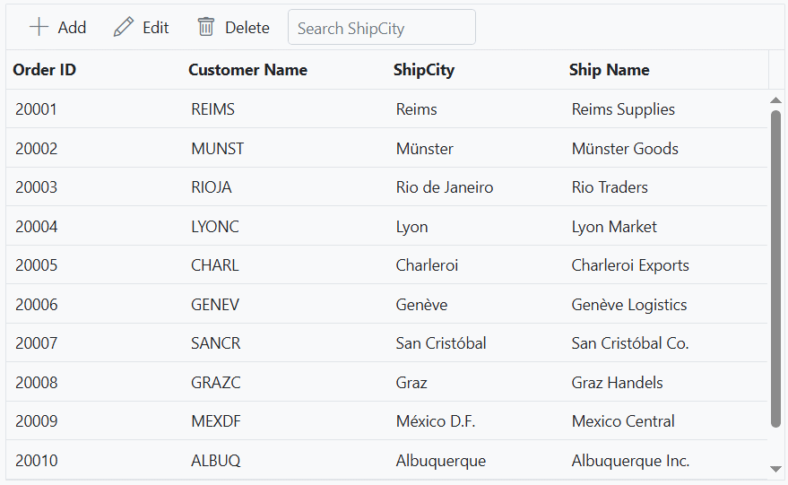

# Toolbar items in ASP.NET Core Grid component

The Syncfusion ASP.NET Core Grid offers a flexible toolbar that enables the addition of custom toolbar items or modification of existing ones. This customizable toolbar is positioned above the grid, providing a convenient way to access various actions and functionalities

## Built-in toolbar items

Built-in toolbar items in the Syncfusion ASP.NET Core Grid component involves utilizing pre-defined actions to perform standard operations within the Grid.

These items can be added by defining the [toolbar](https://help.syncfusion.com/cr/aspnetcore-js2/syncfusion.ej2.grids.grid.html#Syncfusion_EJ2_Grids_Grid_Toolbar) property as a collection of built-in items. Each item is rendered as a button with an icon and text. The following table lists the built-in toolbar items and their respective actions.

| Built-in Toolbar Items | Actions |
|------------------------|---------|
| Add | Adds a new row to the Grid.|
| Edit | Enables editing mode for the selected row in the Grid.|
| Update | Saves the changes made during the editing mode.|
| Delete | Deletes the selected record from the Grid.|
| Cancel | Discards the changes made during the editing mode.|
| Search | Displays a search box to filter the Grid records.|
| Print | Print the Grid content.|
| ColumnChooser | Choose the column's visibility.|
| PdfExport | Exports the Grid data to a PDF file.|
| ExcelExport | Exports the Grid data to an Excel file.|
| CsvExport | Exports the Grid data to a CSV file.|

The following example demonstrates how to enable built-in toolbar items such as **Print** and **Search** in the grid.











> The [toolbar](https://help.syncfusion.com/cr/aspnetcore-js2/syncfusion.ej2.grids.grid.html#Syncfusion_EJ2_Grids_Grid_Toolbar) has options to define both built-in and custom toolbar items.

### Show only icons in built-in toolbar items

Showing only icons in the built-in toolbar items of the Grid involves customizing the appearance of the toolbar to display icons without text.

To display only icons in the built-in toolbar items of the Grid, you can use CSS to hide the text portion of the buttons using the following CSS style.

```css
.e-grid .e-toolbar .e-tbar-btn-text, 
.e-grid .e-toolbar .e-toolbar-items .e-toolbar-item .e-tbar-btn-text {
    display: none;   
}
```

This is demonstrated in the following sample:











### Customize the built-in toolbar items

The Syncfusion ASP.NET Core Grid component allows you to customize the built-in toolbar items to meet your specific requirements. This can include adding, removing, or modifying toolbar items, as well as handling custom actions when toolbar buttons are clicked.

To customize the built-in toolbar items, you can use the [toolbarClick](https://help.syncfusion.com/cr/aspnetcore-js2/Syncfusion.EJ2.Grids.Grid.html#Syncfusion_EJ2_Grids_Grid_ToolbarClick) event of the grid.

The following example demonstrate how to customize the toolbar by disabling and canceling the **Add** button functionlity and showing a custom message when the **Add** button of toolbar is clicked.











## Custom toolbar items

Adding custom toolbar items to the Syncfusion ASP.NET Core Grid involves incorporating personalized functionality into the toolbar.

Custom toolbar items can be added to the Grid component by defining the [toolbar](https://help.syncfusion.com/cr/aspnetmvc-js2/syncfusion.ej2.grids.grid.html#Syncfusion_EJ2_Grids_Grid_Toolbar) property as a collection of `ItemModel` objects. These objects define the custom items and their corresponding actions. The actions for the customized toolbar items are defined in the [toolbarClick](https://help.syncfusion.com/cr/aspnetcore-js2/Syncfusion.EJ2.Grids.Grid.html#Syncfusion_EJ2_Grids_Grid_ToolbarClick) event.

By default, custom toolbar items are positioned on the **left** side of the toolbar. However, you can change the position by using the `align` property of the `ItemModel`. The following example demonstrates how to apply the `align` property with the value **Right** for the **Collapse All** toolbar item.











> * The [toolbar](https://help.syncfusion.com/cr/aspnetcore-js2/syncfusion.ej2.grids.grid.html#Syncfusion_EJ2_Grids_Grid_Toolbar) has options to define both built-in and custom toolbar items.
> * If a toolbar item does not match with built-in items, it will be treated as custom toolbar item.

## Both built-in and custom items in toolbar

Built-in and custom items in a toolbar within the Syncfusion ASP.NET Core Grid provides the flexibility to create a customized toolbar with a combination of standard actions and custom actions.

To use both types of toolbar items, you can define the [toolbar](https://help.syncfusion.com/cr/aspnetcore-js2/syncfusion.ej2.grids.grid.html#Syncfusion_EJ2_Grids_Grid_Toolbar) property of the Grid as an array that includes both built-in and custom items. The built-in items are specified as strings, while the custom items are defined as objects with properties such as `text`, `prefixIcon`, and `id` within the toolbar component.

The following example demonstrates, how to use both built-in and custom toolbar items in the grid. The built-in toolbar items includes **Add**, **Edit**, **Delete**, **Update**, and **Cancel**, while the custom toolbar item is **Click**.











## Add custom components to the Grid toolbar using template

The Syncfusion ASP.NET Core Grid provides the flexibility to customize its toolbar by embedding custom components using the `template` property of the `ItemModel`. This feature allows developers to add UI elements such as buttons, dropdowns, or input controls directly into the toolbar, alongside built-in actions like **Add**, **Edit**, and **Delete**.

In the following example, a script-based template is used to define an [AutoComplete](https://ej2.syncfusion.com/aspnetcore/documentation/auto-complete/getting-started). The `AutoComplete` is populated with unique values from the `ShipCity` field of the Grid data. When a you selects a value from the `AutoComplete`, the Grid is filtered to show only the records matching the selected city. A custom toolbar item is defined using the `template` property. This property is assigned a reference to a template element (**#toolbar-template**) that contains the custom component. When the Grid is rendered, the custom `AutoComplete` appears as part of the toolbar, allowing you to interact with both standard and custom toolbar elements.

Additionally, the [change](https://help.syncfusion.com/cr/aspnetcore-js2/Syncfusion.EJ2.DropDowns.AutoComplete.html#Syncfusion_EJ2_DropDowns_AutoComplete_Change) event of the `AutoComplete` is used to trigger a search operation within the Grid. When the you selects or types a value, the event handler invokes the Grid’s search method, dynamically filtering the displayed records based on the input.

Additionally, the [change](https://help.syncfusion.com/cr/aspnetcore-js2/Syncfusion.EJ2.DropDowns.AutoComplete.html#Syncfusion_EJ2_DropDowns_AutoComplete_Change) event of the `AutoComplete` is used to trigger a search operation within the Grid. When the you selects or types a value, the event handler invokes the Grid’s `search` method, dynamically filtering the displayed records for **ShipCity** column based on the input.












## Custom toolbar items in a specific position

Customizing the position of a custom toolbar within the Syncfusion ASP.NET Core Grid involves modifying the default placement of the custom toolbar items. This enables you to precisely control the positioning of each custom toolbar item according to your specific requirements and desired layout within the Grid.

By default, custom toolbar items in Grid component are aligned on the left side of the toolbar. However, you have the ability to modify the position of the custom toolbar items by utilizing the `align` property of the `ItemModel`.

In the following sample, the **Collapse All** toolbar item is positioned on the **Right**, the **Expand All** toolbar item is positioned on the **Left**, and the **Search** toolbar item is positioned at the **Center**.










 