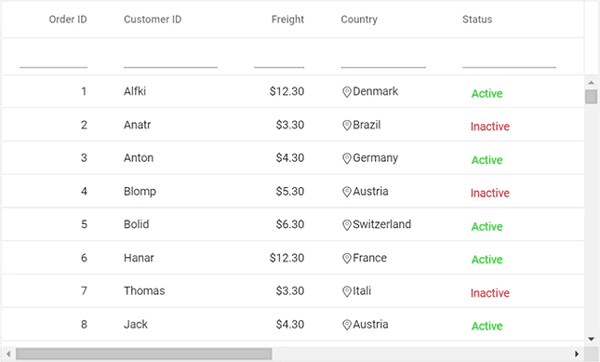
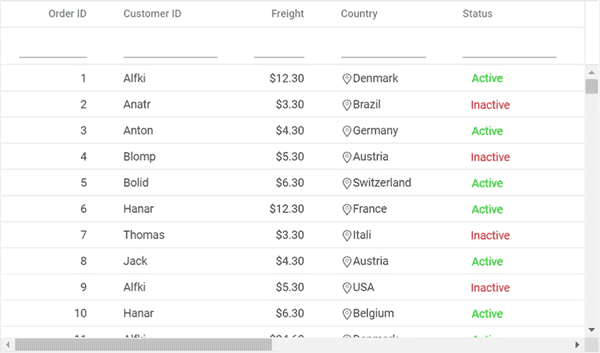

# Virtualization in ASP.NET Core Grid Component

Grid allows you to load large amount of data without performance degradation.

## Row Virtualization

Row virtualization allows you to load and render rows only in the content viewport. It is an alternative way of paging in which the data will be loaded while scrolling vertically. To setup the row virtualization, you need to define [`enableVirtualization`](https://help.syncfusion.com/cr/aspnetcore-js2/Syncfusion.EJ2.Grids.Grid.html#Syncfusion_EJ2_Grids_Grid_EnableVirtualization) as true and content height by [`height`](https://help.syncfusion.com/cr/aspnetcore-js2/Syncfusion.EJ2.Grids.Grid.html#Syncfusion_EJ2_Grids_Grid_Height) property.

The number of records displayed in the Grid is determined implicitly by height of the content area. Also, you have an option to define a visible number of records by
the [`pageSize`](https://help.syncfusion.com/cr/aspnetcore-js2/Syncfusion.EJ2.Grids.GridPageSettings.html#Syncfusion_EJ2_Grids_GridPageSettings_PageSize) property of [`e-grid-pagesettings`](https://help.syncfusion.com/cr/aspnetcore-js2/Syncfusion.EJ2.Grids.Grid.html#Syncfusion_EJ2_Grids_Grid_PageSettings) tag helper. The loaded data will be cached and reused when it is needed for next time.

























## Column Virtualization

Column virtualization allows you to virtualize columns. It will render columns which are in the viewport. You can scroll horizontally to view more columns.

To setup the column virtualization, set the [`enableVirtualization`](https://help.syncfusion.com/cr/aspnetcore-js2/Syncfusion.EJ2.Grids.Grid.html#Syncfusion_EJ2_Grids_Grid_EnableVirtualization) and [`enableColumnVirtualization`](https://help.syncfusion.com/cr/aspnetcore-js2/Syncfusion.EJ2.Grids.Grid.html#Syncfusion_EJ2_Grids_Grid_EnableColumnVirtualization) properties as **true**.

























> Column's [`width`](https://help.syncfusion.com/cr/aspnetcore-js2/Syncfusion.EJ2.Grids.GridColumn.html#Syncfusion_EJ2_Grids_GridColumn_Width) is required for column virtualization. If column's width is not defined then Grid will consider its value as **200px**.

## Virtualization with Grouping

Both the row and column virtualization can be used along with grouping. At initial rendering, the virtual height of scrollbar will be set based on the total number of records and after grouping, it will be refreshed based on the grouped state(expand/collapse). While collapse the group caption row in current viewport then the next view page grouped records are shown.

> The collapsed/expanded state will persist only for local dataSource while scrolling.

## Limitations for virtual scrolling

* While using column virtual scrolling, column width should be in the pixel. Percentage values are not accepted.
* Due to the element height limitation in browsers, the maximum number of records loaded by the grid is limited by the browser capability.
* Cell selection will not be persisted in both row and column virtual scrolling.
* Virtual scrolling is not compatible with batch editing, detail template, rowspan, colspan and hierarchy features.
* Group expand and collapse state will not be persisted.
* Since data is virtualized in grid, the aggregated information and total group items are displayed based on the current view items. To get these information regardless of the view items, refer to the [`Group with Page`](./grouping/#group-with-paging) topic.
* The page size provided must be two times larger than the number of visible rows in the grid. If the page size is failed to meet this condition then the size will be determined by grid.
* The height of the grid content is calculated using the row height and total number of records in the data source and hence features which changes row height such as text wrapping are not supported. If you want to increase the row height to accommodate the content then you can specify the row height as below to ensure all the table rows are in same height.

```css
.e-grid .e-row {
    height: 2em;
}
```

* Programmatic selection using the **selectRows** method is not supported in virtual scrolling.

## Prevent endless virtual scrolling due to browser height limitation

The Grid has an option to load huge amounts of data (like millions of records) without any performance degradation in the Grid using the virtual scrolling feature, which means the data can be fetched using the on-demand concept.

Even though Grid has optimized design for high-performance, the browser has some maximum pixel height limitation for scroll bar element. The content placed above the maximum height cannot be scrolled if the element height is greater than the browser's maximum height. This is the behavior of the browser. This browser height limitation affects the virtual scrolling enabled grid, which means when a large number of records are bound to the Grid, it can only display the records until the maximum height of the browser is reached. Once the browser's height is reached, the remaining records will be hidden.

Usually, the height of the grid element can be calculated by using the Total Records Count * Row Height. For example, if the row height is set as 30px and the total record count will be 1000000(1 million), then the height of the grid element will be 30 000 000 pixels. In this case, the browser's maximum height is about 22369600(The maximum pixel height limitation differs for different browsers). The records above the maximum height of the browser cannot be scrolled. It will be hidden.

This height limitation is not related to Grid component. Its fully depend on the default behaviour of the browser. We have reproduced the same issue in the normal html table too. Please find the below image.

Grid component aslo faced the same issue as mentioned in the below image.

>> gif image

The Grid has an option to overcome this default behavior of the browser by following the below alternative solutions.

**Solution 1: Using external buttons**

You can prevent the height limitation when scrolling through the millions of records by loading the segment of data through the external buttons.

This can be demonstrated in the following sample. In the following sample, Grid is rendered with a large number of records(nearly 2 million). Here, you can scroll 5L records at a time in Grid. If you reach the last page of 5L records, the `Load Next Set` button will be shown at the bottom of the Grid. By clicking that button, you can view the next set of 5L records in Grid.This button will be shown only if the next set of records is available. Also, `Load Previous Set` button (when the grid is on the first page) will be shown at the top of the Grid to load the previous set of 5L records. This button will be shown only if the previous set of records is available.

> [View GitHub Sample]
> If you perform grid actions such as filtering, sorting, etc., after scrolling through the 5L data, the Grid performs those data actions with the whole records, not just the current loaded 5L data.

**Solution 2: Using RowHeight property**

By reducing the [row height](https://ej2.syncfusion.com/aspnetcore/documentation/grid/row/row-height) using the [RowHeight](https://help.syncfusion.com/cr/aspnetcore-js2/Syncfusion.EJ2.Grids.Grid.html#Syncfusion_EJ2_Grids_Grid_RowHeight) property of the Grid, you can be able to scroll more records. This is demonstrated in the following gif images.

Before setting rowHeight property to the grid.



After setting rowHeight property as "30px" to the grid.



**Solution 3: Using Paging feature**

Similar to virtual scrolling, the [paging](https://ej2.syncfusion.com/aspnetcore/documentation/grid/paging) feature also loads the data in on-demand concept. Pagination is also compatible with all the other features(Grouping, Editing, etc.,) in Grid. So use the paging feature instead of virtual scrolling to view the large number of records in the Grid without any kind of performance degradation and browser height limitation.

> Since paging and virtual scrolling are unique features, it is not recommendable to use both features at the same time. But customization can be applied as mentioned in solution1