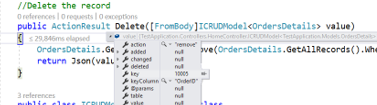
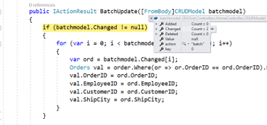

# Editing

The Grid component has options to dynamically insert, delete and update records.
Editing feature requires a primary key column for CRUD operations.
To define the primary key, set [`Columns.IsPrimaryKey`](https://help.syncfusion.com/cr/aspnetcore-js2/Syncfusion.EJ2.Grids.GridColumn.html#Syncfusion_EJ2_Grids_GridColumn_IsPrimaryKey) to `true` in particular column.

You can start the edit action either by double clicking the particular row or by selecting the required row and click on `Edit` button in the toolbar. Similarly, you can add a new record to grid either by clicking on `Add` button in the toolbar or on an external button which is bound to invoke the `addRecord` method of the grid, `Save` and `Cancel` while in edit mode is possible using respective toolbar icon in grid.

Deletion of the record is possible by selecting the required row and click on `Delete` button in the toolbar.

























> * If [`Columns.IsIdentity`](https://help.syncfusion.com/cr/aspnetcore-js2/Syncfusion.EJ2.Grids.GridColumn.html#Syncfusion_EJ2_Grids_GridColumn_IsIdentity) is enabled, then it will be considered as a read-only column when editing and adding a record.
> * You can disable editing for a particular column, by specifying
[`Columns.AllowEditing`](https://help.syncfusion.com/cr/aspnetcore-js2/Syncfusion.EJ2.Grids.GridColumn.html#Syncfusion_EJ2_Grids_GridColumn_AllowEditing) to `false`.

## Toolbar with edit option

The grid toolbar has the [built-in items](./tool-bar##Built-in-toolbar-items) to execute Editing actions.
You can define this by using the [`Toolbar`](https://help.syncfusion.com/cr/aspnetcore-js2/Syncfusion.EJ2.Grids.Grid.html#Syncfusion_EJ2_Grids_Grid_Toolbar) property.

























## Cell edit type and its params

The [`Columns.EditType`](https://help.syncfusion.com/cr/aspnetcore-js2/Syncfusion.EJ2.Grids.GridColumn.html#Syncfusion_EJ2_Grids_GridColumn_EditType) is used to define the editor component for any particular column.

You can set the [`Columns.EditType`](https://help.syncfusion.com/cr/aspnetcore-js2/Syncfusion.EJ2.Grids.GridColumn.html#Syncfusion_EJ2_Grids_GridColumn_EditType) based on data type of the column.

* `NumericTextBox` component for integers, double, and decimal data types.

* `TextBox` component for string data type.

* `DropDownList` component to show all unique values related to that field.

* `DatePicker` component for date data type.

* `DateTimePicker` component for date time data type.

Also, you can customize the behavior of the editor component through `Columns.Edit.Params`.

The following table describes cell edit type and their corresponding edit params of the column.

Component |Example
-----|-----
`NumericTextBox` | params: { decimals: 2, value: 5 }
`DropDownList` | params: { value: 'Germany' }
`Checkbox` | params: { checked: true}
`DatePicker` | params: { format:'dd.MM.yyyy' }
`DateTimePicker` | params: { value: new Date() }

























> If edit type is not defined in the column, then it will be considered as the `stringedit` type (Textbox component) .

## Cell Edit Template

The cell edit template is used to add a custom component for a particular column by invoking the following functions:

* `create` - It is used to create the element at the time of initialization.

* `write` - It is used to create the custom component or assign default value at the time of editing.

* `read` - It is used to read the value from the component at the time of save.

* `destroy` - It is used to destroy the component.

























## Edit Modes

Grid supports the following types of edit modes, they are:

* Normal
* Dialog
* Batch

### Normal

In Normal edit mode, when you start editing the currently selected record is changed to edit state.
You can change the cell values and save edited data to the data source.
To enable Normal edit, set the [`EditSettings.Mode`](https://help.syncfusion.com/cr/aspnetcore-js2/Syncfusion.EJ2.Grids.Grid.html#Syncfusion_EJ2_Grids_Grid_EditSettings) as `Normal`.

























> Normal edit mode is default mode of editing.

#### Cancel edit based on condition

You can prevent the CRUD operations of the Grid by using condition in the `actionBegin` event with requestType as `beginEdit` for editing, `add` for adding and `delete` for deleting actions.

In the below demo, we prevent the CRUD operation based on the `Role` column value. If the Role Column is `Employee`, we are unable to edit/delete that row.

























### Dialog

In dialog edit mode, when you start editing the currently selected row data will be shown on a dialog.
You can change the cell values and save edited data to the data source.
To enable Dialog edit, set the [`EditSettings.Mode`](https://help.syncfusion.com/cr/aspnetcore-js2/Syncfusion.EJ2.Grids.Grid.html#Syncfusion_EJ2_Grids_Grid_EditSettings) as `Dialog`.

























### Batch

In batch edit mode, when you double-click on the grid cell, then the target cell changed to edit state.
You can bulk save (added, changed and deleted data in the single request) to data source by click on the toolbar's `Update` button or by externally calling the `batchSave` method.
To enable Batch edit, set the [`EditSettings.Mode`](https://help.syncfusion.com/cr/aspnetcore-js2/Syncfusion.EJ2.Grids.Grid.html#Syncfusion_EJ2_Grids_Grid_EditSettings) as `Batch`.

























#### Cancel edit based on condition in Batch mode

You can prevent the CRUD operations of the Batch edit Grid by using condition in the `cellEdit`, `beforeBatchAdd` and `beforeBatchDelete` events for Edit, Add and Delete actions respectively.

In the below demo, we prevent the CRUD operation based on the `Role` column value. If the Role Column is `Employee`, we are unable to edit/delete that row.

























## Dialog/Inline template

The dialog template editing provides an option to customize the default behavior of dialog editing. Using the dialog template, you can render your own editors by defining the [`EditSettings.Mode`](https://help.syncfusion.com/cr/aspnetcore-js2/Syncfusion.EJ2.Grids.Grid.html#Syncfusion_EJ2_Grids_Grid_EditSettings) as `Dialog/Inline` and [`EditSettings.Template`](https://help.syncfusion.com/cr/aspnetcore-js2/Syncfusion.EJ2.Grids.Grid.html#Syncfusion_EJ2_Grids_Grid_EditSettings) as SCRIPT element ID or HTML string which holds the template.

In some cases, you need to add the new field editors in the dialog which are not present in the column model. In that situation, the template will help you to customize the default edit dialog.

In the below code example, demonstrate the usage of binding a partial view in the dialog template.























































> The Dialog/Inline template form editors should have **name** attribute.

### Reading Values From Editors

You can read, format and update the current editor value in the [`ActionBegin`](https://help.syncfusion.com/cr/aspnetcore-js2/Syncfusion.EJ2.Grids.GridBuilder-1.html#Syncfusion_EJ2_Grids_GridBuilder_1_ActionBegin_System_String_)event at the time of `requestType` as `save`.

In the below code example, we have format and updated the `freight` value.

``` typescript
    function actionBegin(args) {
        if (args.requestType === 'save') {
            // cast string to integer value.
            args.data['Freight'] = parseFloat(args.form.querySelector("#Freight").value);
        }
    }

```

### Set focus to editor

By default, the first input element in the dialog will be focused while opening the dialog.
If the first input element is in disabled or hidden state, focus the valid input element in the
[`ActionComplete`](https://help.syncfusion.com/cr/aspnetcore-js2/Syncfusion.EJ2.Grids.GridBuilder-1.html#Syncfusion_EJ2_Grids_GridBuilder_1_ActionComplete_System_String_)
event based on `requestType` as `beginEdit`.

```typescript

    function actionComplete(args) {
        // Set initail Focus
        if (args.requestType === 'beginEdit') {
            (args.form.elements.namedItem('CustomerID')).focus();
        }
    }

```

### Adding validation rules for custom editors

If you have used additional fields that are not present in the column model, then add the validation rules to the [`ActionComplete`](https://help.syncfusion.com/cr/aspnetcore-js2/Syncfusion.EJ2.Grids.GridBuilder-1.html#Syncfusion_EJ2_Grids_GridBuilder_1_ActionComplete_System_String_) event.

```typescript

    function actionComplete(args) => {
        if ((args.requestType === 'beginEdit' || args.requestType === 'add')) {
            // Add Validation Rules
            args.form.ej2_instances[0].addRules('Freight', {max: 500});
        }
    }

```

## Adding a new row at the Bottom of the Grid

By default, a new row will be added at the top of the grid. You can change it by setting `editSettings.newRowPosition` as `Bottom`.

























> Add newRowPostion is supported for `Normal` and `Batch` editing modes.

## Command column

The command column provides an option to add CRUD action buttons in a column. This can be defined by the [`Column.Commands`](https://help.syncfusion.com/cr/aspnetcore-js2/Syncfusion.EJ2.Grids.GridColumn.html#Syncfusion_EJ2_Grids_GridColumn_Commands) property.

The available built-in command buttons are:

| Command Button | Actions |
|----------------|---------|
| Edit | Edit the current row.|
| Delete | Delete the current row.|
| Save | Update the edited row.|
| Cancel | Cancel the edited state. |

























### Custom command

 The custom command buttons can be added in a column by using the [`Column.Commands`](https://help.syncfusion.com/cr/aspnetcore-js2/Syncfusion.EJ2.Grids.GridColumn.html#Syncfusion_EJ2_Grids_GridColumn_Commands) property and
the action for the custom buttons can be defined in the `ButtonOption.Click` event.

























## Confirmation messages

### Delete confirmation

The delete confirm dialog can be shown when deleting a record by defining the [`ShowDeleteConfirmDialog`](https://help.syncfusion.com/cr/aspnetcore-js2/Syncfusion.EJ2.Grids.GridEditSettings.html#Syncfusion_EJ2_Grids_GridEditSettings_ShowDeleteConfirmDialog) as `true`

























> The [`ShowDeleteConfirmDialog`](https://help.syncfusion.com/cr/aspnetcore-js2/Syncfusion.EJ2.Grids.GridEditSettings.html#Syncfusion_EJ2_Grids_GridEditSettings_ShowDeleteConfirmDialog) supports all type of edit modes.

### Batch confirmation

By default, grid will show the confirm dialog when saving or cancelling or performing any actions like filtering, sorting, etc.

























> * [`EditSettings.ShowConfirmDialog`](https://help.syncfusion.com/cr/aspnetcore-js2/Syncfusion.EJ2.Grids.GridEditSettings.html#Syncfusion_EJ2_Grids_GridEditSettings_ShowConfirmDialog) requires the [`EditSettings.Mode`](https://help.syncfusion.com/cr/aspnetcore-js2/Syncfusion.EJ2.Grids.EditMode.html) to be `Batch`
> * If [`EditSettings.ShowConfirmDialog`](https://help.syncfusion.com/cr/aspnetcore-js2/Syncfusion.EJ2.Grids.GridEditSettings.html#Syncfusion_EJ2_Grids_GridEditSettings_ShowConfirmDialog) set to `false`, then confirmation dialog does not display in batch editing.

## Column validation

Column validation allows you to validate the edited or added row data and it display errors for invalid fields before saving data.
Grid uses `Form Validator` component for column validation.
You can set validation rules by defining the [`Columns.ValidationRules`](https://help.syncfusion.com/cr/aspnetcore-js2/Syncfusion.EJ2.Grids.GridColumn.html#Syncfusion_EJ2_Grids_GridColumn_ValidationRules).

























## Persisting data in server

Edited data can be persisted in the database using the RESTful web services.

All the CRUD operations in the grid are done through `DataManager`. The `DataManager` has an option to bind all the CRUD related data in server-side.

> For your information, the ODataAdaptor persists data in the server as per OData protocol.

In the below section, we have explained how to get the edited data details on the server-side using the `UrlAdaptor`.

### URL adaptor

You can use the `UrlAdaptor` of `DataManager` when binding data source from remote data.
In the initial load of grid, data are fetched from remote data and bound to the grid using `url` property of `DataManager`.
You can map The CRUD operation in grid can be mapped to server-side Controller actions using the properties `InsertUrl`, `RemoveUrl`, `UpdateUrl`, `CrudUrl` and `BatchUrl`.

The following code example describes the above behavior.

























Also, when using the `UrlAdaptor`, you need to return the data as JSON from the controller action and the JSON object must contain a property as `result` with dataSource as its value and one more property `count` with the dataSource total records count as its value.

The following code example describes the above behavior.

























### Insert record

Using the `InsertUrl` property, you can specify the controller action mapping URL to perform insert operation on the server-side.

The following code example describes the above behavior.
























The newly added record details are bound to the `value` parameter. Please refer to the following screenshot.


### Update record

Using the `UpdateUrl` property, the controller action mapping URL can be specified to perform save/update operation on the server-side.

The following code example describes the previous behavior.
























The updated record details are bound to the `value` parameter. Please refer to the following screenshot.


### Delete record

Using the `RemoveUrl` property, the controller action mapping URL can be specified to perform delete operation on the server-side.

The following code example describes the previous behavior.

























The deleted record primary key value is bound to the `key` parameter. Please refer to the following screenshot.



### CRUD URL

Using the `CrudUrl` property, the controller action mapping URL can be specified to perform all the CRUD operation at server-side using a single method instead of specifying separate controller action method for CRUD (insert, update and delete) operations.

The action parameter of `CrudUrl` is used to get the corresponding CRUD action.

The following code example describes the above behavior.

























Please refer to the following screenshot to know about the action parameter.


> If you specify `InsertUrl` along with `CrudUrl`, then while adding `InsertUrl` only will be invoked.

### Batch URL

The `BatchUrl` property supports only for batch editing mode.
You can specify the controller action mapping URL to perform batch operation on the server-side.

The following code example describes the above behavior.

























```typescript
public ActionResult BatchUpdate([FromBody]string action, List<EditableOrder> added, List<EditableOrder> changed, List<EditableOrder> deleted, int? key)
{
//Save the batch changes in database
}
```



## Default column values on add new

The grid provides an option to set the default value for the columns when adding a new record in it.
To set a default value for the particular column by defining the [`Columns.DefaultValue`](https://help.syncfusion.com/cr/aspnetcore-js2/Syncfusion.EJ2.Grids.GridColumn.html#Syncfusion_EJ2_Grids_GridColumn_DefaultValue).

























## Custom validation

You can define your own custom validation rules for the specific columns by using `Form Validator custom rules`.

In the below demo, custom validation applied for `CustomerID` column.

























## Disable editing for particular column

You can disable editing for particular columns by using the [`Columns.AllowEditing`](https://help.syncfusion.com/cr/aspnetcore-js2/Syncfusion.EJ2.Grids.GridColumn.html#Syncfusion_EJ2_Grids_GridColumn_AllowEditing).

In the following demo, editing is disabled for the `CustomerID` column.

























## Troubleshoot: Editing works only for first row

The Editing functionalities can be performed based upon the primary key value of the selected row.
If `primaryKey` is not defined in the grid, then edit or delete action take places the first row.

## See also

* [Editing with template column](./how-to/editing-with-template-column)
* [Customize dialog when editing](./how-to/customize-the-edit-dialog)
* [Cascading DropDownList with Grid Editing](./how-to/provide-custom-data-source-and-enabling-filtering-to-drop-down-list)
* [Access Editor components](./how-to/access-editor-components)
* [Customize the Edit Dialog](./how-to/customize-the-edit-dialog)
* [Wizard Like Editing](./how-to/use-wizard-like-dialog-editing)
* [Tab Inside the Dialog Template](./how-to/using-tab-inside-the-dialog-editing)
* [Restrict to type decimal points in a NumericTextBox while editing the numeric column](./how-to/restrict-decimal-points-while-grid-editing)
