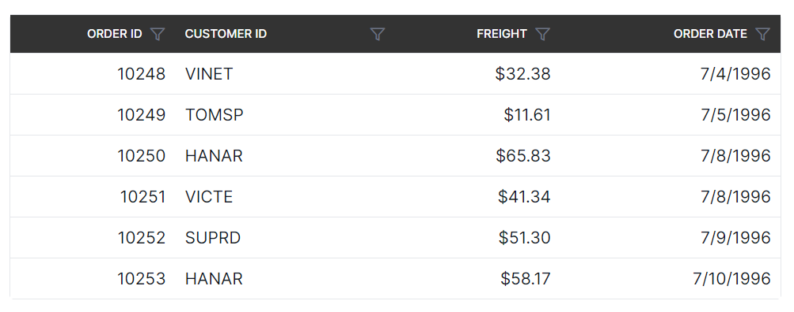
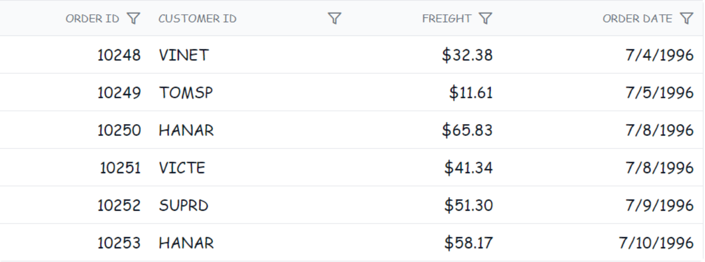
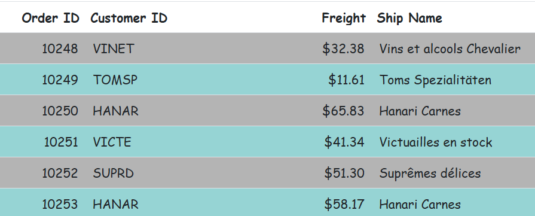

# Style and appearance in ##Platform_Name## Grid component

The Grid component offers various ways to customize its appearance using both default CSS and custom themes. Let's go over some common approaches:

**Default CSS overrides:**

You can use custom CSS to override the default styles of the Grid component. This allows you to change colors, fonts, paddings, and more. You can inspect the generated HTML of the Grid using browser developer tools to identify the relevant CSS classes and styles.

Here's a basic example of how you can override the header background color of the Grid:

```css
/* In your component's CSS file */
.e-grid .e-headercell {
    background-color: #333; /* Override the header background color */
    color: #fff;
}
```



**Using theme studio:**

Syncfusion's Theme Studio tool allows you to create custom themes for all their components, including the Grid. This is a more advanced approach that lets you define a comprehensive set of styles to achieve a consistent look and feel throughout your application.

1. Visit the [Syncfusion Theme Studio](https://ej2.syncfusion.com/themestudio/?theme=material).
2. Select the Grid component from the left panel.
3. Customize various aspects of the component's appearance, such as colors, typography, and spacing.
4. Once done, you can download the generated CSS file and include it in your ##Platform_Name## project.

## Customizing the grid root element

To customize the appearance of the root element of the Syncfusion ##Platform_Name## Grid component, you can use CSS. Here's an example of how to modify the font family and row colors using CSS:

```css
.e-grid {
      font-family: cursive;
}

```



The above code snippet, the **.e-grid** class targets the root element of the Syncfusion ##Platform_Name## Grid component, and the `font-family` property is set to cursive to change the font family of the grid content.

In the following sample, the font family of grid content is changed to **cursive**, and the background color of rows, selected rows, alternate rows, and row hovering color is modified using the below CSS styles.
























