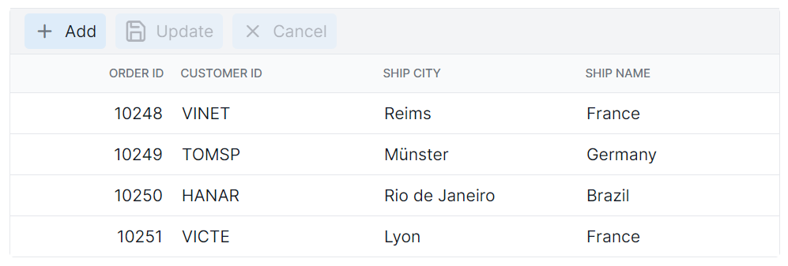

# Toolbar in ##Platform_Name## Grid component

You can customize the appearance of the toolbar in the Syncfusion ##Platform_Name## Grid component using CSS. Here are examples of how to customize the toolbar root element and toolbar button element.

## Customizing the toolbar root element

To customize the appearance of toolbar root element, you can use the following CSS code:

```css
.e-grid .e-toolbar-items {
    background-color: #deecf9;
}
```

In this example, the **.e-toolbar-items** class targets the background color of the toolbar root element. You can modify the `background-color` property to change the background color of the toolbar.


## Customizing the toolbar button element

To customize the appearance of toolbar buttons, you can use the following CSS code:

```css
.e-grid .e-toolbar .e-btn {
    background-color: #deecf9;
}
```

In this example, the **.e-toolbar .e-btn** selector targets the background color of the toolbar button elements. You can modify the `background-color` property to change the background color of the toolbar buttons.

