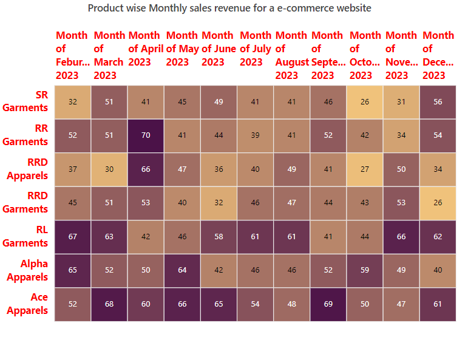
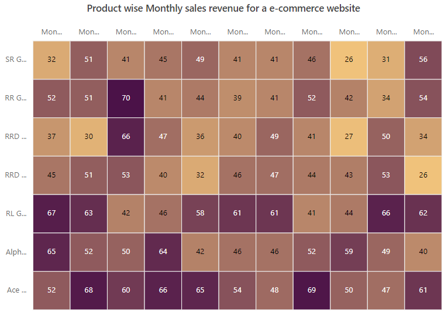
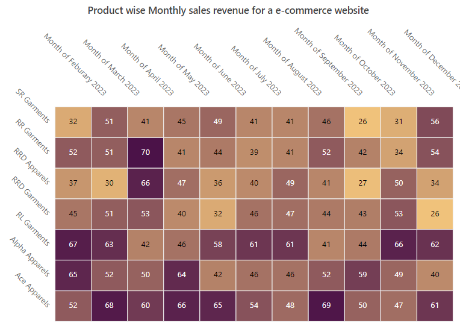
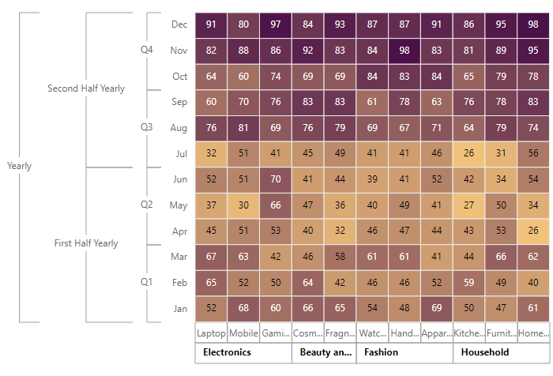

# Axis in ##Platform_Name## HeatMap Chart Component

HeatMap consists of two axes namely, X-axis and Y-axis that displays the row headers and column headers to plot the data points respectively. You can define the type, format, and other customizing options for both axes in the HeatMap.

## Types



There are three different axis types available in the HeatMap, which defines the data type of the axis labels. You can define the axis type by using the [valueType](https://help.syncfusion.com/cr/aspnetcore-js2/Syncfusion.EJ2.HeatMap.HeatMapAxis.html#Syncfusion_EJ2_HeatMap_HeatMapAxis_ValueType) property in the HeatMap.



There are three different axis types available in the HeatMap, which defines the data type of the axis labels. You can define the axis type by using the [ValueType](https://help.syncfusion.com/cr/aspnetmvc-js2/Syncfusion.EJ2.HeatMap.HeatMapAxis.html#Syncfusion_EJ2_HeatMap_HeatMapAxis_ValueType) property in the HeatMap.



### Category axis

Category axis type is used to represent the string values in axis labels.
























### Numeric axis

Numeric axis type is used to represent the numeric values in axis labels.
























### Date-time axis



Date-time axis type is used to represent the date-time values in axis labels with a specific format. In date-time axis, you can define the start and end date/time using the [minimum](https://help.syncfusion.com/cr/aspnetcore-js2/Syncfusion.EJ2.HeatMap.HeatMapAxis.html#Syncfusion_EJ2_HeatMap_HeatMapAxis_Minimum) and [maximum](https://help.syncfusion.com/cr/aspnetcore-js2/Syncfusion.EJ2.HeatMap.HeatMapAxis.html#Syncfusion_EJ2_HeatMap_HeatMapAxis_Maximum) properties.












Date-time axis type is used to represent the date-time values in axis labels with a specific format. In date-time axis, you can define the start and end date/time using the [Minimum](https://help.syncfusion.com/cr/aspnetmvc-js2/Syncfusion.EJ2.HeatMap.HeatMapAxis.html#Syncfusion_EJ2_HeatMap_HeatMapAxis_Minimum) and [Maximum](https://help.syncfusion.com/cr/aspnetmvc-js2/Syncfusion.EJ2.HeatMap.HeatMapAxis.html#Syncfusion_EJ2_HeatMap_HeatMapAxis_Maximum) properties.











## Inversed axis



HeatMap supports inversing the axis origin for both axes, where the axis labels are placed in an inversed manner. You can enable axis inversing by enabling the [isInversed](https://help.syncfusion.com/cr/aspnetcore-js2/Syncfusion.EJ2.HeatMap.HeatMapAxis.html#Syncfusion_EJ2_HeatMap_HeatMapAxis_IsInversed) property.












HeatMap supports inversing the axis origin for both axes, where the axis labels are placed in an inversed manner. You can enable axis inversing by enabling the [IsInversed](https://help.syncfusion.com/cr/aspnetmvc-js2/Syncfusion.EJ2.HeatMap.HeatMapAxis.html#Syncfusion_EJ2_HeatMap_HeatMapAxis_IsInversed) property.











## Opposed axis



In HeatMap, you can place the axis label in an opposite position of its default axis label position by using the [opposedPosition](https://help.syncfusion.com/cr/aspnetcore-js2/Syncfusion.EJ2.HeatMap.HeatMapAxis.html#Syncfusion_EJ2_HeatMap_HeatMapAxis_OpposedPosition) property.












In HeatMap, you can place the axis label in an opposite position of its default axis label position by using the [OpposedPosition](https://help.syncfusion.com/cr/aspnetmvc-js2/Syncfusion.EJ2.HeatMap.HeatMapAxis.html#Syncfusion_EJ2_HeatMap_HeatMapAxis_OpposedPosition) property.











## Axis labels customization

### Customizing the text style



The text style of the axis labels can be customized using the following options available in the [textStyle](https://help.syncfusion.com/cr/aspnetcore-js2/Syncfusion.EJ2.HeatMap.HeatMapAxis.html#Syncfusion_EJ2_HeatMap_HeatMapAxis_TextStyle) property.

* [color](https://help.syncfusion.com/cr/aspnetcore-js2/Syncfusion.EJ2.HeatMap.HeatMapFont.html#Syncfusion_EJ2_HeatMap_HeatMapFont_Color) - It is used to change the text color of the axis labels.
* [fontFamily](https://help.syncfusion.com/cr/aspnetcore-js2/Syncfusion.EJ2.HeatMap.HeatMapFont.html#Syncfusion_EJ2_HeatMap_HeatMapFont_FontFamily) - It is used to change the font family of the axis labels.
* [fontStyle](https://help.syncfusion.com/cr/aspnetcore-js2/Syncfusion.EJ2.HeatMap.HeatMapFont.html#Syncfusion_EJ2_HeatMap_HeatMapFont_FontStyle) - It is used to change the font style of the axis labels.
* [fontWeight](https://help.syncfusion.com/cr/aspnetcore-js2/Syncfusion.EJ2.HeatMap.HeatMapFont.html#Syncfusion_EJ2_HeatMap_HeatMapFont_FontWeight) - It is used to change the font weight of the axis labels.
* [size](https://help.syncfusion.com/cr/aspnetcore-js2/Syncfusion.EJ2.HeatMap.HeatMapFont.html#Syncfusion_EJ2_HeatMap_HeatMapFont_Size) - It is used to change the font size of the axis labels.
* [textAlignment](https://help.syncfusion.com/cr/aspnetcore-js2/Syncfusion.EJ2.HeatMap.HeatMapFont.html#Syncfusion_EJ2_HeatMap_HeatMapFont_TextAlignment) - It is used to position and align the axis labels. This property allows you to specify values such as **Near**, **Center**, and **Far**.
* [textOverflow](https://help.syncfusion.com/cr/aspnetcore-js2/Syncfusion.EJ2.HeatMap.HeatMapFont.html#Syncfusion_EJ2_HeatMap_HeatMapFont_TextOverflow) - When the axis label exceeds the intended space, this property is used to trim or wrap it. This property takes values such as **None**, **Trim**, and **Wrap**.












The text style of the axis labels can be customized using the following options available in the [TextStyle](https://help.syncfusion.com/cr/aspnetmvc-js2/Syncfusion.EJ2.HeatMap.HeatMapAxis.html#Syncfusion_EJ2_HeatMap_HeatMapAxis_TextStyle) property.

* [Color](https://help.syncfusion.com/cr/aspnetmvc-js2/Syncfusion.EJ2.HeatMap.HeatMapFont.html#Syncfusion_EJ2_HeatMap_HeatMapFont_Color) - It is used to change the text color of the axis labels.
* [FontFamily](https://help.syncfusion.com/cr/aspnetmvc-js2/Syncfusion.EJ2.HeatMap.HeatMapFont.html#Syncfusion_EJ2_HeatMap_HeatMapFont_FontFamily) - It is used to change the font family of the axis labels.
* [FontStyle](https://help.syncfusion.com/cr/aspnetmvc-js2/Syncfusion.EJ2.HeatMap.HeatMapFont.html#Syncfusion_EJ2_HeatMap_HeatMapFont_FontStyle) - It is used to change the font style of the axis labels.
* [FontWeight](https://help.syncfusion.com/cr/aspnetmvc-js2/Syncfusion.EJ2.HeatMap.HeatMapFont.html#Syncfusion_EJ2_HeatMap_HeatMapFont_FontWeight) - It is used to change the font weight of the axis labels.
* [Size](https://help.syncfusion.com/cr/aspnetmvc-js2/Syncfusion.EJ2.HeatMap.HeatMapFont.html#Syncfusion_EJ2_HeatMap_HeatMapFont_Size) - It is used to change the font size of the axis labels.
* [TextAlignment](https://help.syncfusion.com/cr/aspnetmvc-js2/Syncfusion.EJ2.HeatMap.HeatMapFont.html#Syncfusion_EJ2_HeatMap_HeatMapFont_TextAlignment) - It is used to position and align the axis labels. This property allows you to specify values such as **Near**, **Center**, and **Far**.
* [TextOverflow](https://help.syncfusion.com/cr/aspnetmvc-js2/Syncfusion.EJ2.HeatMap.HeatMapFont.html#Syncfusion_EJ2_HeatMap_HeatMapFont_TextOverflow) - When the axis label exceeds the intended space, this property is used to trim or wrap it. This property takes values such as **None**, **Trim**, and **Wrap**.












### Customizing labels when intersecting with other labels



When the axis labels intersect, [labelIntersectAction](https://help.syncfusion.com/cr/aspnetcore-js2/Syncfusion.EJ2.HeatMap.HeatMapAxis.html#Syncfusion_EJ2_HeatMap_HeatMapAxis_LabelIntersectAction) property is used to handle the intersection. The `labelIntersectAction` property can take the following values.

* **None** - It specifies that no action is taken when the axis labels intersect.
* **Trim** - It specifies to trim the axis labels when they intersect.
* **Rotate45** - When the axis labels intersect, they are rotated to 45 degrees.
* **MultipleRows** - It specifies to show all the axis labels as multiple rows when they intersect.

The below example demonstrates to trim the axis labels by using the `labelIntersectAction` property.












When the axis labels intersect, [LabelIntersectAction](https://help.syncfusion.com/cr/aspnetmvc-js2/Syncfusion.EJ2.HeatMap.HeatMapAxis.html#Syncfusion_EJ2_HeatMap_HeatMapAxis_LabelIntersectAction) property is used to handle the intersection. The `LabelIntersectAction` property can take the following values.

* **None** - It specifies that no action is taken when the axis labels intersect.
* **Trim** - It specifies to trim the axis labels when they intersect.
* **Rotate45** - When the axis labels intersect, they are rotated to 45 degrees.
* **MultipleRows** - It specifies to show all the axis labels as multiple rows when they intersect.

The below example demonstrates to trim the axis labels by using the `LabelIntersectAction` property.












### Rotating labels



The axis labels can be rotated to the desired angles by using the [labelRotation](https://help.syncfusion.com/cr/aspnetcore-js2/Syncfusion.EJ2.HeatMap.HeatMapAxis.html#Syncfusion_EJ2_HeatMap_HeatMapAxis_LabelRotation) property.












The axis labels can be rotated to the desired angles by using the [LabelRotation](https://help.syncfusion.com/cr/aspnetmvc-js2/Syncfusion.EJ2.HeatMap.HeatMapAxis.html#Syncfusion_EJ2_HeatMap_HeatMapAxis_LabelRotation) property.












### Label formatting



HeatMap supports formatting the axis labels by using the [labelFormat](https://help.syncfusion.com/cr/aspnetcore-js2/Syncfusion.EJ2.HeatMap.HeatMapAxis.html#Syncfusion_EJ2_HeatMap_HeatMapAxis_LabelFormat) property. Using this property, you can customize the axis label by global string format ('P', 'C', etc) or customized format like '{value}°C'.












HeatMap supports formatting the axis labels by using the [LabelFormat](https://help.syncfusion.com/cr/aspnetmvc-js2/Syncfusion.EJ2.HeatMap.HeatMapAxis.html#Syncfusion_EJ2_HeatMap_HeatMapAxis_LabelFormat) property. Using this property, you can customize the axis label by global string format ('P', 'C', etc) or customized format like '{value}°C'.











## Axis intervals



In HeatMap, you can define an interval between the axis labels using the [interval](https://help.syncfusion.com/cr/aspnetcore-js2/Syncfusion.EJ2.HeatMap.HeatMapAxis.html#Syncfusion_EJ2_HeatMap_HeatMapAxis_Interval) property. In date-time axis, you can change the interval mode by using the [intervalType](https://help.syncfusion.com/cr/aspnetcore-js2/Syncfusion.EJ2.HeatMap.HeatMapAxis.html#Syncfusion_EJ2_HeatMap_HeatMapAxis_IntervalType) property. The date-time axis supports the following interval types:

* Years
* Months
* Days
* Hours
* Minutes












In HeatMap, you can define an interval between the axis labels using the [Interval](https://help.syncfusion.com/cr/aspnetmvc-js2/Syncfusion.EJ2.HeatMap.HeatMapAxis.html#Syncfusion_EJ2_HeatMap_HeatMapAxis_Interval) property. In date-time axis, you can change the interval mode by using the [IntervalType](https://help.syncfusion.com/cr/aspnetmvc-js2/Syncfusion.EJ2.HeatMap.HeatMapAxis.html#Syncfusion_EJ2_HeatMap_HeatMapAxis_IntervalType) property. The date-time axis supports the following interval types:

* Years
* Months
* Days
* Hours
* Minutes











## Axis label increment



Axis label increment in the HeatMap is used to display the axis labels with regular interval values in numeric and date-time axes. The labels will be displayed with tick gaps when you set the label interval. But, to achieve the same behavior without tick gaps, use the label increment. You can set the axis label increment using the [increment](https://help.syncfusion.com/cr/aspnetcore-js2/Syncfusion.EJ2.HeatMap.HeatMapAxis.html#Syncfusion_EJ2_HeatMap_HeatMapAxis_Increment) property and the default value of this property is **1**.












Axis label increment in the HeatMap is used to display the axis labels with regular interval values in numeric and date-time axes. The labels will be displayed with tick gaps when you set the label interval. But, to achieve the same behavior without tick gaps, use the label increment. You can set the axis label increment using the [Increment](https://help.syncfusion.com/cr/aspnetmvc-js2/Syncfusion.EJ2.HeatMap.HeatMapAxis.html#Syncfusion_EJ2_HeatMap_HeatMapAxis_Increment) property and the default value of this property is **1**.











## Limiting labels in date-time axis



You can display the axis labels at specific time intervals along with the date-time axis using the [showLabelOn](https://help.syncfusion.com/cr/aspnetcore-js2/Syncfusion.EJ2.HeatMap.HeatMapAxis.html#Syncfusion_EJ2_HeatMap_HeatMapAxis_ShowLabelOn) property. This property supports the following types:

* **None**: Displays the axis labels based on the `intervalType` and `interval` property of the axis. This type is default value of the `showLabelOn` property.
* **Years**: Displays the axis labels on every year between given date-time range.
* **Months**: Displays the axis labels on every month between given date-time range.
* **Days**: Displays the axis labels on every day between given date-time range.
* **Minutes**: Displays the axis labels on every minute between given date-time range.












You can display the axis labels at specific time intervals along with the date-time axis using the [ShowLabelOn](https://help.syncfusion.com/cr/aspnetmvc-js2/Syncfusion.EJ2.HeatMap.HeatMapAxis.html#Syncfusion_EJ2_HeatMap_HeatMapAxis_ShowLabelOn) property. This property supports the following types:

* **None**: Displays the axis labels based on the `IntervalType` and `Interval` property of the axis. This type is default value of the `ShowLabelOn` property.
* **Years**: Displays the axis labels on every year between given date-time range.
* **Months**: Displays the axis labels on every month between given date-time range.
* **Days**: Displays the axis labels on every day between given date-time range.
* **Minutes**: Displays the axis labels on every minute between given date-time range.











## Multilevel Labels



Multilevel labels are used to classify a group of axis labels as a single category, which is then displayed with a label. By using [multiLevelLabels](https://help.syncfusion.com/cr/aspnetcore-js2/Syncfusion.EJ2.HeatMap.HeatMapMultiLevelLabel.html#properties), you can add multiple levels on top of the axis labels.

To divide and group the axis labels, you can use `multiLevelLabels` property. The starting and ending indexes of the axis labels can be set using the `start` and `end` properties in the [categories](https://help.syncfusion.com/cr/aspnetcore-js2/Syncfusion.EJ2.HeatMap.HeatMapMultiLevelLabel.html#Syncfusion_EJ2_HeatMap_HeatMapMultiLevelLabel_Categories). The `text` property can be used to specify a name for the grouped axis labels.

The multilevel labels can be customized by using the following properties.
* [overflow](https://help.syncfusion.com/cr/aspnetcore-js2/Syncfusion.EJ2.HeatMap.HeatMapMultiLevelLabel.html#Syncfusion_EJ2_HeatMap_HeatMapMultiLevelLabel_Overflow) - It is used to trim or wrap the multilevel labels when the label overflows the intended space. NOTE: This property is only for x-axis.
* [alignment](https://help.syncfusion.com/cr/aspnetcore-js2/Syncfusion.EJ2.HeatMap.HeatMapMultiLevelLabel.html#Syncfusion_EJ2_HeatMap_HeatMapMultiLevelLabel_Alignment) - It is used to place and align the multilevel labels.
* `maximumTextWidth` - It is used to set the maximum width of the text. When the text length exceeds the maximum text width, the overflow action will be performed.
* [textStyle](https://help.syncfusion.com/cr/aspnetcore-js2/Syncfusion.EJ2.HeatMap.HeatMapMultiLevelLabel.html#Syncfusion_EJ2_HeatMap_HeatMapMultiLevelLabel_TextStyle) - It is used to customize the font style of the multilevel labels.
* [border](https://help.syncfusion.com/cr/aspnetcore-js2/Syncfusion.EJ2.HeatMap.HeatMapMultiLevelLabel.html#Syncfusion_EJ2_HeatMap_HeatMapMultiLevelLabel_Border) - It is used to customize the border of the multilevel labels displayed in the x-axis and y-axis.












Multilevel labels are used to classify a group of axis labels as a single category, which is then displayed with a label. By using [MultiLevelLabels](https://help.syncfusion.com/cr/aspnetmvc-js2/Syncfusion.EJ2.HeatMap.HeatMapMultiLevelLabel.html#properties) tag, you can add multiple levels on top of the axis labels.

To divide and group the axis labels, you can use `MultiLevelLabels` property. The starting and ending indexes of the axis labels can be set using the `Start` and `End` properties in the [Categories](https://help.syncfusion.com/cr/aspnetmvc-js2/Syncfusion.EJ2.HeatMap.HeatMapMultiLevelLabel.html#Syncfusion_EJ2_HeatMap_HeatMapMultiLevelLabel_Categories). The `Text` property can be used to specify a name for the grouped axis labels.

The multilevel labels can be customized by using the following properties and tags.
* [Overflow](https://help.syncfusion.com/cr/aspnetmvc-js2/Syncfusion.EJ2.HeatMap.HeatMapMultiLevelLabel.html#Syncfusion_EJ2_HeatMap_HeatMapMultiLevelLabel_Overflow) - It is used to trim or wrap the multilevel labels when the label overflows the intended space. NOTE: This property is only for x-axis.
* [Alignment](https://help.syncfusion.com/cr/aspnetmvc-js2/Syncfusion.EJ2.HeatMap.HeatMapMultiLevelLabel.html#Syncfusion_EJ2_HeatMap_HeatMapMultiLevelLabel_Alignment) - It is used to place and align the multilevel labels.
* `MaximumTextWidth` - It is used to set the maximum width of the text. When the text length exceeds the maximum text width, the overflow action will be performed.
* [TextStyle](https://help.syncfusion.com/cr/aspnetmvc-js2/Syncfusion.EJ2.HeatMap.HeatMapMultiLevelLabel.html#Syncfusion_EJ2_HeatMap_HeatMapMultiLevelLabel_TextStyle) - It is used to customize the font style of the multilevel labels.
* [Border](https://help.syncfusion.com/cr/aspnetmvc-js2/Syncfusion.EJ2.HeatMap.HeatMapMultiLevelLabel.html#Syncfusion_EJ2_HeatMap_HeatMapMultiLevelLabel_Border) - It is used to customize the border of the multilevel labels displayed in the x-axis and y-axis.











