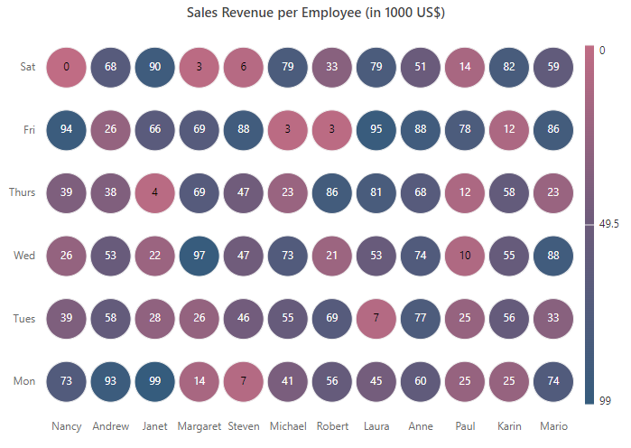
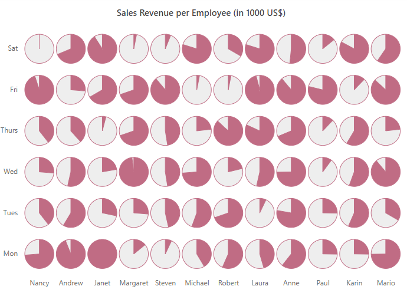

# Bubble HeatMap in ##Platform_Name## HeatMap Chart Component



Data points represent the data source values with **gradient** or **fixed** colors in the HeatMap. You can customize the appearance of these data points by changing the `color` and `size` attributes.

The data points can be represented in color fill or bubble shape by defining the [tileType](https://help.syncfusion.com/cr/aspnetmvc-js2/Syncfusion.EJ2.HeatMap.HeatMapCellSettings.html#Syncfusion_EJ2_HeatMap_HeatMapCellSettings_TileType) property. By default, the data points are color filled with gradient or fixed colors and this depiction of data points is defined as `Rect` in the `tileType` property.



Data points represent the data source values with **gradient** or **fixed** colors in the HeatMap. You can customize the appearance of these data points by changing the `Color` and `Size` attributes.

The data points can be represented in color fill or bubble shape by defining the [TileType](https://help.syncfusion.com/cr/aspnetmvc-js2/Syncfusion.EJ2.HeatMap.HeatMapCellSettings.html#Syncfusion_EJ2_HeatMap_HeatMapCellSettings_TileType) property. By default, the data points are color filled with gradient or fixed colors and this depiction of data points is defined as `Rect` in the `TileType` property.



The cell customizations and color mapping for rect tile type is defined in [appearance](./appearance/) and [palette](./palette/) sections in detail.

## Bubble types



The data points can be represented in the bubble along with its attributes by setting the [tileType](https://help.syncfusion.com/cr/aspnetmvc-js2/Syncfusion.EJ2.HeatMap.HeatMapCellSettings.html#Syncfusion_EJ2_HeatMap_HeatMapCellSettings_TileType) property to **Bubble**.



The data points can be represented in the bubble along with its attributes by setting the [TileType](https://help.syncfusion.com/cr/aspnetmvc-js2/Syncfusion.EJ2.HeatMap.HeatMapCellSettings.html#Syncfusion_EJ2_HeatMap_HeatMapCellSettings_TileType) property to **Bubble**.



In bubble HeatMap, you can display the data points with bubble size, bubble colors, and sector attributes of the bubble.

### Bubble size

In this bubble HeatMap type, the size factor of the bubble is used to denote the data variations. The radius of the bubble varies according to data values.



By default, the bubble with small size denotes the data value with small magnitude and the larger bubble size denotes the data value with larger magnitude. This behavior can be inversed by using the [isInversedbubblesize](https://help.syncfusion.com/cr/aspnetcore-js2/Syncfusion.EJ2.HeatMap.HeatMapCellSettings.html#Syncfusion_EJ2_HeatMap_HeatMapCellSettings_IsInversedBubbleSize) property.

To render a bubble HeatMap with size series, set the [bubbleType](https://help.syncfusion.com/cr/aspnetcore-js2/Syncfusion.EJ2.HeatMap.HeatMapCellSettings.html#Syncfusion_EJ2_HeatMap_HeatMapCellSettings_BubbleType) property to **Size**.












By default, the bubble with small size denotes the data value with small magnitude and the larger bubble size denotes the data value with larger magnitude. This behavior can be inversed by using the [IsInversedbubblesize](https://help.syncfusion.com/cr/aspnetmvc-js2/Syncfusion.EJ2.HeatMap.HeatMapCellSettings.html#Syncfusion_EJ2_HeatMap_HeatMapCellSettings_IsInversedBubbleSize) property.

To render a bubble HeatMap with size series, set the [BubbleType](https://help.syncfusion.com/cr/aspnetmvc-js2/Syncfusion.EJ2.HeatMap.HeatMapCellSettings.html#Syncfusion_EJ2_HeatMap_HeatMapCellSettings_BubbleType) property to **Size**.











### Bubble color

In HeatMap, defined with this tile type, the data points will be represented with same sized bubbles and the data value variations are represented with the bubble colors.



To represent the data points with variations in bubble colors, set the [bubbleType](https://help.syncfusion.com/cr/aspnetcore-js2/Syncfusion.EJ2.HeatMap.HeatMapCellSettings.html#Syncfusion_EJ2_HeatMap_HeatMapCellSettings_BubbleType) property to **Color**.












To represent the data points with variations in bubble colors, set the [BubbleType](https://help.syncfusion.com/cr/aspnetmvc-js2/Syncfusion.EJ2.HeatMap.HeatMapCellSettings.html#Syncfusion_EJ2_HeatMap_HeatMapCellSettings_BubbleType) property to **Color**.











### Bubble sector

In this bubble HeatMap type, the sector of the bubble decides the magnitude of data point. If the sector is large, then the data point value will be high.



To render the data points with bubble sector, set the [bubbleType](https://help.syncfusion.com/cr/aspnetcore-js2/Syncfusion.EJ2.HeatMap.HeatMapCellSettings.html#Syncfusion_EJ2_HeatMap_HeatMapCellSettings_BubbleType) property to **Sector**.












To render the data points with bubble sector, set the [BubbleType](https://help.syncfusion.com/cr/aspnetmvc-js2/Syncfusion.EJ2.HeatMap.HeatMapCellSettings.html#Syncfusion_EJ2_HeatMap_HeatMapCellSettings_BubbleType) property to **Sector**.











### Combining size and color bubble types



In this bubble HeatMap type, size and color of the bubble represents the data value variation. To render this bubble HeatMap type, set the [bubbleType](https://help.syncfusion.com/cr/aspnetcore-js2/Syncfusion.EJ2.HeatMap.HeatMapCellSettings.html#Syncfusion_EJ2_HeatMap_HeatMapCellSettings_BubbleType) property to **SizeAndColor**.



In this bubble HeatMap type, size and color of the bubble represents the data value variation. To render this bubble HeatMap type, set the [BubbleType](https://help.syncfusion.com/cr/aspnetmvc-js2/Syncfusion.EJ2.HeatMap.HeatMapCellSettings.html#Syncfusion_EJ2_HeatMap_HeatMapCellSettings_BubbleType) property to **SizeAndColor**.



The following examples demonstrate different data binding with the **SizeAndColor** bubble type set in the HeatMap.

<!-- markdownlint-disable MD036 -->
**Array binding**

When an array of numbers is specified as the data source, the bubble HeatMap can be rendered with different sizes and colors depending on the bound data.

<!-- markdownlint-disable MD036 -->
**Table**

The following example illustrates how to render a bubble HeatMap with different sizes and colors using array table binding.
























<!-- markdownlint-disable MD036 -->
**Cell**

The following example illustrates how to render a bubble HeatMap with different sizes and colors using array cell binding.
























<!-- markdownlint-disable MD036 -->
**JSON binding**

When a list of JSON objects are specified as data source, the bubble HeatMap can be rendered with different sizes and colors depending on the bound data.

<!-- markdownlint-disable MD036 -->
**Table**

The following example illustrates how to render a bubble HeatMap with different sizes and colors using JSON table binding.
























<!-- markdownlint-disable MD036 -->
**Cell**

The following example illustrates how to render a bubble HeatMap with different sizes and colors using JSON cell binding.
























<!-- markdownlint-disable MD036 -->
**Binding size and color values from datasource**



The size and color of the bubbles in the **SizeAndColor** bubble HeatMap type can be customized by binding the datasource field name that holds the size and color values to the [size](https://help.syncfusion.com/cr/aspnetcore-js2/Syncfusion.EJ2.HeatMap.HeatMapBubbleData.html#Syncfusion_EJ2_HeatMap_HeatMapBubbleData_Size) and [color](https://help.syncfusion.com/cr/aspnetcore-js2/Syncfusion.EJ2.HeatMap.HeatMapBubbleData.html#Syncfusion_EJ2_HeatMap_HeatMapBubbleData_Color) properties in the [bubbleDataMapping](https://help.syncfusion.com/cr/aspnetcore-js2/Syncfusion.EJ2.HeatMap.HeatMapData.html#Syncfusion_EJ2_HeatMap_HeatMapData_BubbleDataMapping).

>The `bubbleDataMapping` supports only for the JSON data with cell adaptor type.












The size and color of the bubbles in the **SizeAndColor** bubble HeatMap type can be customized by binding the datasource field name that holds the size and color values to the [Size](https://help.syncfusion.com/cr/aspnetmvc-js2/Syncfusion.EJ2.HeatMap.HeatMapBubbleData.html#Syncfusion_EJ2_HeatMap_HeatMapBubbleData_Size) and [Color](https://help.syncfusion.com/cr/aspnetmvc-js2/Syncfusion.EJ2.HeatMap.HeatMapBubbleData.html#Syncfusion_EJ2_HeatMap_HeatMapBubbleData_Color) properties in the [BubbleDataMapping](https://help.syncfusion.com/cr/aspnetmvc-js2/Syncfusion.EJ2.HeatMap.HeatMapData.html#Syncfusion_EJ2_HeatMap_HeatMapData_BubbleDataMapping).

>The `BubbleDataMapping` supports only for the JSON data with cell adaptor type.











