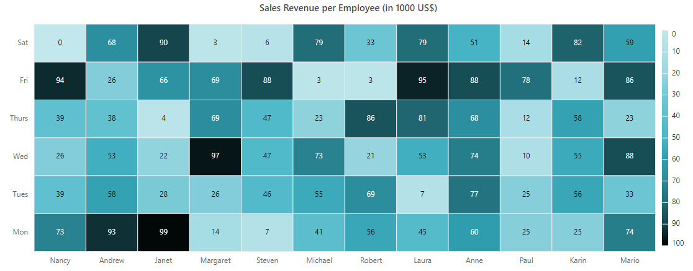
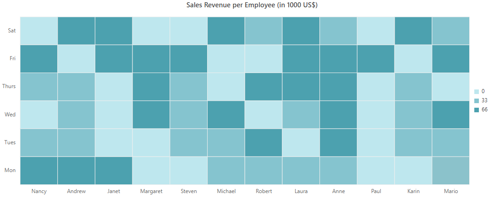
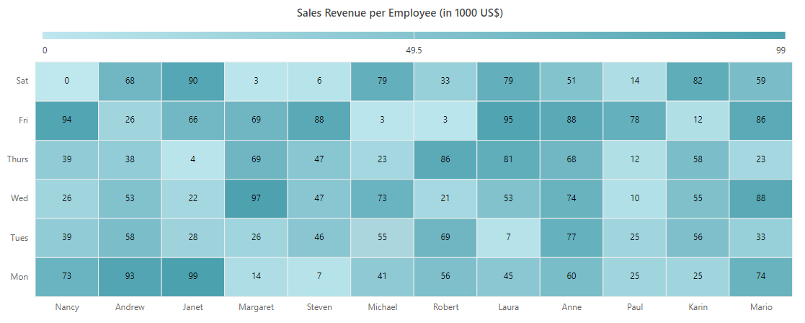
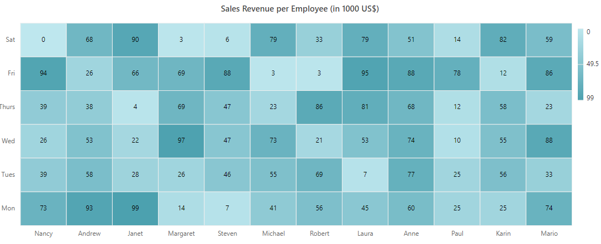
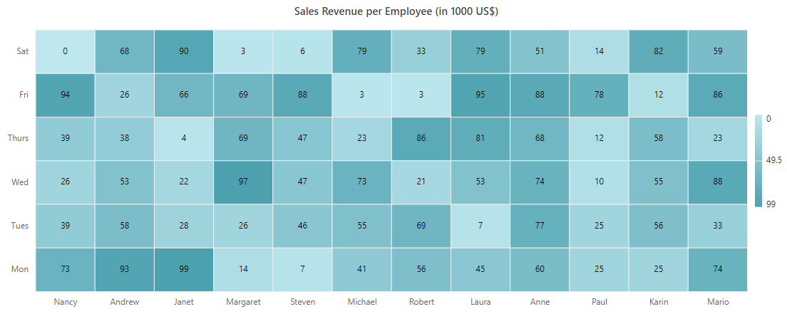
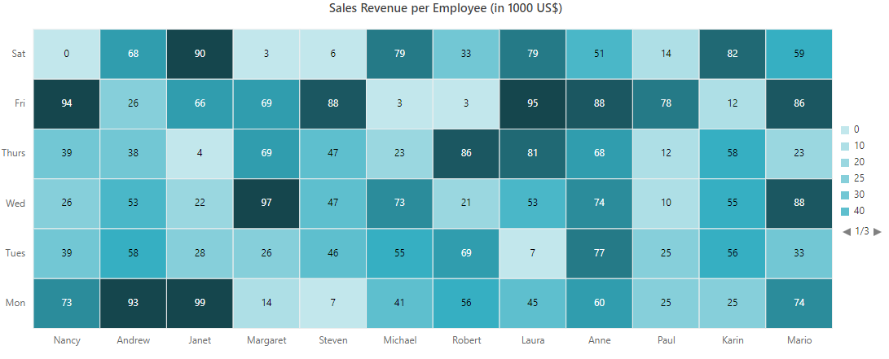
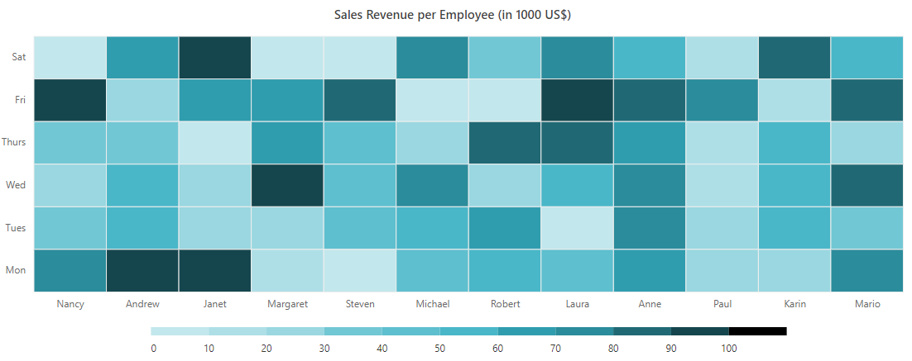
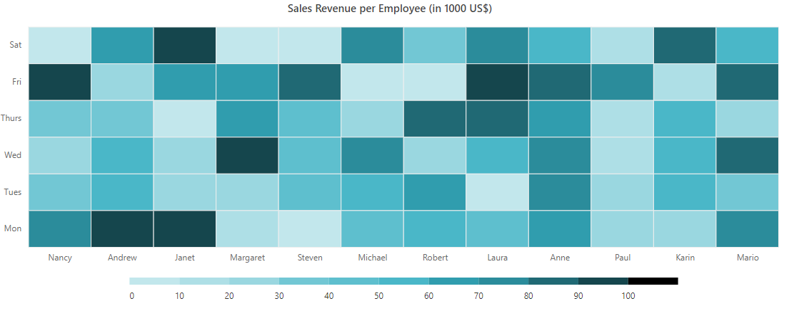
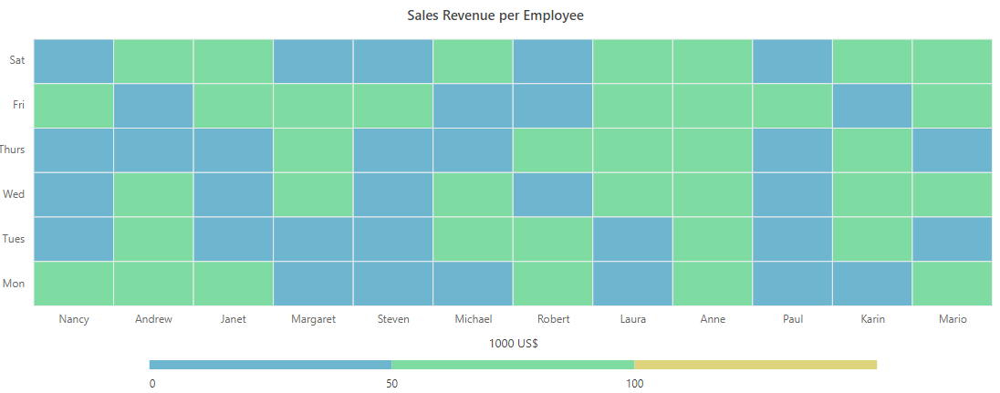

# Legend in ##Platform_Name## HeatMap Chart Component



The legend is used to provide the information about the heat map cell. You can enable the legend by setting the [visible](https://help.syncfusion.com/cr/aspnetcore-js2/Syncfusion.EJ2.HeatMap.HeatMapLegendSettings.html#Syncfusion_EJ2_HeatMap_HeatMapLegendSettings_Visible) property to **true**.












The legend is used to provide the information about the heat map cell. You can enable the legend by setting the [Visible](https://help.syncfusion.com/cr/aspnetmvc-js2/Syncfusion.EJ2.HeatMap.HeatMapLegendSettings.html#Syncfusion_EJ2_HeatMap_HeatMapLegendSettings_Visible) property to **true**.











## Legend types



Heat map supports two legend types: **Gradient** and **Fixed** type.

* **Gradient** - This is a continuous color legend with smooth color transition between palette color values.
* **Fixed** - The fixed color legend is a list. Each palette color information is shown separately in the list item.

You can change the legend type by using the [type](https://help.syncfusion.com/cr/aspnetcore-js2/Syncfusion.EJ2~Syncfusion.EJ2.HeatMap.HeatMapPaletteSettings~Type.html) property in the [paletteSettings](https://help.syncfusion.com/cr/aspnetcore-js2/Syncfusion.EJ2.HeatMap.HeatMapPaletteSettings.html) property.












Heat map supports two legend types: Gradient and Fixed type.

* **Gradient** - This is a continuous color legend with smooth color transition between palette color values.
* **Fixed** - The fixed color legend is a list. Each palette color information is shown separately in the list item.

You can change the legend type by using the [Type](https://help.syncfusion.com/cr/aspnetmvc-js2/Syncfusion.EJ2.HeatMap.HeatMapPaletteSettings.html#Syncfusion_EJ2_HeatMap_HeatMapPaletteSettings_Type) property in the [paletteSettings](https://help.syncfusion.com/cr/aspnetmvc-js2/Syncfusion.EJ2.HeatMap.HeatMapPaletteSettings.html)property.











## Placement



You can place the legend at **Left**, **Right**, **Top**, or **Bottom** to the heat map layout by using the [position](https://help.syncfusion.com/cr/aspnetcore-js2/Syncfusion.EJ2~Syncfusion.EJ2.HeatMap.HeatMapLegendSettings~Position.html) property. The legend is positioned at the **Right** to the heat map by default.












You can place the legend at left, right, top, or bottom to the heat map layout by using the [Position](https://help.syncfusion.com/cr/aspnetmvc-js2/Syncfusion.EJ2.HeatMap.HeatMapLegendSettings.html#Syncfusion_EJ2_HeatMap_HeatMapLegendSettings_Position) property. The legend is positioned at the right to the heat map by default.











## Alignment



You can align the legend as **Center**, **Far**, or **Near** to the heat map using the [alignment](https://help.syncfusion.com/cr/aspnetcore-js2/Syncfusion.EJ2~Syncfusion.EJ2.HeatMap.HeatMapLegendSettings~Alignment.html) property.












You can align the legend as center, far, or near to the heat map using the [Alignment](https://help.syncfusion.com/cr/aspnetmvc-js2/Syncfusion.EJ2.HeatMap.HeatMapLegendSettings.html#Syncfusion_EJ2_HeatMap_HeatMapLegendSettings_Alignment) property.











## Legend dimensions



You can change the legend dimensions with values in pixels or percentage by using the[width](https://help.syncfusion.com/cr/aspnetcore-js2/Syncfusion.EJ2~Syncfusion.EJ2.HeatMap.HeatMapLegendSettings~Width.html) and [height](https://help.syncfusion.com/cr/aspnetcore-js2/Syncfusion.EJ2~Syncfusion.EJ2.HeatMap.HeatMapLegendSettings~Height.html) properties.












You can change the legend dimensions with values in pixels or percentage by using the[Width](https://help.syncfusion.com/cr/aspnetmvc-js2/Syncfusion.EJ2.HeatMap.HeatMapLegendSettings.html#Syncfusion_EJ2_HeatMap_HeatMapLegendSettings_Width) and [Height](https://help.syncfusion.com/cr/aspnetmvc-js2/Syncfusion.EJ2.HeatMap.HeatMapLegendSettings.html#Syncfusion_EJ2_HeatMap_HeatMapLegendSettings_Height) properties.











## Paging for legend

Paging is available only for the list type legend in the heat map, and it can be enabled by default,when the legend items exceed the legend bounds. You can view each legend items by navigating between the pages using navigation buttons.
























## Smart legend



Smart legend is another way of showing list type legend with responsiveness and readability, when the palette has more number of items. You can enable this smart legend by using the [enableSmartLegend](https://help.syncfusion.com/cr/aspnetcore-js2/Syncfusion.EJ2~Syncfusion.EJ2.HeatMap.HeatMapLegendSettings~EnableSmartLegend.html) property when the palette type is set to **Fixed**.

In smart legend, you can change the display type of legend labels by using the [labelDisplayType](https://help.syncfusion.com/cr/aspnetcore-js2/Syncfusion.EJ2~Syncfusion.EJ2.HeatMap.HeatMapLegendSettings~LabelDisplayType.html) property.

The following are the legend label display types:
* **All**: Displays all labels in the legend.
* **Edge**: Displays the legend labels only at extreme ends.
* **None**: None of the labels are displayed. The tooltip will appear for this type of label display when hovering over the legend item.












Smart legend is another way of showing list type legend with responsiveness and readability, when the palette has more number of items. You can enable this smart legend by using the [EnableSmartLegend](https://help.syncfusion.com/cr/aspnetmvc-js2/Syncfusion.EJ2.HeatMap.HeatMapLegendSettings.html#Syncfusion_EJ2_HeatMap_HeatMapLegendSettings_EnableSmartLegend) property when the palette type is set to **Fixed**.

In smart legend, you can change the display type of legend labels by using the [LabelDisplayType](https://help.syncfusion.com/cr/aspnetmvc-js2/Syncfusion.EJ2.HeatMap.HeatMapLegendSettings.html#Syncfusion_EJ2_HeatMap_HeatMapLegendSettings_LabelDisplayType) property.

The following are the legend label display types:
* **All**: Displays all labels in the legend.
* **Edge**: Displays the legend labels only at extreme ends.
* **None**: None of the labels are displayed. The tooltip will appear for this type of label display when hovering over the legend item.











## Legend selection



In the HeatMap, the legend selection is used to toggle the visibility of cell for viewing the specific range value. You can enable the legend selection using the [toggleVisibility](https://help.syncfusion.com/cr/aspnetcore-js2/Syncfusion.EJ2~Syncfusion.EJ2.HeatMap.HeatMapLegendSettings~ToggleVisibility.html) property.












In the HeatMap, the legend selection is used to toggle the visibility of cell for viewing the specific range value. You can enable the legend selection using the [ToggleVisibility](https://help.syncfusion.com/cr/aspnetmvc-js2/Syncfusion.EJ2.HeatMap.HeatMapLegendSettings.html#Syncfusion_EJ2_HeatMap_HeatMapLegendSettings_ToggleVisibility) property.











## Legend title



The legend title displays a specific information about the legend. You can enable the legend title by setting the [title](https://help.syncfusion.com/cr/aspnetcore-js2/Syncfusion.EJ2~Syncfusion.EJ2.HeatMap.HeatMapLegendSettings~title.html) property by providing the text and customizing the legend title text style using the [textStyle](https://help.syncfusion.com/cr/aspnetcore-js2/Syncfusion.EJ2~Syncfusion.EJ2.HeatMap.HeatMapLegendSettings~titleModel~textStyle.html) property.












The legend title displays a specific information about the legend. You can enable the legend title by setting the [Title](https://help.syncfusion.com/cr/aspnetmvc-js2/Syncfusion.EJ2.HeatMap.HeatMapLegendSettings.html#Syncfusion_EJ2_HeatMap_HeatMapLegendSettings_Title) property by providing the text and customizing the legend title text style using the [TextStyle](https://help.syncfusion.com/cr/aspnetmvc-js2/Syncfusion.EJ2.HeatMap.HeatMapLegendSettings.html#Syncfusion_EJ2_HeatMap_HeatMapLegendSettings_TextStyle) property.











