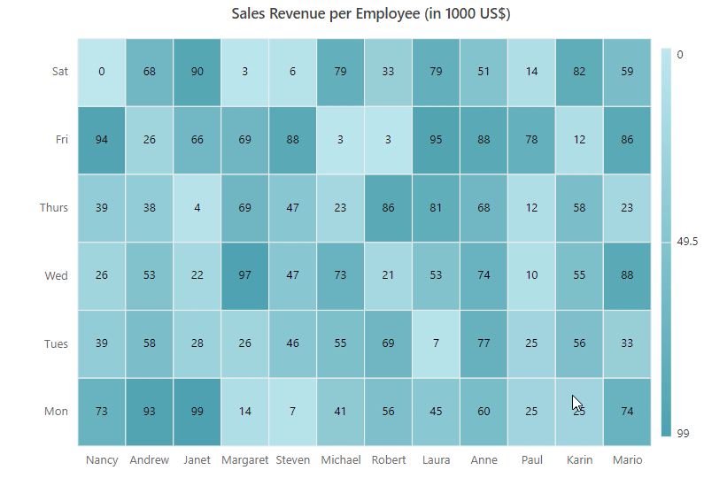
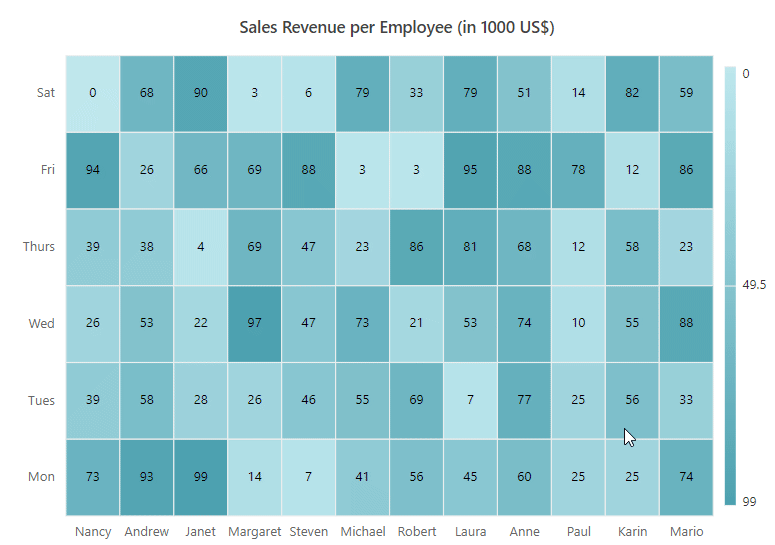
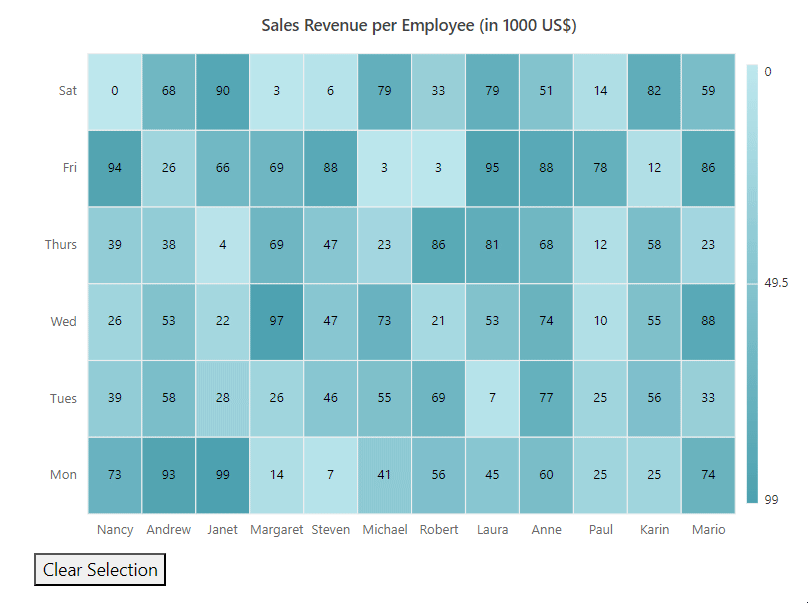

# Selection in ##Platform_Name## HeatMap Chart Component



In the HeatMap, the cell selection is used to select single or multiple HeatMap cells at runtime and get the selected cell details using the [cellSelected](https://help.syncfusion.com/cr/aspnetcore-js2/Syncfusion.EJ2.HeatMap.HeatMap.html#Syncfusion_EJ2_HeatMap_HeatMap_CellSelected) event. You can enable the cell selection using the [allowSelection](https://help.syncfusion.com/cr/aspnetcore-js2/Syncfusion.EJ2.HeatMap.HeatMap.html#Syncfusion_EJ2_HeatMap_HeatMap_AllowSelection) property.

The HeatMap cells can be selected using the following interactions, as shown in the table below.

|   Modes of Interactions |   Description                                                                                                      |
|------------------------ | -------------------------------------------------------------------------------------------------------------------|
|   Mouse                 |  HeatMap cells can be selected by clicking or dragging and dropping over them.                                     |
|   Touch                 |  HeatMap cells can be selected by tapping or dragging and dropping over them.                                      |
|   Keyboard              |  The **Ctrl** key on the keyboard can be used to enable multiple cell selection with mouse and touch interaction. The **Ctrl** key can only be used if the `enableMultiSelect` property is set to **true** in order to enable multiple cell selection.                                                                                                                                     |












In the HeatMap, the cell selection is used to select single or multiple HeatMap cells at runtime and get the selected cell details using the [CellSelected](https://help.syncfusion.com/cr/aspnetmvc-js2/Syncfusion.EJ2.HeatMap.HeatMap.html#Syncfusion_EJ2_HeatMap_HeatMap_CellSelected) event. You can enable the cell selection using the [AllowSelection](https://help.syncfusion.com/cr/aspnetmvc-js2/Syncfusion.EJ2.HeatMap.HeatMap.html#Syncfusion_EJ2_HeatMap_HeatMap_AllowSelection) property.

The HeatMap cells can be selected using the following interactions, as shown in the table below.

|   Modes of Interactions |   Description                                                                                                      |
|------------------------ | -------------------------------------------------------------------------------------------------------------------|
|   Mouse                 |  HeatMap cells can be selected by clicking or dragging and dropping over them.                                     |
|   Touch                 |  HeatMap cells can be selected by tapping or dragging and dropping over them.                                      |
|   Keyboard              |  The **Ctrl** key on the keyboard can be used to enable multiple cell selection with mouse and touch interaction. The **Ctrl** key can only be used if the `EnableMultiSelect` property is set to **true** in order to enable multiple cell selection.                                                                                                                                     |











The illustration below shows how to select multiple cells in the HeatMap by clicking and dragging the mouse across the cells.

## Enable single cell selection



In the HeatMap, the [enableMultiSelect](https://help.syncfusion.com/cr/aspnetcore-js2/Syncfusion.EJ2.HeatMap.HeatMap.html#Syncfusion_EJ2_HeatMap_HeatMap_EnableMultiSelect) property is used to allow single cell selection. When you set the `enableMultiSelect` property to **false**, only one cell is selected. By default, `enableMultiSelect` property is set to **true**.












In the HeatMap, the [EnableMultiSelect](https://help.syncfusion.com/cr/aspnetmvc-js2/Syncfusion.EJ2.HeatMap.HeatMap.html#Syncfusion_EJ2_HeatMap_HeatMap_EnableMultiSelect) property is used to allow single cell selection. When you set the `EnableMultiSelect` property to **false**, only one cell is selected. By default, `EnableMultiSelect` property is set to **true**.











### Clearing cell selection

The `clearSelection` method can be used to clear all the selected cells. The below example illustrates the same.
























