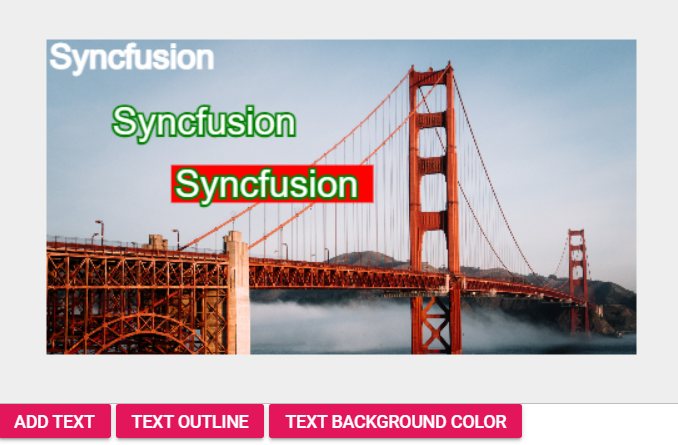
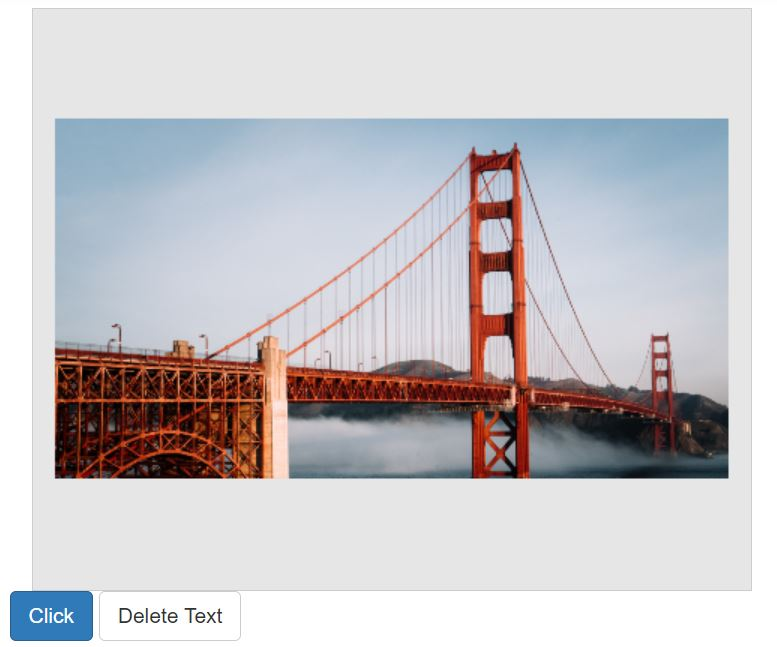
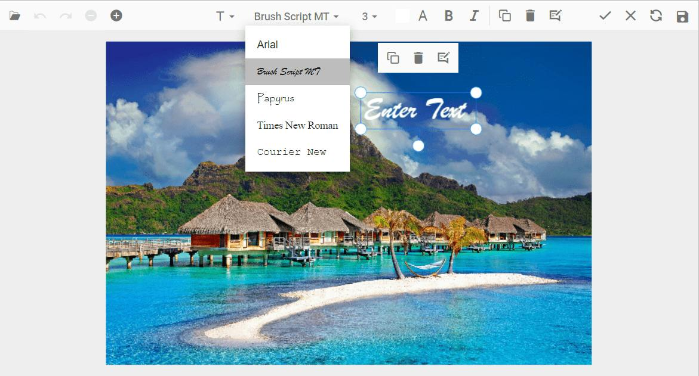
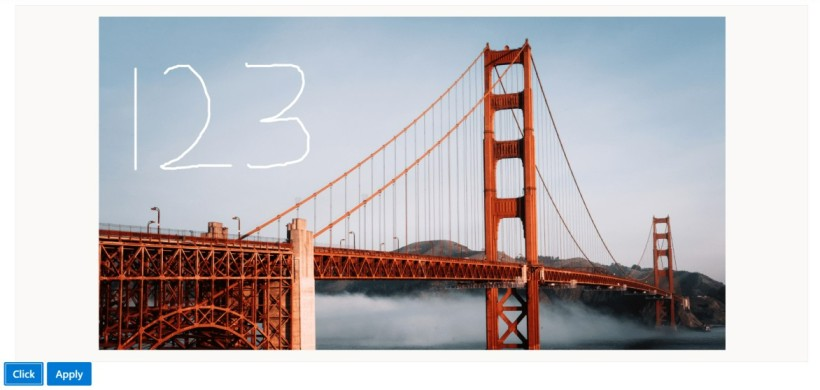
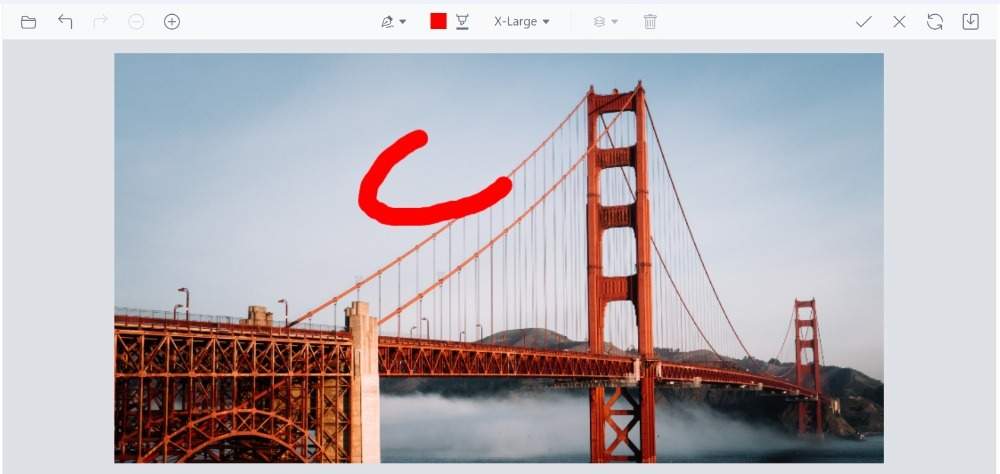
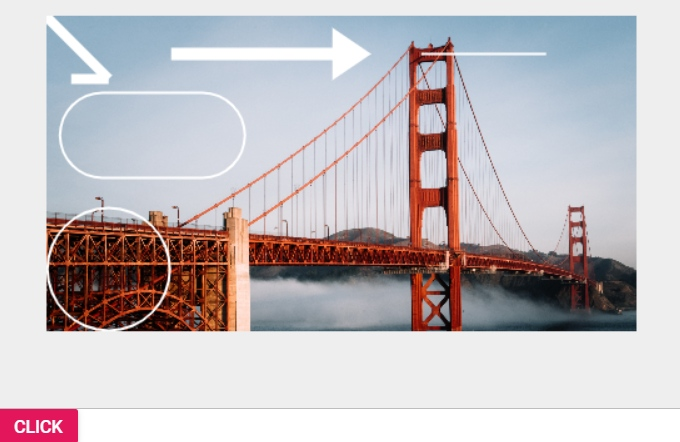
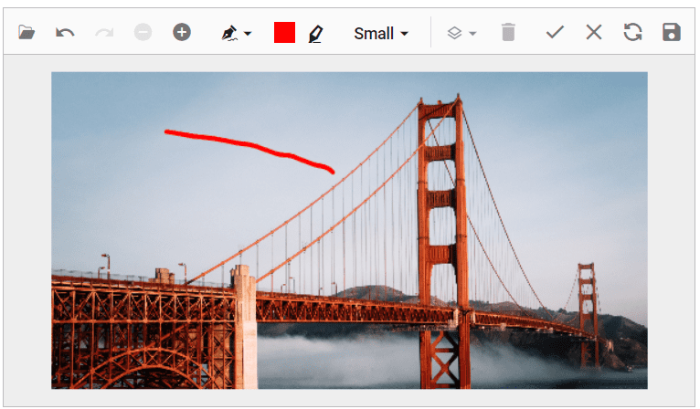
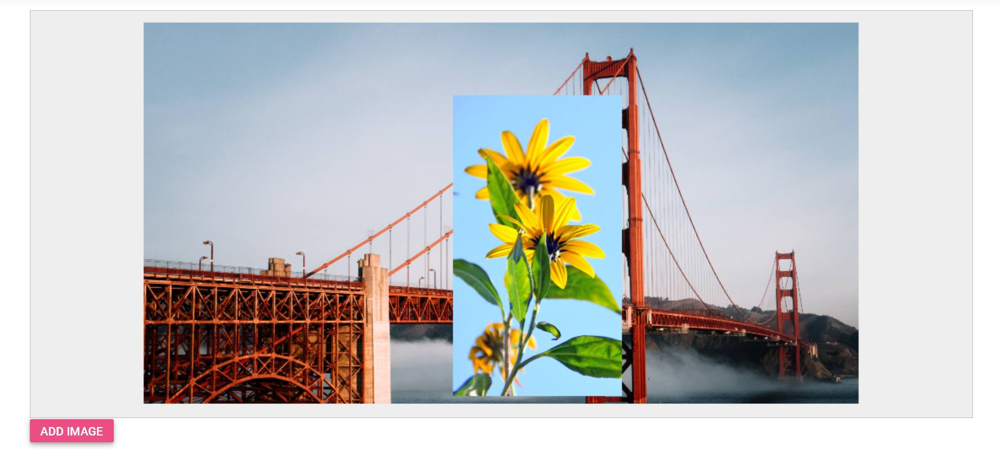

# Annotation in the ##Platform_Name## Image Editor control

The Image Editor allows adding annotations to the image, including text, freehand drawings, and shapes like rectangles, ellipses, arrows, paths, and lines. This gives the flexibility to mark up the image with notes, sketches, and other visual elements as needed. These annotation tools can help to communicate and share ideas more effectively. Users are allowed to draw multiple annotations simultaneously, enhancing creative flexibility. Furthermore, every action, including customizations, will be tracked in the undo/redo collection, ensuring a seamless user experience and making it easier to experiment with different designs.

## Text annotation 

The text annotation feature in the Image Editor provides the capability to add and customize labels, captions, and other text elements directly onto the image. With this feature, you can easily insert text at specific locations within the image and customize various aspects of the text to meet your requirements. 

You have control over the customization options including text content, font family, font style, font color, fill color, stroke color, stroke width and font size for the text annotation. 

### Add a text 

The `drawText` method in the Image Editor allows you to insert a text annotation into the image with specific customization options. This method accepts the following parameters: 

* x: Specifies the x-coordinate of the text, determining its horizontal position within the image. 

* y: Specifies the y-coordinate of the text, determining its vertical position within the image. 

* text: Specifies the actual text content to be added to the image. 

* fontFamily: Specifies the font family of the text, allowing you to choose a specific typeface or style for the text. 

* fontSize: Specifies the font size of the text, determining its relative size within the image. 

* bold: Specifies whether the text should be displayed in bold style. Set to true for bold text, and false for regular text. 

* italic: Specifies whether the text should be displayed in italic style. Set to true for italic text, and false for regular text. 

* color: Specifies the font color of the text, allowing you to define the desired color using appropriate color values or names.

* isSelected: Specifies to show the text in the selected state.

* degree: Specifies the degree to rotate the text.

* fillColor: Specifies the background color of the text.

* strokeColor: Specifies the outline color of the text annotation.

* strokeWidth: Specifies the outline stroke width of the text annotation.

* transformCollection: Specifies the transform collection of the text annotation.

By utilizing the DrawText method with these parameters, you can precisely position and customize text annotations within the image. This provides the flexibility to add labels, captions, or other text elements with specific font styles, sizes, and colors, enhancing the visual presentation and clarity of the image. 

Here is an example of adding a text in a button click using `drawText` method. 
























Output be like the below.

### Multiline text 

The `drawText` method in the Image Editor control is commonly used to insert text annotations into an image. If the provided text parameter contains a newline character (\n), the text will be automatically split into multiple lines, with each line appearing on a separate line in the annotation. 

Here is an example of adding a multiline text in a button click using `drawText` method.
























Output be like the below.

### Delete a text 

The `deleteShape` method in the Image Editor control allows you to remove a text annotation from the image editor. To use this method, you need to pass the `shapeId` of the annotation as a parameter.

The `shapeId` is a unique identifier assigned to each text annotation within the image editor. It serves as a reference to a specific annotation, enabling targeted deletion of the desired text element. By specifying the `shapeId` associated with the text annotation you want to remove, you can effectively delete it from the image editor.

To retrieve the inserted text annotations, you can utilize the `getShapeSetting` method, which provides a collection of annotations represented by `ShapeSettings`. This method allows you to access and work with the annotations that have been inserted into the image.

Here is an example of deleting a text in a button click using `deleteShape` method.
























Output be like the below.

### Customize font family and text color 

The ShapeChanging event in the Image Editor control is triggered when a text annotation is being modified or changed through the toolbar interaction. This event provides an opportunity to make alterations to the text's color and font family by adjusting the relevant properties. 

By leveraging the ShapeChanging event, you can enhance the customization options for text annotations and provide a more tailored and interactive experience within the Image Editor control. 

Here is an example of changing the text’s color and its font family using the ShapeChanging event.
























Output be like the below.

### Add additional font family

The FontFamily property in the Image Editor control provides the flexibility to incorporate supplementary font families, expanding your options for text styling and ensuring a broader range of fonts can be utilized within your design or content. The font value will be determined by the 'id' property.

By leveraging the FontFamily property, you can elevate the scope of customization for text annotations, enriching the user experience within the Image Editor control. This enhancement offers a more personalized and dynamic interaction, empowering users to tailor their text styles for a truly engaging editing experience.

Here is an example of adding additional font family to the text annotation using the FontFamily property.
























Output be like the below.

## Freehand drawing 

The Freehand Draw annotation tool in the Image Editor control is a versatile feature that allows users to draw and sketch directly on the image using mouse or touch input. This tool provides a flexible and creative way to add freehand drawings or annotations to the image.

The `freehandDraw` method is used to enable or disable the freehand drawing option in the Image Editor control. 

Here is an example of using the `freeHandDraw` method in a button click event.
























Output be like the below.

### Adjust the stroke width and color 

The `shapeChanging` event in the Image Editor control is triggered when a freehand annotation is being modified or changed through the toolbar interaction. This event provides an opportunity to make alterations to the freehand annotation's color and stroke width by adjusting the relevant properties. 

By leveraging the ShapeChanging event, you can enhance the customization options for freehand annotations and provide a more tailored and interactive experience within the Image Editor control. 

Here is an example of changing the freehand draw stroke width and color using the ShapeChanging event.
























Output be like the below.

### Delete a freehand drawing 

The `deleteShape` method in the Image Editor allows you to remove a freehand annotation from the image editor. To use this method, you need to pass the `shapeId` of the annotation as a parameter.

The `shapeId` is a unique identifier assigned to each freehand annotation within the image editor. It serves as a reference to a specific annotation, enabling targeted deletion of the desired annotation. By specifying the `shapeId` associated with the freehand annotation you want to remove, you can effectively delete it from the image editor.

To retrieve the inserted freehand annotations, you can utilize the `getShapeSetting` method, which provides a collection of annotations represented by `ShapeSettings`. This method allows you to access and work with the annotations that have been inserted into the image.

Here is an example of deleting a freehand annotation in a button click using DeleteShape method.
























Output be like the below.

## Shape annotation

The Image Editor control provides the ability to add shape annotations to an image. These shape annotations include rectangles, ellipses, arrows, paths, and lines, allowing you to highlight, emphasize, or mark specific areas or elements within the image. 

### Add a rectangle /ellipse / line / arrow / path

The `drawRectangle` method is used to insert a rectangle to the Image Editor control. Rectangle annotations are valuable tools for highlighting, emphasizing, or marking specific areas of an image to draw attention or provide additional context.

The `drawRectangle` method in the Image Editor control takes ten parameters to define the properties of the rectangle annotation: 

* x: Specifies the x-coordinate of the top-left corner of the rectangle. 

* y: Specifies the y-coordinate of the top-left corner of the rectangle. 

* width: Specifies the width of the rectangle. 

* height: Specifies the height of the rectangle. 

* strokeWidth: Specifies the stroke width of the rectangle's border. 

* strokeColor: Specifies the stroke color of the rectangle's border. 

* fillColor: Specifies the fill color of the rectangle.

* degree: Specifies the degree to rotate the rectangle.

* isSelected: Specifies to show the rectangle in the selected state.

* borderRadius: Specifies the radius to apply border radius to rectangle.

The `drawEllipse` method is used to insert a ellipse to the Image Editor control. Ellipse annotations are valuable for highlighting, emphasizing, or marking specific areas of an image.

The `drawEllipse`method in the Image Editor control takes seven parameters to define the properties of the ellipse annotation: 

* x: Specifies the x-coordinate of the center of the ellipse. 

* y: Specifies the y-coordinate of the center of the ellipse. 

* radiusX: Specifies the horizontal radius (radiusX) of the ellipse. 

* radiusY: Specifies the vertical radius (radiusY) of the ellipse. 

* strokeWidth: Specifies the width of the ellipse's stroke (border). 

* strokeColor: Specifies the color of the ellipse's stroke (border). 

* fillColor: Specifies the fill color of the ellipse. 

* degree: Specifies the degree to rotate the ellipse.

* isSelected: Specifies to show the ellipse in the selected state.

The `drawLine` method is used to insert a line to the Image Editor control. Line annotations are valuable for highlighting, emphasizing, or marking specific areas of an image.  

The `drawLine` method in the Image Editor control takes seven parameters to define the properties of the ellipse annotation: 

* startX - Specifies the x-coordinate of the start point. 

* startY - Specifies the y-coordinate of the start point. 

* endX - Specifies the x-coordinate of the end point. 

* endY - Specifies the y-coordinate of the end point. 

* strokeWidth - Specifies the stroke width of the line. 

* strokeColor - Specifies the stroke color of the line. 

* isSelected: Specifies to show the line in the selected state.

The `drawArrow` method is used to insert a arrow to the Image Editor control. Arrow annotations are valuable for highlighting, emphasizing, or marking specific areas of an image.

The `drawArrow` method in the Image Editor control takes three parameters to define the properties of the ellipse annotation: 

* startX - Specifies the x-coordinate of the start point. 

* startY - Specifies the y-coordinate of the start point. 

* endX - Specifies the x-coordinate of the end point. 

* endY - Specifies the y-coordinate of the end point. 

* strokeWidth - Specifies the stroke width of the arrow. 

* strokeColor - Specifies the stroke color of the arrow. 

* arrowStart - Specifies the arrowhead as ImageEditorArrowHeadType at the start of arrow.

* arrowEnd - Specifies the arrowhead as ImageEditorArrowHeadType at the end of the arrow.

* isSelected: Specifies to show the arrow in the selected state.

The `drawPath` method is used to insert a path to the Image Editor control. Path annotations are valuable for highlighting, emphasizing, or marking specific areas of an image.

The `drawPath` method in the Image Editor control takes three parameters to define the properties of the ellipse annotation: 

* points - Specifies collection of x and y coordinates as ImageEditorPoint to draw a path. 

* strokeWidth - Specifies the stroke width of the path. 

* strokeColor - Specifies the stroke color of the path. 

* isSelected: Specifies to show the path in the selected state.

Here is an example of inserting rectangle, ellipse, arrow, path, and line in a button click event.
























Output be like the below.

## Delete a shape 

The `deleteShape` method in the Image Editor allows you to remove a shape annotation from the image editor. To use this method, you need to pass the `shapeId` of the annotation as a parameter. 

The `shapeId` is a unique identifier assigned to each shape annotation within the image editor. It serves as a reference to a specific annotation, enabling targeted deletion of the desired annotation. By specifying the `shapeId` associated with the shape annotation you want to remove, you can effectively delete it from the image editor.

To retrieve the inserted shape annotations, you can utilize the `getShapeSetting` method, which provides a collection of annotations represented by `ShapeSettings`. This method allows you to access and work with the annotations that have been inserted into the image.

Here is an example of deleting rectangle, ellipse, arrow, path, and line in a button click event. 
























Output be like the below.

## Customize default stroke color for shapes 

We provide default settings for stroke color, stroke width, fill color, and other customizations. If users wish to modify only the default options while preserving their previously selected customizations, they can do so by utilizing the [`shapeChanging`] event. Within this event, users can update the values in the `currentShapeSettings` object to apply their own preferences instead of the defaults. This approach allows conditional updates to the `currentShapeSettings`, ensuring that only the desired defaults are changed while maintaining the other settings.
























Output be like the below.

## Image annotation

The image annotation feature in the Image Editor provides the capability to add and customize images directly onto the image. With this feature, you can easily insert image or icons at specific locations within the image and customize various aspects of the image to meet your requirements. You have control over the customization options including rotate, flip, transparency for the image annotation.

### Add an image annotation

The `drawImage` method serves the purpose of inserting an image into the Image Editor control, allowing for image annotations to be added. These image annotations can be used for various purposes, such as adding logos, watermarks, or decorative elements to the image.

The `drawImage` method in the Image Editor control takes six parameters to define the properties of the image annotation:

* data: Specified the image data or url of the image to be inserted.

* x: Specifies the x-coordinate of the top-left corner of the image.

* y: Specifies the y-coordinate of the top-left corner of the image.

* width: Specifies the width of the image.

* height: Specifies the height of the image.

* isAspectRatio: Specifies whether the image is rendered with aspect ratio or not.

* degree: Specifies the degree to rotate the image.

* opacity: Specifies the value for the image.

* isSelected: Specifies to show the image in the selected state.

In the following example, you can use the `drawImage` method in the button click event.
























Output be like the below.

